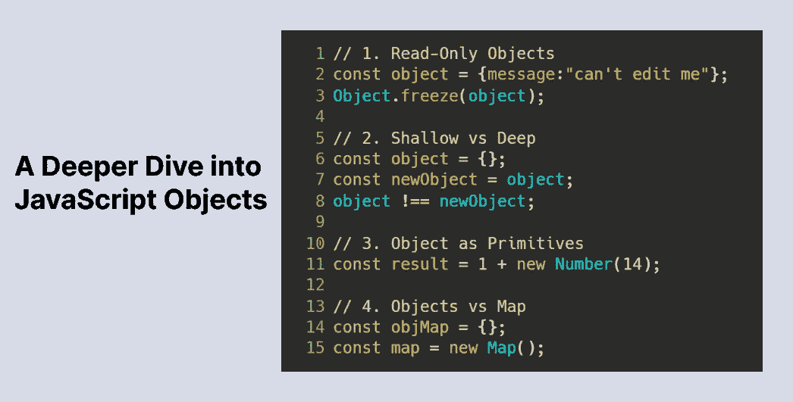

# 深入探究 JavaScript 对象

> 原文：<https://betterprogramming.pub/a-deeper-dive-into-javascript-objects-c18ce52869eb>

## 探索 JavaScript 中对象的细节



作者照片。

JavaScript 对象是基础。花时间深入挖掘它们将会产生更干净和更有性能的代码。

*注意:本文假设您了解对象的基本知识。如果您想快速复习对象，请查看由 Arfat Salman* *编写的*[*JavaScript 对象编年史*](https://blog.bitsrc.io/the-chronicles-of-javascript-objects-2d6b9205cd66) *。*

让我们开始吧！

# 议程

*   [只读对象](#8a35)
*   [浅 vs 深](#6b8a)
*   [作为图元的对象](#a453)
*   [物体与地图](#b8cc)

# 只读对象

假设我们想要创建一个枚举来表示基本方向:

但是，现有属性/键可以更改，新属性可以添加到`DIRECTIONS`中。这在较大的代码库中可能是危险的，因为意外编辑枚举/只读对象的可能性会更大。

```
DIRECTIONS.NORTH = "south"; //nothing stopping this from happening
```

输入`[Object.freeze](https://developer.mozilla.org/en-US/docs/Web/JavaScript/Reference/Global_Objects/Object/freeze)`。

```
Object.freeze(DIRECTIONS);
```

`Object.freeze`取消了添加新属性和编辑/删除现有属性的功能。

```
Object.freeze(DIRECTIONS);/*The below either fail silently or a TypeError will be thrown*/
DIRECTIONS.NORTH = "south";
DIRECTIONS.UP = "up";
del DIRECTIONS.SOUTH;
```

`Object.freeze`还限制改变对象单个属性的[属性描述符](https://javascript.info/property-descriptors)的能力。属性描述符类似于属性的“设置”。以下是它包含的四个字段:

*   `value`:财产的实际。
*   `enumerable`:确定在对象的属性上迭代/枚举时是否会出现一个属性。如果属性的`enumerable`是`true`，那么当我们用`for _ in`迭代一个对象时，它就会显示出来，并且会包含在`Object.keys()`中。
*   `configurable`:确定是否可以从对象中删除属性，或者是否可以更改对象的属性描述符。
*   `writable` : 决定属性的值是否可以通过赋值来改变。

```
const obj = {'a': 1, 'b':2};
console.log(Object.getOwnPropertyDescriptors(obj));
/*
Here is the output of the property descriptors of obj:
{
a: {value: 1, writable: true, enumerable: true, configurable: true},
b: {value: 2, writable: true, enumerable: true, configurable: true}
}
*/
```

`Object.freeze`将保持`enumerable`不变，但会为对象中的属性设置`configurable`和`writable`为`false`。因此，我们不能再编辑属性描述符(我们不能再改变`writable`、`enumerable`或`configurable`)，也不能再改变属性的值。

*注意:* `*Object.freeze*` *只对顶级属性进行这些限制。*

```
const o = {a: 0, b: {c: 5}};
Object.freeze(o);o.b.c = 10; // this is valid
```

这些提到的限制对属性`a`和`b`有效，但对属性`c`无效。即使在冻结对象后，我们也可以编辑`c`的值。

您可能需要递归调用子对象上的`Object.freeze`来确保整个对象被冻结。

# 浅层与深层

与原语不同，JavaScript 对象是通过引用传递的，引用是指向对象在内存中“驻留”位置的指针。

```
const myPet = {
  name: "Doggie",
  type: "Dog"
}
```

`myPet`存储分配给它的对象的引用——而不是对象本身。

```
const yourPet = myPet;
yourPet.name = "Cattie";
console.log(myPet);/*
Here is the output of myPet:
{ name: 'Cattie', type: 'Dog' }
*/
```

这种方式的分配会将引用`myPet`商店复制到`yourPet`。因此，`yourPet`和`myPet`仍然引用同一个对象。

基本上，如果我在`yourPet`中编辑一个属性，这个编辑将会反映在`myPet`中，因为它们仍然引用同一个对象。

当我们有两个变量存储对同一个对象的引用时，我们可以称它们为*浅*副本。

如上所述，创建浅表副本的一种方式是通过赋值。

```
const obj = {"a": 0};
const anotherObj = obj; // shallow copy
```

我们可以通过使用`[Object.is](https://developer.mozilla.org/en-US/docs/Web/JavaScript/Reference/Global_Objects/Object/is)`来测试浅相等。`Object.is`测试两个变量是否引用同一个对象。

```
const obj = {"a": 0};
const anotherObj = obj;
Object.is(obj, anotherObj); // returns true
```

但是等等！为什么下面返回`false`？

```
const histo1 = {"a": 0};
const histo2 = {"a": 0};
Object.is(histo1, histo2); // returns false
```

虽然`histo1`和`histo2`的对象内容相同，但这并不意味着`histo1`和`histo2`在内存中指向同一个对象。结果，`histo1`和`histo2`不是浅拷贝，因为它们的引用指向不同的对象，而这些对象恰好具有相同的内容。

`histo1`和`histo2`是*深*副本。

创建深层副本有几个选项。

## 使用 JSON 进行深度复制

```
const me = {"name": "Ramki"};
const you = JSON.parse(JSON.stringify(me));
```

想法是使用`JSON.stringify`将对象转换为字符串，然后使用`JSON.parse`解析字符串以检索编码的对象。主要的限制是属性为函数的对象不能被正确复制，因为`JSON.stringify`不能编码函数(`[JSON.Stringify](https://developer.mozilla.org/en-US/docs/Web/JavaScript/Reference/Global_Objects/JSON/stringify)`)。

## 带 Lodash 的深层副本

我们可以从 [lodash](https://lodash.com/) 导入`[cloneDeep](https://www.tutorialspoint.com/lodash/lodash_clonedeep.htm)`。这是一种递归克隆传入对象属性的方法。返回的对象将是深层副本。主要的缺点是，我们必须安装一个外部库，增加应用程序的总大小，以便创建一个深层副本。

在对象的值是 JSON 兼容的情况下，使用`JSON.stringify`方法可能更简单。否则，`lodash.cloneDeep`是最好的做法。

# 作为原语的对象

虽然绑定到一个对象的变量存储了它的引用，但是仍然可以通过覆盖`[Object.prototype.valueOf](https://developer.mozilla.org/en-US/docs/Web/JavaScript/Reference/Global_Objects/Object/valueOf)`来获得对象的原始值。

`Object.prototype.valueOf`是返回对象原始值的函数。默认情况下，它返回对象本身，但可以被重写以返回其他内容。

```
const result = 1 + new Number(14);
console.log(result);// result: 15
```

`[Number](https://developer.mozilla.org/en-US/docs/Web/JavaScript/Reference/Global_Objects/Number)`是数字的包装对象。有趣的是，当我们将一个原语(`1`)添加到一个对象(`new Number(14)`)时，我们最终仍然会得到正确的结果`15`。

当我们将`1`添加到`new Number(14)`时，JavaScript 会自动将`new Number(14)`转换为其原始值`14`。这个原始值是从`Number.prototype.valueOf()`中获取的，它被覆盖以提供`Number`对象存储的实际数值。

让我们看另一个例子:假设我们有一个`StringBuilder`对象来有效地连接字符串。

假设我们想以如下方式使用它:

```
const builder = new StringBuilder();
builder.add("B");
builder.add("C");const result = "A" + builder; 
//result: want it to be "ABC" but is "A[object Object]"
```

为了让`result`等于`“ABC”`，我们可以覆盖`StringBuilder.prototype.valueOf`来提供`builder.strings`的串联。

```
StringBuilder.prototype.valueOf = function() {
   return this.concat();
}
```

每当一个`StringBuilder`对象被转换成一个原语，该原语将是我们添加到该对象中的所有字符串的串联。

我们可以覆盖`Object.prototype.valueOf`来在对象被转换成原语时为它们提供定制的原语值。

# 对象与地图

虽然 JavaScript 提供了一个`[Map](https://developer.mozilla.org/en-US/docs/Web/JavaScript/Reference/Global_Objects/Map)`类，但是很多经常使用对象来映射键和值。

著名的二和问题的一个变种，使用物体作为地图

`twoSumCount`使用`Map`数据结构:

尽管它们的用法看起来相似，但还是有一些不同。

## 键

对象的键只能是字符串或`[Symbol](https://developer.mozilla.org/en-US/docs/Web/JavaScript/Reference/Global_Objects/Symbol)`。

等一下。在`twoSumCount`中我们不是只用数字作为键吗？

```
const obj = {};
obj[1] = "Something";
console.log(Object.keys(obj));//output: ["1"]
```

我们使用的整数键会自动转换成字符串。如果我们想使用其他对象作为键，这可能会有问题。

```
obj = {};
obj[{}] = {};
console.log(Object.keys(obj));//output: ['[object Object]']
```

然而，有了`Map`，键的类型将不再局限于字符串或`Symbol`。我们可以有对象、函数、数字等等。作为钥匙。

此外，对象在实例化时可以有默认的键。

```
const map = {};
console.log(map['toString']); //output: [Function: toString]
```

即使我们的`obj`是空的，它仍然继承自`Object.prototype`。因此，初始化时`obj`中存在`toString`和`valueOf`等密钥。为了移除这些默认键，最好使用不从任何东西继承的对象。

```
const map = Object.create(null);
console.log(map['toString']);//output: undefined
```

使用`Object.create(null)`确保在初始化时对象中没有来自原型继承的键，减少了键冲突的机会。

## 表演

根据 [Mozilla 文档](https://developer.mozilla.org/en-US/docs/Web/JavaScript/Reference/Global_Objects/Map) , `Map`据说在频繁添加和删除的场景中比 objects 表现更好。尽管如此，我还是决定对对象和地图进行性能测试。

性能测试分为四个部分:添加、检索、枚举和删除键。钥匙的数量将是一百万。代码的 REPL 链接如下:

[](https://replit.com/@ramapitchala/KlutzyAlarmingLanservers) [## 笨手笨脚杞人忧天

### ramapitchala 的 Node.js repl

replit.com](https://replit.com/@ramapitchala/KlutzyAlarmingLanservers) 

令人惊讶的是，我发现在 REPL 运行时，性能测试更喜欢对象而不是地图。

```
Node Version: 12.22.1Map: Adding Keys: 676.662ms
Map: Getting Keys: 437.161ms
Map: Enumeration: 4580.738ms
Map: Deleting Keys: 699.071ms
=============================
Object: Adding Keys: 135.423ms
Object: Getting Keys: 92.645ms
Object: Enumeration: 4123.763ms
Object: Deleting Keys: 266.606ms
```

以下是在 Razor Stealth 计算机上对节点版本 14.16.0 的结果:

```
Node Version: 14.16.0Map: Adding Keys: 163.153ms 
Map: Getting Keys: 130.77ms 
Map: Enumeration: 53.908ms 
Map: Deleting Keys: 212.994ms 
============================= 
Object: Adding Keys: 28.134ms 
Object: Getting Keys: 9.936ms 
Object: Enumeration: 157.712ms 
Object: Deleting Keys: 61.353ms
```

根据我的基准测试，`Object`似乎在除了枚举之外的所有领域都击败了`Map`。基于此，在存储非字符串键时使用`Map`，否则使用对象将是最好的方法。

我觉得奇怪的是，在性能测试中，地图比对象慢。请让我知道，如果你有任何数据表明，否则。

# 结论

我希望您从这篇文章中学到了一些关于 JavaScript 对象的新知识。

感谢您的阅读！