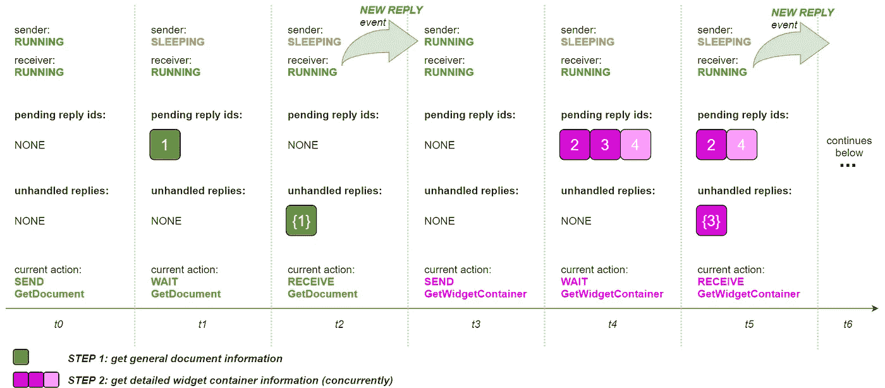
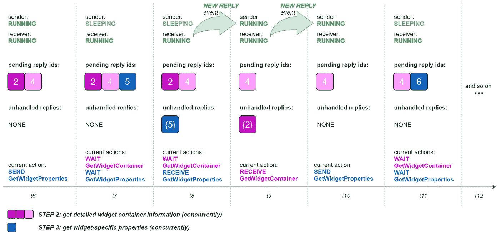

# 深入了解 Python 中的异步和并发编程

> 原文：<https://betterprogramming.pub/a-deeper-look-at-async-and-concurrent-programming-in-python-9f2a84adbdd2>

## “WebSockets 和 AsyncIO:超越 5 行示例”的续集

由 [Pocky Lee](https://unsplash.com/@jizhidexiaohailang?utm_source=unsplash&utm_medium=referral&utm_content=creditCopyText) 在 [Unsplash](https://unsplash.com/?utm_source=unsplash&utm_medium=referral&utm_content=creditCopyText) 上拍摄的照片

在上一篇文章的后续文章中，我讨论了 WebSockets、异步编程和 Python 并发性范围内的设计、库和质量保证。

在第一篇文章中，我们看了一下 WebSockets 技术以及它如何适应 Python。我还提出了一个虚构的用例来为讨论添加更多的上下文。

现在是时候将注意力转移到 [AsyncIO](https://docs.python.org/3.8/library/asyncio.html) 了，这是一个使用 async/await 语法编写并发代码的内置库。(如果你不熟悉的话，我推荐你看一下这个教程。)和`websockets`，`asyncio`将允许我们满足所提议用例的需求。

在 [GitHub](https://github.com/ricardolsmendes/websockets-asyncio) 上有完整的例子；`[document_inspector.py](https://github.com/ricardolsmendes/websockets-asyncio/blob/main/document_inspector.py)`是主文件。解释 200 多行代码中的每一行会很无聊，所以让我们把重点放在关键特性上。

# 并发处理

我在上一篇文章的结尾说，并发任务可以用来处理 WebSocket 通信通道中的消息和回复。将其转化为编程语言，我们最初需要将消息发送者和接收者任务表示为函数。函数是 Python 中的一级对象，这意味着它们可以作为参数传递给其他函数。

AsyncIO 配备了可唤醒的`asyncio.gather()`功能。它用于以给定的顺序运行并发函数，如下面的代码片段所示。

代码片段 1。asyncio.gather()用法示例

`results`名单预计有两个要素。第一个存储消息发送者的结果，可以忽略。第二个存储接收者的结果，这意味着成功执行时要返回的对象。

在这个虚构的用例中，我们还可以利用`asyncio.gather()`:在收到`GetDocument`回复(步骤 1)后，我们需要发送 *n* 条消息来获取详细的小部件容器信息，这取决于给定文档中图形小部件的数量(步骤 2)。为了减少文档检查时间，可以同时发送这些消息，如下所示:

代码片段 2。另一个 asyncio.gather()使用示例

正如我们所见，`asyncio`使得运行并发函数并无缝获取它们的结果值变得容易。还支持异常处理。(详情请参考[官方文档](https://docs.python.org/3.8/library/asyncio-task.html#asyncio.gather)。)

# 任务同步问题

现在我们知道了如何并发运行发送方和接收方任务，是时候解决另一个问题了:同步。在建议的用例中，开始步骤 2 依赖于步骤 1 的成功，开始步骤 3 依赖于来自步骤 2 的至少一个回复。发生这种情况是因为构建要在接下来的步骤中发送的消息依赖于从以前的回复中收集的数据。看看这个基于`syncio.Event`的方法来解决这个问题。

> "异步事件可以用来通知多个任务某个事件已经发生. "
> 
> — [AsyncIO 事件文档](https://docs.python.org/3.8/library/asyncio-sync.html#asyncio.Event)

由于示例工作负载的特征，发送方启动工作负载，并且可以休眠，直到有一些回复需要处理。然后它醒来，处理回复，包括发送后续消息(如果需要)，并再次休眠，直到有新的回复可用。但是谁知道新的回复刚刚到。接收器！

这意味着两个任务都应该可以访问一个共享的`asyncio.Event`对象。创建`[SendReceiveSyncHelper](https://github.com/ricardolsmendes/websockets-asyncio/blob/main/send_receive_sync_helper.py)`类是为了支持任务同步。关于`asyncio.Event`的使用细节，请参考`__new_reply_event`属性和相关方法——顺便说一下，这非常简单。

不幸的是，仅仅发射一个事件是不够的。我们还需要一个缓冲区，允许接收者与发送者共享接收到的对象。这是`__unhandled_replies`属性的工作。简而言之，接收方完成缓冲区，而发送方在处理完传入的回复后清除缓冲区。

还有第三个属性值得特别关注:`__pending_reply_ids`。它由一个数组组成，该数组保存待回复的 id，这意味着它们所标识的消息已经发送但尚未回复。

下图说明了共享变量的总体使用情况。从步骤 1 和 2 开始:

图一。发送方/接收方同步— GetDocuments 和 GetWidgetContainer

然后，第 2 步和第 3 步:

图二。发送方/接收方同步— GetWidgetContainer 和 GetWidgetProperties

变量`__pending_reply_ids`和`__unhandled_replies`有助于决定 WebSocket 是否应该保持打开。当没有未决或未处理的回复时，对于给定的文档，检查工作量被认为已经完成，并且可以关闭连接。

你可以在[完整示例](https://github.com/ricardolsmendes/websockets-asyncio/blob/main/document_inspector.py)的`__send_get_widgets_messages()`和`__receive_get_widgets_messages()`方法中看到用来实现这些结果的代码。

在结束这一部分之前，值得一提的是，这个解决方案可以被改编/重用，以解决各种用例中的任务同步问题，而不仅仅是我的团队所面临的 WebSockets 挑战。

# 错误处理

并发任务将在成功执行时优雅地关闭。但是我们知道失败总是存在的，当失败发生时，最好准备好采取适当的措施来避免破坏应用程序。

## 超时

正如我已经提到的，当没有未决或未处理的回复时，对于给定的文档，检查工作量被认为已经完成。如果没有收到预期的回复，可能需要 3 秒或 20 秒，或者更长时间，从而阻塞整个工作负载。

使用`asyncio.wait_for()`，用户可以指定等待任务完成的时间。[如果超时，取消任务并引发](https://docs.python.org/3.8/library/asyncio-task.html#asyncio.wait_for)错误。在提供的示例中，您可以看到`__hold_websocket_communication()`被包裹在`asyncio.wait_for()`中:

代码片段 3。asyncio.wait_for()用法示例

## 任务取消

而`__get_widgets()`调用又被包装在`asyncio.AbstractEventLoop.run_until_complete()`中。我们将在下面的**同步与异步**部分看到更多关于事件循环的内容。现在，只需注意`asyncio.AbstractEventLoop.run_until_complete()`调用包含在`try/except`块中，这允许我们在工作负载执行过程中出现任何异常时取消所有任务。

通过取消任务，我们确保他们的资源将被释放。

正如我们在上面看到的，`asyncio.wait_for()`在超时发生时取消任务，但是可能会引发不同类型的异常。所以用代码明确取消任务还是值得的。下面的代码片段显示了如何做到这一点:

代码片段 4。阿辛西奥。Task.cancel()用法示例

## 记录并返回

是时候讨论设计决策了。`DocumentInspector`类中只有一个公共方法:`get_widgets()`。它隐藏了我们迄今为止看到的所有复杂性，为用户提供了一个简化的界面。

代码片段 5。关于记录和返回的设计决策

就异常处理而言，这是记录技术信息的唯一地方，因此程序输出保持简洁明了。基于这样的日志，可以很容易地进行故障跟踪。

最后，如果在获取给定文档小部件数据时出现异常，则返回一个空列表。对于这个虚构的用例，假设做出这个决定是为了防止由于每次执行中运行的一些不同工作负载中的错误而中断整个应用程序。有了详细的日志，零星的错误可能是可以接受的。如果它不符合您的需要，请考虑重新引发异常并在上游处理它。

# 同步与异步

您可能注意到了保留字`async`和`await`在第一段代码中比在最后一段中使用得更多。这是因为我使用了自下而上的方法来解释`asyncio`的特性。我的意思是我从更复杂的`DocumentInspector`内部/并发东西开始，以更简单的公共`get_widgets()`方法结束。顺便说一下，该方法是同步的，而不是协程。

同步和异步代码之间的桥梁是`asyncio.AbstractEventLoop.run_until_complete()`方法。它返回给定协程的结果或引发其异常。

> "事件循环是每个 AsyncIO 应用程序的核心."
> 
> — [AsyncIO 事件循环文档](https://docs.python.org/3.8/library/asyncio-eventloop.html#event-loop)

在完整的例子中，我在`__run_until_complete()`中调用了它，这是我们将在本文中讨论的最后一个方法。

代码片段 6。`asyncio.new_event_loop().run_until_complete()`用法示例

请注意，事件循环对象存储在一个变量中。这允许我们将其传递给`__cancel_all_tasks()`——如前所述，在出现错误时取消并发任务——并在文档检查工作完成后正确关闭事件循环。

现在看一下`future` arg:它解析为`asyncio.wait_for()`创建的协程。在运行时，它恰好是发送方和接收方任务的包装器。然后，事件循环拥有了运行工作负载所需的所有元素，并为`get_widgets()`提供了一个在结束时返回的适当对象。

**旁注** : Python 3.7 [临时引入了](https://docs.python.org/3.7/library/asyncio-task.html#running-an-asyncio-program) `asyncio.run()`作为对`asyncio.AbstractEventLoop.run_until_complete()`的更高层次的方法。它完成了我在本节中描述的所有工作，外加**任务取消**。虽然被宣布为[临时 API](https://docs.python.org/3.8/glossary.html#term-provisional-api) ，但其签名和行为从那时起就没有改变过(参考见 [3.7](https://github.com/python/cpython/blob/3.7/Lib/asyncio/runners.py) 、 [3.8](https://github.com/python/cpython/blob/3.8/Lib/asyncio/runners.py) 和 [3.9](https://github.com/python/cpython/blob/3.9/Lib/asyncio/runners.py) 中的源代码)。如果你的项目不需要 Python < 3.7，那就值得考虑`asyncio.run()`。

好了，完成前一篇文章中介绍的虚构用例所需的主要工具已经就绪。在这里，我们结束了“操作”讨论。

# 单元测试

在这最后一节中，我将简要回顾单元测试相关的事项。它更多的是关于经验教训和未来的改进，而不是关于如何编写这样的测试的细节。

## Python 版本怪癖

从 Python 3.4 开始，AsyncIO 就包含在标准库[中。在 3.5](https://docs.python.org/3.6/library/asyncio.html) 中添加了带有`async`和`await`语法的协程[。但是内置的`unittest`模块在 3.8](https://docs.python.org/3.6/whatsnew/3.5.html#whatsnew-pep-492) 中变成了`asyncio`-特色[。](https://docs.python.org/3/whatsnew/3.8.html#unittest)

运行我的团队实际工作的代码需要 Python 3.6+支持，这意味着需要变通方法来测试 3.6 和 3.7 中的异步代码。我们在 Python 博客文章中使用了启发性的[策略来测试异步代码，作为完成工作的参考。](https://medium.com/@AgariInc/strategies-for-testing-async-code-in-python-c52163f2deab)

我们预计这是暂时的，当有协议要求 Python ≥ 3.8 来运行代码时，我们会更新单元测试——解决方法与 3.8 不兼容。因此，我不会在本节的剩余部分重复参考博客文章，而是将重点介绍最近的两个内置改进，这两个改进使得异步代码单元测试从 3.8 开始变得更加简单。

## **异步模拟**

Python 3.8 增加了`AsyncMock`，支持`Mock`的一个[异步版本](https://docs.python.org/3.8/library/unittest.mock.html#unittest.mock.AsyncMock)。`AsyncMock`对象的行为使得该对象被识别为一个异步函数，并且调用的结果是一个可唤醒的。还添加了适当的新测试断言函数，例如`assert_awaited()`、`assert_awaited_with()`和`await_count`。

也就是说，为异步函数编写单元测试现在非常类似于 Python 开发人员在测试同步代码时一直做的事情。例如:

代码片段 7。unittest.mock.AsyncMock 用法示例

## 上下文管理器和迭代方法

`MagicMock`(你没看错，我说的已经不是`AsyncMock`了)增强了。[魔法方法现在支持](https://docs.python.org/3.8/library/unittest.mock.html#magicmock-and-magic-method-support)`__aenter__``__aexit__``__aiter__``__anext__`；因此，异步上下文管理器和迭代可以被无缝地模仿:

代码片段 8。unittest . mock . magic mock . _ _ aiter _ _ 用法示例

然后可以使用上面的模拟对象来测试异步 for 循环，比如`async for message in websocket:`，它在样本代码中遍历 WebSocket 客户端接收到的消息。

如果你想看更多的单元测试例子，包括如何修补异步函数的建议，请参考 GitHub 上的[配套资源库。我把一些试卷留在那里了。](https://github.com/ricardolsmendes/websockets-asyncio/blob/main/tests/document_inspector_test.py)

# 最后的想法

我已经介绍了 WebSockets，对于 AsyncIO 来说差不多就是这些了。我相信他们还有很多有待发现的地方，但我希望在队友的帮助下，我已经足够清楚地提出了我目前所学到的东西。

本文中讨论的设计和策略目前正在生产代码中使用。他们帮助我们创建了一个易于维护的模块化解决方案，促进了重用，并对客户隐藏了复杂性。

写作就是分享，所以我希望这里展示的知识可以帮助其他团队在他们的 WebSockets 和 AsyncIO 相关的挑战中茁壮成长。请不吝赐教，随时欢迎反馈。

万事如意！

# 参考

*   Python 中的异步 IO，完整演练:**[https://realpython.com/async-io-python/](https://realpython.com/async-io-python/)**
*   **Python 中测试异步代码的策略:**[https://medium . com/@ agari Inc/strategies-for-Testing-Async-Code-in-Python-c 52163 F2 deab](https://medium.com/@AgariInc/strategies-for-testing-async-code-in-python-c52163f2deab)****
*   ****Python 中的 AsyncIO、线程和多处理:**[https://medium . com/analytics-vid hya/AsyncIO-Threading-and-multi processing-in-Python-4 F5 ff 6 ca 75 e 8](https://medium.com/analytics-vidhya/asyncio-threading-and-multiprocessing-in-python-4f5ff6ca75e8)******