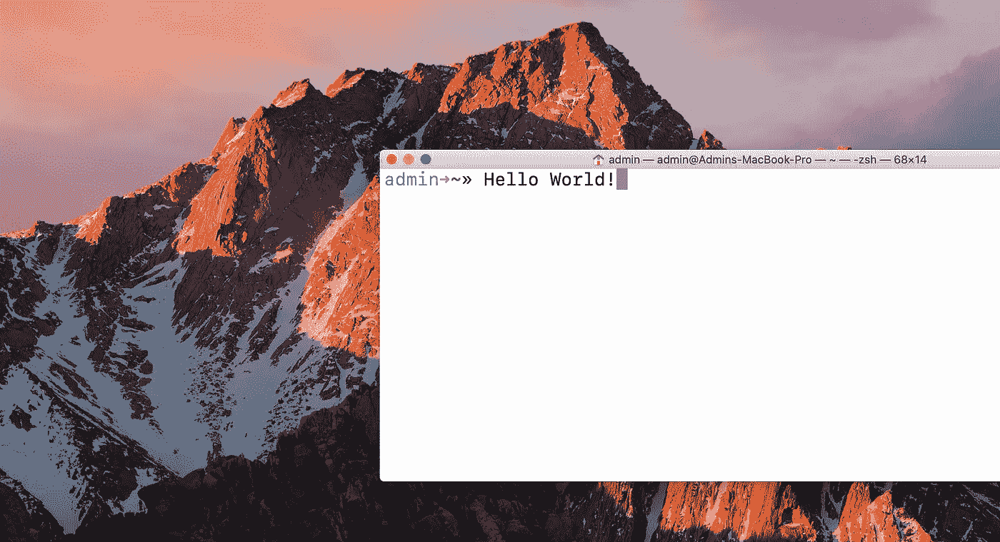

# 大量有用的键盘快捷键

> 原文：<https://betterprogramming.pub/a-definitive-guide-to-all-the-shortcuts-for-new-rubyists-a365a590d16e>

## 在一天中创造更多的时间


凯文·Ku 在 [Unsplash](https://unsplash.com/s/photos/time?utm_source=unsplash&utm_medium=referral&utm_content=creditCopyText) 上的照片

**TL；博士**:互联网上的键盘快捷方式文章多得让你目不暇接。这基本上是我为我自己和我的朋友做的一个元备忘单，列出了让一个新程序员的生活更美好的核心捷径。它最后还有一个不那么核心的游戏规则改变者。

# 为什么

如今，当人们使用短语*时间投资*时，他们通常指的是*时间浪费，*例如，“我一直想重新看《指环王》电影，但这是一个如此*的时间投资*。现在我们被隔离了…”

此时此地，让我们收回这句话的本义:那就是，花时间做一些将来会有回报的事情。你可以随心所欲地把它应用到大而抽象(上大学)或小的地方(整理你的袜子抽屉)。具体来说，我们在这里谈论的是一种时间投资，这种投资用金钱买不到的东西来回报:更多的时间。

让我们假设一天中你在电脑上的每一个动作都被表示为文件中的一行代码。会有一些占据许多行的大标题活动，像写代码、网上冲浪、写电子邮件和听音乐。您还会看到大量的微活动，比如在应用程序之间切换或打开浏览器窗口。在我们想象的文件中，那些微观活动会有如此多的重复，如果我们不至少试着把它们弄干，我们就会变成怪物。

你会问，有什么神奇的工具能让我们做到这一点？答案:键盘快捷键。我知道这是一个非常不性感的词，但是你知道什么是性感吗？有更多的时间做不重复的事情。因为，毕竟，这是一篇关于快捷方式的文章，我们将把它缩写为*SC*forward。

如果我想让你从这篇文章中学到什么，那就是这个。花在学习 SC 上的每一秒钟都会在未来产生数小时的时间。这是一个冷酷的事实；如果你不相信，看看这个脚注。

最终，选择权在你，取决于你对 SCs 有多顽固。你不必成为那些厌恶使用触控板的人，也不必诅咒史蒂夫·乔布斯推广 GUI。哪怕捡几个 SCs 也会让你的生活更美好。毕竟，我们是懒惰的程序员——不做多余的工作是我们的一贯作风！

# 怎么做

这个备忘单是模块化的，这意味着你可以跳过来挑选，或者如果你愿意，可以一口气读完。这是你自己选择的冒险。如果你觉得清单太多了，这里有两条关于如何开始的建议:

*   将这一页加入书签，开始你的日常电脑活动。但是无论何时使用鼠标，都要记住。当其中一个鼠标任务反复出现时，就把这篇文章拿出来，找到它的 SC，然后开始使用它。冲洗，洗涤，重复。
*   本文中的主题从一般(您将在任何地方使用的东西)到特殊(如果您正在使用 Rails，您将经常使用的东西，但是只适用于 Rails)。

最大的是肌肉记忆。如果你从一个不经常使用 SCs 的地方开始，试图把所有这些抽象的命令塞进你的大脑是不会有趣或有效的。一次吃几片，并坚持使用它们。从某些方面来说，仅仅从供应链的角度来思考是最强大的，因为每当你拿起鼠标或者一项任务感觉很麻烦的时候，你就会去寻找它们。

## 两个快速笔记

*   这些快捷方式反映了我使用的系统，所以如果你使用不同的，吃你不喜欢的部分。
*   几乎所有的 MacOS SCs 都可以在 Chrome 和 VS 代码中工作。为了简洁起见，我不会在那些章节中转载它们。

# 目录

```
[**MacOS**](#b597)
 [Basics](#5f44)
 [Navigation](#da28)
 [Cursor and selecting](#ba76)[**Chrome**](#decb)
 [Tab/window navigation](#5fa0)
 [Miscellaneous Features](#33e3)[**VS Code**](#18ba)
 [Display](#13fd)
 [Editing](#c021)
 [Advanced features](#c180)[**Terminal**](#f40a)[One SC tip to rule them all](#ac5d)
```


由[Ruben menárguez](https://unsplash.com/@rubmenarguez?utm_source=unsplash&utm_medium=referral&utm_content=creditCopyText)在 [Unsplash](https://unsplash.com/?utm_source=unsplash&utm_medium=referral&utm_content=creditCopyText) 拍摄的照片

# 马科斯

操作系统 SCs 是一切的基础，很容易成为树上最容易摘到的果子。这个列表包含了必备的快捷键，因为这些快捷键不仅改善了您通常使用电脑的方式，而且它们非常常见，大多数应用程序都使用相同的快捷键。一物多价！

## 基础

*   剪切选中的项目:`command + x`
*   复制选中的项目:`command + c`
*   粘贴选中的项目:`command + v`
*   粘贴搭配风格:`option + shift + command + v`
*   撤销上一个动作:`command + z`
*   在文档或窗口中查找项目:`command + f`
*   保存文件:`command + s`
*   退出应用程序:`command + q`

## 航行

*   打开一个新窗口:`command + n`
*   关闭当前窗口:`command + w`
*   最小化当前窗口:`command + m`
*   打开一个新标签:`command + t`
*   在应用程序之间切换:`command + tab`(一直按 tab 直到出现你想要的应用程序)
*   在相反方向的应用程序之间切换:`command + shift + tab`(一直按 tab 直到你找到你想要的应用程序)

## **光标和 s** 选择

我认为这些是通向 SC 的真正入口。从技术上来说，它们起源于 Mac 应用程序，如 notes 和 document editors，但它们存在于许多应用程序中，如 VS Code，它们使生活变得容易得多。

基本思想是你的光标不必一次向上/向下/向右/向左移动一格——而且你可以同时选择东西！

*   跳转到文档的顶部/底部:`command + up/down arrow`
*   跳到行首/行尾:`command + left/right arrow`
*   跳到上一个/下一个单词的开头:`option + left/right arrow`
*   要选择一个文本块，请用 shift 键组合前面的任意 SCs。要选择文件中的所有内容吗？将光标移到文档的最后一行，然后点击`shift + command + up arrow`。嘣！一旦你真正习惯了这些，用触控板选择东西就会感觉像是一件苦差事。

这绝不是一份详尽的清单。还有很多，所以如果你想查看完整的列表，去苹果网站上的 [Mac 键盘快捷键](https://support.apple.com/en-us/HT201236)。


图片由[照片混合](https://pixabay.com/users/PhotoMIX-Company-1546875/?utm_source=link-attribution&amp;utm_medium=referral&amp;utm_campaign=image&amp;utm_content=1433323)在[像素箱](https://pixabay.com/?utm_source=link-attribution&amp;utm_medium=referral&amp;utm_campaign=image&amp;utm_content=1433323)上生成

# 铬

Chrome 是最受欢迎的网络浏览器，所以这篇指南是针对它的 SCs 的。也就是说，大多数其他网络浏览器都有完全相同的浏览器，所以即使你不使用 Chrome，这也可能是有用的。

## 标签/窗口导航

*   切换浏览器窗口:`option + ``
*   切换浏览器窗口(反方向):`shift + option + ``
*   跳转到左隔壁的标签:`command + option + left arrow`
*   跳到右边旁边的标签:`command + option + right arrow`
*   重新打开最近关闭的标签页: `command + shift + t`
*   在匿名模式下打开一个窗口:`command + option + n`

## 杂项功能

*   书签当前页面:`command + d`
*   打开开发者工具:`command + option + i`
*   跳转到地址栏:`command + l`(如在利马)
*   重新加载当前页面:`command + r`
*   向下滚动网页:`spacebar`
*   向上滚动网页:`shift + spacebar`
*   在新标签页中打开链接:`command + mouse click`
*   在新标签页中打开浏览器历史记录:`command + y`
*   在新标签中打开下载历史:`command + shift + j`

再说一次，外面还有很多。这些只是我经常用的。谷歌支持有 Chrome 键盘快捷键的完整列表。


照片由[this engineering RAEng](https://unsplash.com/@thisisengineering?utm_source=unsplash&utm_medium=referral&utm_content=creditCopyText)在 [Unsplash](https://unsplash.com/?utm_source=unsplash&utm_medium=referral&utm_content=creditCopyText) 上拍摄

# VS 代码

这一个的结构会有一点不同，只是因为 VS 代码有很多强大的特性。我将重点介绍一些我认为最有用的工具，此外，我还将标记一些更高级的工具。你可以在这里找到[VS 代码键盘快捷键的完整列表](https://code.visualstudio.com/shortcuts/keyboard-shortcuts-macos.pdf)。值得一提的是，MacOS [光标和 Select](#ba76) SCs 对于 VS 代码来说非常有价值，因为它们允许你快速浏览光标并有效地进行选择。

## 显示

*   基本的标签页导航和 Chrome 一样:
    右/左跳隔壁:`command + option + l/r arrow`关闭一个标签页:`command + w`
*   拆分编辑器窗口:`command + \`
*   注释掉一段代码:突出显示您的选择，或者将光标放在您想要注释掉的行上，`command + /`
*   当代码溢出窗口时切换自动换行:将光标置于要换行的窗口中，`option + z`

## 编辑

*   特别要强调的一个特性是他们称之为[的智能感知](https://code.visualstudio.com/docs/editor/intellisense)。他们有一个完整的页面，但长话短说，这是一个自动完成功能，知道你的应用程序中的对象。当你开始输入时，它会自动弹出，但如果你想触发它使用代码片段之类的东西，你可以点击`control + spacebar`。一旦你知道它在那里，玩起来就很有趣。
*   移动文本块:高亮显示您的选择或将光标放在您要移动的行上，`option + up/down arrow`
*   复制文本块:高亮显示您的选择，或者将光标放在您要复制的行上，`shift + option + up/down arrow`
*   (这个可能是我最喜欢的，因为它节省了大量的时间。)选择当前选择的所有匹配项。一旦选中，它基本上是一个查找和替换的过程——你对当前选择所做的任何编辑都将发生在当前文件的所有选择中:当你的光标在你想要大量选择的内容中时，`shift +option + L`
*   与上述相关的是多光标编辑，例如，如果您想删除#不同行种子数据的最后#个字符，这很有用。在上一行或下一行的相同位置插入另一个光标:`option + command + up/down arrows`

## 高级功能

*   [代码片段](https://code.visualstudio.com/docs/editor/userdefinedsnippets)是模板，可以更容易地输入重复的代码模式。需要举例吗？有一次，我花了整整一个上午调试某个东西，结果发现是初始化错误。现在，每当我需要一个初始化方法时，我都会使用一个代码片段，这样我就再也不用经历这样的事情了。可以自己写；他们的市场上也有很多。
*   扩展有点像 Ruby 的宝石。它们是代码包，可以创建格式化工具或帮助你调试代码。我个人使用简单的 Ruby ERB 和 HTML 代码片段，但老实说，有这么多的扩展，他们可能是自己的文章。如果你对它们感兴趣，你可以查看[文档概述](https://code.visualstudio.com/docs)或者浏览 [Visual Studio 市场](https://marketplace.visualstudio.com/VSCode)。



你真实的照片

# 末端的

这是最初激发我写这篇文章的一个重要原因。

我长期以来一直是一个狂热的 SC 用户，所以当我开始使用 Rails 时，我对其中的一些命令感到有点不安:

`rails g controller <controller_name>`

`rails db:migrate`

我的意思是，与我习惯的相比，这几乎是一个完整的段落，更不用说还有这么多打字错误。呃。

## 一个 SC 提示来统治他们

后来我发现了一些东西。我不骗你，这就像获取编程的作弊代码。用他们的话说，这是“一个令人愉快的用于管理 zsh 配置的社区驱动的框架。”它叫[哦我的 Zsh](https://ohmyz.sh/) 。

快速说明:我和这个产品没有任何关系，可能有其他人喜欢它。我只是碰巧觉得这个很棒。

这是什么？它是一个位于 zsh 之上的框架，为您自动化了许多真正方便的特性。我将快速介绍几个我最喜欢的。

**文件跳转**

您刚刚运行了`ls`来查看目录中有哪些文件，现在您正坐在那里使用一个`cd`，但结果是您想要的目录的前 13 个字符与另一个完全相同(例如，在命名某个东西时，我从来没有这么笨过)。别担心！现在你只需点击 Tab 键就可以滚动浏览。(同样，还有多级`cd`功能`“cd ...” = 1 level`、`“cd ...” = 2 levels`、`“cd ...” = 3 levels`！)

**主题**

你可能会想，*我们正在讨论实质问题，从我的编程中节省了大量时间，为什么他要提出美学特征*？原来主题不仅仅是漂亮的脸蛋。例如，如果您正在使用 Git 进行大量的协作工作，那么主题可以用您正在处理的分支的名称替换提示行。

**插件**

前两个特性很好，但是插件把我的 Zsh 从“拥有它很好”推到了“无法想象没有它的生活”。我的下巴撞到了地板。插件是一组自定义的 SCs，它们是常用命令的别名。换句话说，如果你设置了 Rails 插件，例如:

`rake db:migrate`

变得…

`rdm`

这是冰山的最小一角。想想你能想到的所有最丑陋、最长的命令，不管用什么语言，你可以打赌很可能有一个插件。仅仅想到 Git 和 Rails 别名就让我头晕。请帮你自己一个忙，调查一下。这里有[维基](https://github.com/ohmyzsh/ohmyzsh/wiki)和[非常广泛的插件列表](https://github.com/ohmyzsh/ohmyzsh/wiki/Plugins)。

这就是我现在所得到的一切:向前迈进，成为一名超级忍者！与任何类似的工作一样，必须决定包括什么和不包括什么。如果你喜欢我没有提到的东西，请与世界分享你的爱，并在评论中留言。

# 脚注

以下是一些很酷的脚注:

[](#bbdb)现代互联网 clickbait 文化把这个概念称为*生活帮*。像许多这样的事情一样，这是一个非常古老的想法，它被用一个诱人的术语装扮起来，以获得浏览量。可以肯定的是，如果穴居人出现在互联网上，将会有数百万篇题为“改变一切的生活帮:用火做饭！”

让我们来快速计算一下。我有一行代码需要从文件的顶部复制，并插入到我在文件末尾编写的代码中。使用快捷方式只需 7 秒钟。用我的触控板(和比下拉菜单更快的右键)，同样的动作花了我 14 秒。那是 7 秒钟的差别。假设我每年编码 45 周，每周 5 天，每天 8 小时，我必须每小时执行(非常保守地)三次类似的动作。如果我一整年都在使用触控板，我会多花 37800 秒来复制粘贴东西。那是十个半小时！

是的，这是一个脚注的脚注。2005 年的这项研究证实了这些数字。它还发现，在他们的研究中，只有 13%-19%的人经常使用 SCs 进行剪切/复制/粘贴功能。首先，我祈祷这个数字在过去的 15 年里飞速增长。其次，这里有一个让我感到身体不适的思想实验:以主要在电脑上工作的美国员工总数为例，乘以不使用 SCs 的比例，再乘以使用 SCs 可以节省的时间。我敢打赌，这个数字比美国和欧洲之间的带薪休假差距(20 天左右)还要大。我只是半开玩笑地说，我认为我们应该开展一场全国性的公益广告运动，贴上像[这张](https://catalog.archives.gov/OpaAPI/media/513630/content/arcmedia/media/images/17/8/17-0744a.gif)这样的二战时期的海报，上面写着:“你真的试过用键盘快捷键来节省时间吗？”