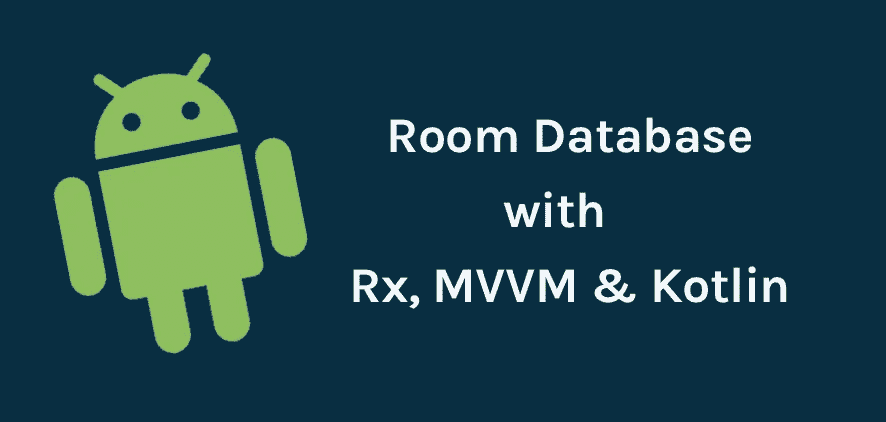
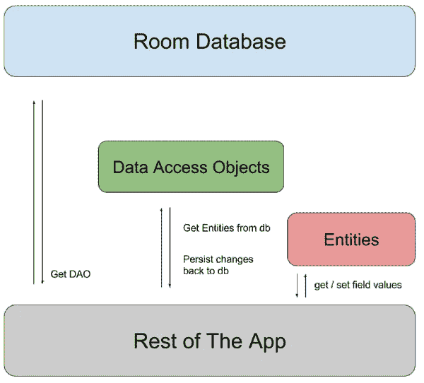
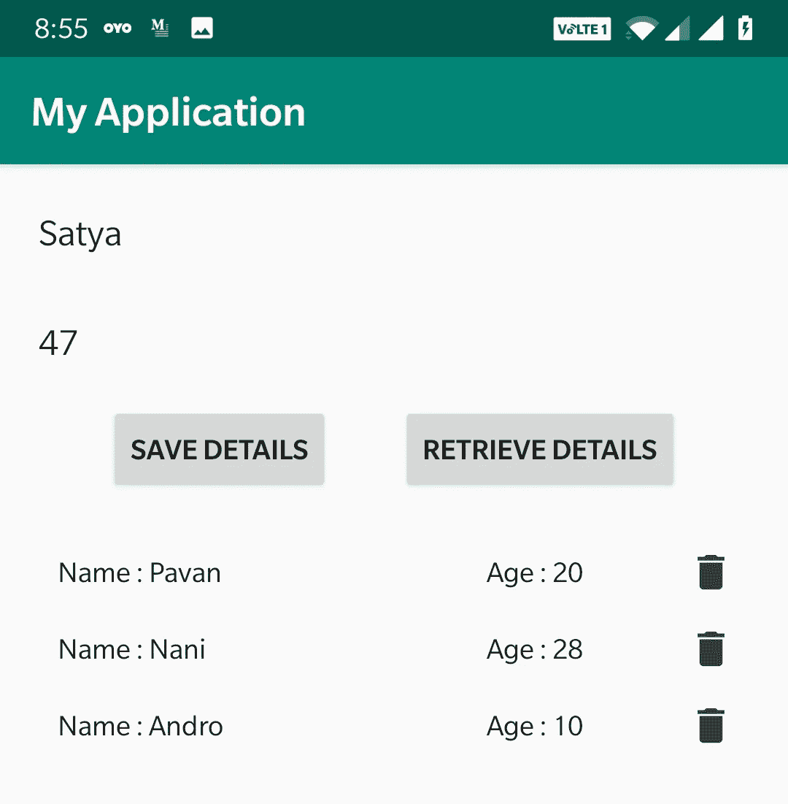

# 科特林、Rx 和 MVVM 的客房数据库详细指南

> 原文：<https://betterprogramming.pub/a-detailed-guide-on-room-database-with-kotlin-rx-mvvm-ea982e9c5abe>

## 浏览房间数据库



# 什么是房间数据库？

在开发一些应用程序如聊天应用程序时，我们需要一个本地数据库来存储数据，以处理减少频繁加载或离线处理等情况。如果您是很久以前的开发人员，您可能已经使用 SQLite 数据库和 SQLiteOpenHelper 类来执行数据库操作。随着时间的推移，许多图书馆蓬勃发展，使开发人员的生活更容易。一个这样的图书馆是房间。

Room 在 SQLite 上提供了一个抽象层，在充分利用 SQLite 的能力的同时，允许更健壮的数据库访问。

简单地说，Room 是 SQLite 上的一个抽象层，以提供简化的编码。如今，我们可以看到许多应用程序使用 Room，因为它提供了很多好处。如果您在应用程序中使用 SQLite，请迁移到 Room。Room 持久性库非常方便易用。

## 为什么使用房间？

1.  我们可以消除与 SQLite 数据库相关的大部分样板代码
2.  对于 SQLite，没有对原始 SQLite 查询的编译时验证。但是在 Room 中，有一个 SQL 查询的编译时验证。`@Query`和`@Entity`在编译时被检查，以消除运行时的问题。它不仅检查语法，还检查丢失的表。
3.  更容易实现和维护。
4.  这个房间是为了配合 LiveData 和 RxJava 进行数据观察而构建的，而 SQLite 不是。

# 房间的组成

在深入研究代码之前，让我们先了解一下 Room 的基本原理。我们主要需要了解三个组件。它们是:

## 实体

一个实体代表数据库中的一个表。教室为每个有`@Entity`注释的班级创建一个表格。类中的每个字段都是表中的一列，我们可以通过用`@ColumnInfo` (name = "column_name ")注释该字段来为该列指定一个特定的名称。我们使用注释`@PrimaryKey`指定的每个表应该至少有一个主键字段。

## 数据访问对象(Data Access Object)

数据访问对象(DAO)是一个带有注释`@Dao`的接口，它包含用于访问数据库的方法。我们将在 Dao 中创建抽象方法来执行 CRUD 操作。房间支持道`@Insert`、`@Update`、`@Delete`、`@Query`中的以下标注。以前我们在 SQLite 中使用光标对象，但是在 Dao 中我们简单地用注释定义各自的查询。一切都简化了。

## 数据库ˌ资料库

该数据库包含数据库容器，并作为应用程序持久化关系数据的底层连接的主要访问点。

用`@Database`标注的类应该满足以下条件:

*   做一个扩展`RoomDatabase`的抽象类。
*   包括所有`entities` 和`database version` 与数据库相关的列表。
*   包含一个没有参数的抽象方法，并返回用`@Dao`注释的类。

属性`version`用于定义数据库的版本，而`entities`用于定义该数据库将包含的所有表的列表。在运行时，您可以通过调用`Room.databaseBuilder()`或`Room.inMemoryDatabaseBuilder()`来获取 Databse 的实例。



三个部分之间的关系。图片来源:developer.android.com

# 让我们开始编码吧

我们在这里要讨论的例子是在单击第一个按钮时保存以简单形式给出的细节，并在单击第二个按钮时检索它们。还有一个删除记录的删除按钮。在这里，我们将使用科特林，Rx 与 MVVM，使我们的工作更容易。



> *从 2.1.0-alpha01 开始，标注有* `*@Insert*` *、* `*@Delete*` *或* `*@Update*` *的刀方法支持 Rx 返回类型* `*Completable*` *、* `*Maybe<T>*` *和* `*Single<T>*` *。*

## **第一步**:在 **build.gradle** 中添加依赖关系

```
// Room Database with Rx
implementation "androidx.room:room-runtime:2.2.2"
implementation "androidx.room:room-rxjava2:2.2.2"
kapt "androidx.room:room-compiler:2.2.2"
implementation 'io.reactivex.rxjava2:rxandroid:2.1.1'implementation"org.jetbrains.kotlin:kotlin-stdlib-jdk7:$kotlin_version"
implementation 'androidx.appcompat:appcompat:1.1.0'
implementation 'androidx.core:core-ktx:1.1.0'
implementation 'androidx.constraintlayout:constraintlayout:1.1.3'
implementation 'androidx.recyclerview:recyclerview:1.1.0'

// Lifecycle
implementation "androidx.lifecycle:lifecycle-extensions:2.1.0"
annotationProcessor "androidx.lifecycle:lifecycle-compiler:2.1.0"
kapt "androidx.lifecycle:lifecycle-compiler:2.1.0"
```

## **步骤 2:** 创建一个模型类实体

如上所述，每个实体代表一个表。在我们的例子中，`PersonData`类将是数据库中的表。

## **第三步:**让我们创建一个**刀**

我们已经定义了表结构，现在是时候按照我们的要求定义 CRUD 操作了。数据访问对象(DAO) 只不过是一个我们定义方法的接口。`PersobalDataDao` 是我们这里的刀，有基本的`@Insert`、`@Delete`、`@Query` 操作。

`@Insert`有一个参数`onConflict` ，当我们试图插入一个已经在表中的带有键的列时，这个参数很有用，`OnConflictStrategy` 有三个选项 Abort、Replace 和 Ignore。

中止:中止交易。交易被滚动。

替换:替换旧数据，继续交易。

忽略:忽略冲突。

`@Query`注释帮助我们编写与数据相关的 SQL 查询。

## 步骤 4:现在是时候创建我们的数据库类了

为了创建一个数据库类，我们需要创建一个扩展`RoomDatabase`的抽象类。这个类用`@Database`标注，有所有`entities`、`database`、`version`和`Dao`的详细信息。

现在我们完成了与数据库相关的事情。让我们创建一个活动和视图模型来执行操作。

第一步:创建一个 XML 文件

第二步:创建一个`ViewModel`类

**第三步**:创建一个`MainActivity`类

**步骤 4:** 由于我们使用了一个适配器来显示已保存项目的列表，所以让我们来看看它的实现。

由于一切都已设置好，如果我们现在运行应用程序，我们将会看到如下表格，我们可以在其中保存数据。在输入详细信息后，我们可以检索已保存数据的列表并将其填充到`RecyclerView`中，并且可以在单击删除按钮时删除已保存的记录。

对于高级的东西，让它更深入。

技巧 1:我们可以通过一次尝试将单个项目或项目数组或可变数量的项目插入数据库。

```
@Dao
interface PersonalDataDao {

    @Insert(onConflict = OnConflictStrategy.*REPLACE*)
    fun insertPersonData(data:PersonData) : Completable

    @Insert(onConflict = OnConflictStrategy.*REPLACE*)
    fun insertPersonDataList(dataList:ArrayList<PersonData>):   .   Completable

    @Insert(onConflict = OnConflictStrategy.*REPLACE*)
    fun insertPersonDatas(data:PersonData,data2:PersonData) : Completable

}
```

同样的情况可以用`@Update` 和`@Delete`来表示

技巧 2: 我们已经看到了关于原语插入；让我们探索对象类型插入。`@Embedded`用于存储 SQL 不直接支持的`data-types`。

提示 3: `TypeConverter` 允许您将特定的自定义类型持久化到数据库类型中。`TypeConverter`被添加到元素的作用域中，所以如果你把它放在一个类/接口上，实体和 DAO 中的所有方法/字段都可以使用转换器。

```
data class PersonData{
 @TypeConverters(SampleConverter::class)
 @ColumnInfo(name = "list_parents")
 var listParent: List<Parent>?
}
```

目前就这些。我将在以后的文章中写更多关于房间的高级概念。我希望你喜欢阅读这篇文章。如果你觉得有用，请分享给你的朋友。

请让我知道你的建议和意见。

感谢阅读…