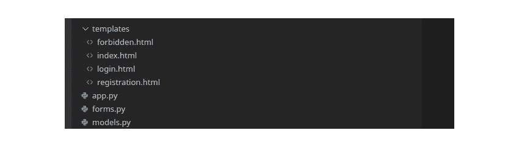
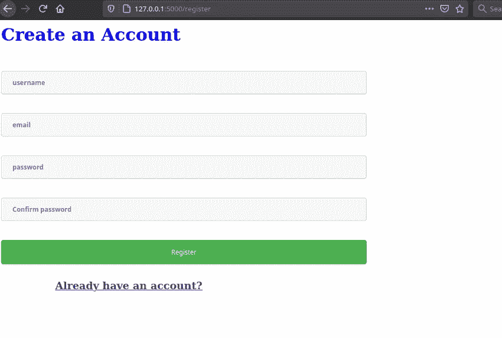
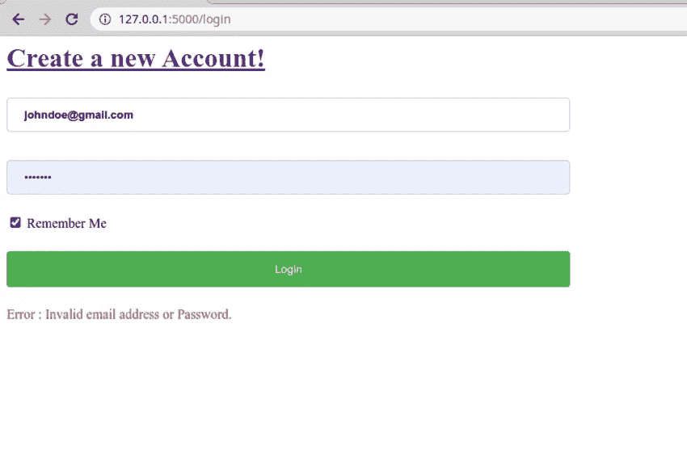
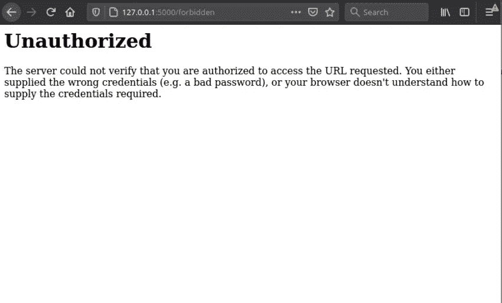

# Flask 中用户注册、登录和注销的详细指南

> 原文：<https://betterprogramming.pub/a-detailed-guide-to-user-registration-login-and-logout-in-flask-e86535665c07>

## 如何在 Flask 中设置用户帐户


来自[爆发](https://burst.shopify.com/online?utm_campaign=photo_credit&utm_content=Picture+of+Laptop+On+Login+Screen+%E2%80%94+Free+Stock+Photo&utm_medium=referral&utm_source=credit)的[莎拉·普弗卢格](https://burst.shopify.com/@sarahpflugphoto?utm_campaign=photo_credit&utm_content=Picture+of+Laptop+On+Login+Screen+%E2%80%94+Free+Stock+Photo&utm_medium=referral&utm_source=credit)的照片

当用户在一个特定的网站上注册一个帐户时，他们可以用详细信息登录。在登录过程中，网站向服务器发送请求，检查所提供的详细信息是否与数据库中的信息相匹配。如果找到了该用户的详细信息，用户就成功登录并可以访问其他页面。

# 认证和授权的概念

身份验证是识别登录用户的过程，而授权决定特定用户是否有权访问 web 资源。

# 密码哈希

在设计任何应用程序时，一个重要的规则是永远不要以纯文本的形式存储敏感数据，比如密码。以纯文本形式存储密码会带来很大的安全风险，因为数据会落入错误的硬盘。

那么，我们如何确保我们的密码是安全的呢？哈希！。哈希是一个接受字符并用另一个不可反向工程的随机字符掩盖数据的过程。

Flask 提供了`Werkzeug`包，它处理散列功能。下面的代码显示了如何散列简单的密码字符。

```
from werkzeug.security import generate_password_hash, check_password_hashplain_password = "qwerty"hashed_password = generate_password_hash(plain_password)print(hashed_password)
```

哈希密码将是:

```
pbkdf2:sha256:150000$yotdkuRo$034c73b6e64d1a02ec30a2551a7cad18dbc87514b706aa40c9ca386896739315
```

要检查原始密码是否与哈希格式相同，请执行以下操作:

```
hashed_password = generate_password_hash(plain_password)submitted_password = "qwerty"matching_password = check_password_hash(hashed_password,submitted_password)print(matching_password)
```

`check_password_hash()`接受两个参数，即哈希密码字符串和给定密码。如果两个密码匹配，它返回`True`，如果两个字符串不匹配，它返回`False`。

本教程将介绍如何在 Flask 中创建一个用户认证系统，使用 Flask Login 作为认证机制。学完本教程后，您应该能够:

*   使用 WTFfroms 创建用户注册和登录表单
*   创建用户注册和登录页面
*   执行注册并登录到数据库。
*   执行密码哈希
*   如果用户未登录，则保护页面

让我们开始吧。

用以下文件创建一个目录:



项目目录结构

创建并激活虚拟环境。

```
python3.8 -m venv env
source env/bin/activate
```

安装 Flask 和 flask_sqlachemy

```
pip install Flask
pip install Flask-SQLAlchemy
```

## 数据库配置

为了向任何 Flask 应用程序添加数据库功能，我们使用 SQLAlchemy。根据[文档](https://www.sqlalchemy.org/):

> SQLAlchemy 是 Python SQL 工具包和对象关系映射器，为应用程序开发人员提供了 SQL 的全部功能和灵活性。它提供了一整套众所周知的企业级持久化模式，设计用于高效和高性能的数据库访问，并改编成一种简单的 Pythonic 域语言。

打开`app.py`，导入文件顶部的`SQLalchemy`和`Flask`

```
from flask import Flaskfrom flask_sqlalchemy import SQLAlchemy
```

创建 Flask 应用程序实例

```
app = Flask(__name__)
```

初始化数据库并将其绑定到应用程序。

```
app.config[‘SQLALCHEMY_DATABASE_URI’] = ‘sqlite:///mydb.db’app.config[‘SQLALCHEMY_TRACK_MODIFICATIONS’] = Falsedb = SQLAlchemy(app)
```

# 烧瓶登录

Flask 登录是 Flask 中会话管理的基础。它提供了管理用户所需的功能，例如:

*   在会话中存储用户 id，允许他们轻松登录和注销
*   限制未经授权的用户访问某些视图
*   记住用户
*   保护用户会话免受网络攻击

要开始使用 Flask Login，首先通过 pip 安装它。

```
pip install flask-login
```

因为 Flask login 使用会话进行身份验证，所以在您的应用程序上创建一个密钥。

```
import osSECRET_KEY = os.urandom(32)app.config['SECRET_KEY'] = SECRET_KEY
```

**登录管理器**

Flask 登录还带有登录管理器对象，它负责:

*   登录用户
*   从用户会话中重新加载用户，
*   当用户登录时重定向用户，
*   记住用户
*   保护视图免受未授权用户的访问
*   注销用户等等

在`app.py`中，用 Login Manager 类创建一个应用程序对象，并在您的应用程序中配置它。

```
from flask_login import LoginManager,login_manager = LoginManager()login_manager.init_app(app)
```

# 用户模型

用户需要能够创建一个帐户，登录，以及注销。对于本教程，用户将拥有以下字段。

*   用户名
*   电子邮件
*   密码
*   日期

让我们创建模型来描述上述属性。打开`app.py`导入`UserMixin`类`datetime`

```
# app.py from flask_login import UserMixinfrom datetime import datetime
```

添加用户模型类和必填字段:

在第 7 行，我们创建了一个继承自`db.model`的用户类:

`User`类采用以下字段:

*   `id` —唯一字段，也称为主键。
*   `username` —最多 150 个字符的字符串字段，唯一且可索引。
*   `email` —最多 150 个字符的字符串字段是唯一且可索引的。
*   `password_hash` —最多 150 个字符的字符串字段，唯一且可索引。
*   `date_created` —默认为`utcnow`的日期字段。`utcnow`是当前日期。

`[UserMixin](https://flask-login.readthedocs.io/en/latest/#flask_login.UserMixin)` 为以下所有属性和方法提供默认实现:

*   `is_authenticated` -如果用户通过了身份验证(即用户提供了有效的凭证)，则该属性返回 True
*   `is_active` -如果用户是活动用户，该属性返回 True。
*   `is_anonymous` —如果是匿名用户，该属性应返回 True。(不在数据库中的用户)
*   `get_id()` —此方法返回唯一标识用户的 unicode。

我们还定义了一个函数`set_password()`，它接受用户提供的密码并生成一个散列版本。正如我们在前面的教程中提到的，密码以哈希格式存储在数据库中。
`check_password()`使用相同的概念来检查用户在注册时提供的密码是否与数据库中的密码相匹配。

## 用户 _ 加载程序

`login_manager`提供了`user_loader`回调，负责获取当前用户 id。定义`user_loader`:

```
@login_manager.user_loader
def load_user(user_id):
    return User.get(user_id)
```

如果您没有在您的应用程序中定义`user_loader`函数，您将得到如下异常错误:

```
# Exception: Missing user_loader or request_loader
```

# [烧瓶-WTF](https://flask-wtf.readthedocs.io/)

Flask-WTF 是一个允许开发者将 Flask 与 [WTForms](https://wtforms.readthedocs.io/) 集成的库。WTForms 处理 Python 中表单的呈现和验证。它还提供 CSRF 形式的保护。在 WTFforms 的帮助下，我们将创建注册和登录表单。使用 pip 安装它。

```
pip install -U Flask-WTF
```

现在，让我们创建注册和登录表单。打开`forms.py`，从`wtforms`导入`StringField`、`PasswordField`和`SubmitField`。接下来，从`wtforms.validators`导入`DataRequired`、`EqualTo`和`Email`验证器。

```
from flask_wtf import FlaskFormfrom wtforms import StringField,PasswordField,SubmitField,BooleanFieldfrom wtforms.validators import DataRequired,Email,EqualTo
```

安装“`email_validator`”包以支持电子邮件验证。

```
pip install email_validator
```

`RegistrationForm`将采用以下字段:

*   `username`
*   `email`
*   `password1`
*   `password2`

`LoginForm`将有以下字段:

*   `email`
*   `password`
*   `remember`

forms.py

在上面的代码中，我们创建了继承自`FlaskForm`的`RegistrationForm`和`LoginForm`类，然后定义了必需的字段和必需的验证器。当`EqualTo`验证器比较第一个密码和第二个密码时，`DataRequired`确保该字段不为空。

# 在模板中呈现表单

让我们在模板中呈现表单。我们已经在模板文件夹中创建了`registration.html`文件。现在让我们显示表单。将以下代码添加到`registration.html`文件中。

然后，我们继续对登录表单进行同样的操作。打开`login.html`文件并添加以下代码。

**视图和表单验证**

让我们创建包含呈现逻辑和表单功能的路由。

打开`app.py`添加`home`路线，呈现索引页面。

接下来，添加`register`路线:

app.py

我们首先检查表单是否有效，然后用提交的表单中的用户名、电子邮件和密码数据创建一个新的用户对象。然后，我们将数据添加到数据库，并将用户重定向到登录页面。

该表单现在看起来像这样:



登记表

接下来，添加`login`路线。

在表单上提交电子邮件后，我们在用户模型上使用来自 SQLAlchemy 的`query.filter_by()`。因为我们知道`filter_by()`将返回单个对象，所以我们添加了另一个属性`first()`，如果用户对象存在，它将返回用户对象。

如果电子邮件和密码正确，我们使用 Flask-Login 的`login_user()`功能登录。此时，您可以使用`current_user`变量来获取用户。

假设用户存在(但密码错误)。在这种情况下，我们`flash`消息**“无效的电子邮件地址或密码**”。

闪烁系统是向用户提供反馈的简单方式。为了让 flash 消息出现在模板中，我们必须在模板中使用 flash 消息。在 login.html 文件的底部添加以下代码。

```
<p style="color: red;">Error : {{ message }}</p>
```

登录页面应该如下所示:



登录页面

更新主页以显示当前登录的用户，如下所示。

index.html

当用户成功登录时，他们将看到以下页面。


主页

# **护观点**

假设你有一个只有经过认证的用户才能访问的页面；您将如何防止未经授权的访问？幸运的是，Flask_login 提供了`login_required` decorator，确保当前用户在调用视图之前已经登录并通过了身份验证。

```
from  flask_login import LoginManager, login_required,@app.route("/forbidden",methods=['GET', 'POST'])@login_requireddef protected(): return redirect(url_for('forbidden.html'))
```

如果您尝试访问该页面，将会看到以下内容:



受保护的页面

# **注销**

Flask_login 还附带了`logout_user`函数，该函数负责清除当前用户的会话并将他们注销。

# **结论**

本教程介绍了密码哈希的概念，以及如何在 Flask 应用程序中添加用户帐户功能。你也可以查看这个关于 Flask 中数据库的[指南。](/everything-you-need-to-know-about-databases-in-flask-3c7cf44ad6fe)