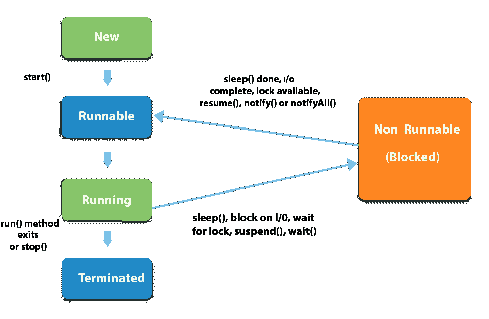
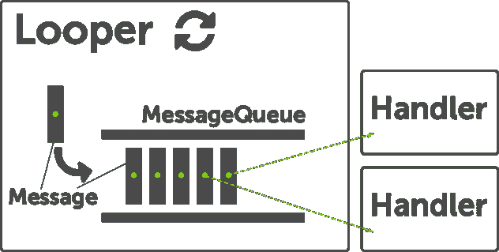
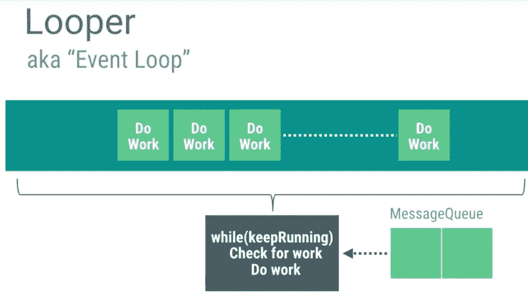
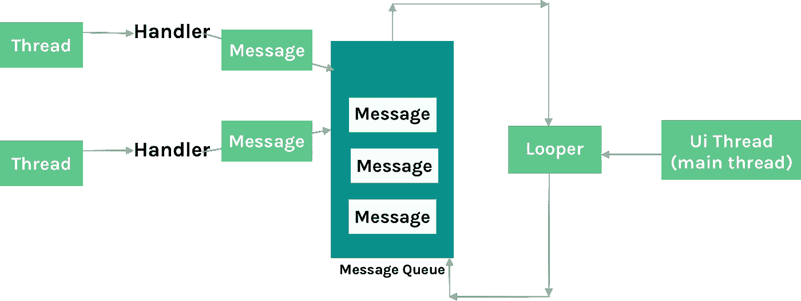

# 多线程 Android:处理程序、线程、循环和消息队列

> 原文：<https://betterprogramming.pub/a-detailed-story-about-handler-thread-looper-message-queue-ac2cd9be0d78>

## 它们是什么，我们如何正确使用它们？


由 [Stephen Frank](https://unsplash.com/@indiablue?utm_source=unsplash&utm_medium=referral&utm_content=creditCopyText) 在 [Unsplash](https://unsplash.com/s/photos/android?utm_source=unsplash&utm_medium=referral&utm_content=creditCopyText) 上拍摄的照片

多线程是任何编程语言中最有价值的概念之一。熟练使用 Android 上的线程可以帮助你提升应用程序的性能。

当用户打开一个应用程序时，Android 会创建自己的 Linux 进程。除此之外，系统为该应用程序创建一个执行线程，称为*主线程*或 UI 线程。

主线程只是一个处理程序线程。主线程负责处理来自整个应用程序的事件，如与生命周期信息相关联的回调、来自输入事件的回调或来自其他应用程序的处理事件等。

任何需要运行的代码块都被推入工作队列，然后由主线程提供服务。由于主线程要做这么多的工作，最好把更长的工作交给其他线程，这样就不会打扰 UI 线程的渲染工作。

避免使用主线程来执行任何可能导致阻塞的操作是至关重要的。

当在主线程上执行网络操作或数据库调用或某些组件的加载时，它们是可能导致主线程阻塞的一些示例。

它们是同步执行的，这意味着在任务完成之前，UI 将保持完全无响应。

为了避免这种情况，它们通常在单独的线程中执行，这样可以避免在执行任务时阻塞 UI。这意味着它们是从 UI 异步执行的。

Android 提供了许多创建和管理线程的方法，并且有许多第三方库使得线程管理更加容易。每个线程类都有特定的用途；然而，选择一个适合我们需求的是非常重要的。

在本文中，让我们探索线程、处理程序、循环和消息队列。

# 线

线程可以定义为执行程序时遵循的路径。Java 虚拟机允许应用程序同时运行多个执行线程。

并发意味着并行运行多个任务，这是我们使用线程的主要原因之一。由于 Android 是单线程模型，我们需要创建不同的线程来执行我们的任务，并将结果发送到主线程，在那里 UI 得到更新。

我们可以用两种方法创建线程。

1.  通过扩展`Thread`类。

2.通过实现一个`Runnable`接口。

`Runnable`接口应该由任何类实现，这些类的实例应该由线程执行。该类必须定义一个名为`run`的无参数方法。

每个线程都是由`java.lang.Thread`类创建和控制的。

我们需要在线程上调用 start 方法来开始执行:

```
new Test.start()
```

线程具有不同状态的生命周期，如新的、可运行的、运行中的、不可运行的(阻塞的)、终止的。



除了更新 UI 元素，我们可以在线程内部执行任何类型的操作。为了从线程中更新 UI 元素，我们需要使用处理程序或`runOnUIThread`方法。

`runOnUiThread()`在 UI 线程上运行指定的动作。

如果当前线程是 UI 线程，则立即执行动作。如果当前线程不是 UI 线程，则动作被发送到 UI 线程的事件队列。

# 消息，消息队列，循环

MessageQueue 是一个队列，它有一个将在某个线程中执行的任务(消息、可运行任务)列表。Android 在主线程上维护一个 MessageQueue。

除了 looper 和 handler，MessageQueues 是 Android 中线程构建模块的一部分，它们几乎在系统的任何地方都有使用。

这个类包含了由循环发送的消息列表。您只需调用`Looper.myqueue()`即可获得消息列表。

根据文档，它是一个低级类，保存由一个循环调度的消息列表。消息不是直接添加到 MessageQueue，而是通过与 looper 关联的处理程序对象添加。

我们可以用`Looper.myQueue()`检索当前线程的 MessageQueue。

打环器负责保持线的活性。它是一种为当前线程提供 MessageQueue 服务的工作线程。Looper 遍历消息队列，并将消息发送到相应的线程进行处理。



每根线只有一个独特的弯针。这意味着每个线程只有一个 MessageQueue。一个线程可以有任意数量的处理程序。因此，looper 为线程提供了使用自己的 MessageQueue 在循环中运行的工具。



消息定义了包含描述和任意数据对象的消息，该消息可以被发送到处理程序。

这个对象包含两个额外的`int`字段和一个额外的 object 字段，在许多情况下允许您不进行分配。我们可以简单地说该消息类似于用于数据传输的包。

虽然 message 的构造函数是公共的，但获得其中一个的最好方法是调用`Message.obtain()`或`Handler.obtainMessage()`方法之一，这将从回收对象池中提取它们。

有不同的论点可能是有用的:

```
public int what
```

用户定义的消息代码，以便收件人可以识别此消息的内容。每个处理程序都有自己的消息代码命名空间，所以您不必担心与其他处理程序冲突。

```
public int arg1public int arg2
```

如果您只需要存储几个整数值，`arg1`和`arg2`是使用`setData()`的低成本替代方案。

```
public Object obj
```

要发送给收件人的任意对象。当使用 Messenger 跨进程发送消息时，只有当它包含 framework 类的 Parcelable(不是由应用程序实现的 Parcelable)时，它才能为非 null。对于其他数据传输，使用`setData`。

你可以在文档中找到更多的论点。

# 处理者

由于只有一个线程更新 UI，即主线程，我们使用不同的其他线程在后台执行多个任务，但最后，为了更新 UI，我们需要将结果发送到主线程或 UI 线程。

如果你正在管理一个大的线程组，那么管理与所有这些线程的通信将会很复杂。因此，Android 提供了处理程序来简化进程间的通信。

处理程序允许您发送和处理与线程的 MessageQueue 相关联的`Message`和`Runnable`对象。每个处理程序实例都与一个线程和该线程的消息队列相关联。

该类负责将任何任务排入消息队列并进行处理。

当您创建一个新的处理程序时，它被绑定到正在创建它的线程的线程/消息队列——从那时起，它将把消息和可运行的消息传递到那个消息队列，并在它们离开消息队列时执行它们。

简而言之，我们可以说处理程序是一个组件，它可以附加到一个线程上，然后通过简单的消息或`Runnable`任务在那个线程上执行一个动作。

它与另一个组件 looper 协同工作，looper 负责特定线程中的消息处理。

当创建一个处理程序时，它可以在构造函数中获得一个`Looper`对象，该对象指示该处理程序附加到哪个线程。如果要使用一个附加到主线程的处理程序，需要通过调用`Looper.getMainLooper()`来使用与主线程关联的 looper。

处理程序有两种主要用途:

1.  安排消息和可运行的消息在未来的某个时间执行。
2.  将要在不同于您自己的线程上执行的操作排队。

## **如何安排**

通过`post(Runnable)`、`postAtTime(Runnable, long)`、`postDelayed(Runnable, long)`、`sendEmptyMessage(int)`、`sendMessage(Message)`、`sendMessageAtTime(Message, long)`和`sendMessageDelayed(Message, long)`的方式完成对消息的调度。

post 版本允许您在消息队列接收到对象时将这些对象排入队列。

`sendMessage`版本允许您将包含一组数据的`Message`对象入队，这些数据将由处理程序的`handleMessage(Message)`方法处理(要求您实现`Handler`的子类)。

## **post()和 sendMessage()的区别**

当我们想要在 UI 线程上执行一些代码而不知道任何关于我们的`Handler`对象的信息时，我们使用`post()`。在许多需要在 UI 线程上执行任意代码的情况下，这是有意义的。

例如，要从后台线程更新 UI 并延迟一段时间，这里可以创建一个附加到 UI 线程的处理程序，然后将动作作为`Runnable`提交。

但是在某些情况下，如果我们想要组织发送给 UI 线程的内容，并且有我们想要执行的特定功能，在这种情况下你可以使用`sendMessage()`。



流程概述

# 摘要

必须创建线程来执行长时间运行的作业。一个`Handler`是两个线程间通信的一个非常方便的对象。

因此，我们无法在处理程序和线程之间进行选择。使用一个线程来完成繁重的工作，如果你的后台线程将触发另一个线程来完成一项工作，那么使用一个处理程序——大多数情况下是 UI 线程。

通过使用 MessageQueue，执行是顺序的，因此在并发线程的情况下，这将避免争用情况。通常，一旦线程的任务完成，它就不能被重用。

但是在 looper 的帮助下，thread 一直保持活动状态，直到您调用 quit 方法，这样您就不需要每次在后台运行作业时都创建一个新的实例。

请让我知道你的建议和意见。

感谢阅读。