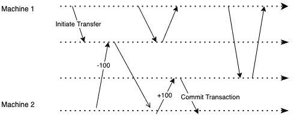
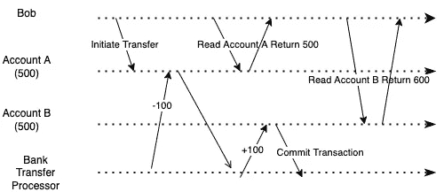
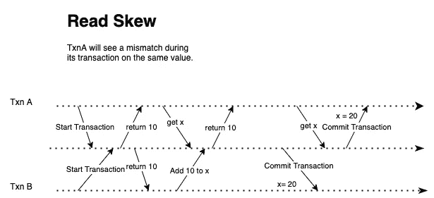
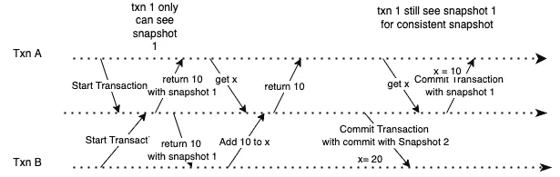
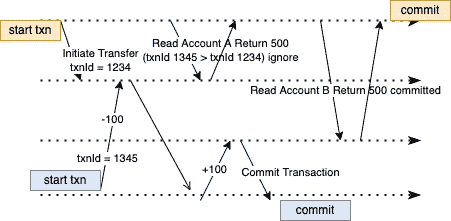

# 分布式系统面试问题:如何避免事务期间的读取不一致

> 原文：<https://betterprogramming.pub/a-distributed-system-interview-question-how-to-avoid-read-inconsistency-during-a-transaction-6ac3b4a8f92a>

## 在分布式环境中创建快照隔离

由作者提供

想象一下，当你试图从账户 A 转 100 美元到账户 B，而两个账户都在同一家银行。启动传输后，刷新屏幕。然而，当你刷新你的屏幕时，你的总余额下降了——那 100 美元似乎凭空消失了。你看账户 A 少了 100 美元。然而，账户 B 并没有多 100 美元。然后，你刷新屏幕几次，看到账户 B 赚了 100 美元。

您在事务处理过程中遇到的这个问题称为读取偏差。当您在不恰当的时间读取事务时——在写入事务期间和之后——就会发生异常。

这可能是一个糟糕的用户体验，但如果您在成功的转账交易后刷新页面，这不会导致任何问题。

但是，在执行数据库备份或分析查询时，读取偏斜会成为一个问题。

在数据库备份中，我们需要制作数据库的副本。在备份过程中，可能会收到书面请求。如果发生读取不对称不一致，备份结果可能会不一致。有些数据是旧版本的，有些数据是新版本的。这种不一致的问题可能会随着这种操作而永久存在。

我们需要在分析查询中扫描大型数据库，并定期检查数据损坏。读取偏差会导致搜索和检查不一致，通常可能会产生不一致的结果，并引发有关数据损坏的错误警报。

# 解决读取偏差

读取偏斜的问题是，一个读取事务在旧数据库版本中读取一次，而在新数据库版本中读取另一次。

这里重要的一点是，读事务需要一致—它不需要是最新的版本。从事务开始到结束都需要保持一致，所以我们需要保持数据版本不变。

例如，如果 Bob 以数据版本 1 运行 read 事务，那么在整个事务中，Bob 应该只能读取数据库数据版本 1。如果在事务处理过程中，发生了新的写事务，这将更新数据库中的数据。Bob 在他交易中将看不到新版本。

因此，我们可以让事务从数据库的一致快照中读取—事务将从所有数据中看到其他事务在事务开始时提交到数据库中。

这个特性被称为快照隔离，它在很多关系数据库中都有提供，比如 PostgreSQL 和 MySQL。

# 实现快照隔离

我们需要在数据库中保存各种快照版本，以实现快照隔离。每次事务开始时，数据库会给事务提交最新的快照版本。然后，数据库将跟踪每个事务及其对应的快照版本，以保持读取的一致性。

每个事务都有一个`transactionId`，从数据库中检索`transactionId`。因此，`transactionId`总是在增加。数据库使用`createdAt`和`deletedAt`值跟踪写入数据库的每个`transactionId`。提交事务后，数据库用事务中的`transactionId`为该操作创建了一个标记。数据库进一步制作新事务的快照，并用最新的 transactionId 标记该快照。当新事务从数据库中读取数据时，数据库会根据以下几条规则检索该事务之前最新提交的事务:

1.  即使提交了后续事务，也不会显示当前尚未提交到数据库的任何 transactionId。
2.  任何中止的交易也不会显示。
3.  数据库不会显示任何晚于(大于)当前`transactionId`的`transactionId`交易。
4.  数据库将向读取数据库的其他传入事务显示任何其他事务。

让我们看看在 Bob 的场景中会发生什么:

1.  当 Bob 发起其转账交易时，它启动一个后台进程，从账户 A 向账户 b 转账 100 美元，该交易将首先调用数据库或 aid 服务来获取增量`transactionId`，并发起交易——假设交易是 1234。
2.  后续的读事务将需要通过获得增量`transactionId`并调用对数据库的读请求来做同样的事情——假设`transactionId`是 1345。
3.  当传输尚未完成时，数据库不会向 Bob 显示由`transactionId` 1234(规则编号 1)应用的数据。
4.  如果在`transactionId` 1345 之后启动了另一个写入事务，因为该事务具有更大的`transactionId`，所以数据库不会将该事务显示给`transactionId` 1345(规则编号 3)。

在删除过程中，数据库不会立即删除字段中的值，而是会在该字段上标记一个[墓碑](https://en.wikipedia.org/wiki/Tombstone_(data_store)#:~:text=A%20tombstone%20is%20a%20deleted,is%20considered%20to%20be%20successful.)。不立即删除该值的一个原因是，那些较早的事务可能仍然使用该值。因此，一旦所有事务都使用了提交给它们的事务的值，我们就可以利用垃圾收集来异步检查和删除该值。

# 将快照隔离引入分布式环境

到目前为止，我们已经探索了如何解决单节点环境中的读取偏斜—我们假设数据库没有分布在多个集群中。

如何在分布式环境中扩展快照隔离？

在分布式环境中，很难获得一个全球性的、不断增长的`transactionId`。出于一个原因，可能驻留在不同数据库中的每台机器可能都有自己的 UUID 计数器，我们需要进行一些协调来确保因果关系。如果事务 B 从事务 A 中读取值，我们希望确保事务 B 的`transactionId`比事务 A 的大。我们如何处理复制数据库中的一致快照？

我们可以使用时钟或一天中的时间作为一个`transactionId`来写入数据库吗？时间时钟是不可靠的，因为 NTP 同步是基于不可靠的网络。因此，一些机器可能会出现时钟偏移，任意向后移动时间。一个节点的时间也可能不同于另一个节点的时间。但是，如果我们可以让时钟足够精确，它可以充当一个`transactionId`——时钟上的时间晚了意味着事件产生的时间晚了。我们如何确保时钟对于 transactionId 足够准确？

当检索每台机器中的时间值时，我们希望它返回一个置信区间，`[Tbegin, Tlast]`而不是得到一个值。置信区间表示时钟具有正负范围`Begin`和`Tlast`的标准偏差。如果有两笔交易，`transactionX`，`transactionY`进来，`[TbeginX, TlastX]`，`[TbeginY, TlastY]`，`TlastX < TbeginY`。我们可以保证`transactionX`早于`tranasctionY`。但是，如果值重叠，我们就无法确定顺序。这种方法被 [Google Spanner](https://cloud.google.com/spanner/docs/true-time-external-consistency) 用来实现其快照隔离。Spanner 将故意等待，直到它超过前一个事务的置信区间而不重叠，以提交当前事务。因此，他们需要保持机器上每个时钟的置信时间间隔尽可能小，以避免延迟。谷歌在每个数据中心部署了一个原子钟或 GPS 服务器，以实现时钟同步。

为了确保快照是每个数据库副本的最新快照，我们可以使用 [quorum](https://en.wikipedia.org/wiki/Quorum_(distributed_computing)#:~:text=A%20quorum%20is%20the%20minimum,operation%20in%20a%20distributed%20system.) 策略从所有数据库集群中获取所有最新的事务快照。我们可以使用的另一个策略是确保事务总是路由到同一个数据库实例，以获得一致的快照结果。

# 包扎

当您因为后台发生了另一个写事务而看不到一致的数据库数据读取结果时，就会发生读偏斜。一致快照是解决单节点数据库中读取偏差的一种方法。

一致快照是一种隔离级别，它保证每个事务都将从数据库的一致快照中读取，通常是当前启动的事务之前的最新快照。

实现快照隔离需要单调递增的计数器 transactionId 来确定将哪个版本返回给事务调用。然而，当处理分布式环境时，这可能是困难的，因为需要协调来产生因果关系。解决这个问题的一个方法是使用一个返回置信区间的时间时钟来创建一个不断增加的`transactionId`。

最后，为了确保每个事务获得一致的快照，我们可以使用仲裁策略，总是从大多数节点返回的当前事务中返回最近的快照，或者在事务调用和数据库实例上具有会话关联性。

在分布式系统中，如何确保读取的一致性？你将如何解决创建全球`transactionId`的问题？请在下面评论它们！

*原载于【https://edward-huang.com】**。***