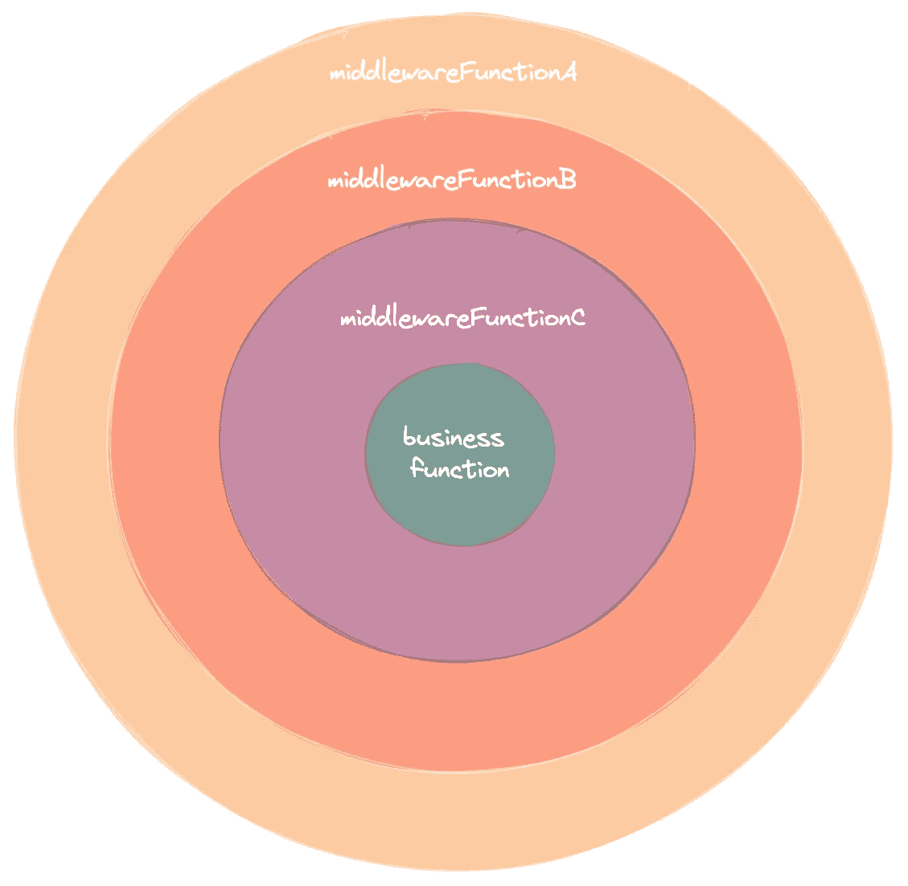
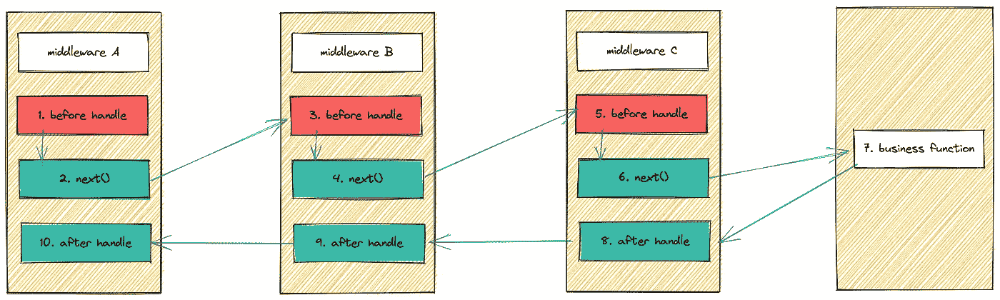

# Golang 中间件的自助实现

> 原文：<https://betterprogramming.pub/a-do-it-yourself-implementation-of-the-golang-middleware-6f02f155ed17>

## 深入了解中间件的原理


照片由[上的](https://unsplash.com?utm_source=medium&utm_medium=referral)[面](https://unsplash.com/@surface?utm_source=medium&utm_medium=referral)拍下

当我们谈到中间件时，你会想到什么？有人会说中间件是拦截器/过滤器，可以用来做一些前置处理和后置处理。

你是对的，中间件本质上是提供通用的**流程控制**。

控制什么？也就是上面说的前处理和后处理。

一般来说，我们会将常用的流程控制代码放入中间件来完成，比如:

*   权限验证
*   请求跟踪
*   预参数检查
*   记录
*   …

如果我们要实现一个中间件，我们需要做什么？

首先，我们来分析一个中间件需要具备哪些功能。

*   可以拦截请求，拦截请求失败是没有意义的。
*   可以绑定多个通用过程控制功能。
*   执行过程控制功能的绑定顺序。

经过分析，我们可以得出结论，中间件是用来**处理通用函数**的调用关系的。

其目的是包装业务函数并返回相同类型的方法。

通过将业务功能包裹在最里面，再将通用的流程控制功能一层一层的包裹在外面，整体看起来有点像食物“**洋葱**”，所以也叫**【洋葱模型】**。



在每个中间件中，将有三个部分:

*   预先截取业务逻辑。
*   下一步处理。
*   业务逻辑处理完成后的后拦截。

下图显示了使用 3 个中间件的处理流程。



这里，我们在`[http](https://pkg.go.dev/net/http)`包的帮助下实现了中间件的一个基本版本。

启动程序后，我们用`postman`访问`http://localhost:8099`，然后在头文件中用值`foo`设置`Authorizationthe`参数。

在访问它之后，我们得到下面的结果。

查看客户端打印:

```
[AuthHandle] token is: foo[LogHandle] start at: 1645004016cost 0.000103 second
```

当然，我们这里的中间件只是一个空壳，但它不做任何事情。

这里我们只是模拟了一个简单版本的中间件的效果，它是以嵌套包装器的形式实现的，留下了一个巨大的问题，那就是每次我们需要添加一个新的中间件时，我们都需要像这样嵌套它，这最终会导致代码膨胀。

最终的代码如下所示。

```
middlewareA(middlewareB(middlewareC(middlewareD(business()))))
```

当中间件越来越多的时候，这个根本维护不了。

我们来分析一下中间件是如何在`[Gin](https://github.com/gin-gonic/gin)`框架中实现的。

与我们上面使用的哑方法相比，Gin 的实现要好得多，它使用了一个**函数数组**。

每当请求进来时，`Gin`为请求分配一个`Context`，它携带一个要处理的`HandlerFunc`数组，以及一个跟踪当前正在处理哪个`HandlerFunc`的索引`index`。

需要注意的是，`index`的默认初始值是`**-1**`。对于等于`-1`的指数，可以看到`reset()`的作用。

为什么他在这里使用默认值-1？因为在`handleHTTPRequest()`方法中，`Gin`直接调用`Next()`函数。

这样`c.index++`就可以得到`0`的值，也就是开始执行第一个订阅的中间件。

当然，你也可以默认手动执行中间件数组中的第 0 个中间件，所以不需要设置为`-1`，可以设置默认值为`0`，但是感觉没那么优雅。

这里有一点需要注意，属性`index`的类型是`int8`，我们知道`int8`的长度范围是`-128 ~ 127`。

所以理论上`Gin`**最多只能处理 127** `HandlerFunc`。

但实际情况是只能处理`63`，接下来看看代码。

`Gin`使用`use()`方法设置`HandlerFunc`的嵌套。

注意上面代码中变量`abortIndex`的值只有 **63** 。

当`Group()`函数被调用时，`HandlerFunc`将被合并，在此确定最大数量，如果超过`abortIndex`将报错。

`Use()`的功能很简单，只是在`HandlersChain`后面加上`HandlerFunc`。

如何在上下文中实现对`HandlerFunc`操作的调用？

答案很简单，我们只需要调用`Next()`函数，在这个方法内，当前上下文执行的索引会加 1，然后执行下一个‘handler func’方法。

这样做的好处是，当调用栈返回的索引大于`HandlersChain`的大小时，不会重复执行。

同时，每次加一也保证了`HandlerFunc`的顺序执行，因为底层是根据数组索引调用的。

具体代码如下:

这里我们需要解释一下为什么需要执行`c.index++`两次。

如果存在一个有 **3 个元素**的数组，并且在执行完最后一个元素时，也就是下标等于`2`时，顺序执行`Next()`函数，如果没有第二版，就会导致**死循环**。

因为下标为 2 的时候是最后一个元素，他没有下一个可以执行的`handler()`。

循环条件为**索引小于数组长度**，其中`**2 < 3**`始终成立，进入无限循环。

所以这里加第二个`c.index++`，当执行完最后一个元素，索引继续加 1，最终值会是`3`，循环退出。

谈完了**添加中间件**和**执行中间件**，接下来就是实现一个功能，就是提前中断中间件。

例如，如果我在一个签入中间件中失败了，并且想要直接返回到该中间件而不是继续，我需要尽早中断所有的中间件处理。

我们先来看一下`Gin`的实现。

这里只需要将索引设置为最大值，因为每个`HandlerFunc`在调用`Next()`方法时都会对索引进行判断，索引超过要处理的函数的切片长度后就不会执行了。

好了，现在我们理解了`Gin`的设计概念，让我们实现一个简单版本的中间件。

**定义上下文结构。**

这里面有两个关键要素`handlers`和`index`。

`handlers`用于存储我们对每个中间件的通用判断逻辑，也相当于一个一层一层的洋葱。

`index`用于存储我们当前正在执行的中间件数量。

如果我们使用洋葱模型，这是我们目前正在剥离的层数。

**定义添加中间件的方法。**

这里非常简单，只需将`handlers` pending 函数添加到我们的上下文属性`MyContext`中。

**定义执行方法。**

在我有了 add 方法之后，我还需要有 execute 方法，它对应于在洋葱模型中剥离下一层洋葱的操作。

在`Gin`中这个方法被称为`Next()`，这里我们使用相同的名称。

**开始使用。**

好了，准备好上面的一切，我们来测试一下。

执行后的输出:

```
[AuthMiddleware Start][LogHandle] start at: 1645605404GET handler funccost 0.000006 second
```

感谢您阅读这篇文章。如果你在这篇文章中发现任何错误，请告诉我。