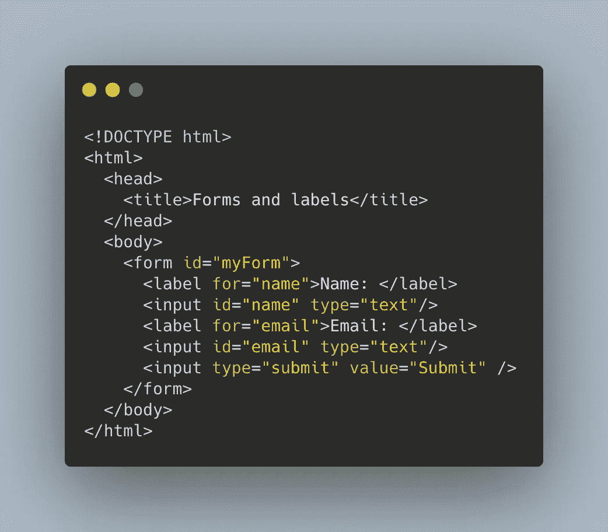
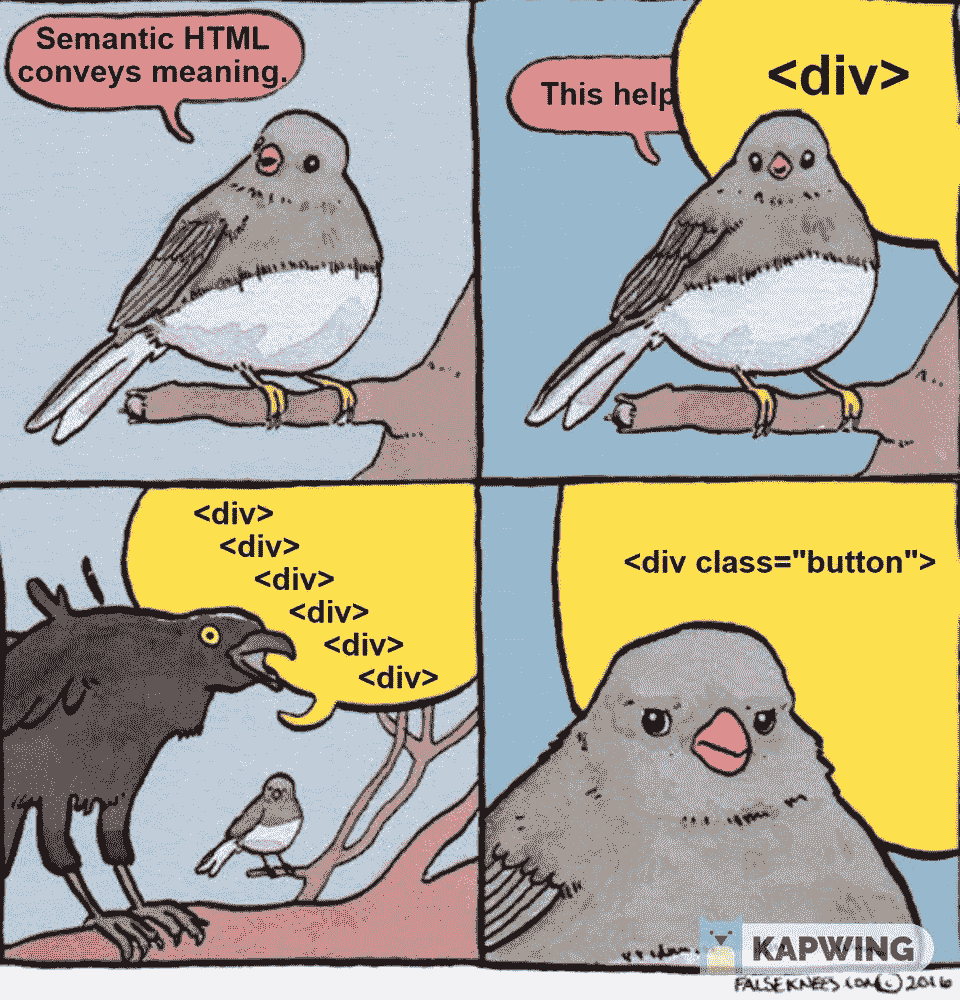

# 让网络变得更美好:无障碍学习

> 原文：<https://betterprogramming.pub/a-eleven-y-accessibility-learnings-8fcedfbf4c0b>

## 我承认:在我一头扎进去之前，我对可访问性知之甚少

Johannes Plenio 在 [Unsplash](https://unsplash.com?utm_source=medium&utm_medium=referral) 上拍摄的照片。

“可及性”往往是一个很容易在谈话中传达包容感的词，但往往伴随着缺乏*理解。*

易访问性，通常缩写为 A11Y，不应该与可用性混淆。可用性指的是*用户如何*使用产品来实现某些目标——有效地、高效地、带着满足感。另一方面，易访问性是产品的设计，它可以被具有多种能力的人使用。简而言之，每个人(我说的每个人是指每个人)都应该能够使用它。

我承认我不太了解软件开发的可访问性。这是我的训练营中没有涉及或提到的一个主题，但我发现随着我在这个领域的继续前进，这个主题变得至关重要——即使作为一名新的开发人员。我现在正在学习，我们都是。

我希望在以后的文章中更深入地研究这个主题，但是现在，这里有一些快速而简单的技巧，下次在编写没有描述性替代文本的图像标签或创建没有标签的表单/输入字段时，请记住这些技巧。

*注意:需要记住几组不同的残疾:视觉、听觉、运动和认知。今天的技巧将更加注重视觉。*

# 视觉的

最容易想到的是视觉——失明或有视觉障碍和低视力的人。键盘导航对于解决这些问题至关重要。此外，对于有视觉障碍的人，开发人员不应该依赖颜色作为唯一的导航工具或不同项目的指示。也就是说，不要仅仅依靠红色和绿色来表示好坏。为什么？色盲！

现在，我不是说不用颜色。用它！它让世界变得鲜活起来！但是请添加图标、文本和其他元素来加强内容。也要检查你的颜色对比度——低对比度会让用户难以阅读。

最后，有些人喜欢用大字体或放大字体来帮助阅读内容，所以在设计页面时要考虑到放大的镜头，以便清晰地传达页面内容。

如果包含图像，而且经常包含图像，请确保在标记/代码中包含替代文本！在你写代码的时候，这是一个简单的加法。就在那里。靠近图片的标题或描述性摘要也是一个有用的补充。有视觉障碍的用户依靠辅助工具(如屏幕阅读器)从页面上获取信息。屏幕阅读器将读出替代文本。

此外，假设您正在将一个表单合并到页面上。对于每个输入字段，有一个标签重视，如果用户点击标签，相应的输入字段将获得关注。这被称为可访问性树——屏幕阅读器使用的东西。它通知用户元素的各种属性(如类型、名称和状态)。这样，标签和输入字段元素之间的联系就很清楚，有助于用户知道他们在回答什么。

带有每个输入标签的 HTML 表单示例。

最后，在必要的地方使用适当的 HTML 语义标签帮助用户——和屏幕阅读器！—了解它们可以与哪些元素进行交互。它们的语义是有原因的！使用适当的标题标签(如`<h1>, <h2>`)。如果你有一个按钮，使用`<button>`标签。

一个分支上的两只鸟，一只解释语义 HTML，另一只说使用带有 button 类的 div，而不是 button。Meme 模板由[假膝盖](https://falseknees.com/386.html)提供。

# 听力

如果页面上有视频，提供某种形式的音频信息的视觉访问！这可以通过字幕或提供完整对话的文字记录来实现。

# TL；速度三角形定位法(dead reckoning)

1.  键盘导航:页面的所有交互元素都应该可以通过键盘访问。通过使用 Tab 和 Shift + Tab 键，用户应该能够与需要用户输入的元素进行交互。大多数都是默认完成的，但是需要记住。
2.  不要仅仅依赖于颜色:使用颜色可以增加页面的维度，但是要添加图标、文本或者其他元素来加强意思！使用外部站点确认颜色对比等。
3.  不要跳过替代文本:花额外的五秒钟添加替代文本，以帮助使用屏幕阅读器的用户理解您用于内容的图像。
4.  将这些标签添加到输入中:将标签添加到输入字段有助于屏幕阅读器显示文本和输入之间的联系。单击标签会将焦点移动到用户的相应输入。
5.  使用语义 HTML 标签:当你可以使用`button`标签时，不要使用`div`作为按钮。叫语义是有原因的！
6.  使用视频？分享文本:如果你在你的页面上使用视频，允许添加字幕或提供文字记录，这样那些不能播放音频的人(残疾与否)就可以理解对话的内容。

# 结论

我自己也有很多关于可访问性的东西要学习，并希望继续学习并将其融入到我的日常项目中。如果你有任何资源可以分享，请不要犹豫告诉我！希望在后面的文章中更深入的讨论这个话题，敬请期待。

# 参考

 [## 易接近

### 这里所说的无障碍指的是产品、设备、服务或环境的设计，以便…

en.wikipedia.org](https://en.wikipedia.org/wiki/Accessibility)  [## 易接近

### 网络的力量在于它的普遍性。无论是否残疾，每个人都能获得服务是一个重要方面。蒂姆…

www.w3.org](https://www.w3.org/standards/webdesign/accessibility)  [## 辅助功能基础

### 无障碍重点关注残疾人如何访问网站、系统或应用程序或从中受益。可访问性…

www.usability.gov](https://www.usability.gov/what-and-why/accessibility.html)