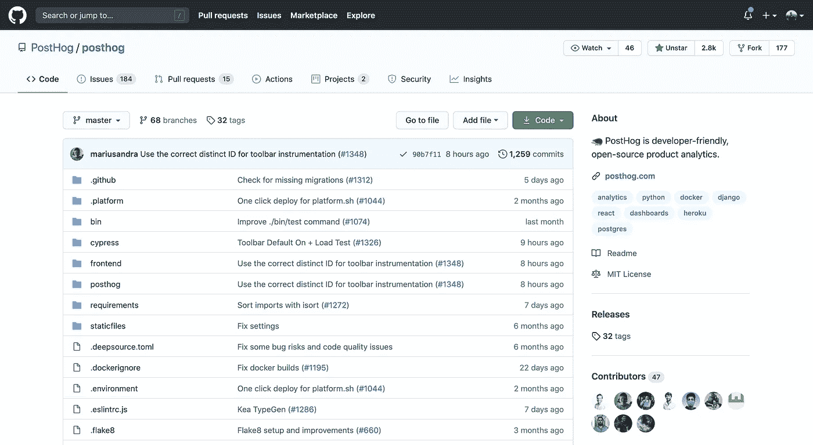

# 软件开发人员的公平招聘过程

> 原文：<https://betterprogramming.pub/a-fair-hiring-process-for-software-developers-95a5f96bc1cb>

## 除了我们讨厌的算法，还有什么别的选择呢？

克里斯蒂娜@ wocintechchat.com 的照片

感觉每天我打开 Medium 都会有一个新帖子，关于为什么软件开发人员的招聘过程很糟糕。

所以，作为一个刚刚经历过招聘过程的人，我想我应该分享一下我对招聘过程的看法。

我不是来批评采访或反对算法的。外面已经有够多了。

我在这里谈论一个我经历过并发现非常公平的过程，希望能够揭示一个解决方案可能是什么样的，而不是添加到谈论传统雇佣开发人员方式的问题的文章列表中。

作为免责声明，我应该说，我说的这家公司最终确实聘用了我。然而，这篇文章在我得到邀请之前就在我的草稿列表*里了。换句话说，我不认为他们的过程是公平的，因为他们雇佣了我。我认为他们的过程是公平的，因为它是(当然是在我看来)。*

最后，值得一提的是，这些想法是我自己的。我没有被告知要写这篇文章，公司里的任何人都没有校对过这篇文章。

那么，除此之外，我要怎么做才能得到现在的工作呢？

# 第一步:电子邮件

申请这份工作不是通过一张表格，而是通过给 CEO 发一封电子邮件来完成的(这里我们说的是一家初创公司)。

在我看来，这已经是一大利好。

首先，你不会被某些字段告诉你要包含的内容所限制。比如我连简历都没发过来。我的个人网站上基本上有我简历上的所有内容，以一种更好的方式展示。我认为没有必要赘述，最终跳过了发送这个网站的“基本文件*”。*

*第二，你可以在方法上更加自由。你可以用任何你喜欢的方式来组织邮件，这有助于展示你的个性。*

*最后，你更有可能得到回复，即使是拒绝。忽略一个仅仅是电子表格上一个名字的候选人要容易得多，而不是一个通过电子邮件直接与你交谈的人。*

*我不知道使用电子邮件是因为他们是首选方法，还是因为他们更容易。但我真的希望他们保持这种方式，即使随着公司的发展，申请人最终会给 CEO 以外的人发信息。*

# *第二步:采访首席执行官*

*这本来是一次 30 分钟的聊天，但却持续了将近一个小时。*

*我现在看到我们的 CEO 每天都很忙，所以如果他在接下来的时间段有一个会议，他可能必须准时离开。然而，在我的情况下，我们加班，这很好。*

*有人(至少看起来)对你感兴趣，比只是像不得不做的事情一样去参加面试要好得多。我想我们大多数人都有过这样的电话或面试，我们以为进展顺利，结果却被对方以“我得走了，再见”打断了。感觉不太好！*

# *第三步:与工程师面谈*

*流程的这一部分非常相似。*

*如果你申请的是一个技术职位，必须有人来核实你是否知道一些东西。在我的案例中，这是以两次通话的形式发生的，两次都超过 30 分钟。*

*我先和 CTO 谈过，然后和一个资深开发者谈过。两次电话都很轻松，包括我向他们提出的与职位没有直接关系的个人问题。总的来说，环境非常舒适。*

# *第四步:签约*

*这一步是我认为这篇文章的重点。他们没有让我参加实践技能面试，也没有给我一个带回家的项目，而是临时雇用了我。*

*在得到一份全职工作之前，先做几天或几周的合同工，这个想法并不新鲜，但在这个具体的过程中，有几件事让我印象深刻，我很快就会谈到这一点。*

*不过我想先给可能不太熟悉的人简单介绍一下这个概念。本质上，为了看看候选人是否适合这个角色和团队，公司不会让你做一系列测试，而是雇佣你做一些有偿工作，看看你是否是这个角色的合适人选。*

*这是最公平的。你得到了报酬，你有机会看到公司是什么样的，你开始做一些不仅代表你的工作将会是什么样的事情——这实际上就是你的工作将会是什么样的。*

*在我的试用期，我在 GitHub repos 上处理问题。我的工作今天实际上是现场直播——我没有得到模拟的东西来工作，我在做真实的东西。*

**

*[博文回购](https://github.com/PostHog/posthog)截图*

*以上是这一总体概念的一些好处，但在我的过程中，还有一些特别突出的地方:*

## *“大约 50%的候选人达到了这个阶段”*

*当我收到回复邮件，邀请我和他们一起工作三天时，我非常激动。但几行下来，首席执行官说，他们的一半申请人达到试用期。*

*签约几天并不是提供给那些已经通过大量测试的少数人的特殊机会——这就是候选人如何被测试的。我觉得这挺公平的。*

*很有道理。在真实的工作环境中测试你的候选人，看看他们实际上是什么样的。*

## *"我们会把你的价格提高 20% "*

*咨询/承包的小时费率高于全职费率。句号。*

*如果你正在经历一个招聘过程，为什么会有什么不同呢？你还在工作。*

*在我的例子中，我得到的报酬比我本来的工资多 20%，按比例算。*

## *没有隔离*

*在我的承包工作中，我不觉得自己是团队的一员，只是在一旁做些工作。*

*我参与了。事实上，我被赋予了相当大的责任来决定做什么，同时也有机会参与决策。*

*总的来说，我认为选择雇佣候选人做实际工作是一个双赢的选择。换句话说，这是*公平*。*

*从我的角度来看，我得到了合理的报酬，有机会真正感受我的角色，有机会展示我的技能，并看到我与团队的融合程度。*

*从公司的角度来看，他们能够看到我实际上可以做什么，完成一些真正的工作，并最大限度地减少他们聘用一个他们会后悔的人的机会(并不得不花更多的钱来发现这一点)。*

# *第五步:反馈和提议*

*就在试用期结束的第二天，我和首席执行官通了电话，讨论了事情的进展。*

*这对我来说很棒，因为我得到了一些诚实的反馈，关于团队对我的看法以及我做的对或错。接受或拒绝，这是有价值的。*

*然后，根据反馈，我得到了一份工作！*

*我没有马上接受。在他们提出邀请和我接受邀请之间(大约一周)，这位首席执行官和我讨论了一下我在职业生涯中的目标，以及如何将它与我的角色结合起来。*

*我提出了一些关于我对自己未来定位的观点，他同意了一个支持这些观点的角色结构——这是另一个优点！*

*最后，我接受了邀请，加入了[的博客](https://posthog.com)，成为一名技术作家和开发者。*

# *最后的想法*

**

*克里斯托弗·高尔拍摄的照片*

*我希望这篇文章很好地概述了招聘过程，而不一定要批评其他方法，这些方法各有利弊。*

*不同的角色需要不同的方法。但总的来说，雇佣一名候选人(以合理的价格)与你一起做一些实际工作的概念，我认为是公平的，对双方都有利，也适用于广泛的角色。*

*这也不需要取代其他任何东西，它可以与其他方法结合使用。*

*经验法则是:*重视你的候选人*。哦，让候选人知道他们被拒绝也是一个好主意！*