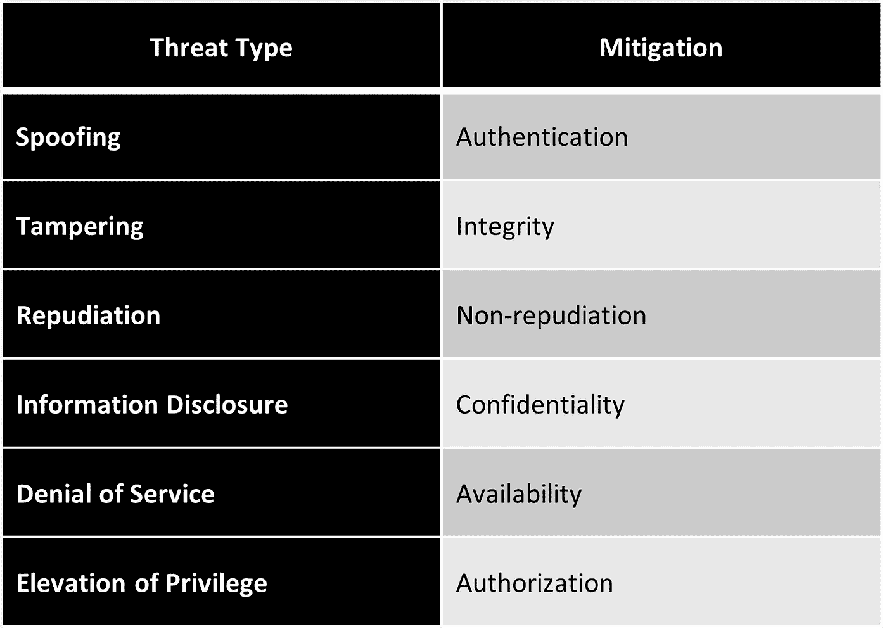
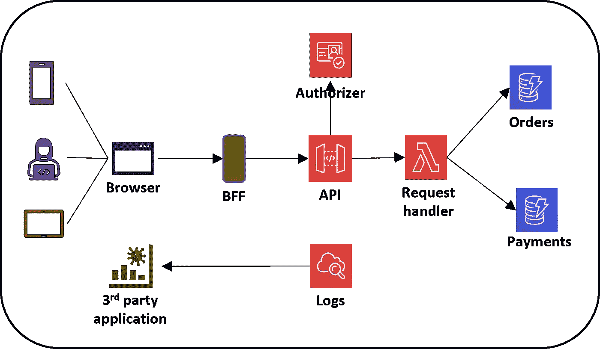
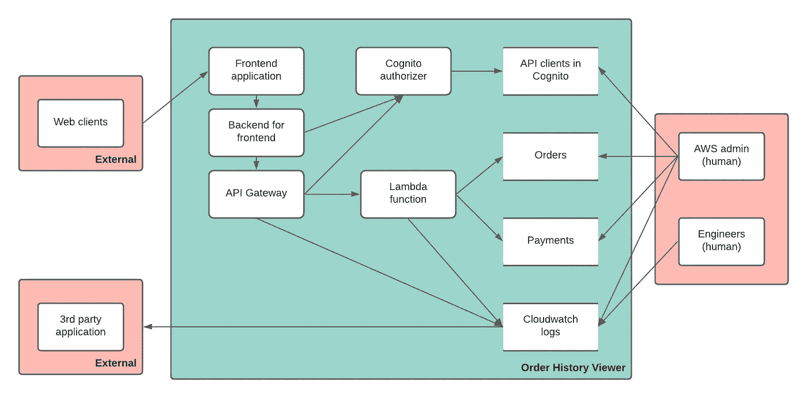
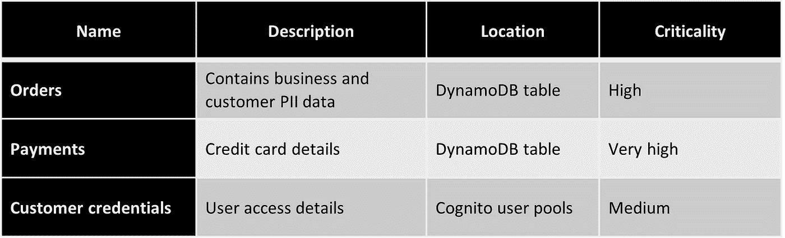
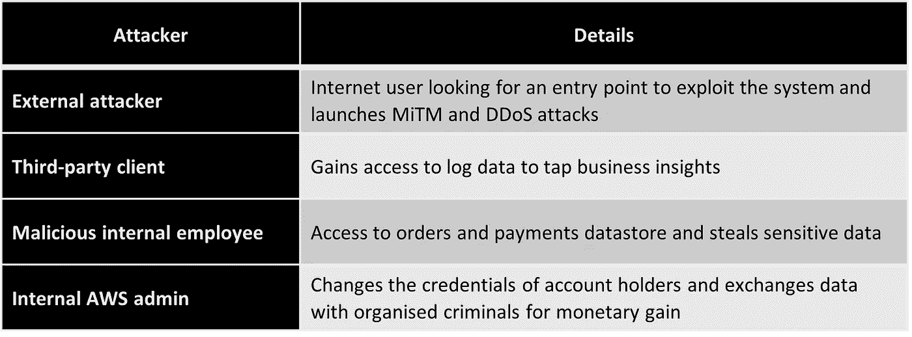
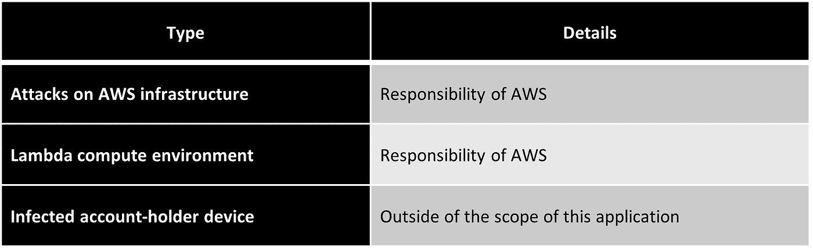
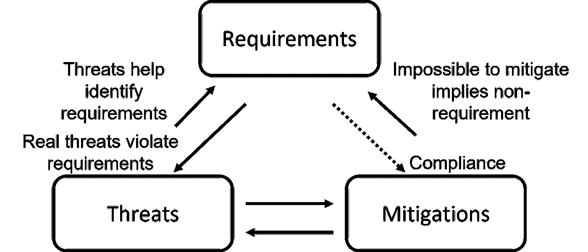
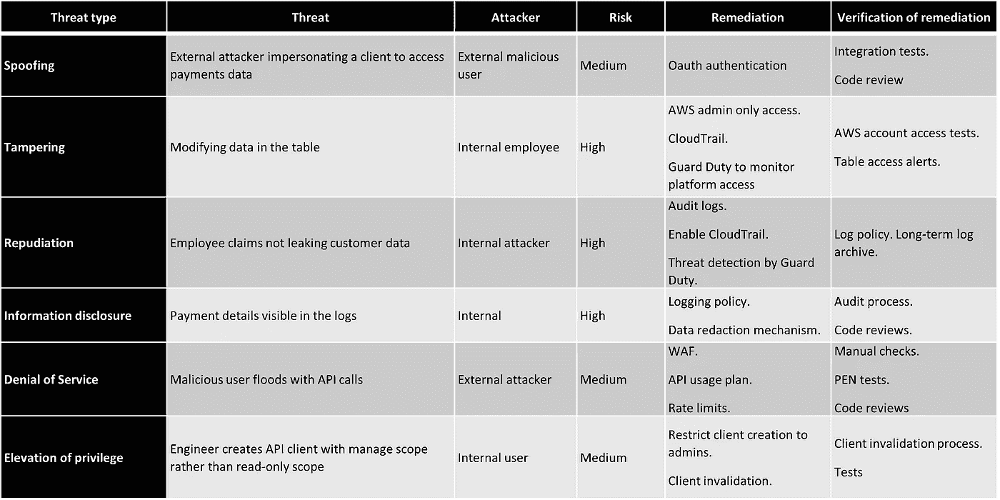

# 在无服务器应用程序中进行威胁建模的几个步骤

> 原文：<https://betterprogramming.pub/a-few-steps-to-conduct-threat-modelling-in-serverless-applications-cefb89fa69dc>

## 构建强大的应用程序

图片由作者提供。

[我的上一篇文章](/why-threat-modelling-should-be-part-of-your-serverless-development-c5fdd7788e53)讨论了开发无服务器应用程序时威胁建模的好处。在本文中，我将解释进行威胁建模、记录威胁、攻击者和缓解步骤的过程。

# 进展

正如我们在我的上一篇文章中简要看到的，STRIDE 是一种广泛用于威胁建模的方法。我将在这里解释的过程是基于 STRIDE 的。代表*欺骗*、*篡改*、*抵赖*、*信息泄露*、*拒绝服务*、*特权提升*。

## 电子欺骗

欺骗是假装成不同于原始自我的某人或某物。

*   欺骗一个人
*   扮演一个角色
*   欺骗机器
*   欺骗一个进程
*   欺骗文件或数据实体

## 篡改

篡改是指修改不同媒体和平台上的数据。

*   篡改磁盘、服务器等上的文件。
*   篡改网络上流动的数据
*   篡改内存中的数据，注入恶意执行

## 拒绝

否认是声称你没有做某事，或者争辩说你对所发生的事情没有责任。这可能具有挑战性，因为人们可以诚实地或欺骗性地否认。

否认争议可能很难证明，除非您有足够的证据，例如详细的系统日志和执行跟踪。

## 信息披露

信息公开就是让人们看到他们无权看到的信息。

*   针对数据存储、文件和归档的信息泄露
*   针对工作流和网络中的数据的信息披露
*   违反系统流程的信息披露

## 拒绝服务

拒绝服务(DoS)攻击吸收或淹没向最终用户提供服务所需的资源。

*   针对 API 的 DoS
*   针对数据存储的 DoS
*   反对进程的拒绝服务
*   针对网络的拒绝服务

## 特权提升

特权提升是指攻击者获得权限去做他们无权做的事情。

*   通过不正确的授权检查提升
*   通过篡改数据提升
*   通过破坏流程来提升

## 高级缓解计划

来源:威胁建模:安全设计

# 无服务器架构示例

作为参考，我们将使用以下简单的订单历史查看器应用程序的无服务器架构。

无服务器架构。图片由作者提供。

该架构的主要元素包括:

*   与服务交互的浏览器前端
*   后端对前端(BFF)层
*   服务的 API 网关端点
*   用于处理请求的 lambda 函数
*   订单和支付的数据存储(DynamoDB)
*   度量和日志的 CloudWatch
*   用于监控和观察的第三方应用程序

现在让我们关注威胁建模过程。通常，它会经历三个阶段:

1.  为流程收集输入
2.  过程本身
3.  汇编过程的结果

# 威胁建模的输入

此流程的输入细节各不相同。业务领域、应用程序的复杂性、它的目标用户、人口统计、组织的社会地位等等都可能是其中的一部分。

*   应用程序的高级架构
*   解决方案设计细节
*   数据流图
*   特定领域的行业合规标准
*   操作要求和限制
*   安全需要
*   信任边界
*   第三方供应商和合作伙伴应用

对于复杂的无服务器应用程序来说，这个列表可能很长，但是对于简单的服务来说，这个列表是最小的。

# 威胁建模过程

这个过程可以是简单的一个人的活动，也可以是多人参与的头脑风暴。无服务器应用程序的规模和复杂性会影响这一决策。

## 流程领导

这是过程的主持人。他们的职责包括:

*   识别和收集所需的输入项目
*   规划和实施威胁建模流程
*   产生结果，即威胁建模文档

## 单人流程

如果应用程序简单、紧凑且不言自明，那么流程负责人的任务就是生成流程文档。此人可能会与他人协商，但在其他方面会独立工作。

## 头脑风暴会议

工程师、架构师、产品负责人和业务利益相关者聚集在一起讨论和识别应用程序的潜在威胁。流程负责人解释架构、数据流和其他与应用程序相关的注意点。

我们鼓励每个人提出所有类型的威胁，不一定要按照任何特定的顺序。然后，在将威胁添加到威胁建模文档之前，根据 STRIDE 分类对威胁进行分组。

# 威胁建模的结果

一次成功的建模练习会产生一份详细的文档，记录潜在的威胁、严重性、缓解思路和相应的措施。

## 威胁建模文档内容

以下是 STRIDE 之后的威胁建模文档中最常见的部分。没有理由把它局限于这些。根据您的领域和需求，添加或更改增加价值的部分。

1.  描述
2.  体系结构
3.  数据流图
4.  资产
5.  攻击者
6.  不包括的项目:如接受服务项目是由投保以前已患有的疾病或伤害引致的
7.  要求
8.  威胁
9.  行动
10.  剩余风险

## 1.描述

本节设置文档的上下文。总结了其应用及其特点。

参考示例:订单历史查看器允许客户查看他们当前和过去的订单详细信息。它还显示了每个订单的付款明细汇总。这项服务适用于拥有该企业账户的客户。

## 2.体系结构

向应用程序的体系结构图添加引用和链接。本节主要是为了完整性，并为下面的流程图提供背景。

## 3.数据流图(DFD)

DFD 在威胁建模中很常见。它们用简单的元素描述数据流，例如:

*   过程
*   数据流
*   数据存储
*   外部实体

虽然不是必须的，但是颜色可以增加威胁建模的清晰度。绿色代表可信区域，红色代表不可信区域，蓝色代表应用程序。

参考示例:

威胁模型 DFD。图片由作者提供。

## 4.资产

在威胁建模中，资产是有价值的东西。

*   攻击者想要的东西—这些主要是有形的物品。比如支付明细和商业秘密。
*   你想要保护的东西——这些是不可量化的项目。例如，你想保护你公司的声誉。
*   通向上述目标的垫脚石—一旦资产受损，就会导致其他资产受损。例如，一旦攻击者获得了您的笔记本电脑，他们就可以获得存储在该设备中的公司医疗配方。

作为练习的一部分，确定并列出具有以下详细信息的资产:

*   资产的名称
*   描述
*   位置，如果它存储在某个地方
*   关键程度级别(或保密级别)

参考示例:

资产

## 5.攻击者

识别应用程序的攻击者可能看起来是一项简单的任务，但当您开始构建列表时，它可能会变得具有挑战性。你的竞争对手、数据挖掘者、间谍、恐怖分子、有组织的罪犯、小偷、雇员等。都可能是攻击者。

一个好的起点是将它们分为两类:

*   外部攻击者—能够访问互联网的攻击者。如果您使用第三方应用程序并共享 API，构建系统、日志和数据，那么您的永久攻击者也可能来自这里。
*   内部攻击者—不满的员工、不可信的管理员用户、为竞争对手工作的卧底员工，甚至无意中在社交媒体上分享详细信息的无辜同事，都可能是内部威胁。

参考示例:

攻击者

## 6.不包括的项目:如接受服务项目是由投保以前已患有的疾病或伤害引致的

本部分确定超出威胁模型范围和覆盖范围的项目。

参考示例:

不包括的项目:如接受服务项目是由投保以前已患有的疾病或伤害引致的

## 7.要求

这是威胁建模的一个重要部分。这里捕获的需求可以作为识别威胁的食谱，从而制定缓解计划。因此，它通常被称为需求、威胁和缓解之间的相互作用。

来源:威胁建模:安全设计

不同类型的需求来源于组织、行业部门、平台、使用的技术、客户等的许多部分。

*   业务要求—包括与声誉相关的要求、不同于竞争对手安全实践的措施等。
*   行业要求—特定于应用程序将要启动的行业的详细信息。医疗行业、政府组织以及银行和金融部门就是几个例子。
*   技术要求—您的云平台等要素，第三方 SaaS 应用程序等间接因素会带来不同的安全要求需要考虑。
*   合规性要求—支付卡行业数据安全标准(PCI-DSS)、健康保险便携性和责任法案(HIPAA)以及其他监管机构要求在构建安全应用程序时考虑多种措施。
*   隐私要求—包括个人数据保护、同意管理等。

参考示例:

*   恶意帐户持有人不应拦截和假冒该服务。
*   内部员工不应能够访问支付数据。
*   敏感数据和 PII 数据不应出现在日志中。
*   任何访问 orders 或 payments DynamoDB 表的用户(包括 AWS 管理员)都必须发出操作警报。

## 8.威胁

识别潜在威胁、评估其风险、分析缓解计划以及考虑行动计划是威胁建模的核心方面。无论是由一个工程师还是一个团队来完成，这都是你在这个过程中花费大部分时间的地方。

对于每个威胁，记录以下项目:

*   威胁类型—欺骗、篡改、否认、信息泄露、拒绝服务或特权提升。
*   威胁—对威胁的描述。
*   攻击者—攻击者的类型。
*   风险—风险系数(通常为高、中或低)。
*   补救—减轻威胁的措施。
*   补救措施的验证——持续验证缓解措施正常运行的步骤。
*   行动—补救和验证步骤后可采取行动的项目(与每个威胁一起添加或收集在单独的部分中)。
*   剩余风险—即使通过缓解计划降低后的风险量(或者与每个威胁一起添加，或者在单独的部分中收集)。

参考示例(下表仅显示了每种类型的一个威胁，但实际上，每个部分下会有许多威胁):

威胁

## 9.行动

如果没有作为上表的一部分添加，这是从威胁发现活动中确定的所有行动的列表。这些行为中的大多数被作为吉拉票证提出并被跟踪。

参考示例:

*   配置 Cognito 用户池，定义 API 范围，并设置授权者。
*   创建一本关于如何使 API 客户端失效的操作手册。
*   记录 lambda 函数的结构化日志记录策略。

## 10.剩余风险

即使采取预防措施后仍有可能发生的风险量。

参考示例:

*   第三方监控应用程序可能会损坏或删除重要的日志数据。
*   恶意用户可能会间歇地小批量攻击 API，使其难以拦截。

# 结论

开发高质量的解决方案需要时间和精力。虽然无服务器使我们能够加快这个过程，但构建健壮的应用程序需要注意细节。威胁建模指导并帮助您构建安全的云级解决方案。

如果您是威胁建模的新手，从简单的无服务器架构开始，然后扩展到复杂的解决方案。先介绍给一个小团队，从那里成长。

让威胁建模成为您的无服务器开发最佳实践原则的一部分！

# 参考

*   肖斯塔克，亚当， [*威胁建模:安全设计*](https://www.amazon.com/Threat-Modeling-Designing-Adam-Shostack/dp/1118809998) ，(威利)