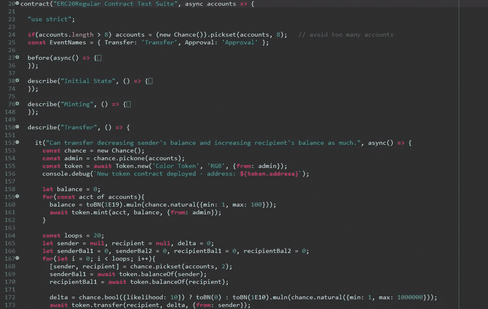
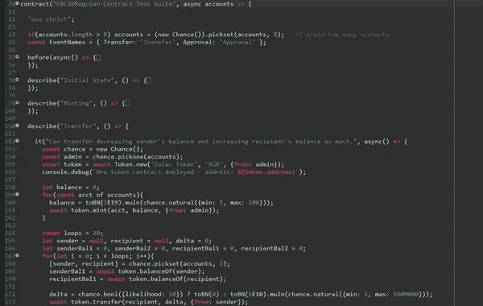

# Solidity 中以太坊智能合约的单元测试技巧

> 原文：<https://betterprogramming.pub/a-few-tips-for-unit-testing-ethereum-smart-contract-in-solidity-d804062068fb>

## 撰写更好的智能合同



与其他软件程序不同，智能合同一旦部署到特定地址，就不能修改或删除。这种独特的约束使得智能合约中的漏洞比其他漏洞更加危险。所以需要更详尽的测试。

目前，用于可靠性单元测试的最著名的单元测试工具如下:

*   [松露智能合约测试框架](https://www.trufflesuite.com/docs/truffle/testing/writing-tests-in-javascript)
*   [Remix-IDE 单元测试插件](https://remix-ide.readthedocs.io/en/latest/unittesting.html)
*   [OpenZeppelin 测试环境](https://github.com/OpenZeppelin/openzeppelin-test-environment)

OpenZeppelin 测试环境最近才出现，所以看起来验证的还不够，虽然看起来很有希望。Remix 是最强大的编辑工具之一。但是单元测试在命令行模式下比在 GUI 中更合适。所以截至目前，大多推荐松露智能合约测试框架。

以下链接是 ERC-20 智能合约的块菌单元测试程序。

[](https://github.com/3rdstage/smart-contracts/blob/master/test/token/TestERC20Regular.js)

单击查看完整源代码

在测试程序中，使用了一些块菌文件中没有的策略。它们可以使测试程序更加有效和高效，这将在下面解释。如果你不熟悉 Truffle 测试框架，最好先阅读官方文档。

[1] [Truffle:用 JavaScript 编写测试](https://www.trufflesuite.com/docs/truffle/testing/writing-tests-in-javascript)

# 分组测试用例

松露测试框架采用了著名的摩卡。稍微扭曲一下 Mocha 测试的基本结构，Truffle 测试程序从`contract()`函数开始，并在其中包含`it()`函数作为测试用例。

块菌单元测试骨架

如果一个智能契约有几十个单元测试，那么像上面这样的线性结构就很难阅读、维护和更新。Mocha 允许测试用例嵌套到中间的`describe()`函数中，所以 Truffle 测试用例可以使用嵌套的`describe()`函数来对测试用例进行分组，以提高可读性。

在下面的测试程序中，根据令牌的顶层概念，测试用例被分为`Initial State`、`Minting`、`Transfer`、`Approval`、`Delegated Transfer`、`Burning`和`Circuit Breaker`。这些组是`describe()`函数，它们包含`it()`函数作为下面的测试用例。

对于大量的测试用例，如果所有现有的测试用例每次都被执行，那么测试新添加的测试用例会非常低效。将测试用例分成几个测试程序来避免这种情况，会引起对一致性和可维护性的其他关注。您可以使用`only()`函数只运行您想要用 Mocha 框架测试的选定测试用例。

如果执行下面的测试程序，将只运行`Transfer`类别下的测试用例，其中`describe()`函数标有`only()`。

您可以将`only()`应用于`it()`函数，以进一步缩小执行范围。一个测试程序中可以标记多个`describe()`或`it()`功能`only()`。

执行下面的测试程序，只运行两个以`it.only`开始的测试用例，跳过所有其他测试用例。

[1] [摩卡](https://mochajs.org/):功能丰富的 JavaScript 测试框架
【2】[JavaScript 中的松露测试](https://www.trufflesuite.com/docs/truffle/testing/writing-tests-in-javascript)
【3】[摩卡/独占测试](https://mochajs.org/#exclusive-tests)

# 大数字

以太坊更喜欢大数。以太坊的隐含单位是卫，最具代表性的以太是 10 卫。

在 JavaScript 中，原始数字类型的最大整数值大约是 2⁵ (~ 10 ⁶)。因此，要用 JavaScript 处理以太坊，需要另一种用于大数字的数字类型。`[web3.js](https://github.com/ethereum/web3.js/)`，以太坊最基本的小玩意之一使用`[bn.js](https://github.com/indutny/bn.js/)` ⁴和`[bignumber.js](https://github.com/MikeMcl/bignumber.js/)` ⁵.`[web3.eth.sendTransaction()](https://web3js.readthedocs.io/en/v1.2.4/web3-eth.html#sendtransaction)`函数中的`value`参数和`gasPrice`参数的数据类型说明了这一点。虽然不清楚`web3.js`为什么支持两种不同类型的巨数，但是考虑到`[web3.utils.BN()](https://web3js.readthedocs.io/en/v1.2.4/web3-utils.html#bn)`和`[web3.utils.toBN()](https://web3js.readthedocs.io/en/v1.2.4/web3-utils.html#tobn)`，似乎还是首选`BN` ( `bn.js`)。

为了在测试程序中更容易地处理大数字，在开始时定义对`web3.utils.toBN()`函数的引用。

```
const toBN = web3.utils.toBN;
```

`BN` ( `bn.js` ) API 包含各种函数，包括算术运算、比较运算和位运算。一些函数以后缀`n`命名，这意味着操作数应该是原始数字类型。

在下面的示例代码中，`add()`、`div()`、`sub()`、`eq()`等正常命名的函数采用`BN`类型操作数，而`addn()`、`divn()`、`muln()`、`eqn()`等以后缀`n`命名的函数采用本原数类型操作数。

[1] [以太](https://ethdocs.org/en/latest/ether.html)
【2】`[Number.MAX_SAFE_INTEGER](https://developer.mozilla.org/en-US/docs/Web/JavaScript/Reference/Global_Objects/Number/MAX_SAFE_INTEGER)`
【3】[web 3 . js](https://github.com/ethereum/web3.js/):以太坊 javascript API
【4】[bn . js](https://github.com/indutny/bn.js/):纯 JavaScript 中的 BigNum
[【bignome . js](https://mikemcl.github.io/bignumber.js/):任意精度算术的 JavaScript 库

# 随机测试数据

增加测试覆盖率和避免意外测试结果的最简单方法之一是使用随机测试数据。

下面是一个测试用例，用于检查在构造函数中指定的名称和符号是否设置正确，以及是否查询了令牌协定。如果令牌契约用硬编码值“RGB”设置名称字段，尽管这肯定是一个缺陷，但下面的测试用例无法找到它。测试用例意外地使用相同的文字“RGB”作为测试数据，因此测试不会失败。

为了防止这样的意外结果，我们可以使用随机测试数据，如下例所示。⁴是一个 JavaScript 库，可以生成各种格式和约束的随机数据。一些随机函数被用来产生随机的句子和单词，或者从一个数组中选择一个元素。

在下一个示例中，随机生成用于将金额设置为 mint ( `balance`)、将金额设置为 transfer ( `delta`)以及将账户设置为 sender 和 receiver(`sender`、`recipient`)。对于要转移的金额，`chance.bool({likelihood: 10})`用于边界条件(零金额)，在大约 10%中进行尝试。

Chance 提供了超过 80 种不同类型或格式的功能，包括`number`、`text`、`date-time`、`location`等等。在每个函数中，可以通过选项设置详细的方面或约束。

[1] [随机测试数据](https://docs.microsoft.com/en-us/dynamics365/business-central/dev-itpro/developer/devenv-random-test-data)(MSDN)
【2】[随机测试](https://en.wikipedia.org/wiki/Random_testing)(维基百科)
【3】[单元测试指南](http://fluxens.com/unittesting.html)
【4】:随机字符串、数字等的极简生成器。

# 还原，事件

智能合约与外部系统异步交互，因此事务的结果不能由返回值传递。相反，会触发事件并发出交易收据。为了更彻底地确认智能协定是否按预期运行，智能协定测试应该验证触发的事件。智能合约测试还应该在失败的情况下检查设计的或预期的恢复，例如无效的输入值、权限不足、余额不足等等。

要检查恢复或事件，发送交易后需要处理交易收据。代码可能有点冗长，所以如果有一个方便的函数会很有用。令我惊讶的是，Truffle 测试框架没有提供。但是我们可以使用下面的库。

*   [松露断言](https://github.com/rkalis/truffle-assertions)
*   [OpenZeppelin 测试助手](https://github.com/OpenZeppelin/openzeppelin-test-helpers)

目前，这两个库提供了相似的特性。由于 [OpenZeppelin](https://openzeppelin.com/) 的名称值，首选后者。

要使用 OpenZeppelin 测试助手⁴，需要导入`[@openzeppelin/test-helpers](https://www.npmjs.com/package/@openzeppelin/test-helpers)`模块。

使用`[expectRevert](https://docs.openzeppelin.com/test-helpers/0.5/api#expect-revert).unspecified()`函数来确认事务已经被一个失败的测试用例恢复。

要验证通过测试用例的事件，使用`[expectEvent()](https://docs.openzeppelin.com/test-helpers/0.5/api#expect-event)`函数。可以确认包括参数名称和值的事件变元。

可以指定索引，而不是事件参数名。

[1]`[web3.eth.getTransactionReceipt](https://web3js.readthedocs.io/en/v1.2.9/web3-eth.html#gettransactionreceipt)`
【2】[深入以太坊日志](https://codeburst.io/deep-dive-into-ethereum-logs-a8d2047c7371)
【3】[open zeppelin 测试助手源项目](https://github.com/OpenZeppelin/openzeppelin-test-helpers)
【4】[open zeppelin 测试助手 API 参考](https://docs.openzeppelin.com/test-helpers/0.5/api)

# ECMAScript 8 (2017)

JavaScript 从诞生到现在已经有相当一段时间了，而且还在快速进化。JavaScript 由 ECMAScript 标准化，自 2015 年以来，每年都发布新版本的规范。

为了更有效地处理 Truffle 测试程序，选择包含有用测试特性的正确 JavaScript 版本是很重要的。

JavaScript 本质上是异步的。大多数框架和库，包括 web3.js 和 [Truffle 契约抽象](https://www.trufflesuite.com/docs/truffle/reference/contract-abstractions)，都是异步运行的。用异步进程处理回调或承诺的编程流可能对性能有益，但它们可能更复杂和困难。对于测试程序来说，可读性和易用性可能比优化或性能更重要。

`[async](https://developer.mozilla.org/en-US/docs/Web/JavaScript/Reference/Operators/async_function)` / `[await](https://developer.mozilla.org/en-US/docs/Web/JavaScript/Reference/Operators/await)` ⁴语句支持异步函数的同步流，因此代码可以避免回调堆栈。`await`语句仅在`async`块中有效。在 Truffle 测试的情况下，`it()`函数的第二个参数将是`async`函数，然后在测试函数内部进行`await`调用。

下面的示例显示了对令牌契约(`Token.new`、`token.mint`、`token.totalSupply`、`token.transfer`)的所有调用都是在`async`函数(`async() => {}`)内的`await`。

```
it("...", **async() => {** const chance = new Chance();
  const admin = chance.pickone(accounts);
  const token = **await Token.new**('Color Token', 'RGB', {from: admin})**;** let balance = 0;
  for(const acct of accounts){
    balance = toBN(1E19).muln(chance.natural({min:1,max:100}));
    **await token.mint**(acct, balance, {from: admin});
  }  const total = **await token.totalSupply**();

  const loops = 20;
  let sender = 0, recipient = 0, delta = 0;
  for(let i = 0; i < loops; i++){
    sender = chance.pickone(accounts);
    recipient = chance.pickone(accounts);
    delta = toBN(1E13).muln(chance.natural({min:0,max:100})); **await token.transfer**(recipient, delta, {from: sender});
    assert.isTrue((**await token.totalSupply**()).eq(total));
  }
});
```

在 JavaScript 中，使用`var`关键字的变量声明具有不寻常的语义，比如函数作用域和 hoisting⁵.这在其他编程语言中并不常见，即使是简单的代码也会让非本地 JavaScript 程序员感到沮丧。ECMAScript 6 于 2015 年发布，引入了`const` ⁶和`let` ⁷语句来补偿`var`的那些意外影响。使用`const`和`let`的变量声明有块作用域，没有 hoisting⁸.在 scene⁹.后面，吊装实际上可能更复杂但是`const`和`let`与`var`相比几乎没有提升。因此，如果打算进行功能范围或提升，强烈建议使用`const`和`let`。

为了使变量声明和使用更不容易出错，还建议使用严格模式⁰。在`contract()`函数的开始行添加`'use strict'`文字就足够了。这条简单的线将删除许多容易出错的旧功能，让您感觉更舒服。

```
**contract**("ERC20Regular Contract Test Suite", async accounts => {

  **"use strict";**

  if(accounts.length > 8){  // avoid too many accounts
    accounts = (new Chance()).pickset(accounts, 8);
  } ...
)};
```

ECMAScript 8 中增加了`async` / `await`语句，ECMAScript 6 中增加了`const` / `let`语句。支持 ECMAScript 8 的 Node.js 9.11.2 或更高版本几乎完全推荐使用这些语句。

[1] [ECMAScript 版本](https://en.wikipedia.org/wiki/ECMAScript#Versions)
【2】[JavaScript 版本](https://www.w3schools.com/js/js_versions.asp)
【3】`[async](https://developer.mozilla.org/en-US/docs/Web/JavaScript/Reference/Operators/async_function)`[语句](https://developer.mozilla.org/en-US/docs/Web/JavaScript/Reference/Operators/async_function)
【4】`[await](https://developer.mozilla.org/en-US/docs/Web/JavaScript/Reference/Operators/await)`[语句](https://developer.mozilla.org/en-US/docs/Web/JavaScript/Reference/Operators/await)
【5】[JavaScript 作用域和提升](http://www.adequatelygood.com/JavaScript-Scoping-and-Hoisting.html)
【6】`[const](https://developer.mozilla.org/en-US/docs/Web/JavaScript/Reference/Statements/const)`[语句](https://developer.mozilla.org/en-US/docs/Web/JavaScript/Reference/Statements/const)
【7】`[let](https://developer.mozilla.org/en-US/docs/Web/JavaScript/Reference/Statements/let)`[语句](https://developer.mozilla.org/en-US/docs/Web/JavaScript/Reference/Statements/let)
【8】

# 加纳切 CLI

单元测试可能会非常乏味，所以一个快速执行的测试环境是必要的。特别是以太坊，需要一个尽可能与 mainnet 相同的环境，但是需要一个一致的算法而不是 PoW。智能契约单元测试基本上独立于共识算法。作为测试环境，最好使用带有 PoA 的测试网，如 Rinkeby 或 Kovan，或者本地独立以太坊客户端(节点)实现，如 [Ganache](https://github.com/trufflesuite/ganache) 或 [Ganache CLI](https://github.com/trufflesuite/ganache-cli) 。

Ganache CLI 开发时间长，运行速度快，并提供各种可配置选项，这使得它在测试环境中非常有用。

以下命令行将启动适用于智能合约单元测试的 Ganache CLI 实例。

```
ganache-cli --networkId 31 \
    --host '127.0.0.1' --port 8545 \
    --gasPrice 2.5E10 --gasLimit 4E8 \
    **--deterministic** \
    **--defaultBalanceEther 10000** **--accounts 10** --secure \
    --unlock 0 --unlock 1 --unlock 2 --unlock 3 --unlock 4 \
    --hardfork 'petersburg' \
    **--blockTime 0** \
    --db '/var/lib/ganache-cli/data' >> /var/log/ganache.log 2>&1
```

[1] [Ganache CLI 选项](https://github.com/trufflesuite/ganache-cli#options)