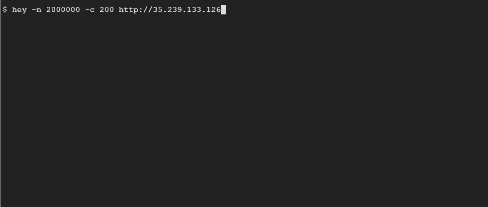

# 谷歌 Kubernetes 引擎自动驾驶仪初探

> 原文：<https://betterprogramming.pub/a-first-look-at-google-kubernetes-engine-autopilot-8c8faa947609>

## 使用友好的 Kubernetes API 的新的无服务器解决方案


伊万·迪亚兹在 Unsplash[上的照片。](https://unsplash.com?utm_source=medium&utm_medium=referral)

我们目前正处于一个历史性的关头。Google 试图在一个友好的 Kubernetes API 后面放置一个无服务器的解决方案。它最近推出了 [GKE 自动驾驶](https://cloud.google.com/kubernetes-engine/docs/concepts/autopilot-overview)，为我们提供了一个无服务器的选择，同时运行受欢迎的托管 Kubernetes 解决方案。

因此，不用在您的 Google 云环境中启动带有工作节点的 GKE 集群，您现在可以将所有管理麻烦卸载到 Google 的 SREs，并完全专注于您的应用程序，同时使用友好的 Kubernetes API。

这意味着您不必在应用程序中做任何事情，并且可以轻松使用无服务器解决方案。此外，您还可以获得谷歌站点可靠性工程师的专业知识来管理您的集群，并且您只需为自己消耗的资源付费。

您不需要基础架构规划、工作节点大小评估、容量调整以及其他与使用基础架构相关的麻烦。您也不需要太担心安全性，因为默认情况下，您会得到一个生产就绪、经过实战检验的 Kubernetes 集群，它运行在后台，并且完全从您那里抽象出来。

在自动驾驶模式下运行的 GKE 会将所有行业领先的最佳实践应用到您的集群，并消除管理工作节点所需的所有操作。因此，它最大化了您的集群的效率，并节省了您的团队的时间来专注于对您的业务更重要的事情——开发更好的软件。

我在我的 Google 云环境中玩杂耍，想要启动一个 Kubernetes 集群，当我发现这个特性时，我感到惊喜。我试了一下，想和大家分享一下我的经验。

让我们从启动集群开始。

# 启动集群

使用 web 控制台启动自动驾驶集群相对容易。当你点击“创建一个新的集群”，它会要求你选择标准或自动驾驶版本。因为我更喜欢 CLI，所以让我们来看看如何使用 CLI 来实现这一点。

首先，让我们使用以下命令来启用 GKE API:

```
$ gcloud services enable container.googleapis.com
```

下一步是使用以下命令启动自动驾驶集群:

```
$ gcloud container clusters create-auto cluster-1 --region us-central1 --project=<PROJECT_ID>
NAME       LOCATION     MASTER_VERSION    MASTER_IP     MACHINE_TYPE  NODE_VERSION      NUM_NODES  STATUS
cluster-1  us-central1  1.18.12-gke.1210  34.72.73.103  e2-medium     1.18.12-gke.1210  3          RUNNING
```

我们得到了一个在`us-central1`区域运行的区域自动驾驶集群。现在，与标准群集相比，启动它需要的时间要长一些。它花了八分多钟才启动，所以你需要有点耐心。

现在，让我们看看我们可以利用该群集做些什么。

# 部署应用程序

像往常一样，让我们尝试获取群集的所有节点，看看我们会得到什么:

```
$ kubectl get node
NAME                                       STATUS   ROLES    AGE   VERSION
gk3-cluster-1-default-pool-570d283e-9h7b   Ready    <none>   63s   v1.18.12-gke.1210
gk3-cluster-1-default-pool-6a8774ab-m727   Ready    <none>   63s   v1.18.12-gke.1210
```

我们看到一个双节点集群正在运行！但是等等，它启动的时候不是说三个节点吗？嗯，这可能是谷歌 SRE 在幕后工作，告诉我们，“嘿！您没有部署任何东西，因此您可以使用两个来完成这项工作。”

所以，我有个主意。如果我部署一个 NGINX 部署，将其公开为一个`Load Balancer`服务，部署一个`Horizontal Pod Autoscaler`，并敲打它以查看集群如何运行，会怎么样？听起来像个计划。

让我们首先创建一个 NGINX 部署:

我们已经创建了部署。让我们使用以下命令将部署公开为一个`Load Balancer`服务:

```
$ kubectl expose deployment nginx-deployment --port=80 --type=LoadBalancer
service/nginx-deployment exposed
```

让我们使用以下命令创建一个`Horizontal Pod Autoscaler`:

```
$ kubectl autoscale deployment nginx-deployment --min=2 --max=50 --cpu-percent=10
horizontalpodautoscaler.autoscaling/nginx-deployment autoscaled
```

现在，让我们使用以下命令获取 pod 和服务:

```
$ kubectl get pod
NAME                                READY   STATUS    RESTARTS   AGE
nginx-deployment-7874d6b448-hxh9h   1/1     Running   0          4m48s
nginx-deployment-7874d6b448-qgppq   1/1     Running   0          4m48s
$ kubectl get svc
NAME               TYPE           CLUSTER-IP      EXTERNAL-IP      PORT(S)        AGE
kubernetes         ClusterIP      10.63.128.1     <none>           443/TCP        16m
nginx-deployment   LoadBalancer   10.63.130.238   35.239.133.126   80:32757/TCP   3m8s
```

因此，两个 pod 通过在 35.239.133.136 上运行的`Load Balancer`服务公开。让我们使用`curl`点击这个服务，看看我们会得到什么:

```
$ curl 35.239.133.126
<!DOCTYPE html>
<html>
<head>
<title>Welcome to nginx!</title>
...
</body>
</html>
```

我们得到默认的 NGINX 响应。酷，服务正在工作！

现在，让我们在下一节做一些负载测试。

# 对应用程序进行负载测试

让我们使用`hey`实用程序来提供服务，在一个复制的终端中，让我们监视 pod 的数量。

使用以下命令来敲打服务:

```
$ hey -n 2000000 -c 200 [http://35.239.133.126](http://35.239.133.126)
```

对于服务端点上的 200 个并发用户，它将触发 200 万个请求。考虑到我们已经设置了自动扩展来利用 10%的 CPU，这已经很多了。现在让我们看看我们的服务表现如何:



我们从两个吊舱开始，由于 HPA，在我终止测试的特定时间，我们移动到九个吊舱。

我们还可以观察到，对于豆荚，GKE 也自动缩放了节点。我们从两个节点开始，到六个节点结束。默认情况下，它会为您提供一个自动扩展的集群。

但这是有代价的。我们来看看一些成本方面的考虑。

# 成本考虑

我用谷歌云的价格计算器做了一个快速比较。[我比较了](https://cloud.google.com/products/calculator/#id=7e91ef8c-3b23-42c8-a752-65c0009986a2)使用 n1-standard-2 机器(两个 vCPUs 和 7.5 GBs 内存)运行单个节点集群和在自动驾驶集群中使用相同数量的资源运行单个 pod。

标准集群每月花费 48.54 美元，而自动驾驶集群每月花费**【91.97 美元获得相同的资源。这几乎是两倍的成本！**

**这就是你必须明智地做出决定的地方。与任何无服务器平台一样，您最终会支付更多费用，因为您可以获得谷歌的专业知识和幕后管理，而无需管理您的基础设施。这也可能意味着团队中负责管理 it 的人会减少，从而节省成本。无论如何，人力资源成本始终是技术的最高价格，在金字塔的第二部分，基础设施成本排在许可证成本之后，处于最低水平。**

**如果你经常运行批处理作业，并希望优化你的成本，你最好自动运行，因为你可以在谷歌的托管基础设施中爆发，只需为你的 pods 运行的时间付费。对于长期运行的服务，比如 web 服务器，最好在标准集群中运行。这听起来对各方都是双赢的局面。**

# **结论**

**我对这个平台感到惊喜，喜欢它的感觉。当我用它做更多的事情时，我会分享我的经验，所以下次见！我希望你喜欢这篇文章。感谢阅读！**