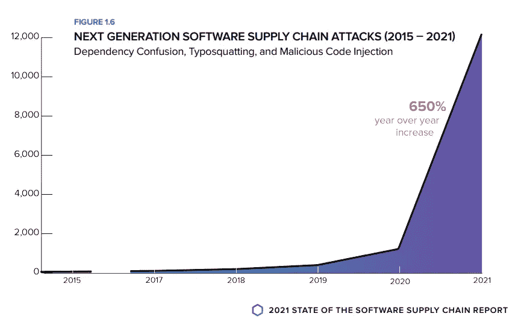
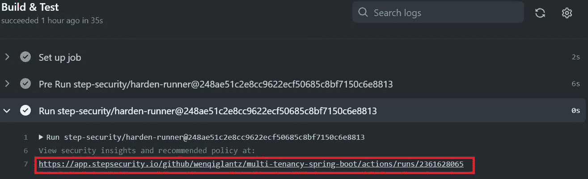
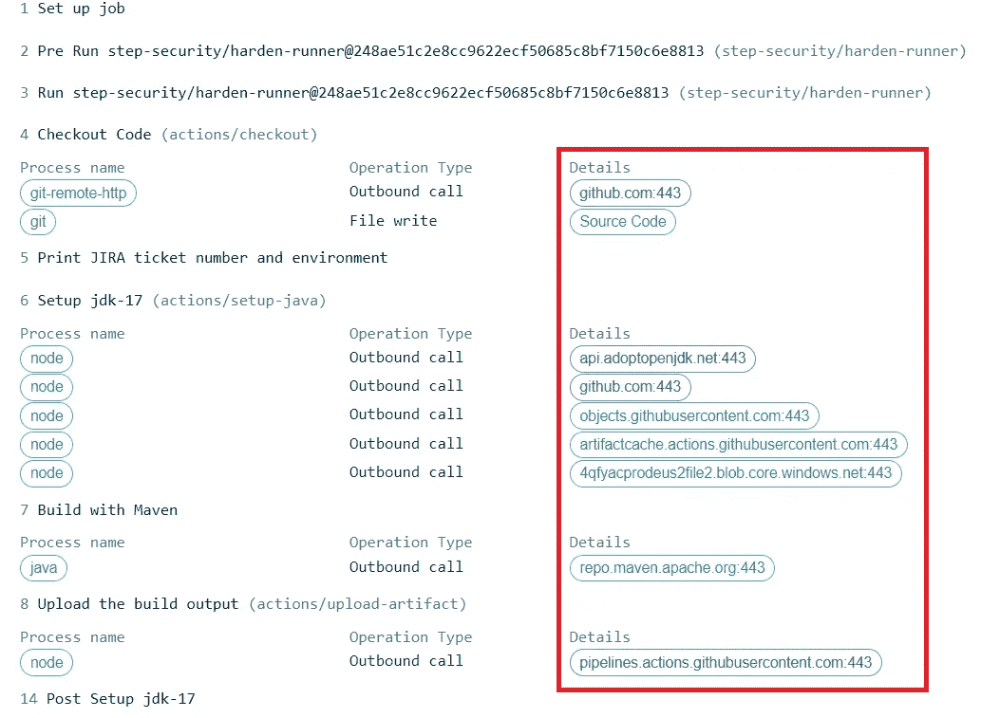
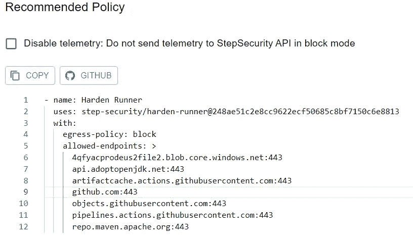
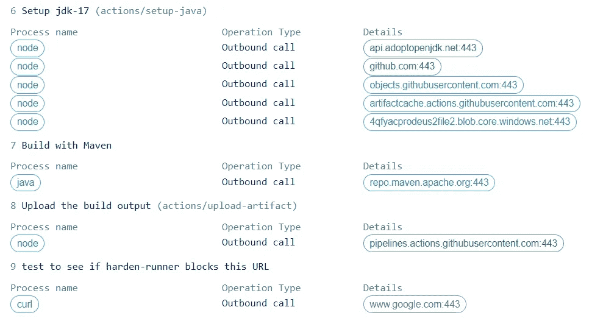
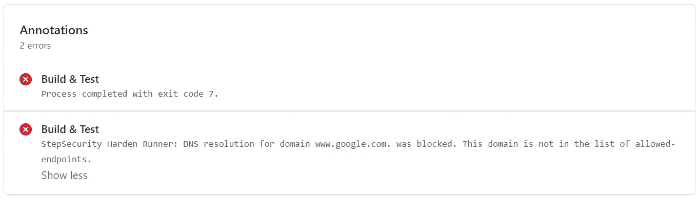

# 初看 Harden-Runner:防止供应链攻击的必备 GitHub 动作

> 原文：<https://betterprogramming.pub/a-first-look-at-harden-runner-the-must-have-github-action-to-prevent-supply-chain-attacks-d7707bbc106e>

## 什么、为什么和如何


来自 [Pixabay](https://pixabay.com/?utm_source=link-attribution&amp;utm_medium=referral&amp;utm_campaign=image&amp;utm_content=843587) 的[灵感](https://pixabay.com/users/inspiredimages-57296/?utm_source=link-attribution&amp;utm_medium=referral&amp;utm_campaign=image&amp;utm_content=843587)

```
 ∘ [What is a Supply Chain Attack?](#b09e)
  ∘ [What is Harden-Runner?](#c448)
  ∘ [Why Do We Need Harden-Runner?](#1301)
  ∘ [How to Use Harden-Runner?](#4c59)
  ∘ [Step 1: Add Harden-Runner GitHub Action to your workflow](#6c21)
  ∘ [Step 2: Add the recommended outbound endpoints to your workflow](#7d93)
  ∘ [Harden-Runner Verification](#7c64)
  ∘ [Limitations of Harden-Runner](#b0fd)
  ∘ [Summary](#49bd)
```

# 什么是供应链攻击？

供应链攻击是一种针对软件开发商和供应商的新兴威胁。目标是通过感染合法应用程序来分发恶意软件，从而访问源代码、构建流程或更新机制。

在最近的过去，软件供应链攻击急剧上升，被消费的软件被篡改以渗透到组织中。根据由 [Sonatype](https://www.sonatype.com/) 发布的 [2021 年软件供应链状态](https://www.sonatype.com/hubfs/SSSC-Report-2021_0913_PM_2.pdf?hsLang=en-us)报告，从 2015 年 2 月到 2019 年 6 月记录了 216 起软件供应链攻击。

然后从 2019 年 7 月到 2020 年 5 月，攻击次数增加到 929 次。然而，此类攻击在过去一年中同比增长了 650%。



来源:[https://www . sonatype . com/hub fs/SSSC-Report-2021 _ 0913 _ PM _ 2 . pdf？hsLang=en-us](https://www.sonatype.com/hubfs/SSSC-Report-2021_0913_PM_2.pdf?hsLang=en-us)

这些攻击已经破坏了从小型创业公司到财富 500 强公司和政府机构的所有类型的组织。这些攻击中有许多在数月内未被发现，这使得不良行为者得以泄露大量机密数据。

根据上文提到的同一份 Sonatype 报告，多年来观察到一个长期趋势:为了扩大对下游受害者的剥削，不良行为者越来越多地将目标对准位于数字价值流上游的技术资产和提供商。这包括开源库、ide、构建服务器、更新服务器和托管服务提供商(MSP)。

# 什么是 Harden-Runner？

由 [StepSecurity](https://www.stepsecurity.io/) 于 2022 年 2 月推出的 Harden-Runner 可以自动发现出站流量并将其与 CI/CD 工作流的每个步骤关联起来。受损的依赖项和构建工具通常会进行出站调用，如 [codecov 违规](https://www.bleepingcomputer.com/news/security/popular-codecov-code-coverage-tool-hacked-to-steal-dev-credentials/)、[依赖混淆攻击](https://medium.com/@alex.birsan/dependency-confusion-4a5d60fec610)和最近的[节点包劫持](https://blog.sonatype.com/npm-project-used-by-millions-hijacked-in-supply-chain-attack)中的情况。

# 我们为什么需要哈登-亚军？

攻击者试图危害构建服务器有三个主要原因:

1.  泄漏机密—构建服务器拥有用于发布包或部署构建输出的机密，这些凭据很有价值。
2.  过滤元数据——目标是识别这个构建服务器是否会受到损害，或者跟踪特定依赖项在哪里被使用。
3.  篡改构建输出—在这种情况下，攻击者可能需要下载额外的软件来修改源代码或依赖项或构建输出。

在每种情况下，攻击者通常需要调用该步骤或工作流不需要的端点。将出站流量限制在工作流所需的端点，可以阻止许多针对构建服务器的软件供应链攻击。

[Harden-Runner GitHub 操作](https://github.com/step-security/harden-runner)在 GitHub 托管的 runner (Ubuntu VM)上安装安全客户端，以便:

1.  在构建过程中检测源代码篡改
2.  防止凭据泄露
3.  检测受损的依赖项或构建工具

# 如何使用 Harden-Runner？

需要遵循两个步骤:

## **步骤 1:将**[**Harden-Runner GitHub 动作**](https://github.com/step-security/harden-runner) **添加到您的工作流**中

确保将此操作添加为工作流程中每个作业的第一步。通知`egress-policy: audit`。在这一步中，Harden-Runner 会安装一个守护程序来监控您的工作流的进程、文件和网络活动，然后生成见解和推荐的策略。

公共存储库不需要额外的配置。但是对于私有库，你需要安装 [Harden-Runner-App](https://github.com/marketplace/harden-runner-app) 并添加这个动作。生成的 insights URL 不是公共的。您需要首先进行身份验证，才能访问私有存储库。只有有权访问存储库的人才能查看它。

完成工作流执行后，您应该会看到一个链接，指向工作流运行的安全洞察和建议。见下图截图；该链接以红色突出显示:



单击该链接会导致如下所示的分析结果。注意，出站端点以红色突出显示。扪心自问，是否有任何端点不是针对与它们相关联的特定操作的？如果您有任何疑问，请进行一些研究，上报给您的 DevOps 工程师和/或安全团队成员，他们可以审查并使用他们的最佳判断。



在见解下方，您将看到推荐的政策。Harden-Runner 建议根据上述分析结果。



## 步骤 2:将推荐的出站端点添加到工作流中

应该只允许到这些端点的流量。从现在开始，出站流量将仅限于此工作流的这些域。请注意`egress-policy: block`，附加的`allowed-endpoints`，以及您的工作流允许的端点列表。

# 硬化转轮验证

现在是时候验证 Harden-Runner 是否真的如预期那样工作了。让我们将下面的步骤添加到工作流中，该步骤试图访问`[https://www.google.com/](https://www.google.com/)`，一个没有在 Harden-Runner 的`allowed-endpoints`列表中列出的 URL。

让我们看看会发生什么。下面的三张截图捕捉到了真实发生的事情:

1.  在 Security Insights 页面上，对`[www.google.com](http://www.google.com):443`的出站呼叫失败，因为它以红色突出显示。
2.  步骤`test to see if harden-runner blocks this URL`确实因`connection refused`错误而失败。
3.  GitHub Actions 选项卡下运行的工作流的 Annotations 部分清楚地列出了原因:`DNS resolution for domain [www.google.com.](http://www.google.com.) was blocked. This domain is not in the list of allowed-endpoints.`



精彩！Harden-Runner 的工作完全符合预期！

通过以上步骤，我真正理解了 Harden-Runner 的工作原理。Harden-Runner 是我们 GitHub Actions 安全加固工具箱中不可或缺的工具。

# 硬化跑步者的局限性

作为一个相对较新的 GitHub 动作，Harden-Runner 有一些我们应该知道的限制:

1.  Harden-Runner GitHub 动作只对 GitHub 托管的跑步者有效。不支持自承载的运行程序。
2.  仅支持 Ubuntu VM。不支持 Windows 和 macOS GitHub 托管的运行程序。这里有一个关于[的讨论](https://github.com/step-security/harden-runner/discussions/121)。
3.  当[作业在容器](https://docs.github.com/en/actions/using-jobs/running-jobs-in-a-container)中运行时，不支持 Harden-Runner，因为它需要在 Ubuntu VM 上进行`sudo`访问才能运行。它可用于监视使用容器来运行步骤的作业。限制是整个作业在一个容器中运行。这对于 GitHub Actions 工作流来说是相当罕见的，因为大多数工作流都是直接在 ubuntu-latest 上运行的。

# 摘要

我们探讨了什么是供应链攻击，什么是 Harden-Runner，我们为什么需要它，我们如何在 GitHub Actions 工作流中使用它来帮助防止供应链攻击，以及它的一些局限性。

我希望这篇文章对你有所帮助。我向所有正在使用或计划使用 GitHub Actions 的人强烈推荐 Harden-Runner！今天就开始探索吧！

这个故事的源代码可以在我的 [GitHub repo](https://github.com/wenqiglantz/multi-tenancy-spring-boot/blob/main/.github/workflows/workflow.yml) 中找到。

编码快乐！

# **参考文献**

[https://www . sonatype . com/hub fs/SSSC-Report-2021 _ 0913 _ PM _ 2 . pdf？hsLang=en-us](https://www.sonatype.com/hubfs/SSSC-Report-2021_0913_PM_2.pdf?hsLang=en-us)

[https://blog . step security . io/introducing-harden-runner-github-action-to-prevent-supply-chain-attacks-91a 030 b 67 a 77](https://blog.stepsecurity.io/introducing-harden-runner-github-action-to-prevent-supply-chain-attacks-91a030b67a77)

[https://blog . step security . io/how-harden-runner-detected-and-blocked-third-party-analytics-from-ci-CD-FD 7514 a 953d 9](https://blog.stepsecurity.io/how-harden-runner-detected-and-blocked-third-party-analytics-from-ci-cd-fd7514a953d9)

[https://github.com/step-security/harden-runner](https://github.com/step-security/harden-runner)

[https://docs . Microsoft . com/en-us/Microsoft-365/security/intelligence/supply-chain-malware？view = o365-全球](https://docs.microsoft.com/en-us/microsoft-365/security/intelligence/supply-chain-malware?view=o365-worldwide)

[案例研究:Kapiche 通过 StepSecurity Harden Runner 提高了其软件供应链的安全性](https://www.stepsecurity.io/case-studies/kapiche/)