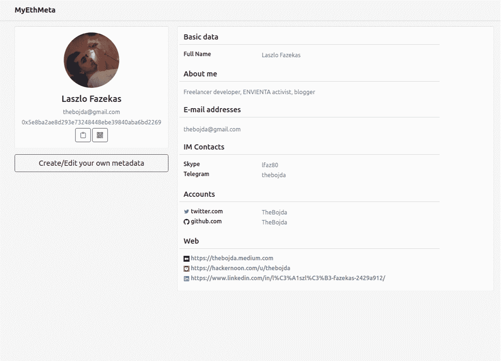
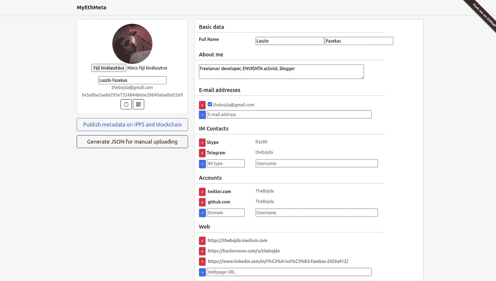

# 首先看一下 MyETHMeta:你的以太坊账户的 Gravatar

> 原文：<https://betterprogramming.pub/a-first-look-at-myethmeta-gravatar-for-your-ethereum-account-c9c09679483b>

## 以太坊的分散元数据服务介绍



[https://myethmeta.org](https://myethmeta.org/)

[Gravatar](https://gravatar.com/) 是使用最广泛的个人资料图片服务。GitHub、WordPress、Disqus 和许多其他服务都使用它。但是 Gravatar 不仅仅是一个个人资料 pic 服务。它可以基于便携式联系人管理完整的用户配置文件。

[MyETHMeta](https://myethmeta.org/) 是一个完全去中心化的以太坊元数据服务。您的个人资料图片和个人资料数据将被分配到您的以太坊地址，而不是您的电子邮件地址。

元数据分配由多边形链上的智能合约管理。[选择多边形](https://polygon.technology/)是因为气费低(链上更新元数据 URL 不到 2 分钱)。元数据可以存储在任何 URL 上。

存储可以是集中式服务器或任何分散式存储，如 [IPFS](https://ipfs.io/) 或 [Swarm](https://www.ethswarm.org/) 。元数据本身是一个简单的 JSON 文件。它基于 [PortableContacts](https://en.wikipedia.org/wiki/Portable_Contacts) (像 Gravatar 一样)，但是你可以通过自定义字段自由扩展它。(你可以在这里找到[元数据的](https://github.com/TheBojda/myethmeta/blob/main/specification/myethmeta-schema.json)JSON 模式。)

MyETHMeta 智能合约真的很简单。任何人都可以简单地为他的以太坊账户设置一个 URL。身份验证由智能合约完成，因此只有帐户的所有者可以更改 URL。代码如下所示:

```
contract MyEthMeta {
    mapping(address => string) private metaURIs; event MetaURIChanged(address indexed ethAddress, string uri); function setMetaURI(string memory uri) public {
        metaURIs[msg.sender] = uri;
        emit MetaURIChanged(msg.sender, uri);
    } function getMetaURI(address ethAddress)
        public
        view
        returns (string memory)
    {
        return metaURIs[ethAddress];
    }
}
```

智能契约不归任何人所有，因此任何人都可以通过契约自由发布自己的元数据。

MyETHMeta 有一个非常简单的用于读取元数据的**零依赖** [JavaScript 库](https://www.npmjs.com/package/myethmeta)。该库的大小小于 2K，并提供了一个简单的接口来读取给定以太坊地址的配置文件信息:

```
const client = new MyEthMetaClient()
const metadata = await client.getMetaData(eth_address)image.src = metadata.thumbnailUrl // show profile picture
```

虽然可以手动管理配置文件元数据，但 MyETHMeta 有一个配置文件页面服务，任何人都可以在那里轻松管理自己的配置文件。



个人资料页面是一个 DApp。没有数据存储在服务器端，因为 MyETHMeta 没有后端服务。它是一个静态的 HTML 页面，只与多边形链通信(通过官方的多边形代理)，并使用 [Pinata](https://www.pinata.cloud/) 来存储用户数据。因此，元数据和配置文件图片完全归配置文件所有者所有。

在本文的最后，让我们来看看一些计划:

*   **UI/UX 改进**(显然需要)
*   **经过验证的数据。**EIP-191 格式的 JSON 可以添加数字签名。可信验证者可以签署 JSON 中的一些数据(例如:Twitter 帐户)来验证它。
*   **更多数据。添加更多的个人数据并使用之前的验证方法有助于开发更可信的服务。例如，在一个分散的优步，如果你看到你的司机的有效驾驶执照号码，你可以更信任他。**
*   **NFT 资料图片。NFT 电影公司如此受欢迎，我的公司可以轻松支持他们。所有权可以很容易地被验证，因为数据被分配给以太坊帐户。**
*   **VCF 支持。**个人资料数据可以导出为 VCF 格式，许多移动平台上的地址簿都支持这种格式。你只需点击一下就可以将联系信息添加到你的地址簿中。
*   **以太坊虫群饲料支持。** [Feeds](https://docs.ethswarm.org/docs/dapps-on-swarm/feeds/) 是以太坊 Swarm 独有的功能。通过使用提要，您可以将可变数据分配给分配给您的以太坊帐户的主题。该特征使得无需任何区块链交互就可以存储和更新元数据分配。

如果您有以太坊地址，让我们创建一个 [MyETHMeta](https://myethmeta.org/) 配置文件。你没什么可失去的。[智能合约](https://polygonscan.com/address/0x63Ba8dfAEBa09a63c1bCB47a46229f14707Af995#code)是公开的，使用起来很便宜(MATIC 不到 2 美分)。您的元数据将存储在您的 pinata 帐户中。MyETHMeta 没有任何后端服务器。

这些页面是由 AWS S3/CloudFront 托管的静态 HTML。一切都是开源的，不信你可以去查。你可以在这里找到 GitHub 回购[。](https://github.com/TheBojda/myethmeta)

请记住，MyETHMeta 处于测试阶段，因此非常感谢任何错误报告、功能请求和 PR。