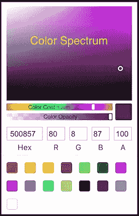
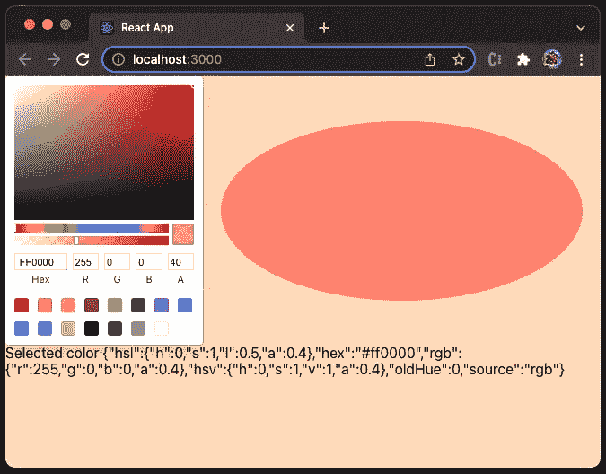
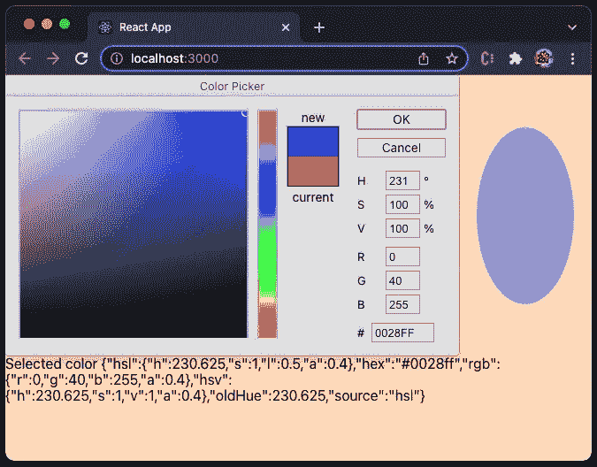
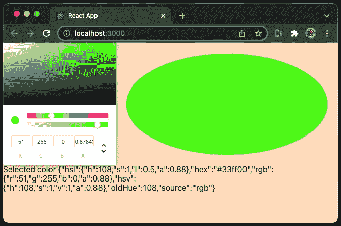
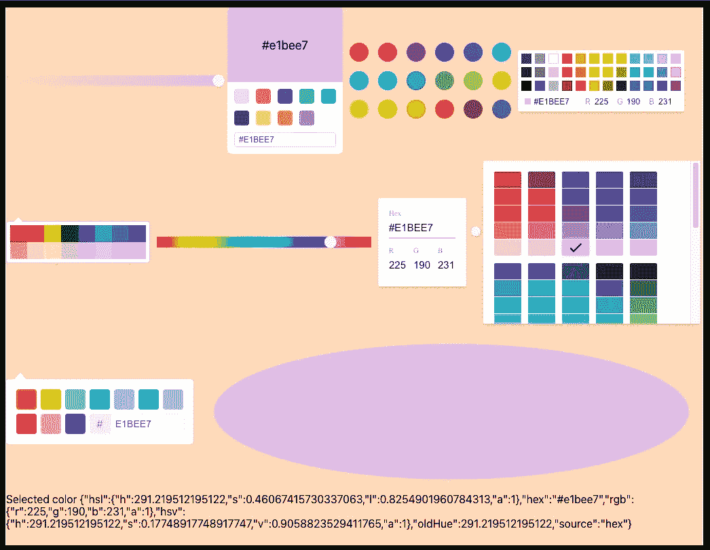
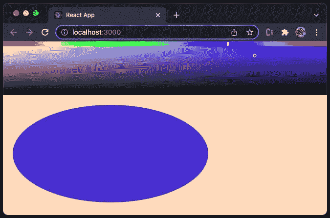

# React-Color 初探:最完整的 React 颜色拾取器

> 原文：<https://betterprogramming.pub/a-first-look-at-react-color-the-most-complete-react-color-pickers-4ce1d0fc73de>

## react-color 中各种颜色拾取器的介绍


罗伯特·卡茨基在 [Unsplash](https://unsplash.com?utm_source=medium&utm_medium=referral) 上拍摄的照片

颜色选择器是一个用户界面，它具有颜色的可视化表示以及选择颜色的功能。尽管`[react-colorful](https://github.com/omgovich/react-colorful)`已经超过`[react-color](https://github.com/casesandberg/react-color)`成为最受欢迎的 React 颜色选择器，`react-color`仍然是拥有最完整颜色选择器组件的库。`react-color`已经在 Github 上获得了最多的星星(10.4k)。


作者图片

# 在创建反应应用程序中设置反应颜色

我们使用 [Create React App](/an-in-depth-guide-for-create-react-app-5-cra-5-b94b03c233f2) 作为探索 react-color 的基础。以下命令创建一个 React 项目:

```
% npx create-react-app my-app
% cd my-app
```

建立`react-color`:

```
% npm i react-color
```

`react-color`成为`package.json`中`[dependencies](/package-jsons-dependencies-in-depth-a1f0637a3129)`的一部分:

它已准备好用于创建 React 应用程序。

# 颜色定义

`react-color`中的颜色是字符串或对象。当它是一个字符串时，它可以是一个颜色名称，或者一个十六进制值。当它是一个对象时，它由以下键定义:

*   `"hsl"`:HSL 颜色格式，代表色相、饱和度、明度。色调是色轮上从 0 到 360 的度数。0 是红色，120 是绿色，240 是蓝色。饱和度是一个百分比值，其中`0%`是灰色的阴影，`100%`是全色。明度指定亮度，其中`0%`为黑色，`50%`为“正常”，而`100%`为白色。`{ h: 0, s: 0, l: 100 }`是白色。HSL 还包括不透明度的 alpha 值。Alpha 在`0`和`1`之间，其中 0 为透明，1 为不透明。`{ h: 0, s: 0, l: 100, a: 0.5}`是透明度为 50%的白色。
*   `"hex"`:十六进制颜色格式，是由`#rgba`指定的十六进制颜色值，其中 r(红色)、g(绿色)、b(蓝色)是`00`和`ff`之间的颜色强度，a (alpha)是`00`和`ff`之间的不透明度。`"#000000"`为黑色，`"#ff0000"`为红色，`"#00ff00"`为绿色，`"#0000ff"`为蓝色，`"#ffffff"`为白色，`"#ff000080"`为透明度为 50%的红色。
*   `"rgb"`:是 RGB 颜色格式，是一个有四个键的对象(rgba)，其中`r`是红色值，`g`是绿色值，`b`是蓝色值，`a` (alpha)是不透明度。每种颜色强度在`0`和`255`之间。`{ r: 0, g: 0, b: 0 }`是黑色，`{ r: 255, g: 0, b: 0 }`是红色，`{ r: 0, g: 255, b: 0 }`是绿色，`{ r: 0 g: 0, b: 255 }`是蓝色，`{ r: 255, g: 255, b: 255 }`是白色。`a` (alpha)是`0`和`1`之间的不透明程度，其中 0 为透明，1 为不透明。`{ r: 255, g: 0, b: 0, a: 0.5 }`是透明度为 50%的红色。
*   `"hsv"`:HSV 颜色格式，代表色相、饱和度、明度。它也被称为 HSB(色调、饱和度和亮度)。HSL 和 HSV 的区别在于，HSL 中`100%`明度的颜色是纯白色，而 HSV 中的`100%`值只是在有色物体上发出白光。`{ h: 0, s: 0, l: 100 }`是白色。`{ h: 0, s: 0, v: 100 }`是黑色。`{ h: 0, s: 0, v 100, a: 0.5 }`是透明度为 50%的黑色。
*   `"oldHue"`:上一个色相值。
*   `"source"`:表示颜色来源。，可以是`"hsl"`、`"hex"`、`"rgb"`或`"hsv"`。

# 颜色选择器用户界面

`react-color`提供 13 个颜色选择器供使用，每个颜色选择器都有一个独特的用户界面。`react-color`的草图选择器代表了典型的颜色选择器。



作者图片

顶部由色谱(饱和度、光/值)、颜色连续区(色调)和颜色不透明度(alpha)的控件组成。点击或拖动这些组件来选择特定的颜色。选定的颜色由右下角的颜色方块显示。

中间部分显示选定的十六进制值、RGB 值和 alpha 值。也可以编辑它们来选择特定的颜色。

底部显示预设的颜色方块，提供选择常用颜色的便捷方式。

# 草图选择器

通过将以下代码复制到`src/App.js`中，在 Create React App 环境中运行草图选择器:

第 2 行从`'react-color'`导入`SketchPicker`。

该代码设置了一个带有`peachPuff`背景的用户界面(第 18 行)，它获取整个视口的高度(第 19 行)。

颜色选择器(第 30 行)和颜色椭圆(第 31-40 行)并排显示在 flex 布局中(第 24-28 行)。

在第 30 行，颜色选择器不直接获取颜色对象。相反，它使用转换后的十六进制值`hexColor`，该值在第 9–14 行计算。

第 31–41 行用背景色`hexColor`定义了一个椭圆形。

在第 42 行，显示所选颜色的字符串表示。由于字符串相当长，`overflowWrap`被设置为`'break-word'`(第 20 行)。

通过`npm start`执行代码。最初，选择的颜色是`'red'`，alpha 值是`1`。它显示以下用户界面。


作者图片

调整 alpha 值。拾色器在透明背景下显示所选颜色，椭圆形在实心`peachPuff`背景下显示所选颜色。我们可以看出它们之间的区别。



作者图片

下面是`SketchPicker`的定义:

# `Photoshop Picker`

让我们试试 photoshop picker。对于`src/App.js`，我们将导入语句改为`PhotoshopPicker`:

```
import { PhotoshopPicker as Picker } from 'react-colorful';
```

通过`npm start`执行代码。



作者图片

photoshop picker 可以控制色谱、颜色连续统，但不能控制颜色不透明度。它显示选定的 HSV、RGB 和十六进制值。它还有两个按钮回调:

*   onAccept:当单击 OK 时调用。
*   onCancel:当单击 Cancel 时调用。

下面是`PhotoshopPicker`的定义:

# `Chrome Picker`

让我们试试 Chrome picker。对于`src/App.js`，我们将导入语句改为`ChromePicker`:

```
import { ChromePicker as Picker } from 'react-colorful';
```

通过`npm start`执行代码。



作者图片

Chrome 拾色器可以控制色谱、颜色连续统和颜色不透明度。它显示选定的 RGBA 或 HSLA。

下面是`ChromePicker`的定义:

# 其他颜色选择器

`react-color`总共有 13 个拾色器。我们已经展示了`SketchPicker`、`PhotoshopPicker`和`ChromePicker`。

我们将其余 10 个颜色选择器放入一个应用程序中:

第 2–13 行导入 10 个颜色选择器。

第 39–40 行将换行和项目间隙添加到 flex 布局中。

第 43–52 行列出了所有颜色选择器。

通过`npm start`执行代码。10 个颜色拾取器在视图中。它们都控制着椭圆形的颜色。同时，它们又相互制约。



作者图片

从左到右从上到下依次是`AlphaPicker`、`BlockPicker`、`CirclePicker`、`CompactPicker`、`GithubPicker`、`HuePicker`、`MaterialPicker`、`SliderPicker`、`SwatchesPicker`、`TwitterPicker`。

# 自定义颜色选择器

在大多数情况下，13 个颜色选择器应该足够了。另外，`react-color`允许我们创建定制的颜色拾取器。

在下面的`src/App.js`中，我们为颜色连续体(`Hue`组件)和色谱(`Saturation`组件)构建控件。

第 1 行导入`CustomPicker`，一个高阶组件，来制作任何定制的颜色拾取器。它用于第 32 行。

第 2 行导入内置组件，`Hue`和`Saturation`。

通过`CustomPicker`的包装器，App 传入`hex`、`rgb`、`hsl`、`hsl`、`onChange`(第 4 行，此处`rgb`不用于此代码)。

`Hue`显示在第 13–15 行。

`Saturation`显示在第 16–18 行。

椭圆形(第 19–27 行)使用`hex`值作为背景。

通过`npm start`执行代码。我们看到下面的用户界面。



作者图片

但是，单击色调或饱和度不会触发任何颜色变化。

发生了什么事？

原来`react-color` 版本`2.19.3`有 bug。降级到版本 2.17.1 解决了该问题。

# 结论

在上一篇文章的[中，我们已经探索了`react-colorful`，一个用于 React 应用程序的微型颜色选择器组件。它是快速的、经过良好测试的、无依赖性的、移动友好的和可访问的。如果你对内置用户界面满意，这是一个不错的选择。](https://medium.com/p/2e2c135ad3e9)

然而，`react-color`提供了最完整的颜色选择器组件。它有 13 个不同的颜色选择器，应该满足大多数用户界面/UX 的要求。此外，它还提供了更多可能性的定制。

感谢阅读。我希望这有所帮助。如果你有兴趣，可以看看[我的其他媒体文章](https://jenniferfubook.medium.com/jennifer-fus-web-development-publications-1a887e4454af)。