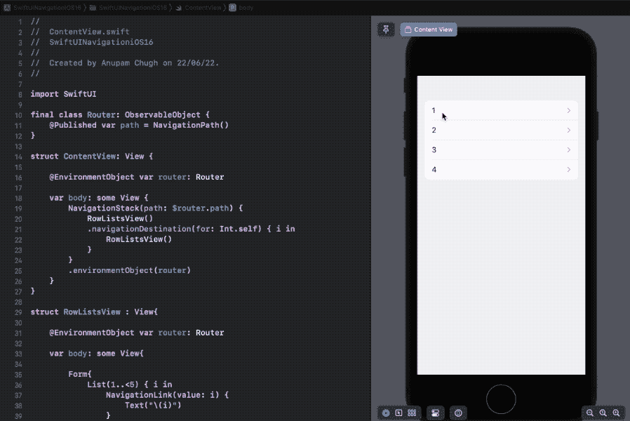

# SwiftUI 导航堆栈、导航路径和“导航目的地”初探

> 原文：<https://betterprogramming.pub/a-first-look-at-swiftui-navigationstack-navigationpath-and-navigationdestination-3a9bbb300e08>

## 用 iOS 16 告别 SwiftUI NavigationView


照片由[丹钟](https://unsplash.com/@dannayyyboi?utm_source=medium&utm_medium=referral)在 [Unsplash](https://unsplash.com?utm_source=medium&utm_medium=referral) 上拍摄

SwiftUI NavigationView 从一开始就是这个框架的致命弱点。从最初不允许在 NavigationLink 中缓慢加载目的地视图(尽管后来解决了这个问题)，到不能以编程方式导航深层链接的[功能](/programmatic-navigation-in-swiftui-project-81200f35150)，SwiftUI 的导航框架经常迫使我们退回到使用`UINavigationController`。

让我们喘息的是，在 iOS 16 中，苹果提出了一种新的导航架构，这种架构是数据驱动的，而不是以前的视图驱动结构。

主要的新导航 API 变化包括一个新的`NavigationStack`,允许您从堆栈中推送和弹出视图，一个用于管理路由堆栈的`NavigationPath`,以及一个用于以编程方式高效导航视图的`navigationDestination`修饰符。随着同样的更新，他们已经弃用了`NavigationView`。

# 你好，导航栈

在我们的视图层次堆栈中集成 NavigationStack 非常简单:

```
NavigationStack {
       NavigationLink {
            Text("Destination Screen")
       } label: {
            Text("Goto Next Screen")
       }
}
```

在一些琐碎的情况下，我们可以用新的`NavigationStack`容器直接重构旧的`NavigationView`。请注意新的`NavigationLink` init 语法。

该 API 现在包含一个`value` - `label`语法，标签包含链接的内容视图，值包含目标视图构建器。

同样值得注意的是，NavigationLink 的旧 init 方法如`NavigationLink(isActive:destination:label:)`已经被弃用。

类似地,`NavigationLink(destination:tag:selection:)`在 iOS 16 中也被弃用，这意味着基于 NavigationLink 重构编程导航将需要完全不同的代码。

# 使用"`navigationDestination"`修饰符的程序导航

在上一节中，我们看到了如何在 init 代码中设置`NavigationLink`的目标视图。然而，你可能还记得在 iOS 16 之前构建复杂的导航结构时，布尔标志给我们带来的痛苦。

很高兴，从 iOS 16 开始，我们可以在`.navigationDestination`修改器中设置目的地视图。`navigationDestination`让我们能够基于类型以编程方式路由到不同的屏幕。你也可以为不同的视图类型添加多个`navigationDestination`修改器。

在以下示例中，我们创建了一个 SwiftUI 导航应用程序，该应用程序在目的地屏幕上构建相同的列表视图:

# 路由导航使用导航路径链接

以前，为了路由导航链接，我们有`tags`。

在 iOS 16 中，我们有了一个强大的新`NavigationPath`，可以保存与`NavigationStack`中显示的视图相关的类型擦除数据。

`NavigationPath`的强大之处在于它能够从堆栈中轻松推送、弹出属于不同数据类型的视图。

考虑下面的应用，我们在`NavigationStack`中插入了`NavigationPath`:

我们已经在一个`ObservableObject`类中设置了我们的`NavigationPath`，并在一个`EnvironmentObject`中设置了它，以便将它传递给子视图。不过，您也可以使用`@Binding`来完成同样的操作。

注意修改后的`NavigationStack(path:)`初始化。

下面是`RowListsView`的代码:

我们稍微修改了上面的 SwiftUI 视图——加入了自定义的 back 按钮，这些按钮将以编程方式更改`NavigationPath`——从而更改视图`NavigationStack`:



SwiftUI 导航路径

我们看到了通过调用下面这段代码返回到根目录是多么容易:

```
router.path = .init()
```

你可以通过长按返回按钮返回到任何一个屏幕——它会显示一个带有前一个屏幕标题的下拉列表。现在，默认情况下标题会显示`back`，但是你可以通过设置`.navigationTitle(string:)`修改器来定制它们。

虽然这篇关于新 SwiftUI NavigationStack 的介绍性文章到此结束，但是您可以使用新模式做更多的事情，比如处理深度链接等等。

此外，为了将新的导航 API 移植到之前的 iOS 版本，这里有一个[惊人的开源库](https://github.com/johnpatrickmorgan/NavigationBackport)。

目前就这些。以下是整个 [SwiftUI 代码片段](https://gist.github.com/anupamchugh/eba92fc51dbc5e155adfdc3770d31d99)的要点。