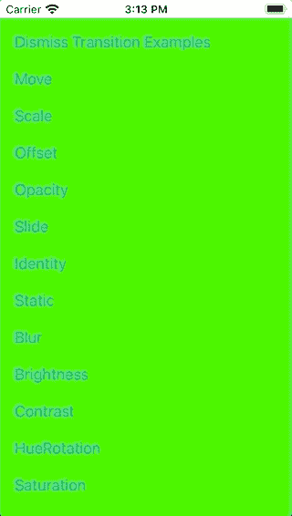

# 灵活的 SwiftUI 导航库

> 原文：<https://betterprogramming.pub/a-flexible-swiftui-navigation-library-f3d28e75a506>

## SwiftUI 的导航堆栈

## 解决 NavigationView 和 NavigationLink 的一些缺点


[摄影](https://unsplash.com/@photoholgic?utm_source=unsplash&utm_medium=referral&utm_content=creditCopyText)在 [Unsplash](https://unsplash.com/s/photos/swallow-flight?utm_source=unsplash&utm_medium=referral&utm_content=creditCopyText) 上拍摄的照片

任何与 SwiftUI 打过交道的人也都接触过它的新型导航:你将 SwiftUI 视图嵌入到一个`NavigationView`中，并通过一个`NavigationLink`进行转换。

NavigationView/NavigationLink 用法示例

SwiftUI 还为模态导航提供了`.sheet(isPresented:)`修改器。

和 SwiftUI 一样，这一切都很优雅。😎

然而，一旦你真的想实现一个真正的应用程序，而不仅仅是“你好，世界！例如，您遇到了某些问题:

*   `NavigationView` / `NavigationLink`不支持自定义过渡动画。
*   没有根 pop 或多重 pop；您必须在整个视图层次中手动传递目标视图的状态变量。
*   如果您显示几个模态视图，您不能一次关闭所有视图。而且模态全面屏只有 iOS 14+支持。
*   不提供没有过渡动画的导航。有变通办法，但它们不再优雅。
*   如果您随后修补您自己的转换解决方案，您会意识到向后转换必须在向前转换期间定义，并且不能在以后替换。然后你会偶然发现其他各种各样的 SwiftUI 怪事。

当然，新技术会遇到初期问题，但一年后，我们仍然可以在 iOS 14 中使用它们。😞

因此，我编写了自己的 SwiftUI 导航库来解决上述所有问题。🤓

我把它叫做 NavigationStack，你可以在 GitHub 上找到它:

[](https://github.com/indieSoftware/NavigationStack) [## 独立软件/导航堆栈

### GitHub Page NavigationStack 是一个定制的 SwiftUI 解决方案，用于在视图之间导航。这是一个更灵活的选择…

github.com](https://github.com/indieSoftware/NavigationStack) 

# 导航堆栈简介

NavigationStack 的工作方式与 SwiftUI 的`NavigationView`非常相似。您将自己的 SwiftUI 视图嵌入到一个`NavigationStackView`中，而不是一个`NavigationView`中。不使用`NavigationLink`，而是调用`NavigationModel`类型的`EnvironmentObject`上提供的方法，比如`pushContent()`。

如何使用 NavigationStack 库推送视图的示例

后退导航也可以通过`NavigationModel`操作。以下是 pop 过渡的一个示例:

如何使用 NavigationStack 库返回到上一个视图的示例

因此`NavigationModel`在所有子视图中都可以作为`EnvironmentObject`使用，当然，它必须被注入到视图层次的根视图中:

```
let myRootView = MyRootView().environmentObject(NavigationModel())
```

实际上，差不多就是这样。简单，优雅，敏捷，嗯？😄

## 过渡

`NavigationModel`不仅支持 push 和 pop 导航，还有`presentContent()`和`dismissContent()`的便捷方法来模拟模态转换。使用`fadeInContent()`和`fadeOutContent()`，您可以切换到另一个视图。

这些方便的方法在内部使用来自`NavigationModel`的方法`showView()`和`hideView()`。如果提供的方法不够，您还可以直接使用`showView()`和`hideView()`并创建自己的过渡。

如何使用自定义转场的示例

这里不仅使用了`.easeOut`动画类型，还使用了单独的过渡动画。定义了这个过渡动画，它结合了缩放动画和不透明度动画。

原点视图——即您想要导航离开的视图——被称为`defaultView`。因此,`alternativeView`是目标视图，即您想要导航到的视图。两者都可以单独制作动画。例如，旧视图淡出，而新视图移入。

反向动画与过渡动画同时自动定义。如果您调用`NavigationModel`上的`hideTopViewWithReverseAnimation()`，您可以返回到前一视图并使用反向动画。但是，您也可以使用`hideTopView()`返回到之前的视图，并指定要使用的特定过渡动画。当它真的回去的时候就可以了。

您可以毫不费力地创建自己的过渡动画。在图书馆的资料中，如果你想更深入地研究这个问题，你可以找到这样的例子。😉



该库提供的一些自定义过渡动画

## 视图标识符

作为一名理解干净代码的 iOS 开发人员，字符串`MyRootView`的代码味道肯定会让你震惊。🧐

这个标识符是必要的，这样可以处理一个特殊的视图。通过这种方式，您可以明确地说出想要交换哪个视图，或者想要导航回哪个视图。由于有了这个标识符，即使中间有另一个视图级别，也可以直接跳到根视图。

但是，建议将字符串标识符转换为常数，并使用常数来代替。这降低了打字错误的风险。如果常量直接从视图名称自动创建就更好了。😁

如何使用常量作为导航字符串标识符的示例

有了静态常量`id`，子视图就可以指向`MyRootView`并导航到它。

# 结论

NavigationStack 库的工作方式与 SwiftUI 的单页导航方式类似，即视图层次结构中的一个子视图被另一个子视图替换。

通过我自己的实现，我能够解决 SwiftUI 标准导航的一些问题和缺点。当然还有一些改进的空间，但是我希望有人会觉得它有用。😊

更多信息，可以查看 GitHub 上的 [NavigationStack。](https://github.com/indieSoftware/NavigationStack)