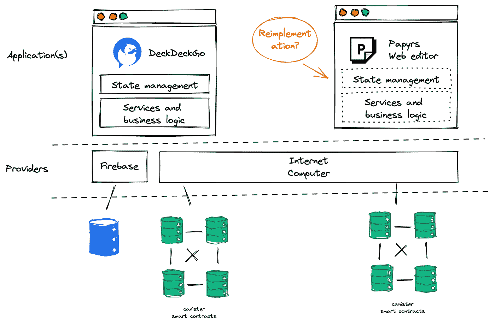
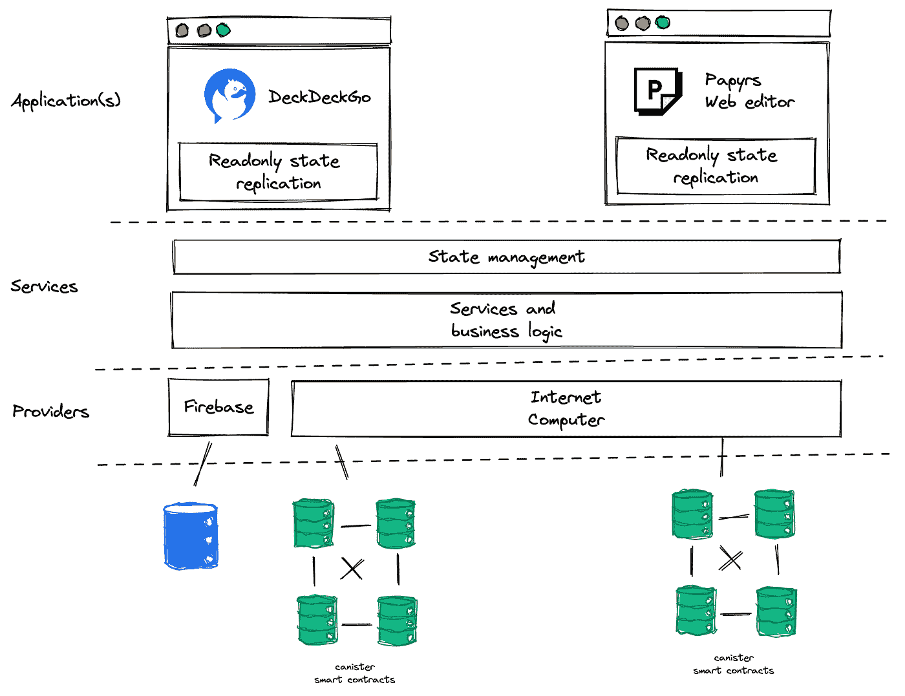
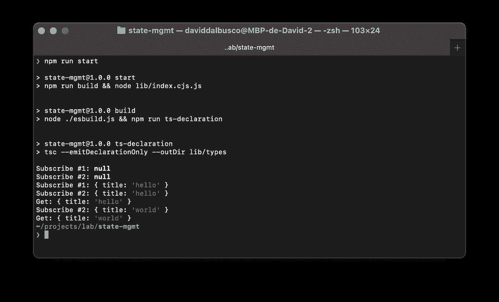

# TypeScript 中的无框架存储

> 原文：<https://betterprogramming.pub/a-frameworkless-store-in-typescript-84baaa00b901>

## 你曾经开发过 API、服务和状态管理与核心完全分离的应用吗？


照片由[派恩瓦特](https://unsplash.com/@pinewatt?utm_source=Papyrs&utm_medium=referral)在 [Unsplash](https://unsplash.com/?utm_source=unsplash&utm_medium=referral&utm_content=creditCopyText) 拍摄

使用框架有不可否认的优势(React、Angular、Svelte 等。)进行前端开发，但也有不可否认的缺点。

跨各种技术的项目之间的互操作性和兼容性通常是一个问题，对于长期应用程序和在团队之间共享资源的公司来说，这是一个必须要考虑的问题。

[Web 组件](https://developer.mozilla.org/en-US/docs/Web/Web_Components)——一套允许你创建可重用的不可知定制元素的不同技术——是挑战的一个常见关键。然而，它们的使用通常仅限于设计系统或富 UI 组件的创建。

根据我的经验，很少有公司在其前端应用程序中明确地将表示层与业务层分离。

老实说，您是否经常开发 API 和服务层与项目完全分离的应用程序？您曾经将应用程序的状态管理提取到可重用的库中吗？​

这就是我在开发 [Papyrs](https://papy.rs/) 时寻求解决的问题——一个开源、隐私优先、去中心化的博客平台，100%生活在链上。

# 摘要

在这篇博文中，我展示了一个架构，它将两个应用程序的业务和状态管理逻辑分开，这两个应用程序是用两种不同的技术开发的( [Sveltekit](https://kit.svelte.dev/) 和 [Stencil](https://stenciljs.com/) )。****

之后，我展示了我在 TypeScript 中开发的商店的有效框架代码，以及它如何集成到这两个应用程序中。

# 体系结构

Papyrs 是 [DeckDeckGo](https://deckdeckgo.com/) 的衍生项目。两者都是 web 编辑器，应该在 [DFINITY](https://dfinity.org/) 的互联网计算机上保存和发布数据——也就是说，他们的目标不同，但他们的架构应该相同。​

因为 DeckDeckGo 是去年移植到互联网计算机上的——当时还没有上线——同时保持向后兼容 Google Firebase。API 层已经在独特的库中实现。

然而，当我开始实现 Papyrs 时，业务逻辑和状态管理仍然是在 DeckDeckGo 的应用程序中实现的。

因此，我不得不问自己是否渴望从头开始重新实现这些特性(😅)或者其他解决方案——比如重用和共享库——是否是一个可靠的选择。



纸莎草发展初期的建筑

当您阅读本文时，我假设您知道结果是什么:我提取并分离了特性，以便在两个项目中重用完全相同的代码。

虽然提取业务逻辑是一个相对简单的操作——大部分是无状态的函数——但是提取商店就有点复杂了。幸运的是，我最终找到了一个解决方案——我将在下一章分享——它混合了不可知的可写状态管理和可读存储。

基本上，当应用程序复制这些值来更新 UI 时，库的存储负责保存状态。



DeckDeckGo 和 Papyrs 共享的结果架构

# 无框架代码

这个商店就是一个普通的`class`，它包含一个值并公开`set`和`get`函数。

```
export class Store<T> {
  constructor(private value: T) {
  }

  set(value: T) {
    this.value = value;
  }

  get(): T {
    return this.value;
  }
}
```

商店还应该传播这些更改——当值被修改时，应该让消费者知道。因此，它应该提供一种注册回调的方法。

此外，当使用者注册一个侦听器时，它还应该能够停止侦听更改——即取消注册回调。

这就是为什么商店为每个注册的回调分配一个惟一的 ID。由于有了这些标识符，就有可能返回一个可以取消侦听器订阅的函数。

为了生成一个惟一的标识符，我使用了[符号](https://developer.mozilla.org/en-US/docs/Web/JavaScript/Reference/Global_Objects/Symbol)——一个浏览器的内置对象，它的构造函数返回一个保证惟一的`symbol`。

`subscribe`函数还调用被注册的回调函数。这样，消费者就可以立即收到当前值，而不必等待下一次更新。

最后，setter `propagate`将新值传递给所有注册的回调。

```
interface StoreCallback<T> {
  id: Symbol;
  callback: (data: T) => void;
}

export class Store<T> {
  private callbacks: StoreCallback<T>[] = [];

  constructor(private value: T) {
  }

  set(value: T) {
    this.value = value;

    this.propagate(value);
  }

  get(): T {
    return this.value;
  }

  private propagate(data: T) {
    this.callbacks.forEach(({callback}: StoreCallback<T>) =>
      callback(data)
    );
  }

  subscribe(
    callback: (data: T) => void
  ): () => void {
    const callbackId: Symbol = Symbol();

    this.callbacks.push({id: callbackId, callback});

    callback(this.value);

    return () =>
      (this.callbacks = this.callbacks.filter(
        ({id}: StoreCallback<T>) => id !== callbackId
      ));
  }
}
```

# 演示

为了尝试上述通用状态管理，我们可以创建一个虚拟商店和一个消费者。

## 商店

下面的存储包含一个用`null`初始化的对象`Doc`。

```
import {Store} from './store';

export interface Doc {
  title: string;
}

export const docStore: Store<Doc | null> = new Store<Doc | null>(null);
```

## 消费者

消费者——一个测试脚本——创建两个订阅者，设置第一个值“hello ”,取消订阅第一个侦听器，并设置一个新值“world”。

```
import {type Doc, docStore} from './doc.store';

const print = ({
  subscriber,
  value
}: {
  subscriber: string;
  value: Doc | null;
}) => console.log(`${subscriber}:`, value);

const unsubscribe1 = docStore.subscribe(
  (value: Doc | null) => print({subscriber: 'Subscribe #1', value})
);
const unsubscribe2 = docStore.subscribe(
  (value: Doc | null) => print({subscriber: 'Subscribe #2', value})
);

docStore.set({title: 'hello'});
console.log('Get:', docStore.get());

unsubscribe1();

docStore.set({title: 'world'});
console.log('Get:', docStore.get());
```

## 试验

如果我们在终端中运行上述脚本，我们将注意到以下内容:

*   订户立即获得当前值
*   第一个订户已成功注销
*   商店保留该值并触发已注册的订户

我们可以断定一切都如预期的那样工作。



# 包装

我试图将业务逻辑从我的应用程序中完全分离出来。如果包含这些存储的库能够完全访问这些存储，那么应用程序就能够写入值。

为了解决这个需求，我的库只公开了存储的接口和订户。

```
export {type Doc} from './doc.store';

export const docSubscribe = (
  callback: (doc: Doc| null) => void
): (() => void) => docStore.subscribe(callback);
```

# **用法**

上述解决方案是不可知的。它是用 TypeScript 编写的，编译成 JavaScript。这就是为什么它可以集成到任何现代框架中，甚至可以不集成。

## 苗条的

[可读商店](https://svelte.dev/tutorial/readable-stores)是一个有趣的模式，是由苗条开箱提供的。在前几章中介绍的库的存储可以在一个函数中进行，这个函数可以写入应用程序的存储，但是不能在其他地方调用。

```
import { readable } from 'svelte/store';
import { type Doc, docSubscribe } from 'state-mgmt';

const start = (set: (value: Doc | null) => void) => {
  const unsubscriber: () => void = docSubscribe(
    (doc: Doc | null) => set(doc)
  );

  return function stop() {
    unsubscriber();
  };
};

export const doc = readable<Doc | null>(null, start);
```

每当库在状态管理中设置一个值时，订户被调用，当前值被复制到 Svelte 存储中。最终，用户界面被更新。

## 模板

开箱即用的 [@stencil/store](https://github.com/ionic-team/stencil-store) 是可写的。幸运的是——多亏了 Philipp Mudra 在模板的 slack channel 上分享的解决方案——可以用 TypeScript [实用程序](https://www.typescriptlang.org/docs/handbook/utility-types.html#readonlytype)将模板设为只读。

```
import {createStore} from '@stencil/store';
import { type Doc, docSubscribe } from 'state-mgmt';

interface DocStore {
  doc: Doc | null;
}

const {state} = createStore<DocStore>({doc: null});

docSubscribe((doc: Doc | null) => {
  state.doc = doc;
});

const readonlyState: Readonly<typeof state> = state;

export default {state: readonlyState};
```

# 结论

在我看来，将所有业务逻辑和状态管理与应用程序完全分离是一件很酷的事情。

如果有一天我想为[纸莎草纸](https://papy.rs/)开发一个新的 UI，我将能够快速完成，而不用担心任何逻辑。​

此外，该解决方案是可扩展的。我可以一遍又一遍地重复使用和复制同样的方法，直到我不再想在 web3 上开发新的应用程序。

更多冒险，请在推特上关注我