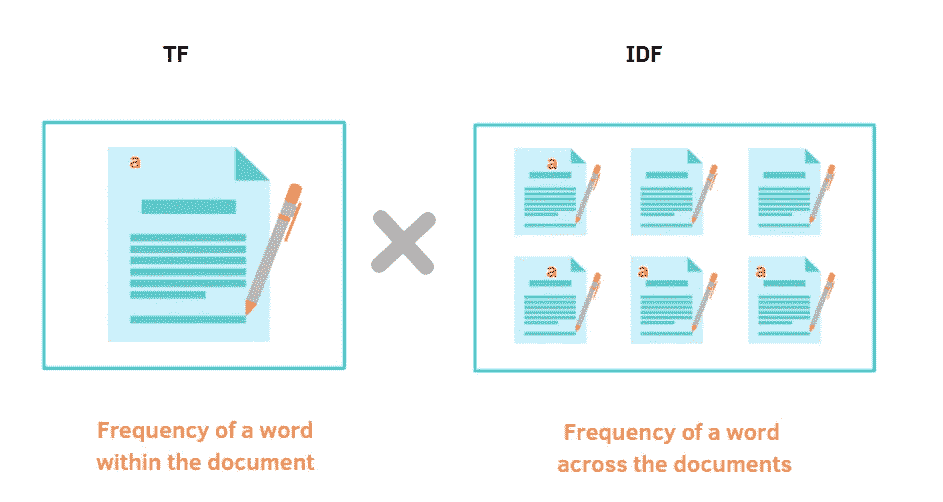
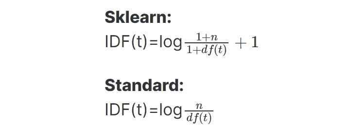
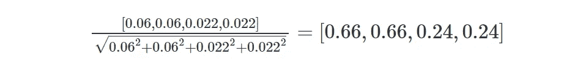
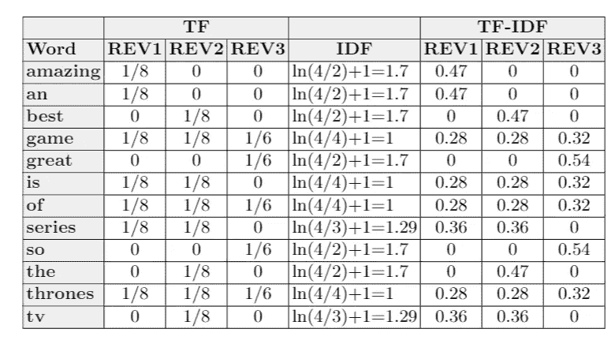
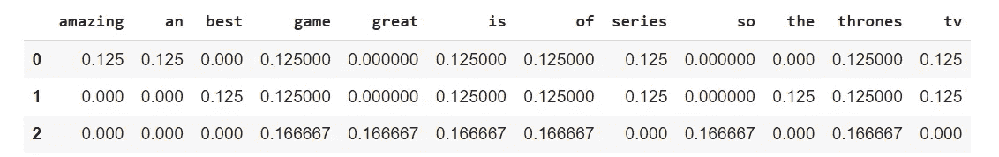
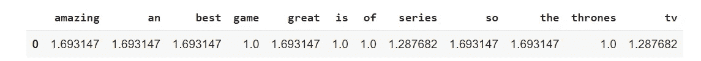
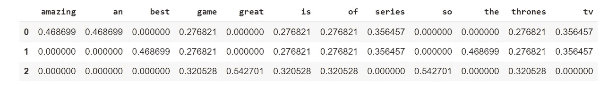
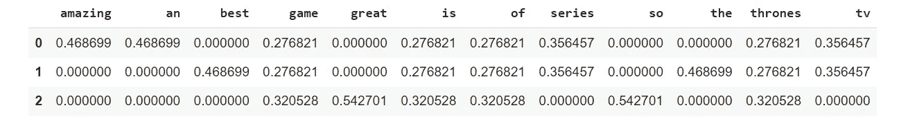

# NLP 友好指南:TF-IDF 和 Python 示例

> 原文：<https://betterprogramming.pub/a-friendly-guide-to-nlp-tf-idf-with-python-example-5fcb26286a33>

## 将实现与 Scikit-Learn 的 tfidf 矢量器进行比较

作者插图

*这是* [*NLP 教程系列*](https://eugenia-anello.medium.com/nlp-tutorial-series-d0baaf7616e0) *的第三篇帖子。本指南将让您逐步了解如何从头开始实现 TF-IDF，并将获得的结果与已经实现的 Scikit-learn 的*tfidf 矢量器*进行比较。*

处理大量文本以执行分类、语音识别或翻译的模型需要额外的步骤来处理这些类型的数据。文本数据需要转换成其他东西，数字，计算机可以理解。有许多技术可用于使用此类数据创建新要素。

其中一个是**词频-逆文档频**，也叫 TF-IDF。这个长名字看起来很吓人，但是这种方法的思想很简单。这是一种技术，用于量化一个文档中以及同时跨一组文档的单词的重要性。

事实上，有许多像“the”、“is”、“I”这样的常用词在句子中频繁出现，但对带来信息没有显著贡献。如果我们只看频率这个词，这些词会显得比其他词更重要。因此，引入 TF-IDF 是为了在数据集中拥有更强大的特征。

目录:

*   标准 TF-IDF
*   [Sklearn TF-IDF](#0b70)
*   [一个简单的例子](#ff3f)
*   [用 Python 实现](#ba33)
*   [与 Scikit-Learn 的比较](#facf)

# 标准 TF-IDF

它由两个术语组合而成:

图片来源:作者

其中**词频** (TF)是单词`t`在文档 d 中的出现频率，换句话说，就是该单词在文档中的计数与总字数的比值:

图片来源:作者

正如我们之前说过的，频率这个术语不足以提供有效的度量。我们还需要把它和另一个术语结合起来，叫做**逆文档频率**。这是一个分数的对数变换，计算方法是将语料库中的文档总数除以包含该单词的文档数。

图片来源:作者

更好的方法是精确地指出对数是以 10 为底的，而在 Sci-Kit learn 中，在实现

# Sklearn TF-IDF

在前一段中，已经介绍了 TF-IDF 的标准定义。现在，我将展示在 sklearn 中计算的`tf-idfs`的`[**TfidfTransformer**](https://scikit-learn.org/stable/modules/generated/sklearn.feature_extraction.text.TfidfTransformer.html#sklearn.feature_extraction.text.TfidfTransformer)`和`[**TfidfVectorizer**](https://scikit-learn.org/stable/modules/generated/sklearn.feature_extraction.text.TfidfVectorizer.html#sklearn.feature_extraction.text.TfidfVectorizer)`与标准方法有何不同:

图片来源:作者

你可以很容易地观察到`sklearn`版本的 IDF 在分子和分母上都加了 1，以避免零除。此外，等于 1 的常数被加到对数项上。

例如，如果我们有`n=3`文档和`df(t)=3`，这意味着该单词出现在所有文档中，那么根据 Scikit-learn 定义，IDF(t)等于`ln((1+3)/(1+3))+1 = 1`，而在标准情况下等于`IDF(t) = log10(3/3) = 0`。

一旦计算出 TF 和 IDF 分数，我们就可以最终通过以下公式获得 TF-IDF 向量:

图片来源:作者

在我们使用**欧几里德范数**对结果 TF-IDF 向量进行归一化之后:

用 L2 规范标准化。图片来源:作者

例如，给定原始 tf-idfs 的向量 v = [0.06，0.06，0.022，0.022]，我们应用 L2 范数，获得第一个文档的 TF-IDFs:

图片来源:作者

# 一个简单的例子

让我们看一个简单的例子来理解前面解释的概念。我们可能有兴趣分析一下关于《权力的游戏》的评论:

**回顾 1** :权力的游戏是一部惊艳的电视剧！

**回顾 2** :权力的游戏是最好看的电视剧！

**回顾 3** :权力的游戏太棒了。

在表中，我按照 Sklearn 方法显示了获得 TF-IDFs 的所有计算。

表中列出了获得 TF-IDFs 的所有计算方法。图片鸣谢:作者。

很明显，最常见的词，如“游戏”、“of”、“权力”、“is”，具有最小的 IDF，1，这意味着它们将具有 0.3 左右的低权重。

另一方面，像“惊人的”和“伟大的”这样的词具有更高的 TF-IDF 值，因为这些词中的每一个都只出现在一篇评论中。

此外，像“so”和“the”这样的常用词也贡献更多，因为它们并不出现在所有的句子中，我们没有删除停用词以使方法尽可能简单。

# 用 Python 实现

教程中最重要的部分现在开始。让我们导入库:

我们可以看到之前示例中考虑的评论:

在 TF-IDF 中，我们不考虑标点符号，所以需要去掉。此外，我们将字符串转换成一个列表，以方便应用程序。

考虑到这三个列表，我们还想获得唯一单词的列表:

第一步是获得文档中每个单词的**词频**分数:

TF 分数的结果如下:

图片来源:作者

现在，我们要按照 Sklearn 方法计算 **IDF** :

我们最终可以获得 IDF 值，如上表所示:

图片来源:作者

最后也是最重要的一步是为每个单词和每个文档获得 **TF-IDF 分数**。这些稳健性度量是通过将 TF 和 IDF 值相乘获得的。

下面，我展示了通过这个函数得到的最终输出:

从头开始实现获得的输出。图片来源:作者

# 与 Scikit-Learn 的比较

此时，我们可以直接应用 Scikit-Learn 实现的 TfidfVectorizer:

使用 Sklearn 获得的结果。图片来源:作者

输出是通过从头开始实现获得的。图片来源:作者

用更少的代码行获得了同样的结果！是不是很神奇？

# 最后的想法

我希望这篇教程对你理解 TF-IDF 是如何工作的有所帮助。起初，我在理解为什么标准方法和 Sklearn 结果不同时遇到了一些问题。

在我更好地阅读了 TfidfVectorizer 的文档和 GitHub 代码之后，我了解到这种方法有一些修改。瞧。当然还有其他修改要添加。

比如去掉停用词，我推荐做。函数`TfidfVectorizer`也有很多参数来改变获取 TF-IDFs 值的方式。请检查[文档](https://scikit-learn.org/stable/modules/generated/sklearn.feature_extraction.text.TfidfVectorizer.html#sklearn.feature_extraction.text.TfidfVectorizer)。GitHub 的代码在这里是。感谢阅读。祝您愉快！

你喜欢我的文章吗？ [*成为会员*](https://eugenia-anello.medium.com/membership) *每天无限获取数据科学新帖！这是一种间接的支持我的方式，不会给你带来任何额外的费用。如果您已经是会员，* [*订阅*](https://eugenia-anello.medium.com/subscribe) *每当我发布新的数据科学和 python 指南时，您都会收到电子邮件！*