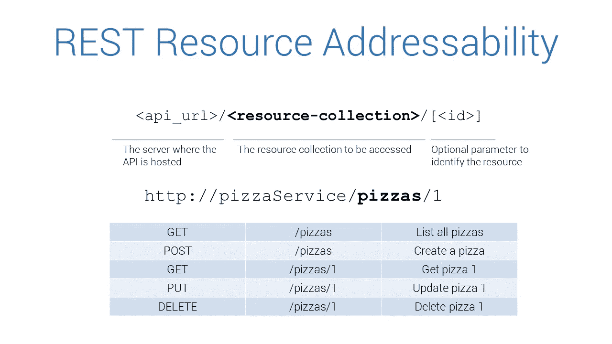
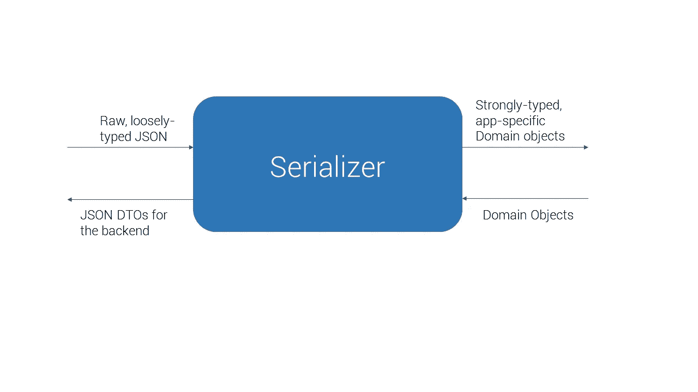
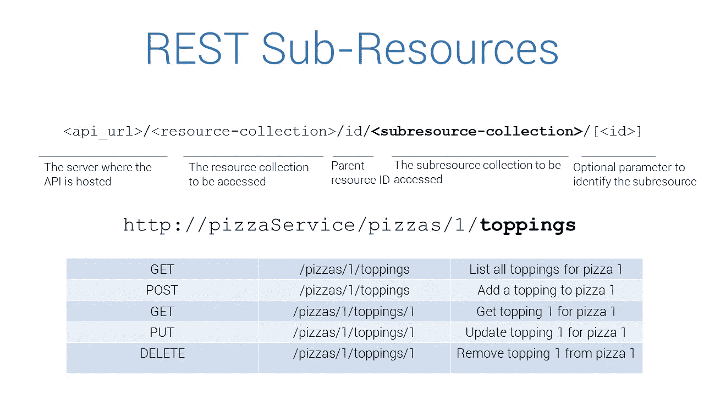

# 面向角度应用的通用 HTTP 服务方法

> 原文：<https://betterprogramming.pub/a-generic-http-service-approach-for-angular-applications-a7bd8ff6a068>


照片由 [Jantine Doornbos](https://unsplash.com/@jantined?utm_source=unsplash&utm_medium=referral&utm_content=creditCopyText) 在 [Unsplash](https://unsplash.com/search/photos/programming?utm_source=unsplash&utm_medium=referral&utm_content=creditCopyText) 上拍摄

我目前正在做的项目的一部分是构建一个基于 Angular 4 的 web 应用程序，该程序从大量 RESTful 后端服务中提取数据并将其可视化。

REST 的基石之一是通过 HTTP 请求识别和操作资源。

例如，如果我们有一个 RESTful pizza 服务，它公开了一个`pizzas`端点，那么在这个端点上执行一个`HTTP GET`将会返回一个资源集合，每个资源都是一个 pizza 的表示。

每一个比萨饼都可以用一个属性来唯一识别，比如一个`id`。然后这个`id`可以用来获取和操作一个特定的 pizza 资源。

向`pizzas/:id`端点发出`GET`请求将返回带有所请求的`id`的比萨饼。

用请求体中的 pizza 资源向`pizzas/:id`端点发出`PUT`请求，会用提供的值更新指定的资源。

向端点发出一个`DELETE`请求会删除那个资源。

总体情况如下:



在 Angular 应用程序中，我们将使用`HttpClient`模块来发出 HTTP 请求，因此如果我们在 Angular 应用程序中实现了一个匹配的`PizzaService`，它看起来会像这样:

`HttpClient`的泛型方法确保强类型的`Pizza`对象被返回给使用该服务的组件。

然而，如果在后端的对象表示和在前端需要显示的内容之间需要稍微复杂一点的转换，我们将需要构建自己的转换机制。

以我们的例子为例，让比萨饼有一个`cookedOn`属性，它由 API 作为字符串返回。我们想把它解析成一个[矩](https://momentjs.com/)对象，这样我们就可以更好地控制它在应用程序中的显示方式。

此外，在向 API 回发披萨时，`cookedOn`字段将被忽略，不需要被回发。

对于诸如此类的转换，我使用了一种称为`Serializer`的机制，它将 API 返回的原始 [JSON](https://www.json.org/) 转换为具有所需属性的强类型对象。



这里有一个`PizzaSerializer`的例子:

和`PizzaService`，现在已经增强为使用串行器。

现在，这里需要注意的是，如果我们有另一个返回汉堡而不是披萨的后端服务，匹配的前端服务将做与`PizzaService`相同的事情，只是现在它对`Burger`对象而不是`Pizza`对象执行相同的操作。

由于模型上的可能差异，实现上的唯一差异是序列化器。

在构建我们的 Angular 应用程序的过程中，我们实现了大量的服务来从后端获取和操作数据。

所以我们最终得到了一堆本质上做同样事情的类——从后端获取特定的资源，将它们转换成前端对它们的表示，并根据需要从后端更新、创建或删除它们。

这最终导致了大量代码重复，需要以某种方式解决。

解决方案是采用一种通用的方法，这种方法适用于从 RESTful API 获取的任何资源，只要资源符合一些基本的约束。

例如，如果我们假设从 API 返回的所有东西都是唯一可识别的，这意味着我们收到的每个对象都有一个`id`字段。

我们可以通过创建一个`Resource`模型来对此进行形式化:

```
export class Resource {
  id: number
}
```

现在，我们为从后端获取的资源创建的每个模型，比如`Burger`或`Pizza`，都可以从`Resource`继承，从而赋予它一个`id`属性。

```
export class Pizza extends Resource {
  //id is inherited from Resource
  name: string;
  cookedOn: Moment;
}
```

另一个我们需要通用化的组件是`Serializer`。我们将通过指定一个所有序列化程序都将实现的接口来做到这一点。

现在，我们使用这个通用模型和接口(以及一些很酷的 TypeScript 泛型)来实现适用于任何资源的通用服务。

扩展这个通用服务的`PizzaService`现在不需要编写任何 CRUD 代码！

实现一个新的汉堡服务现在只需要创建一个类，并让它从上面的泛型`ResourceService`继承。

我们有了它，一个从 RESTful API 获取和转换数据的通用实现！

然而，还有一种情况我们没有考虑到。

REST 允许资源拥有子资源，即与主资源对象相关联的子资源。



为了支持这样的子资源，我们需要如下扩展我们的资源模型:

```
export class Resource {
  id: number;
  parentId?: number;
}
```

添加`parentId`字段允许我们识别子资源。

然而，我们将需要实现另一个通用服务，一个`SubResourceService`，它需要一个额外的参数来标识父端点，并且需要在`parentId`中被传递以对资源进行操作。

# 结论

现在，我们有了 RESTful API 提供的任何资源或子资源上的 CRUD 的全功能通用实现。

这确保了在获取、转换和分发数据方面完成所有繁重工作的代码被封装在两个类中，并且可以单独进行单元测试。

序列化程序公开了纯函数，这些函数也可以进行彻底的单元测试，以确保高质量的工作软件。