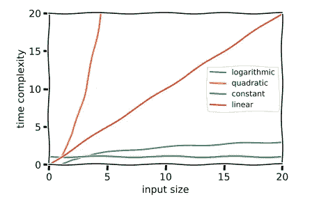
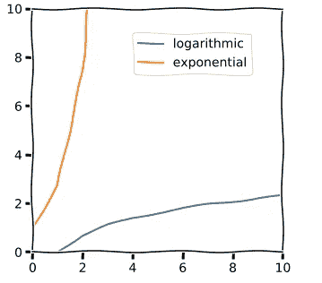

# 对数时间复杂性的温和解释

> 原文：<https://betterprogramming.pub/a-gentle-explanation-of-logarithmic-time-complexity-79842728a702>

## 别担心，这比听起来简单


照片由[哈里桑德胡](https://unsplash.com/@harryxsandhu?utm_source=unsplash&utm_medium=referral&utm_content=creditCopyText)在 [Unsplash](https://unsplash.com/s/photos/time?utm_source=unsplash&utm_medium=referral&utm_content=creditCopyText) 拍摄

如果你是计算机科学的新手，你可能见过类似于`O(n)`或`O(log n)`的符号。这就是时间复杂度分析或 big-O 符号！

为了快速编写代码，理解这个概念非常重要，至少在直觉层面上是如此。还有空间的复杂性。它定义了一个程序可能使用多少内存，但是我们将把它留到下一篇文章中。

这个概念是高等教育认为需要让计算机科学本科生上几年数学课的原因之一。现在，我并不反对数学课，但是你绝对不需要它们来写好的代码。

事实是，普通程序员需要了解的所有计算机科学概念本身并不难理解。就像代码本身一样，各个部分都很简单，但是这些部分加起来就复杂得难以理解了。

# n 是什么？

> "时间复杂度是计算复杂度，描述了运行一个算法所需的时间."— [维基百科](https://en.wikipedia.org/wiki/Time_complexity)

这是一个相当罗嗦的定义，让我们来分解一下。

我将讨论四种重要的大 O 符号。还有其他像 *n log n* 和 *n factorial* 这样的方法，但是我们现在不考虑这些。

假设我们有一个包含五个字母的列表:

```
[a,b,c,d,e]
```

因为有五个，所以这里的 *n* 等于 5: `n=5`。

## 常数时间或 O(1)

如果你的程序想像这样从你的列表中删除一个字母:

```
[a,b,c,d,e] => [a,b,c,d]
```

它的时间复杂度仅仅是 1，因为不管列表中有多少个字母，它总是只需要一次操作。

O(1)是最好的时间复杂度！像哈希表这样的数据结构巧妙地利用算法来完成常数时间操作，并大大加快速度。

## 线性时间或 O(n)

如果你的程序像这样复制所有的字母:

```
[a,b,c,d,e] => [aa,bb,cc,dd,ee]
```

对于每个字母，该字母是重复的。程序一次通过一个。

你可以说它的运行时间是 n 阶的，因为它要做的操作数量与你的列表中有多少个字母成正比。这能说明它在实践中会跑多快吗？不完全是。

你的输入可以是两个字母，也可以是 120 亿。它可以在旧的笔记本电脑或超级电脑上运行，运行时间会有很大不同。

如果程序把每个数字加到自己身上三次，而不是两次，它仍然是 O(n ),因为即使你的程序每次输入做更多的运算，每次输入多多少是不变的。

O(n)是一个合适的时间复杂度，你经常无法避免它。

## n 阶平方或 O(n)

现在，假设您希望您的程序将列表中的每个成员互相添加。

```
[a,b,c,d,e] => [abcde, bacde, cabde, dabce, eabcd]
```

因为对于列表中的每一个项*，你也必须遍历列表中剩余的*项*，所以你的程序必须执行的操作数是输入数(或 n)乘以自身数(n 的平方)。*

如果你的列表中有两个字母，你的程序将运行四次运算。如果你的列表有四万亿个字母，它可能永远也跑不完！

O(n)几乎从来都不是一个可接受的时间复杂度，你通常可以用某种聪明的算法来避免它。

## 对数时间或 O(log n)



matplotlib xkcd 样式的图形！

查看该图，您可以看到四个运行时是如何伸缩的。

橙色二次曲线上升速度极快，而绿色常数保持不变，与输入无关。但是那条蓝色的对数线呢？那看起来几乎和恒定时间一样好！

# 对数

> "一个代表一个固定数(基数)的幂的量，它必须被提高到一定的幂才能产生一个给定的数."— [词典](https://www.lexico.com/definition/logarithm)

如果你从高中起就没想过代数，你会想重温一下对数到底是什么。

## 数学来了

当 x 是指数时，对数用于求解 x。看看这个等式:

```
3^x == 9
```

对数问题的答案是:“我们用 3 的什么次方得到 9？”答案当然是 2！

```
log3(9) == 2
```

对数函数与指数函数相反。当你说某样东西呈指数增长时，它正在被*乘以*。当某物以对数方式增长时，它被除以。

被它除的数是基数。在计算机科学中，这个数字在大多数实际应用中是 2。



看啊！它们是镜像的。

这意味着，如果您有两个列表项要处理，并且您的程序在 n 次的 *log base 2 中运行，那么将需要执行一次操作。那真的很厉害！运行的操作将比您拥有的数据少。*

输入越大，你的程序需要经历的实际输入的比例就越小！

# 实际对数

再次查看我的列表:

```
[a,b,c,d,e]
```

例如，如果我想搜索它并找到`d`，也许你可以写一个程序，按顺序查看每个字母，并在找到它要找的东西(d)时返回索引(3)。

该搜索将需要四次操作。不算太坏，对吧？如果我们要找的是`e`呢？只有五次手术。因为这是最坏的情况，而五是输入的长度，所以搜索算法将是 O(n)。

这对于一个小的列表来说很好，但是如果我们在一个有十亿个元素的列表中搜索最末尾的元素，这个算法会花费很长时间。

## 弗拉门戈搜索

如果我们能加速到 O(log n)呢？嗯，如果列表排序了，我们可以！我会让这些弗拉门戈舞者来解释:

注意舞者是如何排成一行，背上有数字的。背上有数字 7 的男人在找匹配的女人。他不知道她在哪里，但他知道所有的女士都在排序。

他的流程是走到中间的舞者面前，问她数字七在哪边。当她说:“她在我左边”时，他可以排除她右边的所有人。

接下来，他问左边中间的女人同样的问题。这让他可以排除另外一半的候选人，以此类推，直到他找到第七个。

这个程序的运行时间为 O(log n ),因为在最坏的情况下，它运行的操作数将是输入大小的 *log base 2。在这种情况下，由于我们的“列表”中有七个舞者，运行时间是 log2(7)或~3 次操作。*

这种算法被称为二分搜索法，因为我们在每次运算中用两个 T4 来除可能的候选数。这就是 log2(以 2 为底的对数)的意思。它是 O(log n)的典型代表。

作为软件工程师，我们不必太担心对数的底数。它几乎总是为 2，如果不是，性能考虑也没有太大的不同。所以我们才说 log n，不指定基数。

# 感谢阅读！

希望有意义！如果有不清楚的地方，请留言评论。