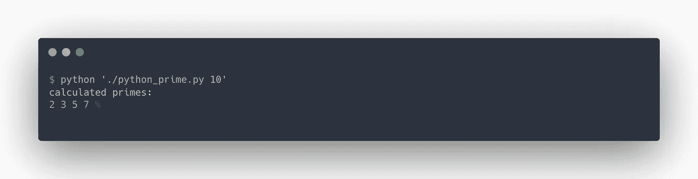
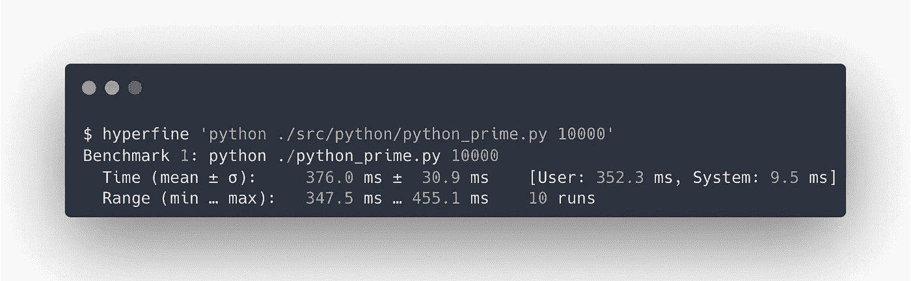
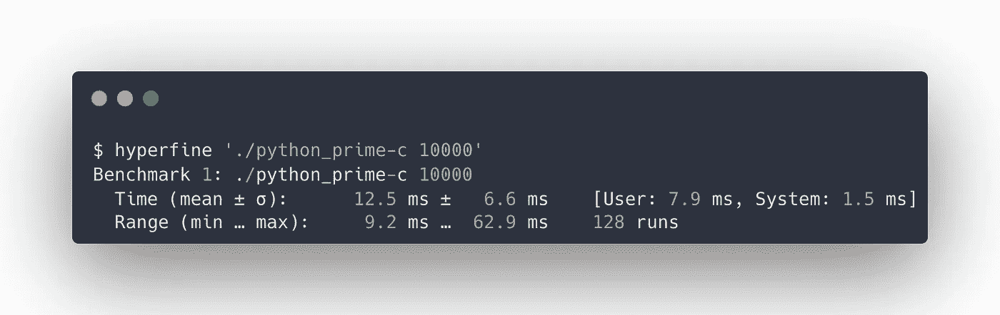
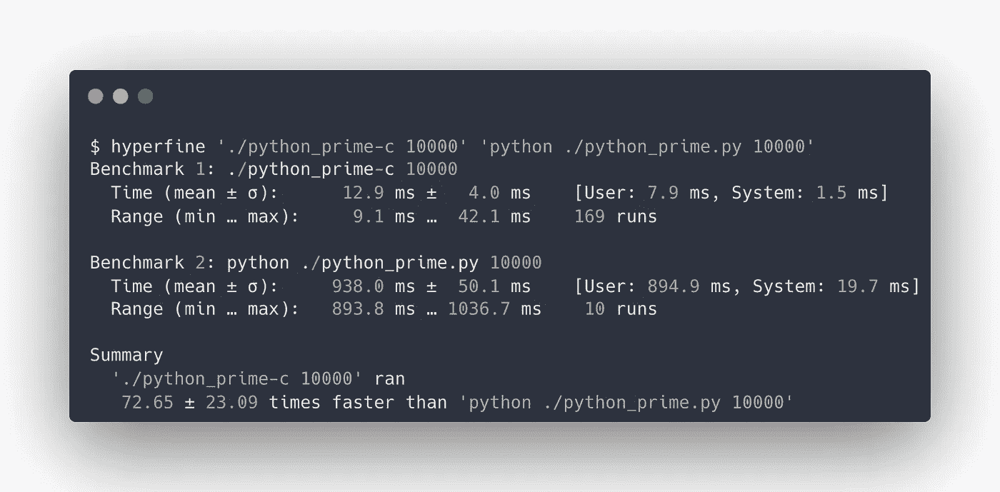
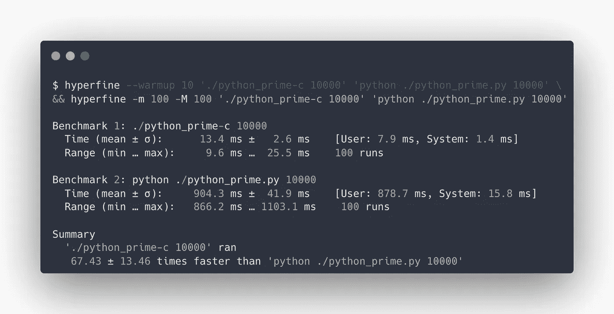

# PyPy 的简单介绍——速度更快、改动最少的 Python

> 原文：<https://betterprogramming.pub/a-gentle-introduction-to-pypy-python-performance-and-benchmarking-3d0e5609985>

## PyPy 与 Python——性能和基准测试


在 [Unsplash](https://unsplash.com?utm_source=medium&utm_medium=referral) 上由 [TETrebbien](https://unsplash.com/es/@tetrebbien?utm_source=medium&utm_medium=referral) 拍摄的照片

在这篇文章中，我将讲述我最近才接触到的 PyPy 的经历。

本文是对 2011 年【1】的[用 PyPy](https://morepypy.blogspot.com/2011/04/tutorial-writing-interpreter-with-pypy.html) 编写解释器教程的补充。当我第一次尝试按照这篇博文的步骤操作时，我遇到了许多问题，比如过时的文档、过时的代码引用、python 版本不兼容等等。我将试着在这里介绍这些问题和我的学习经历。

[用 PyPy](https://morepypy.blogspot.com/2011/04/tutorial-writing-interpreter-with-pypy.html) 写一个解释器是关于用 PyPy 工具链创建一个[BF](https://en.wikipedia.org/wiki/Brainfuck)【2】解释器以及它的翻译过程。当我跟进时，对我来说主要的问题与工具链本身有关。因此，我决定把我的注意力集中在这里。我们不会在这里讨论 BF 解释器，因为它已经在最初的博客文章中解释过了，但是我将介绍 PyPy 工具链和一些基本的基准概念，它们对于理解这个主题是必不可少的。

# PyPy 到底是什么？

如果你以前尝试过 Python，你可能运行的是[CPython](https://en.wikipedia.org/wiki/CPython)【3】。CPython 是 Python VM(虚拟机)最常见的实现。[PyPy](https://www.pypy.org/)【4】是 CPython 的替代品。

使用 PyPy，我们用[RPython](https://doc.pypy.org/en/latest/coding-guide.html#restricted-python)【5】编写程序，并应用生成二进制可执行文件的 RPython 翻译工具链。PyPy 相对于 CPython 的一个主要优势是速度，这将在本文后面使用基本的基准测试工具进行演示。

**行话总结:**

*   **CPython**——最常见的 Python 实现
*   PyPy——CPython 替代方案
*   **RPython**—Python 的受限版本
*   **基准**——评估程序相对性能的行为(在我们的例子中是时间)

# 上手使用 RPython

首先，我们需要编写一个简单的`RPython`程序，称之为`python_prime.py`:

它绝对类似于 Python👀。那是因为`RPython`是限制级 Python。我们必须选择某种计算问题，所以我们用了一个素数序列生成器。实际的计算工作不是这里的重点。

我们的 RPython 程序也有一些 PyPy 挂钩——一个叫做`target`的函数(注释应该是不言自明的)。

# 运行程序

我们将使用 Python 2.7.18 版本，因为我发现了与更高版本的不兼容问题。如果你没有安装 2.7 Python 版本，你可以使用[pyenv](https://github.com/pyenv/pyenv)【6】或[conda](https://docs.conda.io/projects/conda/en/latest)【7】等工具。

运行我们的程序:

```
$ python ./python_prime.py 10
```

我们应该得到类似于图 1 的输出。



图一。以 CPython 身份运行 RPython 程序。

# 标杆管理

现在我们已经有了自己的程序，我们可以做一些基准测试来了解它的运行时性能。

为此，我们将使用一个叫做[超精细](https://github.com/sharkdp/hyperfine)【8】的工具。

Mac 安装:

```
brew install hyperfine
```

Linux Debian 安装:

```
wget [https://github.com/sharkdp/hyperfine/releases/download/v1.15.0/hyperfine_1.15.0_amd64.deb](https://github.com/sharkdp/hyperfine/releases/download/v1.15.0/hyperfine_1.15.0_amd64.deb) sudo dpkg -i hyperfine_1.15.0_amd64.deb
```

与我们如何运行 RPython 程序类似，我们可以通过 hyperfine 实用程序来运行它:

```
$ hyperfine 'python ./python_prime.py 10000'
```

图 2 展示了完整的输出。



图二。RPython 程序基准测试结果。

默认情况下，Hyperfine 会运行我们的程序十次，并给出诸如最小和最大执行时间之类的统计数据。这里我们不打算详细讨论超精细。重要的是，在比较运行时时，要有一种感觉和高层次的理解。

一般来说，基准测试的结果可能会受到不同因素的影响，例如运行基准测试的机器、运行基准测试时同时运行的其他进程、热启动与冷启动、缓存等。但是，就我们的目的而言，我们这里的基准流程已经足够好了。

# 使用 PyPy 翻译我们的程序

第一步是获得 PyPy 源代码:

```
wget [https://downloads.python.org/pypy/pypy2.7-v7.3.9-src.tar.bz2](https://downloads.python.org/pypy/pypy2.7-v7.3.9-src.tar.bz2) 
tar -xvf pypy2.7-v7.3.9-src.tar.bz2 # extracting 
tar mv pypy2.7-v7.3.9-src ./pypy 
```

在这里，我们下载源代码，提取它并重命名提取的目录，以便以后使用。

下载并解压缩后，运行 PyPy 翻译工具链:

```
export PYTHONPATH=${PWD}:${PWD}/pypy/ 
python ./pypy/rpython/translator/goal/translate.py python_prime.py
```

如果您将教程代码与我的进行比较，您会注意到文件路径的不同——`[translate.py](http://translate.py)`是从`pypy/translator/goal/translate.py to rpython/translator/goal/translate.py`转移过来的。

另外，我将`[PYTHONPATH](https://bic-berkeley.github.io/psych-214-fall-2016/using_pythonpath.html)` [9]环境变量设置为当前目录和 PyPy 源代码的路径。这将使 PyPy 模块可供我们的程序运行。

当运行它时，您应该在您的终端上看到 toolchain 日志(在我的 M1 芯片上大约需要 30 秒)；当这个过程完成时，我们应该得到与 python 文件同名但后缀为“-c”的翻译后的二进制文件。

```
$ ls -lah ./python_prime-c 
-rwxr-xr-x 1 medium medium 217K 24 Sep 11:34 ./python_plain_class-c
```

让我们看看里面👀

```
$ file ./python_plain_class.py ./python_plain_class-c python_plain_class.py: **Python script text executable, ASCII text** python_plain_class-c: Mach-O 64-bit **executable x86_64**
```

如果您不信任文件命令:

```
$ head ./python_plain_class-c������ H__PAGEZEROx__TEXT__text__TEXT0/��0/�__stubs__TEXT��>��__stub_helper__TEXT�”��__cstring__TEXT2�q2�__const__TEXT�����__unwind_info__TEXTD��D�__eh_frame__TEXT8��...
```

是的，它确实是一个二进制文件。

好了，我们用 PyPy 把 Python 翻译成了二进制。现在怎么办？

# 比较基准🔬

在我们翻译的程序上运行 hyperfine:

```
$ hyperfine ‘./python_prime-c 10000’
```

完整输出见图 3。



图 3。翻译的 RPython 程序基准测试结果。

发现区别了吗？我们也可以运行 hyperfine 来比较这两个程序:

```
$ hyperfine './python_prime-c 10000' 'python ./python_prime.py 10000'
```

图 4 显示了完整的结果。



图 4。比较 CPython 和 RPython 基准。

说什么！？速度快 72 倍🤯？！

显然是的。超精细不会骗你。你可以相信它。

你真的希望这样吗？？也许我应该把这篇文章命名为“让你的 python 程序运行速度提高 70 倍”？我认为这仍然很酷…好了，继续。

让我们再次运行 hyperfine，这一次使用 worm-up 和更多运行:

```
$ hyperfine --warmup 10 './python_prime-c 10000' 'python ./python_prime.py 10000' \
&& hyperfine -m 100 -M 100 './python_prime-c 10000' 'python ./python_prime.py 10000'
```

结果见图 4。



图 4。比较 CPython 和 PyPy 基准。

在运行基准测试之前，我们执行了十次预热，然后每个程序运行 100 次，并记录它们的执行时间。结果和上一个相差不远；这是完全相同的指标，因为我没有在实验室中运行基准测试，所以基准测试可能有些偏差！

# 总结✏️

那么我们做了什么？我们构建了一个简单的 RPython 程序，使用 PyPy 工具链对其进行了翻译，并在使用 hyperfine 并排比较两个程序的执行时间时，亲眼见证了显著的性能提升。

对于编写计算密集型应用程序来说，PyPy 似乎是一个不错的选择，尤其是如果您想留在 Python 领域的话。但是，如果您尝试一段时间，您会发现它可能没有使用 CPython 方便；您可能会遇到一些模糊的类型注释错误或不支持的函数调用异常。就像生活中的任何事情一样，它有优点也有缺点。

我知道，我知道。谁关心 Python 2.7？！在撰写本文时，我们已经处于 Python 3.10.7。我们为什么要为 Python 2.7 费心？它也达到了支持的结尾，因为你错过了它！

主要原因是我在跟踪 2011 年的文章，你猜怎么着？2011 年还没有 Python 3 . 10 . 7 版本。顺便说一下，我打赌你可以使用更新的版本，就像我在官方下载页面上看到的那样。我只是还没试过。

当我听说 PyPy 的时候，我很兴奋(自从我写第一个 Python 语言以来差不多十年了)。即使我还不打算在生产中使用它，仅仅知道执行这样的优化实际上是可行的也是令人大开眼界的。

# 下一个❓️是什么

接下来，我们将查看 PyPy jit 跟踪日志，并在我们的 RPython 应用程序中执行进一步的优化。

## 参考

[1][https://morepypy . blogspot . com/2011/04/tutorial-writing-interpreter-with-pypypy . html](https://morepypy.blogspot.com/2011/04/tutorial-writing-interpreter-with-pypy.html)

[2]https://en.wikipedia.org/wiki/Brainfuck

[3]https://en.wikipedia.org/wiki/CPython

[https://www.pypy.org/](https://www.pypy.org/)

[5][https://doc . pypy . org/en/latest/coding-guide . html # restricted-python](https://doc.pypy.org/en/latest/coding-guide.html#restricted-python)

[https://github.com/pyenv/pyenv](https://github.com/pyenv/pyenv)

[https://docs.conda.io/projects/conda/en/latest](https://docs.conda.io/projects/conda/en/latest/user-guide/install/index.html)

[https://github.com/sharkdp/hyperfine](https://github.com/sharkdp/hyperfine)

[9][https://BIC-Berkeley . github . io/psych-214-fall-2016/using _ python path . html](https://bic-berkeley.github.io/psych-214-fall-2016/using_pythonpath.html)