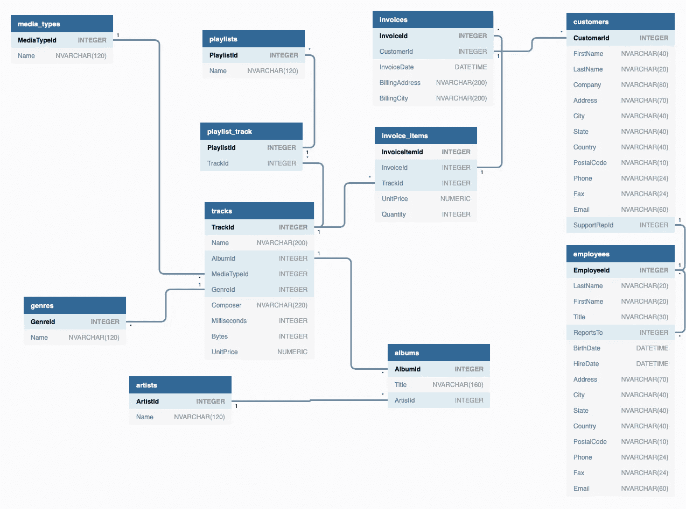

# Python 中 SQL 基础知识的简明介绍

> 原文：<https://betterprogramming.pub/a-gentle-introduction-to-sql-basics-in-python-b137651ed1ff>

## 如何使用结构化查询语言编写简单的查询


照片由[卡斯帕·卡米尔·鲁宾](https://unsplash.com/@casparrubin?utm_source=unsplash&utm_medium=referral&utm_content=creditCopyText)在 [Unsplash](https://unsplash.com/search/photos/sql-database?utm_source=unsplash&utm_medium=referral&utm_content=creditCopyText) 上拍摄

如果你想看代码，你可以在我的 [GitHub](https://github.com/rmacaraeg/SQL_lessons) 上找到。

在 Metis 学习数据科学时，我们需要学习的一项内容是结构化查询语言(SQL)。SQL 对我来说是新的，所以我花了一些时间来掌握它并理解它是如何工作的。

我想写一个包含所有 SQL 基础知识的博客，这样我就可以在继续学习数据科学时参考它。希望这也能帮到你。

在这篇文章中，我们将回顾:

1.  基本查询。
2.  筛选(where 子句)。
3.  多重条件。
4.  排序值。
5.  独特的价值观。
6.  聚合函数。
7.  分组依据。

# 数据

对于这些例子，我将使用 SQLite 教程的 [Chinook 示例数据库](http://www.sqlitetutorial.net/sqlite-sample-database/)。

使用 [Python](https://www.python.org/) 和 SQLite，我们可以创建一个类似于运行普通查询的环境，只使用 SQL。



奇努克数据库的辉煌

查看 Chinook 数据库，每个表顶部的名称以深蓝色背景显示(媒体类型、播放列表、员工等。).

在每个表中，都有 ArtistId、Name、Title、InvoiceDate 等列。为了访问每个表中的信息，我们使用 SQL。

# 基本查询

让我们从简单的东西开始。要从表中获取所有的列和行(让我们使用 tracks 表),我们使用以下代码:

```
SELECT * 
FROM tracks;
```

这将返回 3503 行 9 列数据。

通常情况下，我们不希望看到表中的所有数据都是这样，我们可能会使用它来快速检查几行，以确保没有任何异常情况发生:

```
SELECT * 
FROM tracks 
LIMIT 10;
```

这个查询与上面的查询做的一样，但是这次它将结果限制在前 10 行/结果。

# 筛选(Where 子句)

我们可以使用过滤来更深入地研究我们的查询。

使用相同的曲目表，假设我们想知道列表中的第 222 首歌曲是什么。

为此，我们将利用`WHERE`子句:

```
SELECT name, composer
FROM tracks
WHERE trackid = 222;
```

这将输出福斯托·尼罗—阿曼迪尼奥创作的*维达·博亚*。

更进一步，我们可以在`WHERE`子句中使用许多操作符来查找与我们想要的相匹配的数据行:

```
SELECT * 
FROM tracks
WHERE milliseconds>300000 
  AND bytes<5000000;
```

这将输出两个过滤器都符合的三首歌曲。使用`WHERE`子句，我们可以找到与我们的分析实际需要相匹配的特定数据。

`AND` / `OR`是 SQL 查询中常用的。

# 排序值

如果添加带有列名的`ORDER BY`，它将从该列排序的表中以升序返回信息(默认为升序)。

```
SELECT *
FROM tracks
ORDER BY name;
```

这将返回曲目表中的所有行，按歌曲标题排序(以*“40”*开始，以*→ltimo Pau-De-Arara*结束)。

要更改它并按降序获取信息:

```
SELECT *
FROM tracks
ORDER BY name DESC;
```

这将以相反的顺序输出相同的列表。

# 独特的价值观

有时，我们会使用有大量重复信息的数据库。为了补救这一点，我们利用了`DISTINCT`条款:

```
SELECT DISTINCT(composer)
FROM tracks;
```

该查询删除作曲者列中的重复值，并仅返回作曲者。这将原来的 3503 行数据减少到 853 行。

# 用于聚合的 SQL 函数

在 SQL 中，有五个重要的聚合函数:

*   `COUNT()`
*   `SUM()`
*   `AVG()`
*   `MIN()`
*   `MAX()`

有了这些函数，我们可以开始进一步处理数据，以获得有洞察力的结果。

以下是一些查询示例:

```
SELECT COUNT(*)
FROM tracks
WHERE name LIKE 'a%';
```

这将进入 tracks 表，查找并统计所有以字母 a 开头的歌曲名称。该代码输出以字母 a 开头的 199 首歌曲。

```
SELECT MAX(unitprice)
FROM invoice_items;
```

这将返回 1.99，即 invoice_items 表中任何商品的最高价格。

# 分组依据

`GROUP BY`子句通常与聚合函数结合使用。它根据给定的列值对行进行分组，然后计算每个组的聚合。

```
SELECT composer, SUM(milliseconds)
FROM tracks
GROUP BY composer;
```

这将返回表中每个作曲者的总时间(以毫秒为单位)。

```
SELECT composer, COUNT(trackid)
FROM tracks
GROUP BY composer;
```

该查询计算每个作曲者的曲目 id 数。

# 结论

希望这能帮助您开始使用简单的 SQL 查询。

我将很快发表另一篇文章，介绍 SQL 的更多特性，如`JOIN`和子查询，敬请关注！