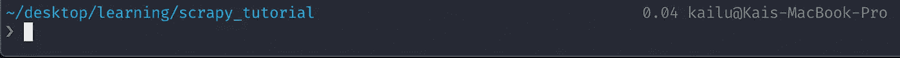
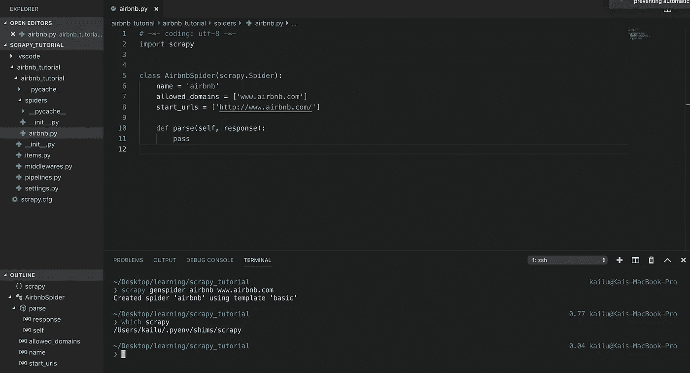
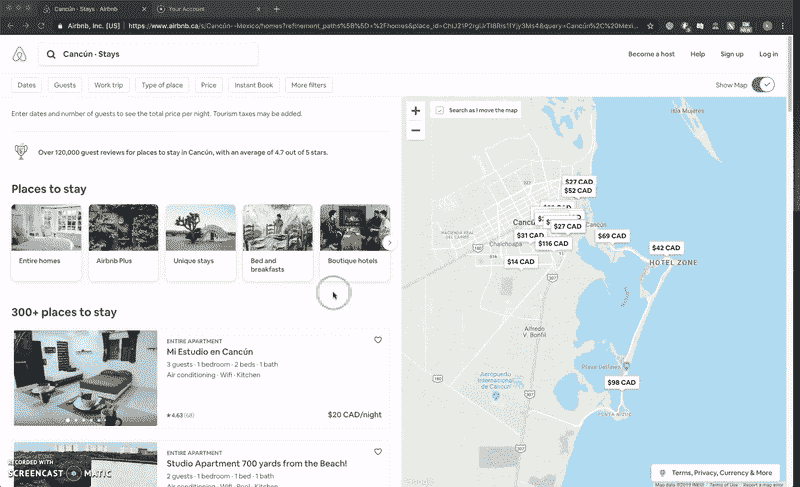
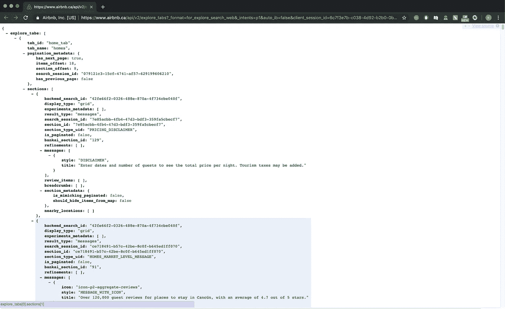
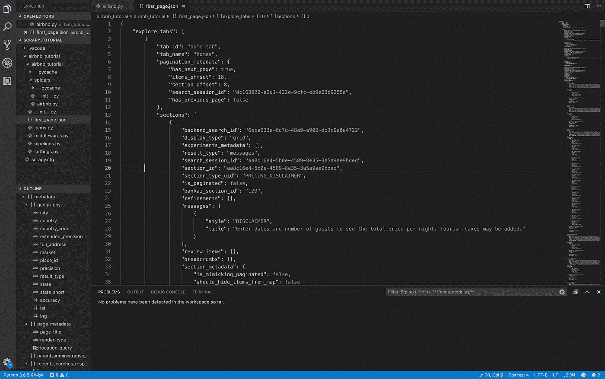
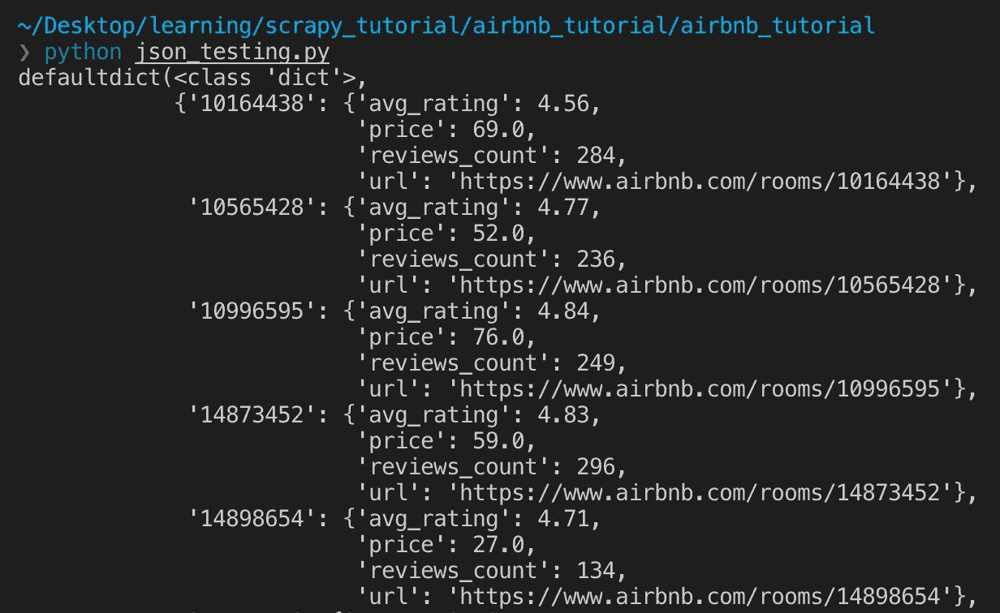
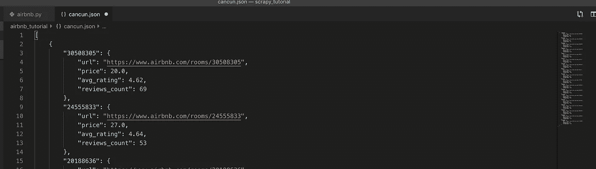

# 使用 Scrapy 抓取 Airbnb 房源的温和介绍

> 原文：<https://betterprogramming.pub/a-gentle-introduction-to-using-scrapy-to-crawl-airbnb-listings-58c6cf9f9808>

## scrapy 中的网页抓取项目入门


isles mujèRES(2019 春季旅行)

在这篇文章中，我将详细介绍如何搜集 Airbnb 房源。

Airbnb 是一个网站，允许用户将他们的地方出租给其他用户短期居住(通常是短期)。如果你想和一大群人一起旅行，这是一个很好的选择。我最近对抓取 Airbnb 感兴趣，因为我想解决我在使用该网站时遇到的一个问题。

这篇文章将作为那些有兴趣在 [scrapy](https://scrapy.org/) 中开始网络抓取项目的人的指南。

首先，scrapy 是一个用于更复杂抓取项目的网络抓取框架。对于较大的抓取项目来说，它比其他 web 抓取库，如`BeautifulSoup` 或`Requests`要好得多。

# 设置开发环境

让我们从头开始！第一步，安装 Python！获得 Python 最简单的方法就是使用`pyenv`。这是一个轻量级的 Python 版本管理工具，可以让您轻松地在多个 Python 版本之间切换。

**Python 用户可以简单地跳过 1.1-1.2 部分，但一定要使用 Python 3.6.x 版本。**

确保你的 Python 版本**不是** 3.7，因为它不能很好地与 scrapy 集成！

## 1.安装 pyenv

如果你还没有安装它，你可以按照这些说明。

如果您在安装过程中遇到一些问题，[这是一个有用的第一个位置来查看](https://github.com/pyenv/pyenv/wiki/Common-build-problems)，因为在安装之前`pyenv`有一些您需要的依赖项。

## 2.安装 Python

现在，我们可以打开终端并运行以下命令:

```
pyenv install 3.6.5
```

接下来，我们可以通过运行以下命令来设置 Python 版本:

```
nano ~/.pyenv/version
```

并输入`3.6.5`。您可以通过运行命令`python -V`来验证您使用的是正确的版本。现在应该是`Python 3.6.5`了。

## 3.安装刮刀

我们可以简单地运行以下命令来安装 scrapy:

```
pip install scrapy
```

# 创建我们的 Airbnb 蜘蛛

现在我们的环境已经设置好了，我们终于可以开始一个 scrapy 项目了！在此之前，我建议为项目创建一个文件夹。我为这个项目创建了一个`scrapy_tutorial`文件夹。



## 开始一个零碎的项目

在终端中导航到您的文件夹(如`cd desktop/learning/scrapy_tutorial`)后，您可以通过运行以下命令创建一个新项目:

```
scrapy startproject airbnb_tutorial
```

这将创建一个名为`airbnb_tutorial`的项目模板。我将继续在 [VSCode](https://code.visualstudio.com/download) 中打开这个项目。尽管你可以随意使用任何你觉得舒服的文本编辑器或 IDE！

我们可以通过运行以下命令来创建一个通用爬行器，用于抓取 Airbnb 列表:

```
scrapy genspider airbnb www.airbnb.com
```



零碎设置

这应该会生成一个类似上面文件的蜘蛛。现在我们准备开始刮！

# 我们开始刮吧！

通常当我着手刮削项目时，我首先会考虑这个问题:

我能刮到的最低级的物体是什么？

在这里，它可以是一个单一的家上市，单页上市，或任何东西！经过一些调查和大量的反复试验，我找到了 XML HTTP 请求的位置，该请求为一个 Airbnb 页面返回一个`JSON`对象。请注意，从 Airbnb 获取`GET`信息还有其他方法，但我发现以下方法最方便！

## 1.获取我们的请求 URL

假设我们正在墨西哥的坎昆找房子。我们的登录页面看起来会像这样:


然后，我们可以按照以下步骤获取请求 URL:

1.  在页面上单击鼠标右键，然后单击进行检查
2.  转到网络选项卡
3.  重新加载页面
4.  寻找一个以`explore_tabs?_format`开头的条目，点击进入
5.  复制顶部的请求 URL



简短演示

既然您已经获取了请求 URL，它应该看起来像下面这样:

```
[https://www.airbnb.ca/api/v2/explore_tabs?_format=for_explore_search_web&_intents=p1&auto_ib=false&client_session_id=6c7f3e7b-c038-4d92-b2b0-0bc7c25f1054&currency=CAD&experiences_per_grid=20&fetch_filters=true&guidebooks_per_grid=20&has_zero_guest_treatment=true&is_guided_search=true&is_new_cards_experiment=true&is_standard_search=true&items_per_grid=18&key=d306zoyjsyarp7ifhu67rjxn52tv0t20&locale=en-CA&luxury_pre_launch=false&metadata_only=false&place_id=ChIJ21P2rgUrTI8Ris1fYjy3Ms4&query=Canc%C3%BAn%2C%20Mexico&query_understanding_enabled=true&refinement_paths%5B%5D=%2Fhomes&s_tag=b7cT9Z3U&satori_version=1.1.9&screen_height=948&screen_size=medium&screen_width=1105&search_type=section_navigation&selected_tab_id=home_tab&show_groupings=true&supports_for_you_v3=true&timezone_offset=-240&version=1.5.7](https://www.airbnb.ca/api/v2/explore_tabs?_format=for_explore_search_web&_intents=p1&auto_ib=false&client_session_id=6c7f3e7b-c038-4d92-b2b0-0bc7c25f1054&currency=CAD&experiences_per_grid=20&fetch_filters=true&guidebooks_per_grid=20&has_zero_guest_treatment=true&is_guided_search=true&is_new_cards_experiment=true&is_standard_search=true&items_per_grid=18&key=d306zoyjsyarp7ifhu67rjxn52tv0t20&locale=en-CA&luxury_pre_launch=false&metadata_only=false&place_id=ChIJ21P2rgUrTI8Ris1fYjy3Ms4&query=Canc%C3%BAn%2C%20Mexico&query_understanding_enabled=true&refinement_paths%5B%5D=%2Fhomes&s_tag=b7cT9Z3U&satori_version=1.1.9&screen_height=948&screen_size=medium&screen_width=1105&search_type=section_navigation&selected_tab_id=home_tab&show_groupings=true&supports_for_you_v3=true&timezone_offset=-240&version=1.5.7)
```

如果你安装了 [JSONView](https://chrome.google.com/webstore/detail/jsonview/chklaanhfefbnpoihckbnefhakgolnmc?hl=en) ，你可以以更漂亮的形式渲染`JSON`对象。这不是必须的，但是有帮助！如果您滚动浏览，您可以看到这是一个包含我们清单第一页上所有清单的`JSON`对象。



## 2.抓取第一页

现在我们已经有了包含清单第一页的`JSON`对象的请求 URL，我们只需发送一个`scrapy`请求到我们的计算机上的`GET`。然后我们可以使用`JSON`文件来提取我们想要的字段。

在您的蜘蛛文件(我的是`airbnb.py`)中，配置文件如下所示:

为了解释这里发生了什么，我定义了两个函数。`start_requests`和`parse`。`start_requests`将首字母`scrapy request`发送到我们的 URL 并调用`parse`，后者将`response`的正文写入名为`first_page.json`的`JSON`文件。

要运行蜘蛛，使用`cd`导航到您的项目，并通过输入以下命令运行蜘蛛:

```
scrapy crawl {name_of_your_spider}
```

您的蜘蛛的名称可以在您的蜘蛛文件的`name`变量中找到。例如，我会将`airbnb`作为`{name_of_your_spider}`传入。

运行时，应该需要几秒钟时间返回一个`JSON`文件。打开该文件，您可以按下`CMD-A`然后按下`ALT-SHIFT-F`来将`JSON`格式化为更易读的格式。我们走吧！我们已经成功地从 Airbnb 抓取了第一页房源！



## 3.使用 JSON 对象

既然我们已经抓取了包含整页清单的`JSON`对象，我们需要提取每个家庭的必要信息。为此，我建议创建另一个 Python 文件来测试从`JSON`文件中抓取字段。网上有很多指导你如何使用 Python 中的`JSON`的指南。如果你不熟悉的话，一定要去看看！

假设我们想获得每个家庭的`url`、`price`、`number of reviews`和`average rating`。我是这样做的:

这将在运行时返回以下内容:



## 4.把所有的放在一起

既然我们已经有了获取我们感兴趣的特定字段的样板代码，我们就可以把这些都放在您的 spider 文件中。像这样:

为了帮助更好地解释`parse`，我们首先将`response.body`的输出(这是我们的`first_page.json`文件的内容)分配给`data`，用来自`json_testing.py`的样板代码提取我们想要的`JSON`中的字段，最后产生输出`data_dict`。

要运行蜘蛛并获得输出`JSON`文件，只需在终端中运行:

```
scrapy crawl -o cancun.json
```

这将生成一个`cancun.json`输出文件，包含从第一页抓取的所有清单。现在，打开生成的文件，然后使用`CMD-A`和`ALT-SHIFT-F`再次格式化它。您应该会看到如下输出:



恭喜你。你刚刚从 Airbnb 搜集了一些房源数据。从这里有很多路可以走:您可以考虑从`first_page.json`文件中提取`has_next_page`字段，作为解决如何抓取多个页面的起点。或者，如果您觉得受限于`JSON`文件中的字段，可以考虑直接向特定的列表 URL 发送`scrapy`请求:[https://www.airbnb.com/rooms/](https://www.airbnb.com/rooms/){ room _ id }

然而，这需要一个名为`Splash`的插件，因为我们现在直接从 Airbnb 请求信息。由于 Airbnb 使用 JavaScript 来呈现内容，仅仅依靠 scrapy 已经不够了。如果有兴趣，我很乐意解释如何设置和运行`Splash`！

本教程中的所有代码将在这里[变为](https://github.com/kailu3/scrapy_tutorial)。随意克隆它，并添加更多的字段和功能！

我还做了一个更复杂的`[scrapy](https://github.com/kailu3/airbnb_scraper)`[项目](https://github.com/kailu3/airbnb_scraper)，它可以接受`price_lower_bound`、`price_upper_bound`和`city`等参数，从 Airbnb 抓取多页房源。你需要为此设置`Splash`，我已经在`README.md`中包含了说明。

就是这样！感谢阅读。