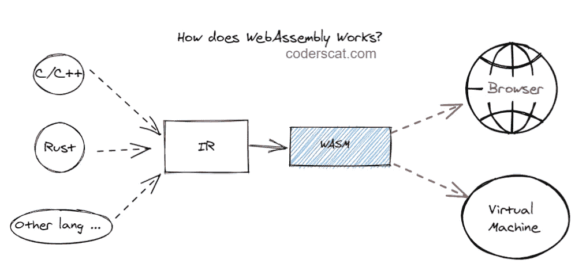
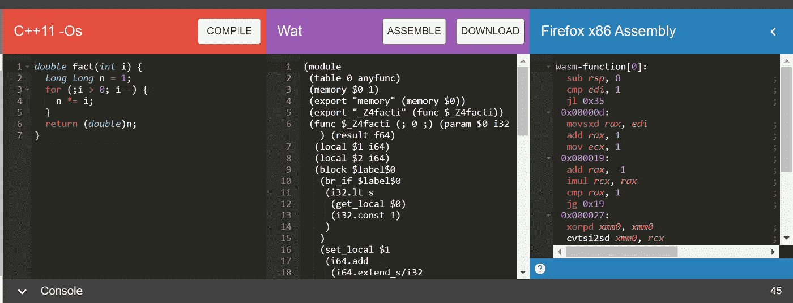
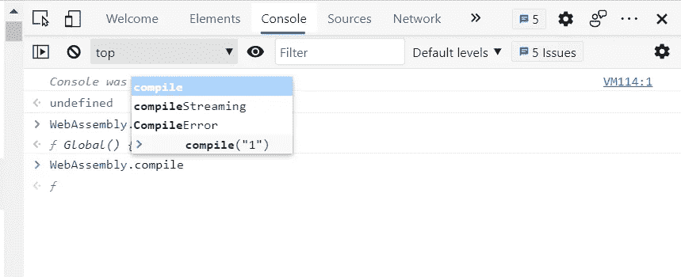

# WebAssembly 简介

> 原文：<https://betterprogramming.pub/a-gentle-introduction-to-webassembly-529b7bdc24e6>

## 了解它的历史和未来

保罗·埃施-洛朗在 [Unsplash](https://unsplash.com/) 上拍摄的照片。

我最近用 Rust 写了一个玩具项目，然后编译成 [WebAssembly](https://webassembly.org/) 。令我惊讶的是，它并没有那么复杂，一切都很完美。

我的计算密集型应用程序现在以预期的性能运行在 web 客户端上。这个奇妙的经历诱使我去了解更多关于 WebAssembly 的知识。我将在本文中分享我对 WebAssembly 的理解。

# WebAssembly 之前

每一项新技术的引入都是为了解决一些现存的问题。发明 WebAssembly 是为了解决 web 的问题。

如今，前端应用程序变得更加复杂。除了逻辑复杂，代码量大，还有一个原因是语言本身的缺陷。

广泛使用的解释型编程语言 JavaScript 的作者布伦丹·艾希(Brendan Eich)创造了它，使它的发展史变成了某种程度上的补洞史。

JavaScript 主要有两种问题。

## 表演

类似于其他解释编程语言，JavaScript 很慢。至少在 2008 年之前，是非常缓慢的。随着越来越多的 web 应用程序采用 JavaScript，web 浏览器之间开始了一场性能大战。JIT(实时编译器)的引入是为了解决 JavaScript 的性能问题。[谷歌的 V8](https://v8.dev/) 和微软的 [ChakraCore](https://github.com/chakra-core/ChakraCore) 都自带 JIT(甚至是多阶段 JIT)。

来源:[https://twitter.com/linclark](https://twitter.com/linclark)

由于其作为动态语言的设计，有几类优化可用于其他编程语言，但即使是最快和最现代的 JavaScript 运行时也无法使用，并且仍将如此。例如，超前(AOT)优化编译策略。

## 鲁棒性和可维护性

有了 JavaScript 这样的动态编程语言，我们可以快速构建东西。但是当项目越来越大的时候，事情就变得一团糟了。

静态类型使处理复杂系统变得更加容易。它有助于您在编译时更快地发现类型不匹配，并且使优化变得更容易。

例如，在动态类型编程语言中，如果你不小心输入，你可能会做出奇怪的事情，比如试图将数字`1`和字符串`“2”`相加，结果得到字符串`“12”`。但是这种类型错误应该在开发阶段就被发现。简单地说，动态类型具有“先编写，后调试”的风格，而静态类型涉及“先思考，后编写”的风格。

要向 JavaScript 添加静态类型，有几种方法:

*   [TypeScript](https://www.typescriptlang.org/) :基于 JavaScript，添加静态类型定义。
*   [原因](https://reasonml.github.io/)和 [PureScript](https://www.purescript.org/) :翻译器将其他静态类型语言(如 OCaml/Haskell)编译成 JavaScript。
*   asm.js (已弃用):定义一个严格的 JavaScript 子集，可以用作编译器的低级、高效的目标语言——特别是允许编译器进行提前(AOT)优化编译。我们可以使用一个源代码到源代码的编译器比如 [Emscripten](https://en.wikipedia.org/wiki/Emscripten) 把静态类型语言(比如 C)编译成 asm.js。

# WebAssembly 简介

虽然 asm.js 在最初的 JavaScript 上有性能改进，但它本质上仍然是 JavaScript。在某些情况下，生成的文件会变得太大，并给需要频繁传输的代码带来瓶颈。

由于 asm.js 代码主要作为编译目标，我们不会手动编辑，所以有必要发明一种二进制格式。这基本上就是 WebAssembly 的起源:

> “WebAssembly(缩写为 Wasm)是基于堆栈的虚拟机的二进制指令格式。Wasm 旨在作为编程语言的可移植编译目标，支持客户端和服务器应用程序在 web 上的部署。”— [WebAssembly 的网站](https://webassembly.org/)

WebAssembly 于 2015 年首次发布，第一次演示是运行 Unity 的[“愤怒的机器人”。](https://beta.unity3d.com/jonas/AngryBots/)在 [WebAssembly Games](https://www.webassemblygames.com/) 可以玩更多部署在 WebAssembly 上的游戏。另一个经典 demo 是 Mozilla 的[禅园(史诗)](https://www.youtube.com/watch?v=TwuIRcpeUWE):

2019 年 12 月 5 日，WebAssembly 成为继 HTML、CSS、JavaScript 之后的官方[“web 第四语言”](https://www.w3.org/2019/12/pressrelease-wasm-rec.html.en)。

WebAssembly 是一种不同于 JavaScript 的语言，但它不是用来替代 JavaScript 的。相反，它旨在补充 JavaScript 并与之协同工作，允许 web 开发人员利用两种语言的优点。

通过面向 WebAssembly，我们可以重用嵌入在更大的 JavaScript/HTML 应用程序中的现有代码。这可以是从简单的助手库到面向计算的任务卸载。

作者

# 试一试

在 WebAssembly 中，有两种常用的文件格式:

*   。wat——一种基于 S 表达式的文本格式和中间形式，设计用于文本编辑器、浏览器开发工具等。
*   。wasm—web assembly 的虚拟机可以读取和运行的二进制格式。

这两种格式可以相互转换。

如果只是试用 WebAssembly，可以使用 [WasmExplorer](https://mbebenita.github.io/WasmExplorer/) 输入一些 C/C++代码。你可以把 C/C++/Rust 或者其他源代码转换成。wat 格式，然后组装。wat 格式到. wasm。

编译后的 WAT 和 x86 汇编格式内容显示在 windows:

来自 wasmexplorer

目前，大多数 web 浏览器已经支持 WebAssembly。您可以尝试打开浏览器的控制台，输入如下内容:

作者

最好的初学者教程是[官方指南](https://webassembly.org/getting-started/developers-guide/)。你可以选择你最熟悉的编程语言，编译成 WASM 格式。

[wasmtime](https://wasmer.io/) 是一个独立的 WebAssembly 运行时，而 [wasmer](https://github.com/wasmerio/wasmer) 不仅是一个运行时，还支持使用超轻量容器。

# 浏览器外的 web 程序集

因为二进制格式的 WASM 可以由 WASM 虚拟机加载和执行，我们实际上可以将 WebAssembly 的使用扩展到浏览器之外。

在任何地方经营 WASM 都会带来巨大的好处。我们可以重用代码，让遗留代码在不同的平台上运行。我们根本负担不起为多个平台不断重写软件的时间和金钱。

当 Java 问世时，“一次编写，随处运行”是一个说明跨平台好处的口号。有了 WebAssembly，有希望的未来是“用任何编程语言编写一次，在任何地方运行。”

WASI 项目是实现这一目标的一个有希望的标准。

如果我们能够让不同的编程语言无缝地互操作，这将是一个新的强大武器。

# WebAssembly 的未来

仍有许多功能处于开发或建议阶段。

尽管 WebAssembly 现在还没有完成，但我相信它将会影响客户端 web 开发、桌面应用程序、服务器端功能、传统现代化、游戏、无服务器等领域。

# 参考

*   [网页组装主页](https://webassembly.org/)
*   [web assembly 文章的卡通介绍](https://hacks.mozilla.org/category/code-cartoons/a-cartoon-intro-to-webassembly/)
*   [与一起将 WebAssembly 带到 web 之外作者林克拉克](https://www.youtube.com/watch?v=fh9WXPu0hw8)
*   [WASI:在 web 之外运行 WebAssembly 的系统接口](https://hacks.mozilla.org/2019/03/standardizing-wasi-a-webassembly-system-interface/)

*原载于*[*https://coderscat.com*](https://coderscat.com/intro-webassembly/)