# 一瞥夸尔库斯对金·戈尼克

> 原文：<https://betterprogramming.pub/a-glimpse-at-quarkus-vs-gin-gonic-39be595e8c29>

## 带有微服务框架的 quick REST API

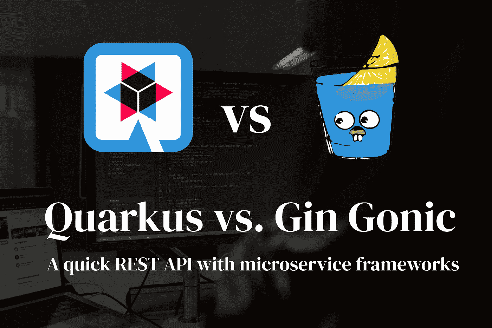

来自 [Unsplash](https://unsplash.com/photos/QckxruozjRg) 的背景图片。由作者使用网上免费图片编辑。

很长一段时间以来，我一直希望检验一些最新和最著名的 web 框架。在这篇文章中，我想看看 [DevEx](https://medium.com/codex/its-time-for-great-devex-because-happy-developers-write-better-code-701834efcd36) 的以下技术。

**我想看看的网络框架:**

1.  [用](https://golang.org/)[轧花机角度](https://github.com/gin-gonic/gin)进行
2.  [Java](https://www.java.com/de/) 与 [Quarkus](https://quarkus.io/)

## 要求

为了让这一瞥成为可能，我们需要一个小应用程序，它可以很容易地构建，但包含现代 web 应用程序的功能。这就是为什么我选择了——谁能想到呢——一款天气应用。
用户可以接收他搜索的城市的天气信息。
它的数据将来自使用 REST 的免费第三方 API。
城市搜索也是如此 API 将为此提供支持。
我不会对接收到的数据做任何事情，只是简单地将 JSON 响应隧道化。

**基础架构**

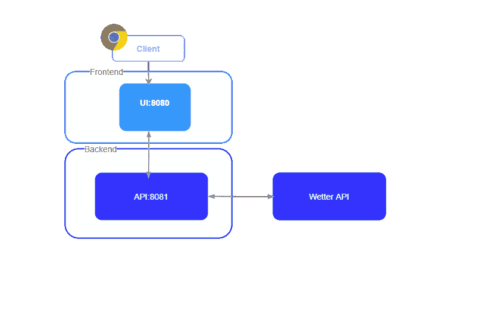

让我们坚持一个简单的架构。我们有一个后端服务。这将与 [openweathermap](https://openweathermap.org/) 的 API 进行通信。然后，服务将使用简单的 REST API 向客户端提供数据。我们假设的前端可以简单地调用 GET /weather/:name。

# 和金·高尼克一起去

我将使用版本[1 . 16 . 6。](https://golang.org/dl/go1.16.6.src.tar.gz)在文档中你可以找到一个很有价值的 l [ink](https://golang.org/doc/tutorial/web-service-gin) ，里面有一个很棒的关于用 Gin 开发 restful API 的教程。这正是我们所需要的！

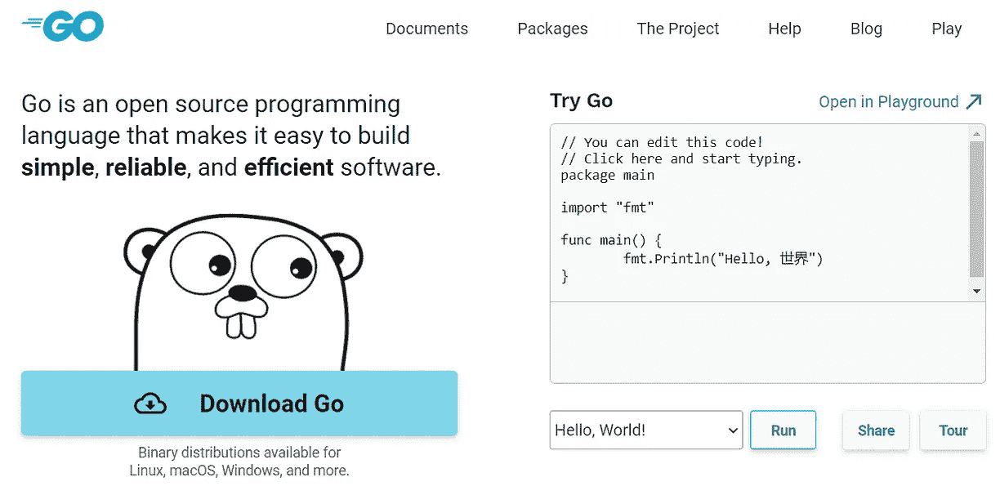

网站包含运行程序和 Windows 安装程序

安装后—不要忘记用 GOPATH 设置环境变量。

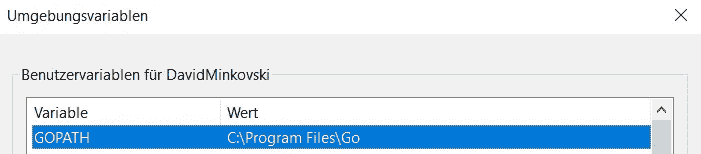

环境变量

```
$ mkdir wetterapp-gin
$ go mod init davidminkovski.com/wetterapp-gin
```

让我们为天气应用程序创建文件夹并初始化。
我按照教程创建了一个测试 API。
对于 IDE，我使用了 [Visual Studio 代码](https://minkovski-d.medium.com/meine-top-vscode-extensions-2021-61ebbae690d4)。

```
package mainimport (
 "github.com/gin-gonic/gin"
 "net/http"
)type **city** struct {
 ID   string `json:"id"`
 Name string `json:"name"`
}var **cities** = []city{
 {ID: "1", Name: "Frankfurt am Main"},
 {ID: "2", Name: "Köln"},
}func **main**() {
 router := gin.Default()
 router.GET("/cities", getCities)
 router.Run("localhost:8080")
}func **getCities**(c *gin.Context) {
 c.IndentedJSON(http.StatusOK, cities)
}
```

现在还有两个命令需要执行。第一个加载依赖项，第二个启动服务器。

```
$ go get .
$ go start .
```

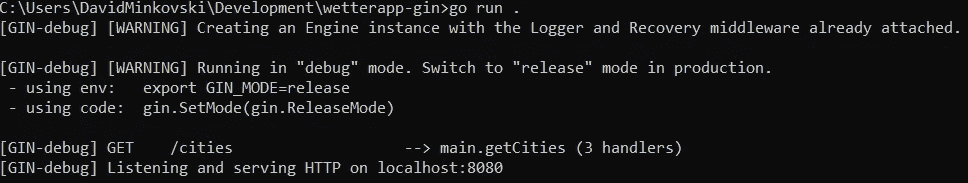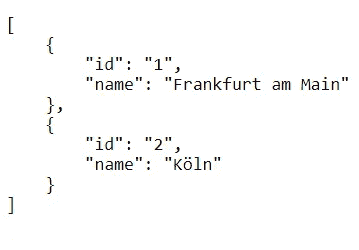

好吧，那真是太快了。 **30 分钟后**我和我的休息 API。
现在我想查询天气 API。[那边](https://medium.com/r?url=https%3A%2F%2Fpkg.go.dev%2Fnet%2Fhttp)你去吧。

```
package mainimport (
 "github.com/gin-gonic/gin"
 "io/ioutil"
 "log"
 "net/http"
)func **main**() {
 router := gin.Default()
 router.GET("/weather/:name", getWeatherForCity)
 router.Run("localhost:8080")
}func **getWeatherForCity**(c *gin.Context) {
 name := c.Param("name")
 key := "MY_API_KEY"res, err := http.Get("[http://api.openweathermap.org/data/2.5/weather?q=](http://api.openweathermap.org/data/2.5/weather?q=)" + name + "&appid=" + key)
 if err != nil {
  log.Fatal(err)
 }
 responseData, err := ioutil.ReadAll(res.Body)
 if err != nil {
  log.Fatal(err)
 }
 c.Data(http.StatusOK, "application/json", responseData)}
```

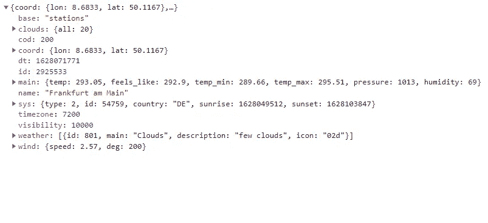

API 调用的 JSON 响应

**就是这样！我有一个简单的 Web API 服务器，可以用来查询城市名称的天气数据。我必须说，作为一个 JS 或 Java 背景的人，理解和习惯新的语法和语言特性需要一些时间，但是这种速度真令人惊叹！**

## 评级

1.  *易用性* : 1/3
2.  速度:3/3
3.  *文档* : 2/3

# Java 和 Quarkus

我将使用 [Quarkus](https://quarkus.io/get-started/) 版本 **2.1.0。**

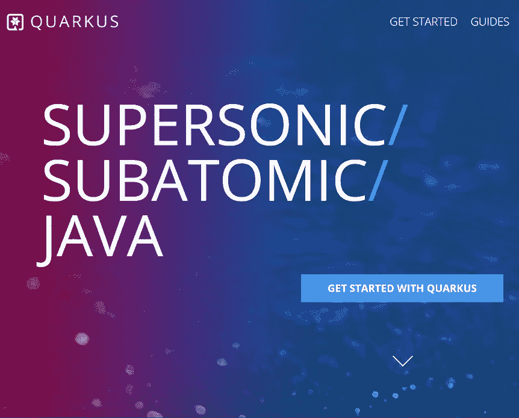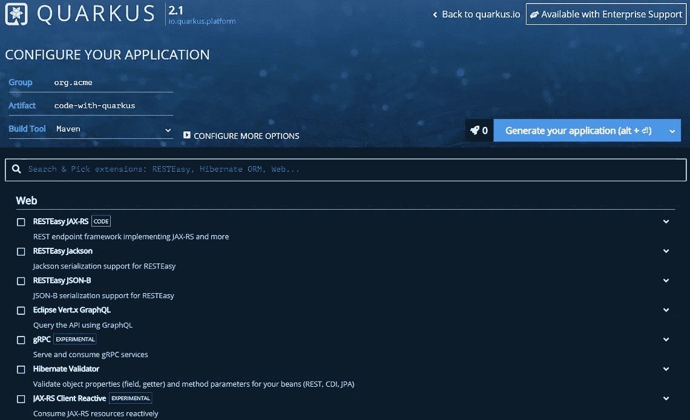

登录页面和配置器

首先，Quarkus 运行在 GraalVM 上，你需要 Java 的 JDK。然后我们将需要包管理器 maven 或 gradle。这大约需要 15 分钟——同样，不要忘记设置正确的环境变量。

Quarkus 凭借其*配置器*大放异彩。与 SpringBoot 等其他 Java 框架类似，您可以选择正确的包并简单地生成所需的应用程序。不幸的是，要知道哪一个是哪一个以及用于什么并不是一件非常直观的事情。我凭直觉做出了如下选择:

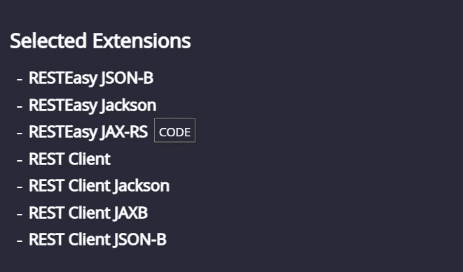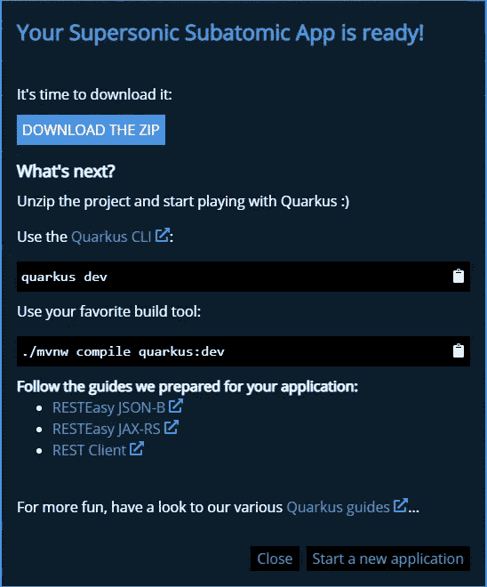

快速下载后，我有我的项目。
它带有一个基本的设置，自述文件和 docker 配置。

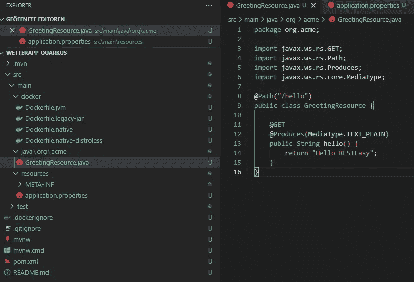

文档为 REST API 提供了很好的文章。此外，您将在这里找到足够的信息来使用其他 API。

首先，让我们为天气数据创建一个模型。

```
// WeatherResponse.java@JsonIgnoreProperties(ignoreUnknown = true)
public class **WeatherResponse** {

   public String name;
   public Weather alpha2Code;
   public Main main;
   public Wind wind;
   public Coord coord;

   public static class Weather {
      public String main;
      public String description;
      public String icon;
   }
   public static class Wind {
      public float speed;
   }
   public static class Main{
      public float temp;
      public float feels_like;
      public float temp_min;
      public float temp_max;
      public int pressure;
      public int humidity;
   }
   public static class Coord{
      public float lon;
      public float lat;
   }
}
```

现在我们需要一个能与第三方 API 通信的服务。
中的*应用*。我们设置 URL 并移除 SSL。

```
// WeatherService.java@Path("/data/2.5/")
@RegisterRestClient(configKey="weather-api")
public interface **WeatherService** {

   @GET
   @Path("/weather")
   Set<WeatherResponse> getByCity(@QueryParam("q") String name, @QueryParam("appid") String appId);
}// application.properties**weather-api/mp-rest/url**=http://api.openweathermap.org/ # 
weather-api/mp-rest/scope=javax.inject.Singleton #
quarkus.tls.trust-all=true
```

让我们继续创建一个资源来监听任何传入的请求。

```
// WeatherResource.java@Path("/weather")
public class **WeatherResource** {

    @Inject
    @RestClient
    WeatherService weatherService;

    String appId = "MY_API_KEY";

    @GET
    @Path("/{name}")
    @Produces("application/json")
    public Set<WeatherResponse> **name**(@PathParam("name") String name) {
        return weatherService.getByCity(name, appId);
    }
}
```

我们完成了！对于 Java 背景的人来说，这里的易用性显然是一个因素，但是与其他框架和语言相比，要做的工作量是很大的。

## 评级

1.  *易用性* : 2/3
2.  速度:1/3
3.  *文件* : 2/3

# 摘要

我希望这篇文章能让你对 Gin Gonic 和 Quarkus 有所了解。
这两个框架都很棒，前途无量。

尤其是 Golang 和 Java 框架，我确信它们会随着编程语言的发展而不断发展。

纵观当前的微服务趋势，这些框架可能是您开始下一个微服务项目的良好基础！