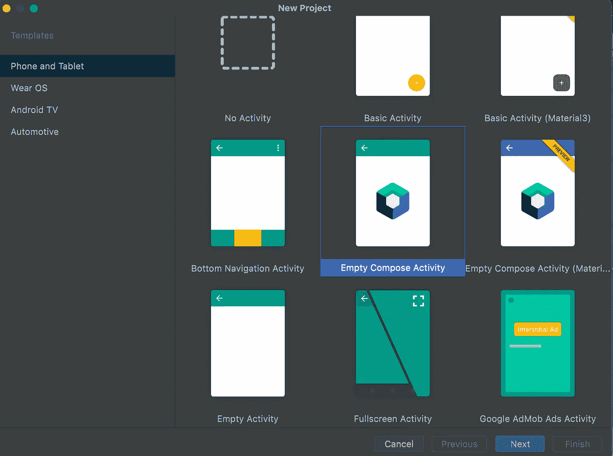
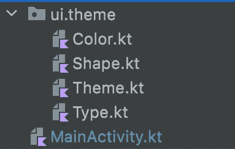
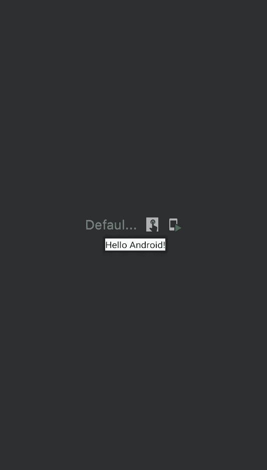
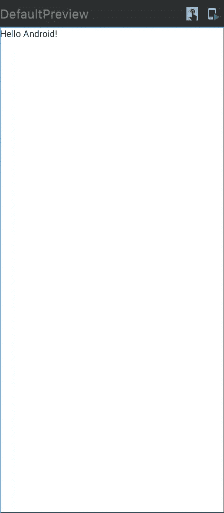
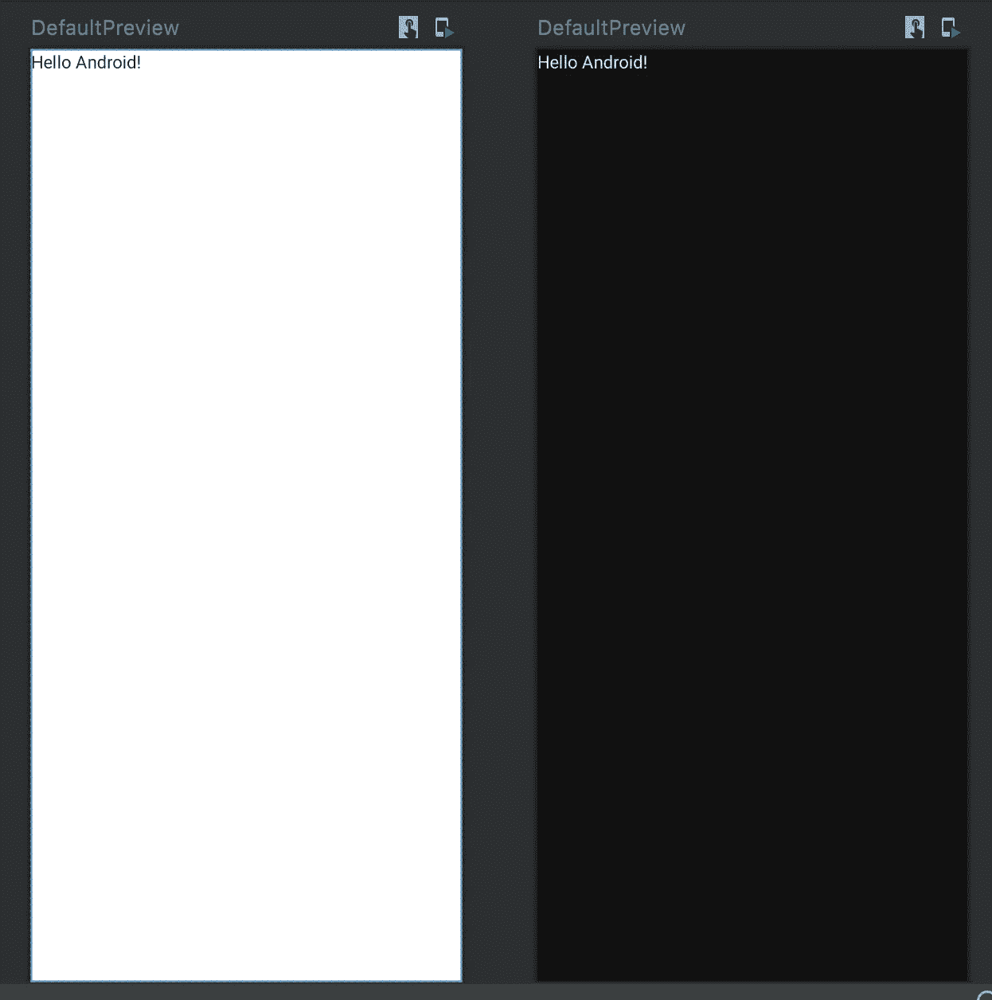
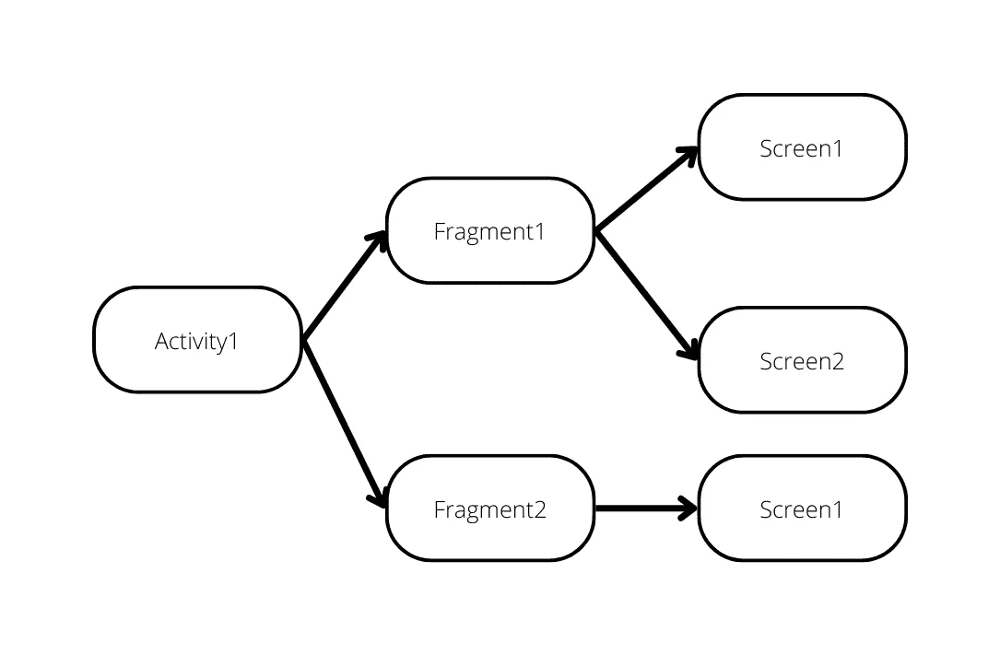

# 通过构建应用程序来了解 Jetpack Compose

> 原文：<https://betterprogramming.pub/a-glimse-into-jetpack-compose-by-building-an-app-a7869723d4e8>

## 通过本教程学习 Jetpack Compose 的概念

照片由 [Pathum Danthanarayana](https://unsplash.com/@pathum_danthanarayana?utm_source=medium&utm_medium=referral) 在 [Unsplash](https://unsplash.com?utm_source=medium&utm_medium=referral) 拍摄

听说过 Jetpack Compose 吗？Jetpack Compose 已经存在了一段时间，今天大多数 Android 开发者都很喜欢它。请放心，如果你不知道或从未听说过它，这篇文章将解释我们需要知道的。

在 Jetpack Compose 出现之前，我们必须使用 XML 在 Android 中构建原生 UI，这就是为什么我们必须在 Kotlin/Java 文件和 XML 之间来回切换，当我们的应用程序增长时，这将非常麻烦。使用 Jetpack Compose，我们代码变得比以前少得多，而且我们不必重新构建 XML。相反，我们将 UI 放在 Kotlin/Java 文件中，因为 Jetpack Compose 使用声明性 API 来减少样板代码，使我们的生活更加轻松。此外，Jetpack Compose 很直观，因为它让您告诉他们您想向用户显示什么。

> 谷歌去年发布了 Jetpack Compose，可以肯定地说 Android 社区喜欢它

总之，Jetpack Compose 可以被视为构建原生 UI 的现代工具包，类似于 Flutter 的 widget composition 或 iOS 的 SwiftUI。

# **我们开始吧**

邓肯·迈耶在 [Unsplash](https://unsplash.com?utm_source=medium&utm_medium=referral) 上拍摄的照片

让我们创建一个简单的项目，以便更好地了解 Jetpack Compose。打开你的 Android 工作室。当您点击*创建项目*时，您应该会看到类似这样的内容。

有两种选择:使用基本实现 Jetpack Compose，或者添加`Material3` *主题*。我们想从基础开始学习，所以我们选择 *Empty Compose 活动*。

> 如果您想从现有项目中实现 Jetpack Compose，请参考此处的链接。

现在，我将使用*空合成活动*创建一个项目，并将其命名为`JetpackCompose`

现在让我们深入研究一下内容。

项目窗格 Android Studio

在 Android Studio 中，如果您查看项目窗格，我们有几个文件，它们是:

*   `Color`:您可以在这里为您的应用程序或其组件添加或编辑颜色
*   `Shape`:您可以在这里添加或编辑形状，用于塑造组件的原生 UI
*   `Theme`:您可以在这里添加或编辑您的应用程序中的亮暗模式主题
*   `Type`:您可以在这里添加或编辑文字的字体，如字体粗细、`fontsize`或`fontfamily`
*   `MainActivity`是在生命周期中控制应用程序的主要类活动。我们会经常用到它。

现在，我将忽略那里的`Color`、`Shape`、`Theme`或`Type`。我们不太需要它，因为这是一个简单的应用程序，我将使用它来实现 Jetpack Compose，但是为了代码简洁，您可以使用它。

现在我们来开`MainActivity.kt` *。对于初学者，您的代码应该是这样的:*

让我解释一下。

在类 MainActivity 中，您决定活动的生命周期。目前，它有从 ComponentActivity 类调用函数`onCreate`的函数`onCreate`，创建包含`JetpackComposeTheme`的内容。

`JetpackComposeTheme`实际上是一个函数，定义了它的`Theme.kt` *。*基本上，它让你有一个基于你在`Theme.kt` *中编码的主题。*`JetpackComposeTheme`的内容是表面，表面是由材料构成的组件，表面的内容被设计为材料表面。现在，我们将以此为基础`Screen`进行以下材料设计。

此外，您有带注释的函数`Composable`的函数`Greeting`，这意味着这个函数是 composable 的一部分，可以被其他 composable 调用。你必须声明这个函数是可组合的，以便让`Text`进入你的函数，因为`Text`是在 Jetpack Compose 中定义的可组合函数的一部分。

由于`Surface`也是可组合函数的一部分，您可以在`Surface`中添加其他可组合函数。

此外，在 Android Studio 中，您可以实时查看您的可组合功能。你只需要为预览制作一个函数，并在该函数中添加注释`Preview`和`Composable`。

现在你有了。又好又方便。

每个可组合的函数都有一个名为`modifier`的参数，所以如果我们想查看设备尺寸，你必须在*文本*中添加`Modifier.fillMaxSize()`到修饰符。

结果会在下面。

你甚至可以在黑暗模式下查看，只需在`DefaultPreview`中添加`uiMode = UI_MODE_NIGHT_YES`。

`DefaultPreview`函数应该是这样的。

再看看预告。

恭喜你，你刚刚学会 Jetpack Compose。

有关 Jetpack Compose 的更多信息，您可以参考这里的。

# 下一步是什么？

既然我们已经了解了 Jetpack Compose 中 composable 的基础知识，那么让我们尝试使用它来编写一个 android 应用程序。

我们将创建一个简单的应用程序，其架构如下:

图像中的节点可以解释为:

*   `Activity`:这个类控制应用程序中活动的生命周期。这个类将转到哪个片段，这取决于用户的屏幕导航。
*   这个类控制许多屏幕，并根据 API 状态决定应该显示哪个屏幕。如如果 API 返回加载状态，显示`Screen1`，如果 API 返回成功状态，显示`Screen2`。
*   这个类包含显示给用户的可组合函数。例如在`Fragment1`的`Screen1`中，它们显示`Text`、`Image`，或者两者都显示。

基于此，首先，我将在我的代码中创建这个架构。请随意跟随我的向导。

打开`MainActivity.kt`，将现有代码改为:

现在我的`MainActivity.kt`使用`HomeFragment`，所以我创建`HomeFragment.kt`。

我用预览以防万一。除了 activity，我把它应用到了每个 UI 类中。

我的`HomeFragment.kt`使用`HomeScreen`，所以我创建`HomeScreen.kt`。

好了，现在我们把这个架构应用到我的应用程序的 UI 屏幕上

> 请随意复制这个。如果你有其他的方法来构建这个。随时让我知道。

# 结论

Jetpack Compose 允许我们通过代码来编程我们的 UI。到目前为止，您已经了解了 Jetpack Compose 的概念以及如何在您的应用程序中实现它。

你可以在我的 GitHub 链接中查看我的代码的完整版本。

 [## GitHub-sky aironline/Jetpack-撰写

### 此时您不能执行该操作。您已使用另一个标签页或窗口登录。您已在另一个选项卡中注销，或者…

github.com](https://github.com/SkyairOnline/Jetpack-Compose) 

在下一篇文章中，我将向您展示如何构建包含`Column`和`Row`的基本布局 Jetpack Compose。

你可以在这里看到我的下一篇文章。

 [## Jetpack 撰写中的布局

### 了解如何使用 Jetpack Compose 在 Android 中创建布局屏幕

better 编程. pub](/layouting-in-jetpack-compose-8c16e687bfe5)