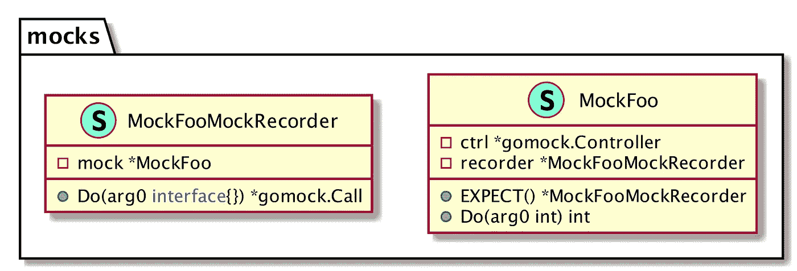

# GoMock 快速入门指南

> 原文：<https://betterprogramming.pub/a-gomock-quick-start-guide-71bee4b3a6f1>

## 用 GoMock 进行单元测试的固执己见的教程


西蒙·马辛格在 [Unsplash](https://unsplash.com/t/nature?utm_source=unsplash&utm_medium=referral&utm_content=creditCopyText) 上的照片

# 为什么我们需要嘲笑

对有依赖关系的代码进行单元测试总是一件痛苦的事情。如果依赖的是外部资源，如数据库、网络和文件，情况会变得更糟。

一个直观的解决方案是创建一个提供所有这些外部资源的隔离环境，然后在其中运行测试用例。但是它们不再是单元测试了。它们是整合测试。

不要误解我。集成测试有其价值，我们肯定需要它们。但是它们不适合运行每一个代码变更，原因有三:

*   它们比单元测试慢得多。
*   他们可能会因为许多不可预知的原因而失败。
*   集成测试失败可能不会直接解释失败和您所做的代码更改之间的关系。

在 mocking 框架的帮助下，我们可以对我们写下的几乎所有逻辑进行单元测试，而没有外部资源的麻烦。

# 介绍 GoMock

[evidence](https://github.com/stretchr/testify)和 [GoMock](https://github.com/golang/mock) 是两个流行的嘲讽围棋的框架。今天我将介绍 GoMock，这是我的偏好。虽然对这两个框架进行点对点的比较超出了本文的范围，但是你可以在这里找到一个[详细的比较](https://blog.codecentric.de/2019/07/gomock-vs-testify/)(虽然我不认同文章的结论)。

注意:两个框架都只能模拟接口，所以我们需要组织接口背后的代码依赖。这将有利于我们的单元测试，即使不涉及嘲讽。

GoMock 是 Go 团队的一个嘲讽框架。它由一个生成类型安全模拟对象的代码生成工具和一个强大的存根 API 组成。

# 用 mockgen 生成模拟对象

要使用 GoMock，我们需要首先安装代码生成工具`mockgen`:

```
GO111MODULE=on go get github.com/golang/mock/mockgen@latest
```

`mockgen`将被安装到`$GOPATH/bin`中。然后我们可以调用这个命令来生成模拟对象。

注意:`mockgen`支持两种生成模式，源和反射。我们建议你总是使用反射模式，因为它更强大，可以避免源模式的一些[死角](https://github.com/golang/mock/issues/10)。

假设我们有一个接口`Foo`和一个使用它的方法`Bar`。

要生成嘲讽代码:

```
mockgen -destination=mocks/mock_foo.go -package=mocks . Foo
```

上面的命令在当前包中找到接口`Foo`(由点参数指定)并为该接口生成一个模仿对象。

**注意:** `mockgen`可以和`go:genernate**.**`集成在一起，这有助于我们将`mockgen`命令保持在被嘲笑的界面附近。因此，我们总是可以将`go:generate`放在源文件中，就像这样:

生成的源代码被写入`mocks/mock_foo.go`(由标志`-destination`指定)，目标包为`mocks`(由标志`-package`指定)。

结果看起来像这样:

`MockFoo`是嘲讽对象，实现接口`Foo`。每个 mocking 对象都有一个方法`EXPECT`，该方法返回一个`MockRecorder`实例(在本例中为`MockFooMockRecorder`)。

`MockFooMockRecorder`拥有接口`Foo`的所有方法。唯一的区别是方法参数的类型是`interface{}`。

`NewMockFoo`是一个创建模拟实例的公共函数。



模拟对象的类图

# 建筑模型

生成模拟对象后，我们可以在单元测试中使用它:

在这个测试中，我们先建立一个`*gomock.Controller`。这是 GoMock 的核心。

注`defer ctrl.Finish()`用于触发最终断言。如果被忽略，嘲讽断言永远不会失败。

接下来，我们用`mocks.NewMockFoo`创建一个新的模拟对象，将控制器实例作为参数传递。

对于新创建的模拟对象，它将接受任何输入和输出。我们需要用方法`EXPECT`(又名*构建存根*)来定义它的行为。这是模仿框架所能提供的最有价值的功能。

通过行`m.EXPECT().**Do**(99).Return(101`，我们确保只有`m.Do(99)`会被调用，并且该方法必须返回 101。通过使用`EXPECT`，我们极大地简化了模仿方法行为的工作。

# 建筑树桩

GoMock 有一个非常强大的期望 API，这意味着我们可以轻松地构建不同的存根。以下是一些例子:

如果不在乎输入参数，就用`gomock.Any`。

```
m.EXPECT().Do(gomock.**Any**()).Return(101)
```

断言长度和零指针:

断言反转条件和组合条件:

```
m.EXPECT().Do2(gomock.Any()).Return(gomock.**All**(
   gomock.**Not**(gomock.Nil()),
   gomock.Len(8)))
```

断言调用次数:

```
// assert invocation time is a fixed number
m.EXPECT().Do(gomock.Any()).**Times**(8)
// assert invocation time is in a range
m.EXPECT().Do(gomock.Any()).**MinTimes**(3).**MaxTimes**(5)
```

如果需要断言不同参数之间的关系，使用`Call.Do`:

用`Call.DoAndReturn`控制模拟逻辑和返回值:

使用`gomock.InOrder`执行呼叫指令:

```
gomock.InOrder(
   m.EXPECT().Do(1),
   m.EXPECT().Do(2),
   m.EXPECT().Do2(gomock.Any()),
)
```

# 结束语

嘲讽框架可以帮助我们构建干净、轻量级的单元测试。结合接口和依赖注入，我们几乎可以模仿任何东西。

在所有可用的嘲讽工具中，GoMock 是我最喜欢的一个。它来自 Go 团队，提供了一个简单而强大的 API。一般来说，官方团队的解决方案会更地道，也更符合 Go 的理念。我认为戈莫克就是这种情况。

希望这篇文章能帮助你轻松开始嘲讽。

快乐开发快乐生活。