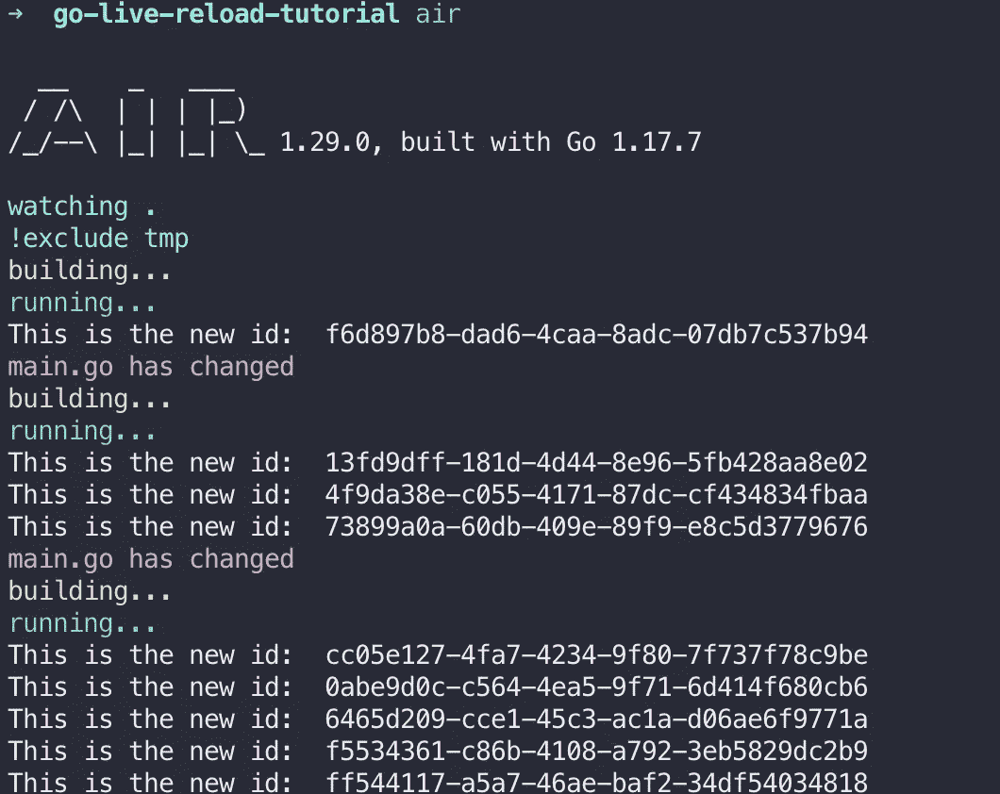
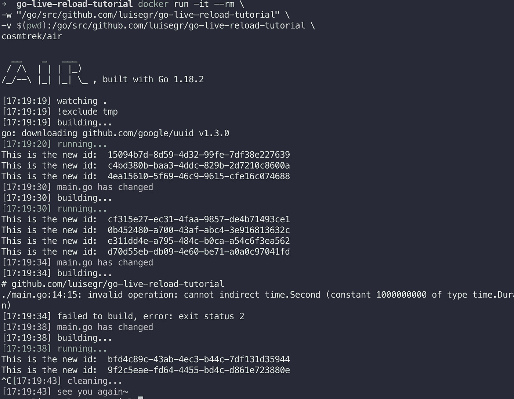
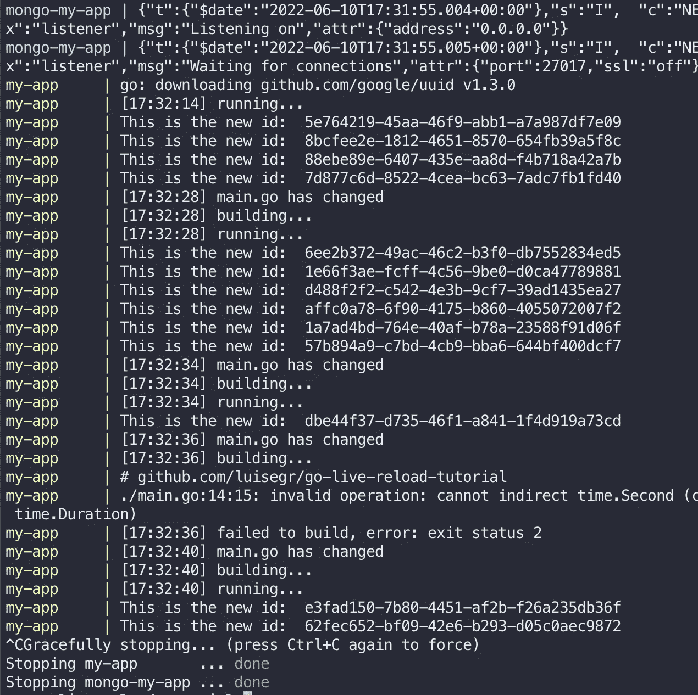

# 这里有一个在 Go 中进行实时重新加载的好方法

> 原文：<https://betterprogramming.pub/a-good-way-to-do-live-reload-for-go-b3707eb47336>

## 只是你的项目中的“空气”


如果你从 Node.js 进入 Go 世界，你可能会错过 JavaScript、Angular、React、Vue 等的一个重要特性。

它们开发起来都很快，因为当你保存正在处理的文件时，它们会接受你的更改，当你使用 express 之类的东西时，也会发生同样的事情，有像`nodemon`这样的工具可以让这项工作变得简单。

在围棋中，有多种方法可以实现这一点。我要展示其中一个，我认为最好的一个。我还将向您描述如何只使用 Go 应用程序，或者使用 docker-compose 文件中的其他依赖项来实现这一点。

这种方法适用于 go 模块。此外，如果你用 go get 添加新的依赖项，应用程序也将被重新加载。

# 目录

本教程分为以下主题:

*   示例 go 应用程序(带有 go 模块)
*   实时重新加载单一应用程序
*   使用多个依赖项实时重新加载(docker-compose)

# 示例应用程序

这个简单的应用程序由两个文件组成，`main.go`和`go.mod`，它只是在你每次按回车键时打印一个随机数`uuid`。

这个简单的程序每 4 秒生成一个新的 UUID，并显示在控制台上，简单到不会分散我们对主要目标的注意力:实时重装。

# 实时重新加载—单个应用程序

为了让这个应用程序能够实时重载(重新构建并在保存时重新运行)，我们需要安装`Air`:

```
go install github.com/cosmtrek/air@latest
```

这将直接从 Air 资源库安装它。之后，我们可以通过运行`air -v`来测试安装。

然后，我们可以转到我们的应用程序目录，并使用以下内容对其进行初始化:

```
air init
```

这将创建一个带有默认值的文件`.air.toml`。您可以查看并修改应用程序所需内容(构建命令、排除的文件夹等)。

它看起来会像这样:

初始化之后，我们就可以开始使用实时重载了:

```
air
```

现在，如果我们对应用程序进行任何更改，它都会检测、编译并运行它。在这个例子中，我只是测试了改变每一代 UUID 等待的秒数:



我们也可以通过 docker 容器对其进行归档，无需安装 air，只需使用 air docker 映像运行即可:

```
docker run -it — rm \
-w "/go/src/github.com/luisegr/go-live-reload-tutorial" \
-v $(pwd):/go/src/github.com/luisegr/go-live-reload-tutorial \
cosmtrek/air
```

这将导致相同的输出，并在更改时重新加载:



Air 还会向您显示编译错误，并在您修复错误后重新构建应用程序

# 实时重新加载—多个依赖项

如果你正在用 docker-compose 运行你的开发环境，并且你正在使用其他的东西，比如`postgres`、mongo、Redis 等等。连同你的应用程序，你也可以利用空气为你的生活重新加载。

你只需要这样设置你的`docker-compose.yml`:

示例 air docker 合成，端口仅用于演示目的，不用于此应用程序

然后，您可以像往常一样运行您的应用程序:

```
docker-compose up
```

您将看到输出，如果您仍然有实时重新加载功能:



我希望这对您有用，有关所有特性的更多详细信息，您可以查看 Air 资源库:

[](https://github.com/cosmtrek/air) [## github-cosm trek/air:☁️go 应用程序的实时重新加载

### 当我开始在 Go 和 gin 框架中开发网站时，☁️ Live reload for Go apps，可惜 gin…

github.com](https://github.com/cosmtrek/air)