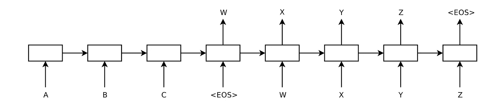
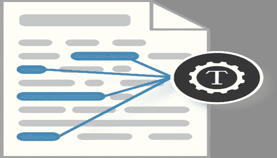
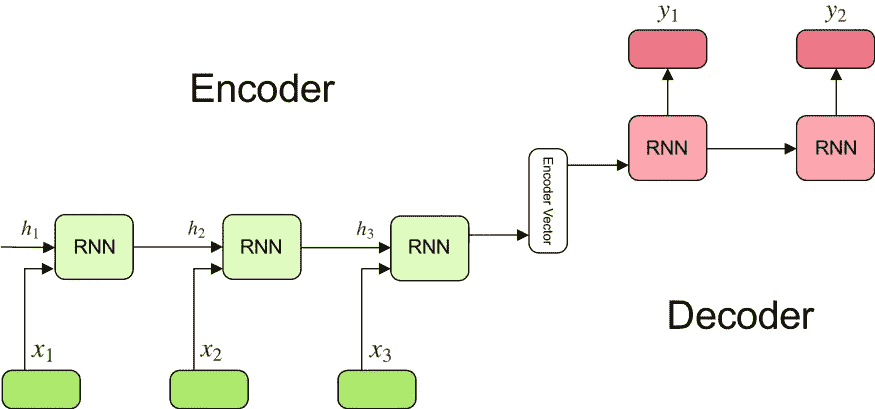
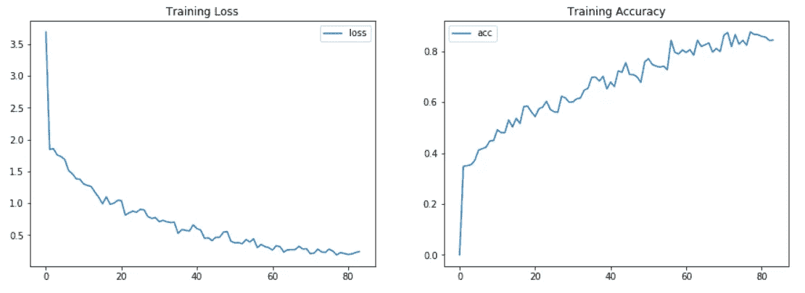
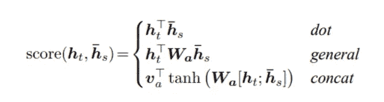
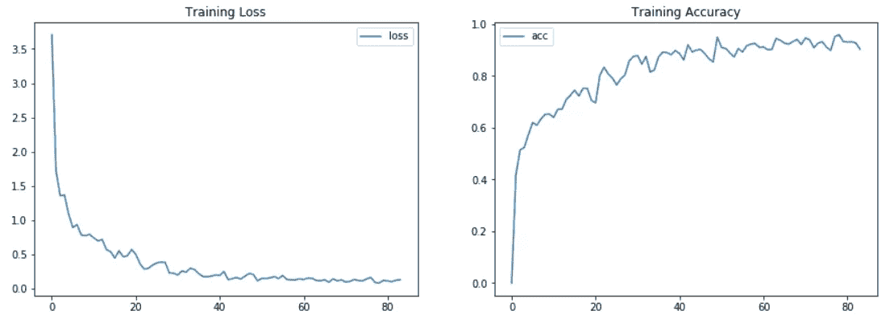
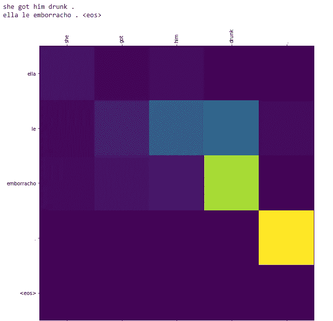

# 编码器-解码器模型和注意机制指南

> 原文：<https://betterprogramming.pub/a-guide-on-the-encoder-decoder-model-and-the-attention-mechanism-401c836e2cdb>

## 在 TF2 创建和训练一个神经机器翻译模型


照片由 [Unsplash](https://unsplash.com?utm_source=medium&utm_medium=referral) 上的 [Alireza Attari](https://unsplash.com/@alireza_attari?utm_source=medium&utm_medium=referral) 拍摄

今天，我们将继续我们的 NLP 世界之旅。在本文中，我们将描述编码器-解码器模型的基本架构，我们将应用于神经机器翻译问题，将文本从英语翻译成西班牙语。

稍后，我们将介绍一项在处理 NLP 任务方面向前迈进了一大步的技术:注意力机制。我们将详述应用于序列对序列模型、多对多方法场景的注意力的基本处理。

但目前，这将是一个简单的注意力模型。我们不会对更复杂的模型发表评论，这些模型将在以后的文章中讨论，比如当我们讨论变形金刚的主题时。

# 什么是神经机器翻译？

> “机器翻译是将一种语言的源文本自动转换成另一种语言的文本的任务。给定源语言中的一系列文本，不存在将该文本翻译成另一种语言的唯一最佳翻译。这是因为人类语言天生的模糊性和灵活性。这使得自动机器翻译的挑战变得很困难，可能是人工智能中最困难的挑战之一。”
> 
> —“*机器学习大师”杰森·布朗利博士【1】*

最初，机器翻译(MT)问题是使用主要基于贝叶斯概率的统计方法来解决的。但是当神经网络变得更加强大和流行时，研究人员开始探索这项技术的能力，并找到了新的解决方案。它被称为神经机器翻译(NMT)。

# 编码器-解码器模型的基本方法

从上面我们可以推断出，NMT 是一个我们处理输入序列以产生输出序列的问题，也就是序列对序列(seq2seq)问题。具体来说，多对多类型是标准方法，在输入和输出端都有几个元素的序列，递归神经网络的编码器-解码器架构。



用于文本翻译的 Sutskever 编码器-解码器模型的描述
摘自[“使用神经网络的序列到序列学习”](https://www.google.com/url?sa=t&rct=j&q=&esrc=s&source=web&cd=&ved=2ahUKEwi0qYaLgbfsAhV3AxAIHQHaAvEQFjABegQIARAC&url=http%3A%2F%2Fresearch.google.com%2Fpubs%2Farchive%2F43155.pdf&usg=AOvVaw1LwAO3f8i-osbs86ssoWVm) 2014

seq2seq 模型由两个子网络组成，即编码器和解码器。左边的编码器接收来自源语言的序列作为输入，结果产生输入序列的紧凑表示，试图总结或压缩它的所有信息。然后，该输出成为解码器的输入或初始状态，解码器也可以接收另一个外部输入。

在每个时间步长，解码器基于接收到的输入及其当前状态生成其输出序列的元素，并为下一个时间步长更新其自身的状态。

输入和输出序列的大小是固定的，但它们不必匹配，输入序列的长度可能不同于输出序列的长度。

该模型的关键点是如何让编码器在单个输出元素中向解码器提供其输入序列的最完整和最有意义的表示，因为该向量或状态是解码器将从输入接收以生成相应输出的唯一信息。输入越长，就越难压缩成一个向量。

我们将详细描述这个模型，并在后面的小节中构建它。



图片由 mcmurryjulie 在 Pixabay 上提供

# **数据集和文本处理**

在这个练习中，我们将使用成对的简单句。源文本将是英语，目标文本将是西班牙语，来自人们贡献的 Tatoeba 项目，每天都添加翻译。这是[链接](http://www.manythings.org/anki/)到一些不同语言的翻译。在那里你可以下载西班牙语/英语`spa_eng.zip`文件；它包含了 124，457 对句子。

课文句子几乎是干净的；它们是简单的纯文本，所以我们只需要删除重音符号，将句子小写，并用空格替换所有内容，除了(`a-z`、`A-Z`、`.`、`?`、`!`和`,`)。应用这个预处理的代码取自神经机器翻译的 TensorFlow 教程。

接下来，让我们看看如何为我们的模型准备数据。很简单，步骤如下:

*   对数据进行标记，将原始文本转换为整数序列。首先，我们从 [Keras](https://keras.io/) 库中创建一个`Tokenizer`对象，并使其适合我们的文本(一个用于输入，另一个用于输出)。
*   从文本中提取一个整数序列:我们为每个输入和输出文本调用标记器的`text_to_sequence` 方法。
*   计算输入和输出序列的最大长度

*   创建输入和输出词汇表:使用我们之前创建的标记器，我们可以检索词汇表，一个将单词匹配到整数(`word2idx`)，另一个将整数匹配到相应的单词(`idx2word`)。

*   填充句子:我们需要在序列的末尾填充零，这样所有的序列都有相同的长度。否则，我们无法批量训练模型。

*   创建一个批量数据生成器:我们想要在批量/一组句子上训练模型，所以我们需要使用 [tf.data](https://www.tensorflow.org/guide/data) 库和函数`batch_on_slices`在输入和输出序列上创建一个数据集。

# **用递归神经网络建立一个编码器-解码器模型**

为了更好地理解，我们可以将模型分为三个基本部分:



从 Simeon Kostadinov 的“理解编码器-解码器序列到序列模型”[3]

## **编码器**

多层循环单元，在每个时间步中，接收一个输入令牌，收集相关信息并产生一个隐藏状态。这取决于 RNN 的类型；在我们的例子中，一个 LSTM，单元混合当前隐藏状态和输入，并返回一个输出，丢弃，和一个新的隐藏状态。

## **编码器矢量**

编码器向量是编码器的最后一个隐藏状态，它试图包含尽可能多的有用输入信息，以帮助解码器获得最佳结果。这是解码器从输入中获得的唯一信息。

## **解码器**

循环单元层，例如 LSTMs，其中每个单元在时间步长 *t* 产生一个输出。第一个单元的隐藏状态是编码器向量，其余单元接受来自前一个单元的隐藏状态。使用 softmax 函数计算输出，以获得输出词汇表中每个标记的概率。

`Encoder`类:

`Decoder`类:

一旦我们的编码器和解码器被定义，我们可以初始化它们并设置初始隐藏状态。我们包含了一个简单的测试，调用编码器和解码器来检查它们是否工作正常:

现在，我们需要定义一个自定义损失函数，以避免在计算损失时考虑`0`值和填充值。我们还必须定义一个自定义的精度函数。

# 训练和评估模型

正如我们之前提到的，我们对批量训练网络感兴趣；因此，我们创建一个函数来执行一批数据的训练:

*   调用批处理输入序列的编码器—输出是编码的向量
*   将解码器初始状态设置为编码向量
*   调用解码器，将右移的目标序列作为输入。输出是对数(在损失函数中应用 softmax 函数)。
*   计算批次数据的损失和准确性
*   更新编码器和解码器的可学习参数
*   更新优化程序

如您所见，我们的训练函数接收三个序列:

*   输入序列:形状:`[batch_size, max_seq_len, embedding dim]`的整数数组。这是编码器的输入序列。
*   目标序列:形状:`[batch_size, max_seq_len, embedding dim]`的整数数组。这是我们模型的目标，我们希望我们模型的输出。
*   目标输入序列:形状:`[batch_size, max_seq_len, embedding dim]`的整数数组。它是解码器的输入序列，因为我们使用*教师强制*。

## 教师强迫

教师强制是 NLP 中深度学习模型开发的关键训练方法。*“这是一种快速有效地训练递归神经网络模型的方法，该模型使用来自先前时间步骤的基础事实作为输入。”*，【8】"[什么是递归神经网络的教师强迫？杰森·布朗利博士](https://machinelearningmastery.com/teacher-forcing-for-recurrent-neural-networks/)

在递归网络中，通常在时间步长 *t* 对 RNN 的输入是前一时间步长 *t-1 的 RNN 的输出。*但是在老师的强制下，我们可以用实际输出来提高模型的学习能力。

> 教师强制的工作方式是使用当前时间步长 y(t)的训练数据集的实际或预期输出作为下一个时间步长 X(t+1)的输入，而不是网络生成的输出
> 
> ——伊恩·古德菲勒的《深度学习》

因此，在我们的示例中，时间步长 *t* 的目标输出是时间步长 *t+1 的解码器输入。*解码器的输入序列将是向右移动一个位置的预期目标序列。为此，我们在第一个位置插入序列开始标记`<sos>`,这样位置 1 的标记就转到位置 2，位置 2 的标记转到位置 3，依此类推。为了均衡序列的长度并界定它们的结尾，在目标序列中，我们将在最后一个位置放置一个序列结束标记`<eos>`。

当我们的模型输出与模型在训练中所看到的没有变化时，教师的强制是非常有效的。但是如果我们需要一个更有创造性的模型，其中给定一个输入序列可能有几个可能的输出，我们应该避免这种技术或者随机地应用它(只在一些随机的时间步骤中)。

现在，我们可以编写主要的火车功能:

我们几乎准备好了——我们的最后一步包括调用主 train 函数，我们创建一个`checkpoint`对象来保存我们的模型。因为训练过程需要很长时间来运行，所以每两个纪元我们就保存一次。以后我们可以恢复它，并用它来做预测。

我们在有限的时间内(大约一小时)训练我们的编码器-解码器模型，采用 40，000 对句子和 512 个单元的 rnn。我们取得了良好的成果:



## 做预测

在预测步骤中，out 输入是一个长度为 1 的序列，即`sos`标记。然后我们反复调用编码器和解码器，直到我们得到`eos`令牌或者达到定义的最大长度。

我们得到的一些预测的例子是:

```
['we re not going .', 'why are you sad ?']
['no vamos . <eos>', '¿ por que estas triste ? <eos>']
```

# 注意机制

先前描述的基于 RNNs 的模型在处理长序列时存在严重的问题，因为随着更多的记号被处理，第一记号的信息丢失或被稀释。上下文向量负责将给定源句子中的所有信息编码成一个包含几百个元素的向量。这给模型处理长句带来了挑战。在 [Bahdanau 等人，2014](https://arxiv.org/abs/1409.0473)【4】和 [Luong 等人，2015](https://arxiv.org/abs/1508.04025)【5】中提出了解决方案。

他们引入了一种叫做*注意力*的技术，这种技术极大地提高了机器翻译系统的质量。*“注意力允许模型根据需要关注输入序列的相关部分，访问编码器所有过去的隐藏状态，而不仅仅是最后一个”，*【8】[seq 2 seq 模型带注意力](https://zhanghanduo.github.io/post/attention/)【张】。在每个解码步骤中，解码器会查看编码器的任何特定状态，并可以从该序列中选择性地挑选出特定元素来产生输出。我们将关注 Luong 的观点。


《注意机制》作者[加布里埃尔·洛耶](https://blog.floydhub.com/author/gabriel/)【6】

有两个相关点需要关注:

## **对准矢量**

*“对齐向量是与输入或源序列具有相同长度的向量，并且在解码器的每个时间步长***，【9】[注意:具有注意机制的序列 2 序列模型](https://towardsdatascience.com/sequence-2-sequence-model-with-attention-mechanism-9e9ca2a613a)”由 Renu Khandelwal 编写。它的每个值都是源序列中相应单词的分数(或概率);它们告诉解码器在每个时间步应该关注什么。有三种方法可以计算比对分数:**

*   ****点积:**我们只需要将编码器的隐藏状态乘以解码器的隐藏状态**
*   ****概述:**与点积非常相似，但包含一个权重矩阵**
*   ****Concat:** 解码器隐藏状态和编码器隐藏状态在通过具有 tanh 激活函数的线性层之前首先相加，最后乘以权重矩阵**

****

**解码器输出**

**比对分数被软最大化，因此权重将在 0-1 之间。**

## ****上下文向量****

**上下文向量是编码器输出、对齐向量的点积和编码器输出的加权平均和。**

**一旦定义了我们的`Attention`类，我们就可以创建解码器了。调用解码器时的完整步骤序列是:**

1.  **照常生成编码器隐藏状态，每个输入标记一个**
2.  **应用 RNN 以产生新的隐藏状态，采用其先前的隐藏状态和先前时间步长的目标输出**
3.  **如前所述，计算比对分数**
4.  **计算上下文向量**
5.  **在最后一个操作中，上下文向量与我们之前生成的解码器隐藏状态连接在一起。然后，它通过一个线性层，这个线性层充当分类器，让我们获得下一个预测单词的概率得分。**

**就这样，我们刚刚用 Luong 的注意力机制构建了一个解码器。您可以假设编码器与我们之前在初始 seq2seq 模型中创建的相同。**

# **专心训练模型**

**现在我们可以定义 step-train 函数来训练批处理数据。这与我们之前看到的非常相似，但是这一次，我们将编码器返回的所有隐藏状态传递给解码器。我们需要创建一个循环来遍历目标序列，为每个序列调用解码器并计算损失函数，将输出与预期目标进行比较。**

**这就是全部——我们准备专心训练我们的编码器-解码器。我们只需要创建检查点并调用主训练函数(这与我们为没有注意的模型编码是一样的)。**

**这一次，我们在大约相同的时间内改进了我们的结果:**

****

# **推理时间**

**我们的模型的预测函数，关注目标序列的迭代，由`<sos>`标记开始，接收来自解码器和对齐向量的下一个字。可以画出这个向量来告诉我们解码器应该更关注哪个输入标记。**

**然后我们可以调用`predict_att_seq2seq`函数并绘制`alignments` 来观察我们的模型是如何工作的:**

****

**您可以通过这个[链接](https://github.com/edumunozsala/NMT-encoder-decoder-Attention)访问并获得我的 GitHub 资源库中的代码，或者您也可以在我的[博客](https://edumunozsala.github.io/BlogEms/fastpages/jupyter/encoder-decoder/lstm/attention/tensorflow%202/2020/10/07/Intro-seq2seq-Encoder-Decoder-ENG-SPA-translator-tf2.html)中获得本文和代码。**

# **参考**

**[1] [机器学习掌握，《神经机器翻译的温和介绍》，杰森·布朗利](https://machinelearningmastery.com/introduction-neural-machine-translation/)**

**[2] [“用神经网络进行序列对序列学习”，作者 Ilya Sutskever](http://papers.nips.cc/paper/5346-sequence-to-sequence-learning-with-neural-networks.pdf)**

**[3] [“理解编码器-解码器序列到序列模型”，作者 Simeon Kostadinov](https://towardsdatascience.com/understanding-encoder-decoder-sequence-to-sequence-model-679e04af4346)**

**[4] [联合学习对齐和翻译的神经机器翻译，Bahdanau 等人，2014](https://arxiv.org/abs/1409.0473)**

**[5] [基于注意的神经机器翻译的有效方法。，2015 年](https://arxiv.org/abs/1508.04025)**

**Gabriel Loye 在 FloydHub 博客上的“注意力机制”**

**【7】*[*什么是老师对递归神经网络的强迫？*](https://machinelearningmastery.com/teacher-forcing-for-recurrent-neural-networks/) *”作者杰森·布朗利博士****

**[8][seq 2 seq 模型与注意事项](https://zhanghanduo.github.io/post/attention/)张**

**[9] " [注意:具有注意机制的序列 2 序列模型](https://towardsdatascience.com/sequence-2-sequence-model-with-attention-mechanism-9e9ca2a613a)**

**[“可视化神经机器翻译模型(Seq2seq 模型的机制，请注意)”作者 Jay Alammar](https://jalammar.github.io/visualizing-neural-machine-translation-mechanics-of-seq2seq-models-with-attention/)**

**[“关注与 Keras 的深层网络”，作者 Thushan Ganegedara](https://towardsdatascience.com/light-on-math-ml-attention-with-keras-dc8dbc1fad39)**