# BigQuery 中的数组和结构指南

> 原文：<https://betterprogramming.pub/a-guide-to-arrays-and-structs-in-bigquery-b9024d74c741>

## 学习使用记录和重复字段


由 [Kelly Sikkema](https://unsplash.com/@kellysikkema?utm_source=medium&utm_medium=referral) 在 [Unsplash](https://unsplash.com?utm_source=medium&utm_medium=referral) 上拍摄的照片

我总是发现 SQL 令人沮丧，因为我不能以一种方便的方式存储列表。幸运的是，像 BigQuery 这样的现代数据仓库允许我们使用数组和结构。让我们看看它是如何工作的，并学习存储和查询嵌套数据！

# 创建数组和结构

## 数组

假设你在当地超市订购了一些商品。您可能希望将订单存储在表`orders` **中。**您希望每个订单占一行，但是每个订单可以包含几个项目。

```
SELECT 1 AS order_id, ["soap", "sugar", "batteries"] AS order_items
```

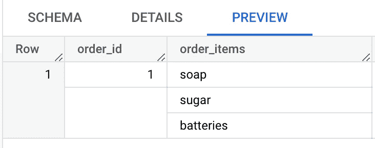

作者截图

数组本质上是允许你在一个字段中存储多个结果的列表。让我们将结果保存在一个表中，并查看模式。

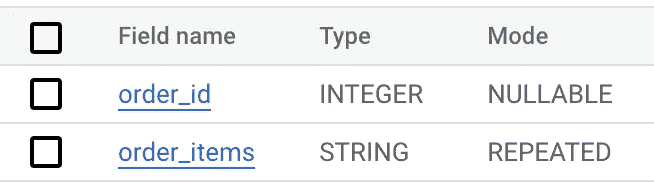

作者截图

我们可以看到数组不是一种数据类型，而是一种模式:我们的字符串数组被视为一个`repeated` 字符串。

## 结构

如果您想将相似的字段重新组合在一起，结构是正确的选择。它们相当于其他编程语言中的对象或字典，允许您存储成对的键和值。

在我们的例子中，我们可能希望存储每个产品的 id、价格、名称和数量。

```
SELECT 
  STRUCT(
    1 AS id, 
    "soap" AS name, 
    5.4 AS price, 
    2 AS quantity
  ) AS product
```


作者截图

让我们将产品保存在另一个表中，并查看模式:

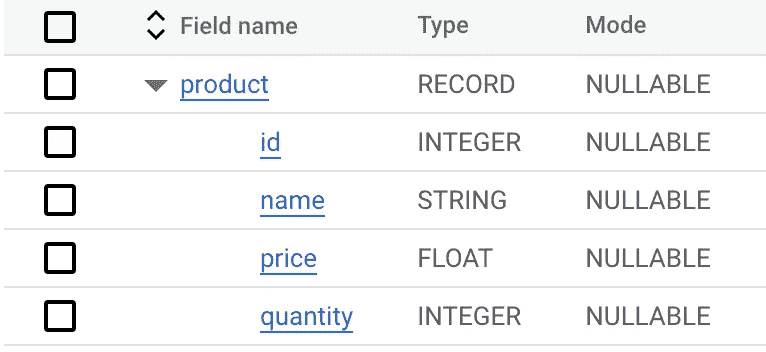

作者截图

在这里，我们的产品字段是类型`record` **。**

## 结构数组

我们才刚开始开心呢！现在，您需要一份您购买的所有商品的清单，以及所有产品的详细信息。

```
SELECT 1 AS order_id,
[STRUCT(
  1 AS id, 
  "soap" AS name, 
  5.4 AS price, 
  2 AS quantity
  ) ,
  STRUCT(
  2 AS id, 
  "sugar" AS name, 
  3.1 AS price, 
  1 AS quantity
  ),
  STRUCT(
  3 AS id, 
  "batteries" AS name, 
  2.8 AS price, 
  1 AS quantity
  )
  ] AS order_items
```

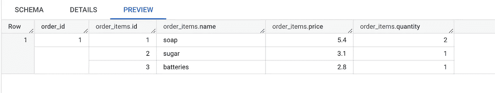

作者截图

您可能已经猜到了，我们的 order_items 字段是模式`repeated`的一个`record`。

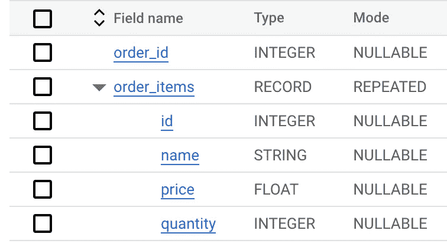

作者截图

# 访问值

## 内部记录

假设我们想访问我们产品的名称。

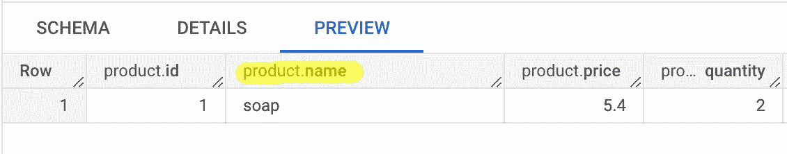

作者截图

这非常简单，我们只需添加一个点并指定键:

```
SELECT product.name
FROM arrays_and_structs.products
```

## 数组内部

现在，我们想访问 order_items 中产品的所有独特价值:

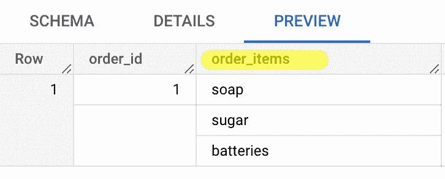

作者截图

这变得有点棘手，因为这是一个重复的字段，我们将不得不取消它的嵌套。

BigQuery 提供了一个`UNNEST`操作符，该操作符为每个重复字段创建一个表。然后我们可以用我们的初始表`JOIN`这个表。

```
SELECT DISTINCT oi AS order_item
FROM arrays_and_structs.orders_array
INNER JOIN UNNEST(order_items) AS oi
```

现在我们有了自己独特的`order_items`！


作者截图

对于未嵌套的字段，有一个快捷方式可以做到`INNER JOIN` 。

```
SELECT DISTINCT oi AS order_item
FROM arrays_and_structs.orders_array, UNNEST(order_items) AS oi
```

请注意，如果您的嵌套字段为空，该内部联接将排除该行。想象一下，我们有一张人们生日收到的礼物表:

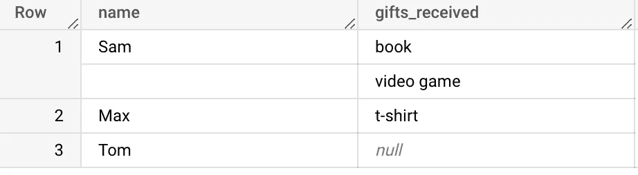

作者截图

因为 Tom 没有收到任何礼物，如果我们使用一个内部连接，我们会得到:

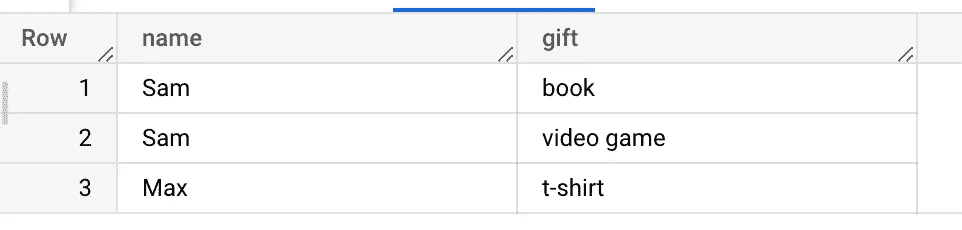

作者截图

我们可怜的朋友汤姆不仅什么也没得到，他还从我们的桌子上消失了！如果我们想留住每个人，不管是不是礼物，我们需要执行一个左连接。

```
SELECT name, gift 
FROM gifts
LEFT JOIN UNNEST(gifts_received) AS gift
```

这一次，汤姆来了:

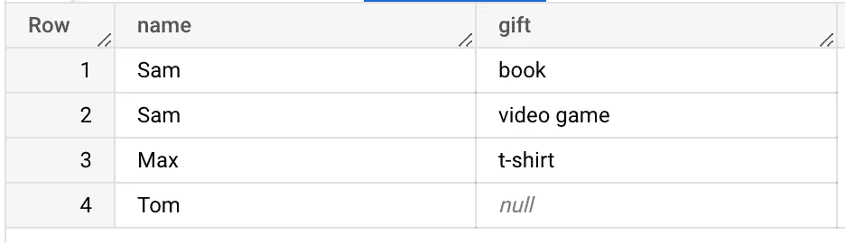

作者截图

## 结构数组内部

假设我们想得到每个订单的总金额。我们需要将每个项目的数量和价格相乘，然后求和。

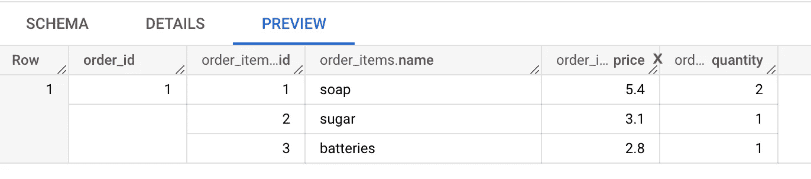

作者截图

我们只是将我们所学的访问结构和数组的所有内容结合起来，然后求和:

```
SELECT  order_id, SUM(order_item.price * order_item.quantity) AS order_amount
FROM `arrays_and_structs.arrays_of_structs`
LEFT JOIN UNNEST(order_items) order_item
GROUP BY order_id
```

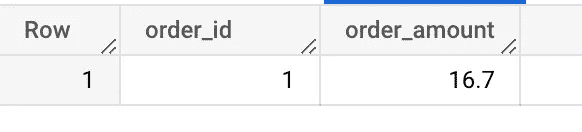

作者截图

这是我们的总数！

如果你想更深入地了解，请查阅关于使用数组和[嵌套和重复字段](https://cloud.google.com/bigquery/docs/nested-repeated)的官方文档。

如果您喜欢这篇文章，请关注我，了解更多关于 SQL 和 BigQuery 的内容，比如这篇关于 SQL 连接的文章:

[](/are-you-making-these-sql-join-mistakes-920a9f7678ac) [## 是你犯了这些 SQL 连接错误吗？

### 两个常见错误及如何避免

better 编程. pub](/are-you-making-these-sql-join-mistakes-920a9f7678ac)