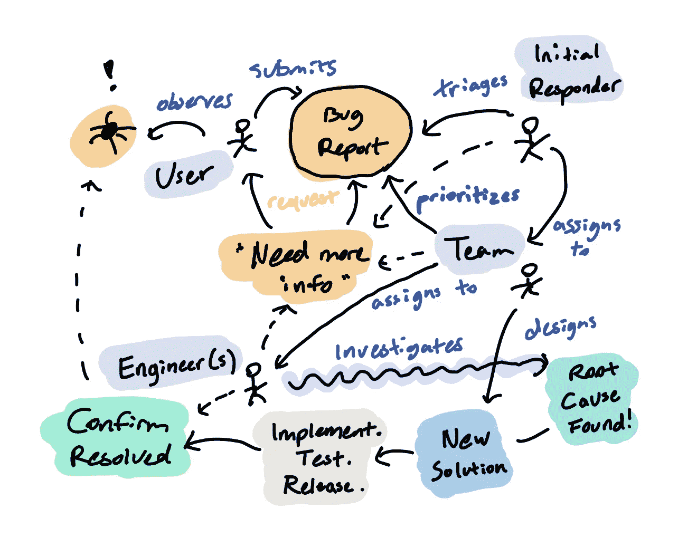
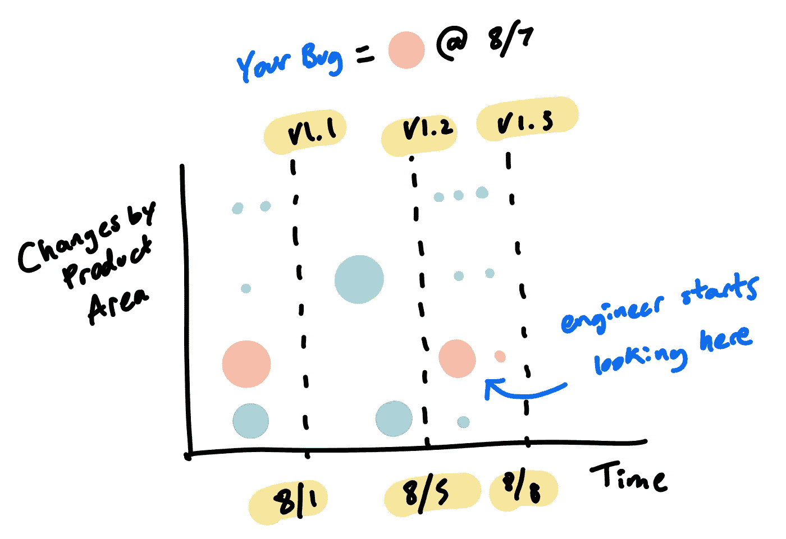

# 更好的错误报告指南

> 原文：<https://betterprogramming.pub/a-guide-to-better-bug-reporting-9cd81b17351f>

## 如何处理项目中出现的 bug

克里斯蒂娜@ wocintechchat.com 在 [Unsplash](https://unsplash.com?utm_source=medium&utm_medium=referral) 上的照片

软件 bug 就像真正的 bug:没有人喜欢它们，但它们是生活中的事实，当它们出现时，你需要一种方法来处理它们。

虽然工程师负责预防和解决软件问题，但任何人都可以通过报告出现的问题来参与改进他们使用的应用程序。那些在科技公司工作的人尤其应该认识到，帮助改进产品是优秀团队成员的一部分。俗话说“看到什么就说什么”。

问题是，大多数非技术人员从来没有真正学会如何与技术团队沟通来解决问题。这篇文章是我经常发现自己想要转发的资源:如何在这个特定的技术合作领域更有效的指南。

我将从工程的角度分享我的见解，让你理解什么是好的 bug 报告，以及为什么。将这些要点付诸实践，你的问题可能会得到更快的解决，你会与你的技术团队有更好的关系，希望我们在使用的应用程序中遇到的错误会更少。

# Bug 过程

错误报告的目的是清楚地解释观察到的问题，并详细说明产生该问题所采取的步骤，以便技术团队可以确定其根本原因并实施解决方案。

一份好的报告能最有效地帮助解决问题。为了让您了解软件公司通常需要什么样的流程，我直观地总结了一个一般的问题工作流程:

一般软件问题工作流程(图片来源:作者)

对于 bug 报告者来说，关键的一点是，当你提交一个问题时，你正在创建一个通过多步沟通流程运行的任务。最大限度地减少此工作流中的低效循环和停顿，很大程度上取决于引发它的信息。因此，在报告 bug 时要记住的一件事是:你提供的信息的质量和数量越好，修复 bug 就越快越容易。

不幸的是，问题解决缓慢的最常见原因是它被贴上了“需要更多信息”的标签每一个软件工程师都对一个错误报告叹了口气，除了“它不起作用”之外，没有更多的洞察力。提示:您不希望您的问题属于这些类别。

那么，作为优秀的软件公民，您应该提供什么信息呢？

# 提供背景

首先，提供尽可能多的背景。你的目标是协助调查工程师，他们的第一个任务将是拼凑出一个清晰的事情经过。为此，他们通常会将您对事件的第一手描述与额外的内部信息(如系统日志和源代码逻辑)结合起来。您提供的上下文有助于快速连接和关联这两个来源。

一些通常有用的上下文信息示例:

*   帐户标识符—您的帐户电子邮件、用户名或组织
*   事件发生的时间和日期
*   位置—您所在的应用程序屏幕的网址和描述
*   应用/平台—您的网络浏览器、移动平台或操作系统
*   版本—您正在使用的软件的版本

您还需要提供您遇到的问题的定性背景，因为大量报告的“错误”最终证明根本不是技术问题。有时软件完全按照它的预期工作，但是行为与你，用户的期望不同。这些“用户错误”场景表明了产品中的沟通或 UX 缺陷，需要设计思维来解决。因此，当报告你认为是一个问题的事情时，包括你试图完成的事情和你预期会发生的事情的背景。这将有助于在需要设计合适的解决方案时通知产品所有者，而不仅仅是实现。

# 过度沟通

尽可能具体详细地描述您遇到的问题。说真的，沟通过度。一个好的目标是尽量不要被要求跟进某个问题，尽可能提前提供更多的信息。你的描述越精确，就有越多的工程师需要工作。图片在这里胜过千言万语，所以如果可以的话，包括截图和屏幕录音。

考虑一个用户对拼车应用程序的假设错误报告:“我不能去旅行。”作为一名工程师，看到这里，我有很多问题需要问提交者。你不能签到吗？应用程序启动时会崩溃吗？你能在某些情况下旅行，但在其他情况下不能吗？发生这种情况时，您会看到什么错误消息？这些问题的答案对问题所在、问题的紧迫性以及如何进行调查都有重大影响。

为了让您更深入地了解工程幕后的情况:大多数软件错误都是由于新更新的发布而出现的，因此解决问题通常首先是寻找最近可疑的代码更改。上下文信息和清晰的描述有助于将搜索范围缩小到潜在的可疑区域。例如，如果您在更改移动应用程序的计费设置时遇到问题，知道支付系统最近发生迁移的工程师可能会直接跳到代码库的该部分，根据相关时间段的变化来验证您的报告。

软件产品随着时间的推移而发生的变化——缺陷搜索可以缩小到

通过提供有关您的问题的背景(“谁、什么、何时、何地、为什么”)和具体、详细的信息，您可以帮助工程师更好地对您遇到的问题的来源进行三角测量。

# 详述重现的步骤

虽然上下文很有帮助，但您可以提供的最有价值的信息是一组清晰的步骤，以一致地再现观察到的问题。这并不总是容易或可能的，但是作为经历 bug 的人，您处于获得这些关键信息的最佳位置。

当你遇到一个软件 bug 时，想象自己在一个产品的比喻森林中意外地偏离了主要路径。大多数虫子不会藏在众目睽睽之下，因为如果它们很明显，它们很可能在到达野外之前就被抓住了。软件问题通常会因为一系列意想不到的动作或特定的条件组合而显现出来——工程师称之为*边缘情况*。您遇到的每个 bug 都是您在某个时间点，在一组适用于您的独特条件下采取的特定步骤的结果。重建所有这些因素，以始终如一地回到这一点是关键的挑战；你的目标是提供指导，帮助捕虫人这样做。

这些“再现”问题的步骤之所以如此有价值，是因为破解 bug 的关键是弄清楚故障模式发生的确切原因。如果不了解问题存在的原因，工程师就不能有效地思考和实施解决方案。一旦一个工程师能够始终如一地重现一个 bug，战斗通常就成功了一半，因为当一个错误能够被重复观察时，根本原因就更容易推断出来。理论可以通过调整条件、重复步骤和观察结果来检验。这部分过程中涉及的批判性思维通常是解决问题的核心工作，因为编写代码补丁是一项相对容易的任务。

提供清晰、具体的步骤来帮助工程师们自己发现问题，将会极大地提高发现问题的速度。所以下一次你遇到一个 bug 的时候，停下来，仔细观察你的环境，尽你所能追溯和记录你所采取的步骤。

# 沟通技巧

除了描述哪里出了问题，你还应该传达问题对你使用产品能力的影响。描述您未能完成的任务、问题的频率和严重性，以及您是否能够找到解决方法。这通知了产品负责人，他们需要根据总的工作积压来确定您的问题的优先级。请注意，夸大您的问题的严重性，希望加快修复对客观的审查者没有特别的帮助，避免夸张会使您的请求在整体上更加可信。

另一个建议是明确区分你关于为什么一个问题会发生的理论和客观的事实观察。你的假设可能是有帮助的，但它们将永远是推测，因为你看不到潜在系统中真理的来源。将这些与事实混为一谈的风险在于，你可能会迷惑或误导工程师。虽然开发人员通常可以过滤掉无关的信息，但是他们仍然容易被转移到调查错误的线索上。因此，你可以包括你的预测，但把它们作为与观察到的症状分开的理论。避免派工程师去做徒劳无益的事情。

最后，快速说明一下音调。没有人喜欢事情不起作用，在报告您刚刚经历的问题时感到恼火是完全可以理解的。然而，像任何客户支持请求一样，保持礼貌的语气对每个人都有好处。对于负责任的技术团队来说，如果没有额外的态度，标记和分配错误通常就足够令人羞愧了。谈到软件缺陷，古老的格言“用蜂蜜比用醋能抓到更多的苍蝇”仍然适用。

# 结束的

技术和团队流程当然在不断改进，以便更好地检测和防止软件问题首先影响用户。但是，只要我们拥有由易犯错的人类在时间限制下设计的复杂技术系统，我们就可以预期缺陷的存在。而这些 bug，都是需要互相交流的人会遇到和处理的。

虽然我们关于改进软件的大部分讨论都围绕着计算机系统，但是所有的软件从根本上来说都与人类系统交织在一起，人类系统由关心其创造和效用的人组成。作为用户，你可以选择成为一个积极的、有益的代理人——产品免疫系统中的抗体。我希望阅读这篇文章能对你的选择有所帮助。因为，尤其是在这个时代，一个更少虫子的世界——这是我们都可以摆脱的。

# 附录:错误报告备忘单

这里有一个快速的错误报告参考，您可以为自己或您的团队定制:

## 纪念

*   要详细具体。过度沟通。
*   把你的理论从观察中分离出来。
*   保持礼貌的语气。

## 提供背景

*   谁，什么，何时，何地，为什么
*   帐户标识符、日期和时间、位置
*   包括截图/录音

## 形容

*   你做了什么
*   你预料会发生什么
*   到底发生了什么
*   提供持续重现问题的步骤

## 影响

*   这对您使用该产品有什么影响？
*   你找到解决方法了吗？