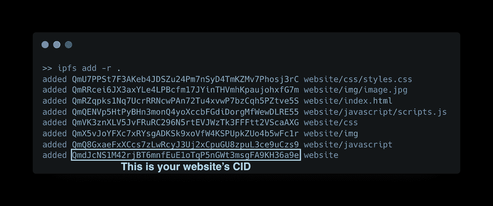
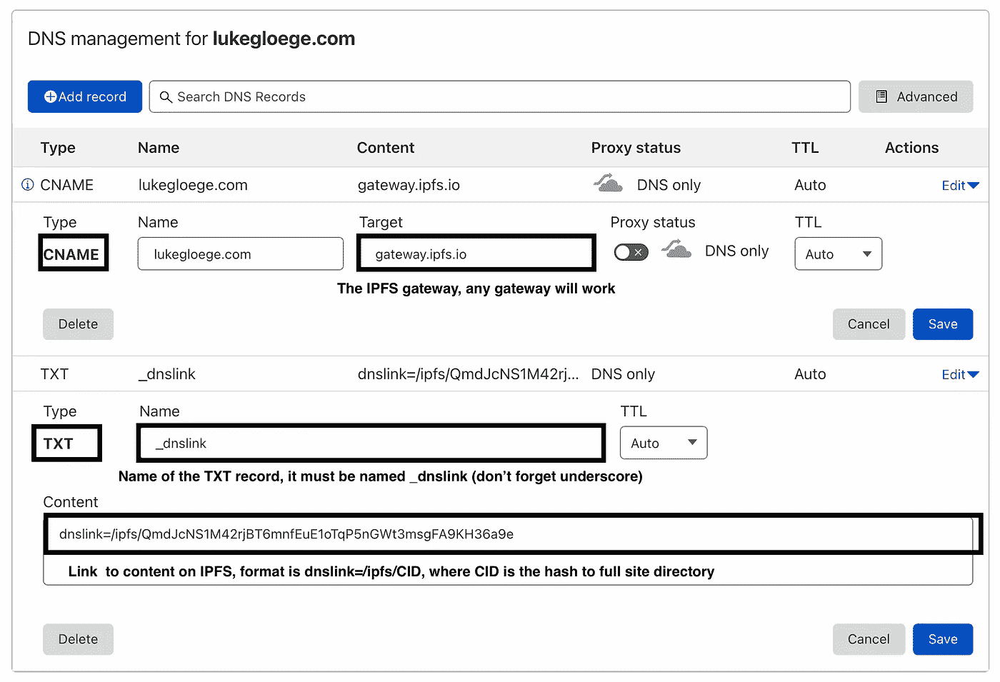

# IPFS 网站托管指南

> 原文：<https://betterprogramming.pub/a-guide-to-hosting-websites-on-ipfs-d2efad40ed3>

## 如何在行星间文件系统上托管站点


戴维·梅尼德雷在 [Unsplash](https://unsplash.com?utm_source=medium&utm_medium=referral) 上拍摄的照片

在这篇文章中，我将描述如何在行星间文件系统( [IPFS](https://ipfs.io/) )上托管一个网站，这是一个通过计算机网络存储和访问文件、网页、数据等的对等网络。分散式存储协议，如 IPFS，将在 [web3 技术栈](https://web3.foundation/about/)中发挥不可或缺的作用，有助于使互联网变得分散和不可改变。我相信这个新生的协议将成为未来几年互联网的重要组成部分。

这个协议有很多[用途，但是在这篇文章中，我将只关注托管一个网站。请记住，IPFS 协议目前还不是所有的浏览器都支持，这可能会限制您的内容的范围。对于那些不了解 IPFS 的浏览器，我们可以简单地通过一个“](https://docs.ipfs.io/concepts/usage-ideas-examples/)[网关](https://docs.ipfs.io/concepts/ipfs-gateway/)来路由我们的网页这就是我将在这篇文章中展示的。作为一个例子，这是我的网页托管在 IPFS 通过网关路由。

```
**Table of contents**[0\. A brief overview of IPFS](#b63c)
  [0.1 Content Identifiers (CID)](#52b1)
  [0.2 Gateway Servers](#4164)
  [0.3 Where to go from here](#8b69)
[1\. Install IPFS CLI](#0ddc)
  [1.1 Brief tutorial of IPFS](#c54b)
[2\. Upload your website to IPFS](#bd80)
[3\. Connecting IPFS to your own domain name](#01ea)
  [3.1 DNS link domain to IPFS](#72dd)
  [3.2 What actually happens?](#7882)
[4\. Conclusions](#8d0a)
```

# 0.IPFS 概述

IPFS 和无处不在的超文本传输协议(HTTP)的主要区别之一是引用数据的方式。HTTP 通过*位置*引用，而 IPFS 通过*内容引用。*当您在浏览器中输入统一资源定位符(URL)时(例如[www.medium.com](http://www.medium.com)),您正在指定您想要访问的内容的位置。

然而，也许在咖啡店你旁边的人有一份你要的内容。那么为什么不从他们那里得到呢？这在 IPFS 中是可能的，在那里多个“对等点”可以托管相同的内容，允许你从它们中的任何一个而不是一个中央服务器检索它。IPFS 上的文件可能不仅仅存储在一个地方，而是存储在世界各地的许多地方，有一天甚至可能存储在其他星球上(因此命名为 inter-*planetary*file system)。

当在 IPFS 上请求内容时，我们用一个[内容标识符(CID)](https://proto.school/anatomy-of-a-cid) 来指定*我们想要什么*，而不管它在哪里。这个 CID 是内容的加密唯一散列。因此，如果内容改变，那么 CID 也将改变。这对于确保内容不被篡改非常重要。

IPFS 让互联网变得不可改变且富有弹性。CID 对于内容是唯一的，因此如果内容被改变，则生成新的 CID。数据具有弹性，因为它托管在多台计算机上，很难从网络中完全删除。

## 0.1 内容标识符(CID)

CID 类似于 URL。URL 描述的是服务器的位置，而 CID 描述的是内容本身，不管它位于何处。简单地说，IPFS 问连接到你的计算机“*你知道与这个 CID 相关的内容在哪里吗？*“网络中的计算机将对此做出响应，”*是的，您可以在该服务器上找到内容。*”

作为一个例子，这里是 IPFS 维基镜像的 CID:

```
ipfs://QmXoypizjW3WknFiJnKLwHCnL72vedxjQkDDP1mXWo6uco
```

就像文件系统一样，我们可以导航到我们真正想要的内容。

```
ipfs://bafybeiemxf5abjwjbikoz4mc3a3dla6ual3jsgpdr4cjr3oz3evfyavhwq/wiki/Beatles.html
```

这个系统的挑战是大多数浏览器不知道如何解析 IPFS 地址。Brave 和 Opera 是两款支持[原生 IPFS](https://github.com/ipfs/in-web-browsers#ipfs-and-igalia-collaborate-on-dweb-in-browsers)的浏览器。对于不了解 IPFS 的浏览器，我们必须要么安装 [IPFS 伴侣](https://github.com/ipfs/ipfs-companion)要么依靠一个“网关”。

## 0.2 网关服务器

网关是你的浏览器和 IPFS 之间的中间人。您向中央网关服务器发出 HTTP 请求，然后该服务器获取 IPFS 内容。


IPFS 网关工作原理示意图。请求通过中央网关服务器路由，然后 IPFS 上的内容被检索并发送给用户。(图片来源:作者修改过的 [UnDraw](https://undraw.co/) 图片)

网关允许任何人访问 IPFS 的内容(不管你的浏览器)，缺点是服务器是集中的，因此容易离线。这是网关服务器的一个问题。

虽然网关是集中的，可能会永久离线，但内容本身仍然保留在 IPFS 上。网关可能消失了，但是内容本身仍然存在——假设它被[固定](https://docs.ipfs.io/concepts/persistence/#persistence-versus-permanence)到网络中的一个节点。

作为一个例子，下面是通过`https://dweb.link`网关路由的同一个 Beatles 页面:

```
https://dweb.link/ipfs/QmXoypizjW3WknFiJnKLwHCnL72vedxjQkDDP1mXWo6uco/wiki/Beatles.html
```

## 0.3 何去何从

现在我们对 IPFS 及其工作原理有了一点了解，让我们安装 IPFS 并托管一些我们自己的内容吧！

# 1.安装 IPFS CLI

在 macOS 上，您可以使用 brew 来安装 IPFS

```
brew install ipfs
```

这将安装 IPFS 命令行界面(CLI)。

也可以直接从 [ipfs.io](https://ipfs.io/) 下载

[](https://docs.ipfs.io/install/command-line/) [## 命令行| IPFS 文档

### 如果您计划在 IPFS 上构建应用程序和服务，那么通过命令行安装 IPFS 非常方便…

docs.ipfs.io](https://docs.ipfs.io/install/command-line/) 

通过检查版本，确保安装了 CLI。

```
ipfs --version
```

## 1.1 Brief 简介

在我们开始使用 IPFS 之前，我们需要[初始化存储库](https://docs.ipfs.io/how-to/command-line-quick-start/#initialize-the-repository)

```
ipfs init
```

这将在`~/.ipfs`中创建文件来存储设置和内部数据。

我们可以通过在新的会话中启动守护进程来连接到网络。

```
ipfs daemon
```

> daeman 也可以在后台启动。`ipfs daemon &`，只是别忘了停下来。在 macOS 上，`killall ipfs`会停止守护进程。

保持守护进程运行，以便您可以在浏览器中查看内容。

现在让我们向网络添加一些内容，并将 CID 保存到一个变量中。

```
CID=`echo "I <3 IPFS -$(whoami)" | ipfs add -q`
```

> 这将始终生成相同的 CID，即使我将`$(whoami)`改为我实际的用户名。这是因为 IPFS 正在散列内容。因此，如果内容没有改变，那么散列(即 CID)也不会改变。

使用以下内容查看您刚刚添加的内容的 CID

```
echo $CID
```

> 在我的机器上，CID 是:`QmTUoo1hN87Vq8rjK9XbJgE6W2ZpHQLshTq31ZsrSLnGWT`

您可以通过`ipfs cat`查看刚刚添加的内容

```
ipfs cat QmTUoo1hN87Vq8rjK9XbJgE6W2ZpHQLshTq31ZsrSLnGWT
```

尝试通过网关解析 CID(例如`[https://dweb.link/ipfs/CID](https://dweb.link/ipfs/CID.)`)。例如，下面是我如何解析我的 CID。

```
https://dweb.link/ipfs/QmTUoo1hN87Vq8rjK9XbJgE6W2ZpHQLshTq31ZsrSLnGWT
```

您应该会看到您的消息显示在浏览器中。

这太棒了！我们可以成功地将内容上传到 IPFS，并在浏览器中查看。现在让我们添加一个完整的网页。

# 2.将您的网站上传到 IPFS

你需要一个网站来托管。在这里，我不打算做任何花哨的东西，只使用以下结构的普通 HTML、CSS 和 JavaScript。

```
.
├── index.html
├── css
│   └── styles.css
├── img
│   └── image.png
└── javascript
    └── scripts.js
```

就像之前一样，我们可以用`ipfs add -r <site_dir>`添加目录

```
ipfs add -r .
```

> `-r`标志递归相加，而“.”表示我们正在从网页目录运行命令。

您会注意到目录树中的每个项目都有一个 CID。我们只关心指向整个网站的顶级 CID。



就像以前一样，我们可以通过网关查看网页

```
[ipfs.io/ipfs/QmdJcNS1M42rjBT6mnfEuE1oTqP5nGWt3msgFA9KH36a9e/](https://ipfs.io/ipfs/QmdJcNS1M42rjBT6mnfEuE1oTqP5nGWt3msgFA9KH36a9e/)
```

但是你可能不想告诉别人你在`[ipfs.io/ipfs/QmdJcNS1M42rjBT6mnfEuE1oTqP5nGWt3msgFA9KH36a9e/](https://ipfs.io/ipfs/QmdJcNS1M42rjBT6mnfEuE1oTqP5nGWt3msgFA9KH36a9e/)`有一个很酷的网页

一个解决办法是购买一个域名，链接到 IPFS 的内容。

# 3.将 IPFS 连接到您自己的域名

> 此步骤需要您拥有的域名。我通过 [Cloudflare](https://www.cloudflare.com/) 购买了我的域名，但是任何提供商都应该工作。

我们将使用 [DNSLink](https://docs.ipfs.io/concepts/dnslink/) 将 IPFS CID 映射到我们的域地址。

## 3.1 IPFS 的 DNS 链接域

你需要一个 DNS 提供商。我使用的是 Cloudflare，但基本说明应该适用于任何 DNS 提供商。

1.  登录 Cloudflare
2.  单击您的活动网站，然后单击左侧栏中的 DNS。
3.  DNS 管理部分，增加一条`TXT`和`CNAME`记录。
4.  将`TXT`记录*名称*设置为`_dnslink.yourwebsite.com`(确保用您自己的域名替换 yourwebsite.com)
5.  将`TXT`记录*内容*设置为`dnslink=/ipfs/CID`(确保用自己的 CID 替换)
6.  将`CNAME`记录设置到任何 IPFS 网关(例如`gateway.ipfs.io`)

举个例子，下面是我的`TXT`和`CNAME`记录的截图。



作者图片

> 复制 CID 时，确保没有前导空格或尾随空格

一旦你输入了所有的信息，点击**保存**，你就成功地在 IPFS 托管了你的网站。

## 3.2 实际发生了什么？

您的浏览器执行 DNS 查找来获取网关服务器的 IP 地址。网关注意到请求来自你的网页，它将寻找内容的 IPFS 地址的 DNS 条目。网关将从 IPFS 检索内容，并将其返回到您的浏览器。

# 4.结论

在这篇文章中，我提供了一个在 IPFS 上托管网页的解决方案，让任何人都可以看到它。在 IPFS 上托管一个网站很容易，但要有一个人类可读的域名确实需要一点努力(和金钱)。

这个解决方案是可行的，但是每次更新网页时都要在`TXT`记录中更改 IPFS 地址，这很麻烦。作为一个解决方案，我鼓励你去看看[行星间名称系统](https://docs.ipfs.io/concepts/ipns/) (IPNS)。我还建议查看一下 [IPFS GitHub Action](https://github.com/marketplace/actions/upload-to-ipfs) 和[unstopped Domains](https://unstoppabledomains.com/)，如果你想要一个完全去中心化的网站，有一个人可读的域名(在撰写本文时，这种方法对浏览器的支持是有限的。)

解决方案的另一个问题是可访问性。为了确保您的内容始终可用，最好将您的内容“固定”到多个节点。我鼓励你去看看不同的[钉住服务](https://docs.ipfs.io/how-to/work-with-pinning-services/)让这变得简单。piata 就是这样一种服务，你可以用一个免费账户来锁定一个轻量级网站。

托管网站是这项新兴技术的众多用例之一。一个明显的应用是分散式[存储解决方案](https://web3.storage/)。

就我个人而言，我对这项新兴技术感到非常兴奋，并期待着看到未来会发生什么。如果你想了解更多，我鼓励你查阅 [IPFS 文档](https://docs.ipfs.io/)并浏览这本 [gitbook](https://flyingzumwalt.gitbooks.io/decentralized-web-primer/content/) 中的教程。

## 想要连接吗？

[](https://lukegloege.com/) [## 长度格洛格

### 我是纽约市美国宇航局戈达德太空研究所的气候科学家。我的研究集中在…

lukegloege.com](https://lukegloege.com/)