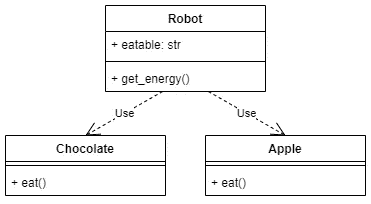

# 松散耦合和使用依赖反转编写更好的 Python 代码指南

> 原文：<https://betterprogramming.pub/a-guide-to-loose-coupling-and-writing-better-python-code-with-dependency-inversion-bec5f7460f7>

## 深入流行的设计模式

照片由瑞秋·尼克森 / [Unsplash](https://unsplash.com/?utm_source=ghost&utm_medium=referral&utm_campaign=api-credit) 拍摄

这篇文章是关于[坚实](https://en.wikipedia.org/wiki/SOLID)原则系列文章的第 5 部分。
你可以在这里找到 4 号岗位[，在这里](/the-interface-segregation-principle-isp-explained-in-python-46e173241642)找到 3 号岗位[，在这里](/the-liskov-substitution-principle-lsp-explained-in-python-6ab92b29d0b8)找到 2 号岗位[，在这里](/the-open-closed-principle-explained-in-python-f5517488f990)找到 1 号岗位[。](/the-single-responsibility-principle-explained-in-python-622e2d996d86)

我们终于达到了最后的坚实的原则。像往常一样，我们从一个定义开始:

原则 5 被称为依赖性反转原则。该定义有两个部分:

> A.高级模块不应该从低级模块导入任何东西。两者都应该依赖于抽象(例如接口)。
> 
> B.抽象不应该依赖于细节。细节(具体的实现)应该依赖于抽象。
> 
> 来源:[依存倒置原则——维基百科](https://en.wikipedia.org/wiki/Dependency_inversion_principle)

在传统的软件架构中，我们设计较低级别的组件供较高级别的组件使用/消费。换句话说，较高级别的组件依赖于较低级别的组件。这种依赖性导致了软件中的紧密耦合。正如原则 [one](/the-single-responsibility-principle-explained-in-python-622e2d996d86) 中所解释的，我们努力实现松耦合，以便将来更容易开发、维护和更改代码。

依赖性反转原则*在某种意义上反转了*这种依赖性，而不是更高级别的组件依赖于更低级别的组件，两者都应该依赖于抽象。这个抽象层将是一个位于高层和低层组件之间的中间组件。然后，这两个组件将使用这个组件相互通信和交互。抽象组件通常会被实现为一个*接口*。

是时候给出一些代码和具体的例子了！

# 密码

考虑下面的例子，其中我们模拟了一个机器人:

`Robot`类只有一个函数`get_energy`。我们制作了一个机器人可以从中获取能量的`Apple`模型。

现在，在某个时候机器人会厌倦吃苹果。所以我们增加了一个`Chocolate`类来给机器人提供更多的饮食选择。

然而，请注意`get_energy`方法发生了什么。我们必须传递一个字符串作为参数，指示机器人应该吃什么食物。此外，我们必须在两种不同的食物上使用 if-else 分支。现在你可以想象如果增加更多的食物，我们将需要更多的树枝。这不是好的设计。

此外，因为`Robot`依赖于每一个单独的食物，如果其中一个食物的实现发生变化，我们就会遇到问题。例如，如果我们向`Chocolate`中的`eat`方法引入一个额外的参数，那么`get_energy`中的代码将会中断，我们将不得不重构它以反映`Chocolate`中的变化。这些问题是由于*紧耦合*和*强依赖*造成的，违反了依赖反转原则。

目前，我们的架构如下所示:

依赖苹果和巧克力的机器人

# 解决办法

为了解决这个问题，我们需要引入一个抽象层。
我们将架构修改如下:

代码看起来像这样:

我们创建一个由`Apple`和`Chocolate`实现的`Eatable`接口。
我们改变了`get_energy`的方法签名，因此它需要一个类型为`Eatable`的参数，而不是`str`。这意味着我们可以去掉 if-else 分支。此外，由于所有的食物都实现了`Eatable`接口，我们确信如果`Chocolate`或`Apple`发生变化，将不会出现代码破坏。

# 结论

在这篇文章中，我们看了依赖倒置原则。该原则本质上是说，较高级别的模块不应该依赖于较低级别的模块。相反，两者都应该依赖于抽象。我们使高级模块独立于低级模块中的实现细节。

原则是:

*   加强松散耦合，从而有助于使代码在面对变化时更加健壮。
*   允许重用较高级别的组件，因为抽象层可以防止在较低级别的组件需要更改时出现代码中断。

我们终于到达终点了！

我希望你喜欢这篇文章和之前所有关于坚实原则的文章。

*最初发表于*【https://haseebkamal.com】