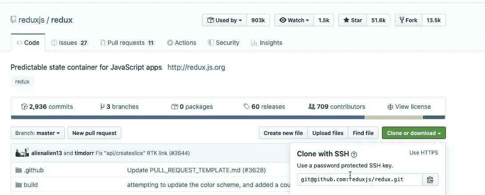
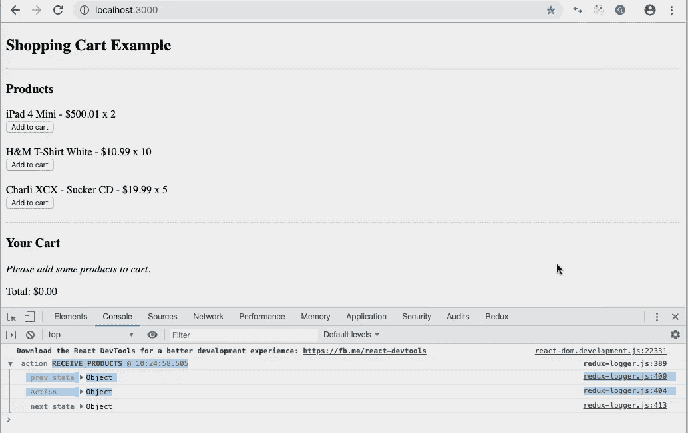
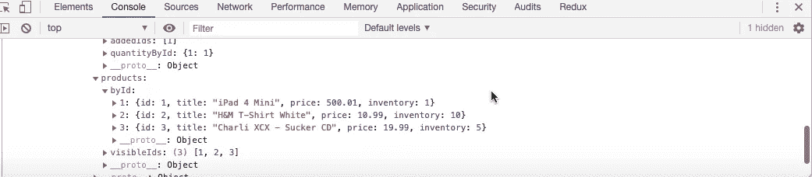
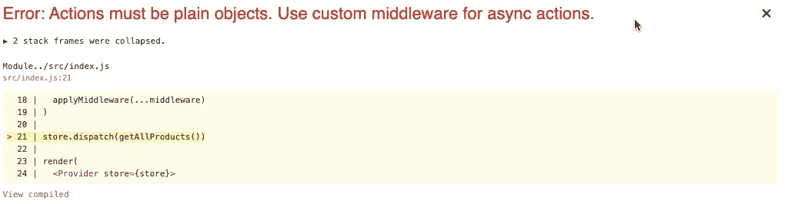
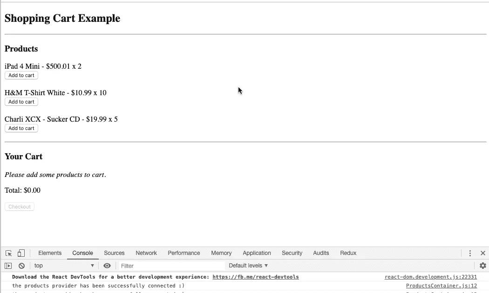
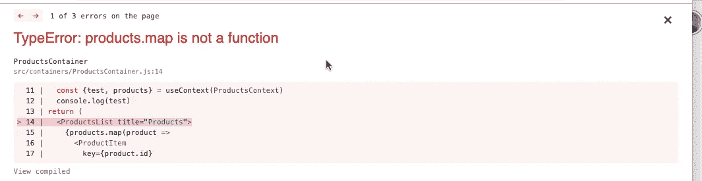

# 将 Redux 迁移到上下文 API 的指南

> 原文：<https://betterprogramming.pub/a-guide-to-migrating-redux-to-the-context-api-9829c66940fe>

## Redux 购物车重构到上下文 API 和 React 挂钩


马库斯·斯皮斯克在 [Unsplash](https://unsplash.com/s/photos/shopping-cart?utm_source=unsplash&utm_medium=referral&utm_content=creditCopyText) 上拍摄的照片

在下面的文档中，我们将从头开始，将一个 [Redux](https://redux.js.org/) 购物车产品的数据重构为上下文提供者模式。

*   [视频](https://www.youtube.com/watch?v=FVhEQBTfoXs&feature=youtu.be)
*   [源代码](https://github.com/01Clarian/ShoppingCart-Redux-Context-Migrate)

本指南主要关注 Redux 和上下文 API 的比较和对比。

refactor 旨在提供一个指导性的示例，并加深我们对 React 中状态管理的理解，实现各种高效的可伸缩模式。

# 流程概述

购物车应用程序将从官方的 Redux GitHub 存储库中提取，以维护标准的示例环境。

我们将在购物车应用程序中跟踪 Redux 的 Flux-like 模式，并通过关注产品数据，利用 React 挂钩和上下文 API 实现成功的状态管理重构。

# 指南大纲

*   克隆 Redux。
*   可扩展的状态管理分析。
*   跟踪购物车产品数据。
*   减速器和动作。
*   Thunk 和 logger:中间件与调度。
*   实现上下文提供者模式。
*   HOCs，HOFs 和 Redux `Connect()`。
*   利用 React 钩子和`useContext`。
*   `setTimeout()`对抗承诺。
*   最终上下文提供者模式重构。

好吧。所以，我们去喝点咖啡，然后开始表演吧。


请注意，对 Node 和 React 的基本要求有助于入门和理解一般概念。

# *克隆还原*

首先，进入 [Redux GitHub 库](https://github.com/reduxjs/redux)。



Redux Github Repo

通过复制 SSH 链接并在命令提示符下运行`git clone` 来克隆源项目。

```
git clone [git@github.com](mailto:git@github.com):reduxjs/redux.git
```

复制文件夹目录:`examples/shopping-cart`中的*购物车*文件夹，并将其粘贴到本指南中您可以方便访问的地方。

现在，使用终端(Mac)命令提示符，进入`cd shopping-cart`文件夹目录，通过运行`npm install`安装所有需要的节点模块。

在文本编辑器中打开代码源，然后通过运行`npm start`启动本地开发服务器。我们现在应该看到购物车应用程序在浏览器中启动并运行。

打开 DevTools 控制台(Chrome)来验证这一点，并注意 Redux Logger 已被激活并正在工作。



非常好。现在，让我们在继续之前快速而美味地啜饮一口咖啡。

# 应用程序结构和 API 仿真

只需在浏览器中查看购物车的显示，我们就可以确定两个主要部分:产品部分和购物车部分。

*   产品部分包含可供购买的产品列表，包括标题、价格和数量。此外，还有一个*添加到购物车*按钮，用于为购物车单独选择产品。
*   当我们点击 iPad 4 Mini *添加到购物车*按钮时，我们看到购物车部分得到更新，包括总价。如果我们向下滚动到 DevTools 中的 Logger，并检查上一个状态与下一个状态，产品库存就会相应地得到更新和反映。



下一状态记录器

但是，我们从哪里开始接收产品的项目数据呢？

好问题。在 Redux 购物车项目的 API 文件夹中，我们看到一个带有商品列表的`products.json`文件和一个`shop.js` 文件，从`products.json`抓取并导出数组。

`shop.js` `getProducts`对象的属性有一个额外的`setTimeout`函数，它被设置为 100 毫秒，以模拟从真实的 API 场景中获取购物车商品的 Async- *esque* 操作。

```
const TIMEOUT = 100export default { getProducts: (cb, timeout) => setTimeout(() => cb(_products), timeout || TIMEOUT),buyProducts: (payload, cb, timeout) => setTimeout(() => cb(), timeout || TIMEOUT)}
```

如果我们将`TIMEOUT`常量数值更改为 2000(两秒钟)并返回到浏览器并刷新，我们会注意到初始产品渲染将花费整整两秒钟才显示:`const TIMEOUT = 2000`。

现在已经定位并评估了我们的 API 数据结构和检索设置，让我们在 Redux 中完整地跟踪产品数据的状态检索管理过程。

# 产品:动作、还原器和 Thunk 中间件

如果我们进入`actions`文件夹，`index.js` 包含以下代码:

```
import shop from '../api/shop'import * as types from '../constants/ActionTypes'const receiveProducts = products => ({type: types.RECEIVE_PRODUCTS,products})export const getAllProducts = () => dispatch => {shop.getProducts(products => {dispatch(receiveProducts(products))})}
```

`receiveProducts`建立类型`types.RECEIVE_PRODUCTS`和有效载荷`products`。

该类型在`ActionTypes`文件中设置为常量。然后传递给两个减速器`visibleIds` 和`byIds`中的开关语句，这两个减速器位于`products.js`的减速器文件夹中。

保持对动作的关注，还要注意一个`getAllProducts`函数，它返回一个调度函数，该函数从商店获取`products.json`，并将产品的数据有效负载发送到我们的`receiveProducts`动作中。

回到位于我们的`src`文件夹中的主`index.js` 文件，如果我们删除我们的 Thunk 中间件:`const middleware = [ ];`，我们会收到以下错误:



由于该动作执行模拟的真实 API 获取，设置为一个`setTimeout()`，我们需要实现 Thunk 来正确地处理和处理异步动作。

沉思地啜饮一两杯咖啡，然后将 Thunk 返回给中间件:`const middleware = [thunk]`。

我们现在已经设法完成了对产品的数据 API 显示的全面评估:我们如何以及在哪里接收数据并在我们的应用程序中管理它。

有了这个评估，让我们继续设置上下文提供者模式的架构。

# 上下文提供者模式设置

回到项目的`src`文件夹，创建一个名为`providers`的新文件夹，并将文件放在名为`products.provider.js`的文件夹中。

在产品提供者文件中，我们将使用以下代码建立一个产品提供者预测试演示:

上面的代码首先引入`createContext`来访问 React 上下文 API 和`useState`钩子。然后，我们将我们的上下文设置为 const `ProductsContext`,在这里我们初始化一个对象，该对象接受我们设置为空字符串的 test 属性。

之后，我们创建了`ProductsProvider` 函数，该函数以儿童道具对象为参数，通过`Context.Provider`传递儿童道具。

在中，我们将 test 的状态初始化为一个字符串:`const [test] = useState(‘the products provider has been successfully connected :)’)`。

`ProductsProvider`然后显式地将`ProductsContext`返回给提供者，并在状态中传递一个对象测试的值，该值的属性为 children。

好吧，让我们停一下。这听起来可能有点拗口，但实际上很简单，除了需要遵循一些事情是如何连接的。

如果你跟不上，回头慢慢地一步一步来。只要确保你跟着痕迹走，它会更有意义，否则，如果你已经设法沿着这一部分走下去，恭喜你，让我们继续前进！

产品上下文知道一个空的 test 字符串，在这个字符串中，我们通过在产品的提供者中设置一个 const test 来初始化状态，也接受一个字符串。

然后，我们可以通过将`ProductsContext.Provider value={{test}}`设置为接收测试的对象，将`test`的状态设置为测试的对象属性。

最后把孩子当包装纸传过去。

为了使提供者能够包装在我们选择的组件/容器中，让我们简单地进入`src`文件夹中的`index.js file` ，导入提供者，并将其包装在我们的应用程序中，授予它对孩子的访问权限。

请注意，ProductsProvider 包装了 Redux store Provider，在应用程序状态管理树的最顶端展示了它。

# 上下文提供者模式测试

是时候多喝点咖啡，测试一下我们新的上下文提供者是否有效地工作了。

进入`productsContainer.js`中的`containers`文件夹。我们现在可以引入`useContext`钩子并从`ProductsContext`中析构我们的测试到我们的产品容器中，看看它是否工作。

我们的`productsContainer.js` 现在应该更新到上面的代码了。浏览器刷新后，DevTools 现在可以成功显示测试日志。



非常好。我们产品显示的上下文提供者模式现在已经完全连接好了，可以实现了。

让我们回到我们的`products.provider.js`文件，将产品数据完全重构到我们的上下文 API 设置中。

# 将产品数据迁移到上下文提供者

我们现在将更新`products.provider.js` 代码。首先，我们将从我们的`shop.js`导入商店。

我们将在产品数据的上下文对象中建立一个新属性，并将其设置为一个空数组。然后，我们将从 React 导入`useEffect`钩子，并创建一个同样设置为空数组的产品状态。

然后，我们将利用`useEffect`钩子来呈现我们的产品数据，方法是将钩子设置为`async`到`await`，从我们的商店获取产品数据，并设置对我们的产品状态的响应。

我们将在`useEffect`中留下一个空数组，这样默认情况下，挂载生命周期执行一次。

最后，我们将把产品的状态带入上下文提供者的值对象。

# 最终实施和异步与承诺

保存新更新的代码，让我们重新装满咖啡杯，回到`productsContainer.js`文件。

让我们通过从`ProductsContext`中析构`products`并从`ProductsContainer`中移除`products`被析构的道具来更新我们的产品数据，以便从我们的产品提供者而不是 Redux 提供者调用，如下所示。

保存所有内容后，我们现在会遇到以下错误。



不必惊慌，这是正常的行为。由于`setTimeout`不返回承诺，因此`async await`不会相应地执行以防止 JavaScript 运行，直到`setTimeout`间隔值完成。

为了保持这个 API 编码后的模拟效果，让我们回到`shop.js` 文件，对代码进行预定义。

让我们创建一个`async`匿名函数，并在`getProduct`数据检索属性周围包装一个`new Promise`。

```
* Mocking client-server processing */import _products from './products.json'const TIMEOUT = 100export default {getProducts: **async** **()=> new** **Promise**((cb, timeout) => setTimeout(() => cb(_products), timeout || TIMEOUT)),buyProducts: (payload, cb, timeout) => setTimeout(() => cb(), timeout || TIMEOUT)}
```

随着新的承诺补丁的修改，`getProducts`现在将返回一个承诺供我们的`async` `useEffect`检索。

保存此最新更新，我们的产品的购物车数据将再次成功显示安装。

恭喜你。现在，我们已经将最初产品的数据显示从 Redux 迁移到新安装的上下文提供者模式中。

喝一口或三口咖啡表示祝贺，让我们做一些最后的代码清理和审查。

# 最终重构和结论

回到我们的`productsContainer.js`文件，我们可以删除我们的`mapStateToProps` const 并将其从我们的 connect 中移除，因为我们产品的数据检索不再由 Redux 管理。

```
export default connect(null,{ addToCart })(ProductsContainer)
```

我们的应用程序将像以前一样继续工作，展示了一次成功的重构。

就像`Connect()`是一个更高阶的组件，它包裹着我们的`productsContainer`组件将数据状态传递给道具一样，我们的`ProductsProvider`现在代替了它。

产品上下文传递产品数据状态的子属性，因为产品提供者通过放置在应用程序树的顶部来包装我们的`index.js` 中的主应用程序。

尽管这两种实现都是有效的，但本指南并不倾向于将其中一种作为终极*指南*。

它只是依赖于每个应用程序，这些是我们需要仔细考虑并做出的决定，以便为我们的应用程序实现最有效的状态管理路径。

本指南纯粹是为了模拟一个重构过程，并以 Context 和 Redux 作为基本起点进行分析。

如果您想要一个额外的练习想法，您可以在 Redux 购物车示例中找到其他东西来重构。

如果您有任何问题或意见，请随时在下面留下。你也可以在这篇文章顶部的链接中查看完整的源代码或视频教程。

感谢您检查这一点，我希望你能找到一些有用的！

[](https://reactjs.org/docs/context.html) [## 上下文反应

### 上下文提供了一种通过组件树传递数据的方法，而不必每次都手动传递属性

reactjs.org](https://reactjs.org/docs/context.html) [](https://react-redux.js.org/) [## React Redux 官方 React 绑定

### Redux 的官方 React 绑定

Reduxreact-redux.js.org 官方反应绑定](https://react-redux.js.org/)