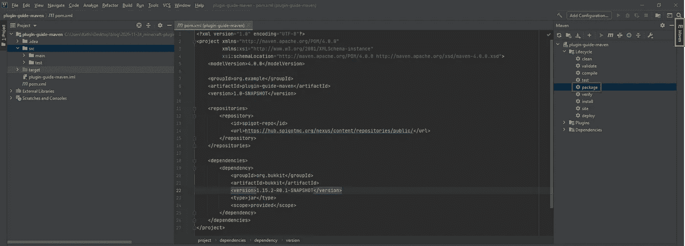
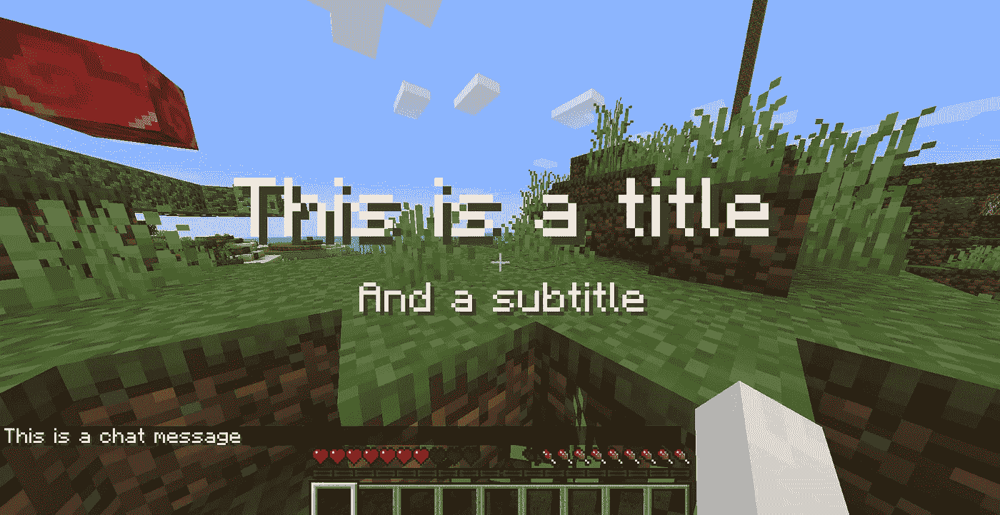

# Bukkit《我的世界》插件开发入门

> 原文：<https://betterprogramming.pub/a-guide-to-minecraft-plugin-development-with-bukkit-part-1-36490aaeb510>

## Java 开发人员指南


由[妮娜·里瓦斯](https://unsplash.com/@nina_eyes?utm_source=medium&utm_medium=referral)在 [Unsplash](https://unsplash.com?utm_source=medium&utm_medium=referral) 上拍摄的照片

最近，我决定在 CoderDojo Linz 举办一系列关于 Java 开发的研讨会。由于那里的许多孩子和青少年喜欢玩《我的世界》，选择《我的世界》插件开发作为这些研讨会的主题是一个直截了当的决定。

因为我以前从未玩过《我的世界》，所以我想先了解一下这个游戏。我玩 2 到 3 个小时来学习基础知识的计划升级得相当快，结果我一个星期都没有产出。嗯，我可能已经预料到了。无论如何，现在我回来了，在接下来的部分，我总结了一些关于用 [Bukkit](https://bukkit.org/) 开发《我的世界》插件的基础知识。

# 先决条件

请注意，本指南假设您已经熟悉 Java。如果你是 Java 新手，我建议你先了解 Java。在这里，你可以找到一些很好的资源来学习它。

此外，有一点与 [Gradle](https://gradle.org/) 或 [Maven](https://maven.apache.org/) 相处的经验也不错。我们使用这些构建工具将依赖项(简而言之:来自他人的代码)加载到我们的项目中，并将项目打包到 Java 档案(JAR)中。

本指南给出了你在`build.gradle`或`pom.xml`中需要的所有代码，但是如果你大致知道他们在做什么就更好了。

注意，您需要用自己的构建工具创建一个新项目。这里有一些给 [Gradle](https://www.baeldung.com/gradle) 和 [Maven](https://www.baeldung.com/maven) 的不错的指南。

# 运行本地 Spigot 服务器

要在你的服务器上安装 Bukkit 插件，你需要运行一个 CraftBukkit 服务器或者它的一个分支，比如[龙头](https://www.spigotmc.org/)或者[纸张](https://papermc.io/)。您可以按照下面描述的步骤启动并连接到 Spigot 服务器。

> 注意:这个指南是关于插件开发的，所以我没有太在意我选择的服务器。在很多情况下，你可能会选择纸而不是龙头，但是插件开发的工作流程是一样的。

1.  从[https://hub . spigotmc . org/Jenkins/job/build tools/lastsccessfulbuild/artifact/target/build tools . jar](https://hub.spigotmc.org/jenkins/job/BuildTools/lastSuccessfulBuild/artifact/target/BuildTools.jar)下载最新的`BuildTools`。
2.  在你的终端中用命令`java -jar BuildTools.jar`执行文件`BuildTools.jar`。
3.  将文件`spigot-<VERSION>.jar`复制或移动到一个空文件夹，用`java -jar spigot-<VERSION>.jar`执行。
4.  这将产生一些文件和文件夹，但不会旋转服务器，因为你需要接受《我的世界》的最终用户许可协议(EULA)第一。要接受它，打开文件`eula.txt`并将行`eula=false`改为`eula=true`。保存并关闭文件。
5.  再次执行`spigot-<VERSION>.jar`启动服务器。一旦线`[09:08:39 INFO]: Done (XXXs)! For help, type "help"`出现，你就准备好了。
6.  打开《我的世界》，选择“多人游戏”。在那里，您可以连接到运行在`localhost`上的新服务器。

# 创建基本插件

现在，您的服务器已经启动并运行，是时候创建一个基本插件了。首先，用 Gradle 或 Maven 创建一个新的 Java 项目。我用的是 Gradle 和 Java 11，但 Maven 也在本节中介绍。此外，我使用了 IntelliJ IDEA 社区作为 IDE。

要使用 Bukkit 的 [API](https://www.freecodecamp.org/news/what-is-an-api-in-english-please-b880a3214a82/) ，你需要将以下依赖项添加到你的`build.gradle`中，并用 Bukkit API 的当前版本替换`[VERSION]`，你可以在这里找到[。在撰写本文时，最新版本是`1.15.2-R0.1-SNAPSHOT`。](https://hub.spigotmc.org/nexus/content/repositories/public/org/bukkit/bukkit/maven-metadata.xml)

```
implementation group: 'org.bukkit', name: 'bukkit', version: '[VERSION]'
```

因为这个依赖项没有存储在任何标准存储库中，所以您还需要添加以下存储库。

```
maven { 
  url "https://hub.spigotmc.org/nexus/content/repositories/public/" 
}
```

如果您决定选择 Maven 而不是 Gradle，那么您需要向您的`pom.xml`添加以下依赖项。

```
<dependency>
    <groupId>org.bukkit</groupId>
    <artifactId>bukkit</artifactId>
    <version>[VERSION]</version>
    <type>jar</type>
    <scope>provided</scope>
</dependency>
```

当然，您还需要添加以下存储库。

```
<repository>
    <id>spigot-repo</id>
    <url>https://hub.spigotmc.org/nexus/content/repositories/public/</url>
</repository>
```

现在是时候创建插件的主类了。因此，您现在必须创建一个新的 Java 类。您可以随意命名它，我将本指南的主类简单地命名为`BukkitPlugin`，这绝对不是一个好的描述性名称。当你开发一个真正的插件时，试着为你的类找到描述性的名字。

让你的新类扩展`org.bukkit.plugin.java.JavaPlugin`，覆盖方法`onEnable(...)`，你就可以开始了。此时，您的整个类应该是这样的:

当您的插件在服务器上启用时，总是会调用`onEnable(...)`方法。

接下来，您需要配置您的插件。要完成这一步，在项目的`resources`文件夹中创建文件`plugin.yml`。

> 信息: [YAML (YAML 不是标记语言)](https://yaml.org/)是一种人类可读的数据序列化标准，通常用于配置文件。它使用文件扩展名`.yaml`或`.yml`。

Bukkit 加载插件需要这个文件。您可以在这个文件中配置很多东西，但是有三个属性是必需的:

*   `name`:你的插件的名字(不能包含任何空格)。
*   `version`:你插件的版本。
*   `main`:你插件的主类。

您可以在 [BukkitWiki](https://bukkit.gamepedia.com/Plugin_YAML) 中找到所有可用的属性。我建议也提供属性`api-version`。它描述了您打算使用 Bukkit 的哪个 API 版本。设置完所有这些属性后，您的`plugin.yml`应该包含以下属性:

```
name: MinecraftPluginGuide_DemoPlugin
main: BukkitPlugin
version: 0.1
api-version: 1.16
```

现在你创建了一个非常基本的插件。它不会做任何事情，但是您已经为接下来的步骤设置好了您需要的一切，您可以进入下一部分，学习如何将您的插件部署到服务器。

# 部署插件

要部署插件，首先需要生成一个包含所有代码和依赖项(如果有的话)的 JAR 文件。接下来，确保您的服务器没有运行，并将 JAR 复制到服务器的`plugins`目录中。现在你可以运行你的服务器了(见第 1 节),你的插件将被加载。你可以通过在游戏中运行命令`pl`或者直接在服务器窗口检查它是否工作。您的插件应该包含在结果列表中。除此之外，当你的插件被加载时，你会看到一个日志消息。

下面几节描述了如何用 Gradle 和 Maven 将项目打包到一个 JAR 中。

## 格拉德勒

如果您只使用 Bukkit 的依赖项，您可以通过在终端中执行以下命令来简单地打包您的项目。请注意，您需要在项目的根目录下才能执行它。

```
./gradlew jar
```

该命令成功后，您可以从项目内的文件夹`build/libs`中获得项目的 jar。

如果您使用 Bukkit 之外的任何其他依赖项，您需要将它们包含在您的 JAR 中，并创建一个所谓的“胖 JAR”。默认情况下，它们不包括在内。您可以创建一个带有`jar`任务的 fat JAR，只需通过以下方式覆盖它:

```
jar { 
    manifest { 
        attributes "Main-Class": "BukkitPlugin" 
    }     from { 
        configurations.compile.collect { it.isDirectory() ? it : zipTree(it) } 
    } 
}
```

这对于小项目来说是可以的，但是对于更大的项目，我会推荐 [Shadow](https://github.com/johnrengelman/shadow) 插件。它添加了一个新的生成 fat JAR 的`gradle`任务。

要添加它，您需要将下面的依赖项添加到您的`build.gradle`中的`plugins`块中。用您想要的版本替换`[VERSION]`模块。撰写本文时的最新版本是`6.1.0.`。

```
id 'com.github.johnrengelman.shadow' version '[VERSION]'
```

完整的`plugins`块现在应该是这样的。

```
plugins { 
    id 'java' 
    id 'com.github.johnrengelman.shadow' version '[VERSION]' 
}
```

现在，您可以通过执行以下命令来创建一个 fat JAR。

```
./gradlew shadowJar
```

## 专家

如果您只使用 Bukkit 的依赖项，您可以通过执行相应的 Maven 任务来简单地打包您的项目。如果要在控制台执行，需要在电脑上安装 Maven。因此，我将只使用 IntelliJs 的内置功能来执行 Maven 任务。

要创建一个 JAR，打开 IntelliJ 右上角的 Maven 工具栏(下图中的橙色方块)，然后打开`Lifecycle`下拉菜单，如果它是关闭的，单击`package`(绿色方块)。



IntelliJ IDEA 社区 Maven 任务

这个任务成功后，您可以从项目中的文件夹`target`中获得项目的 JAR。

如果您使用 Bukkit 之外的任何其他依赖项，您需要将它们包含在您的 JAR 中，并创建一个所谓的“胖 JAR”。默认情况下，它们不包括在内。要在 maven 中创建一个 fat JAR，首先需要在您的`pom.xml`中的`version`标签下添加一行`<packaging>jar</packaging>`。

现在我们将使用 [Apache Maven Shade 插件](https://maven.apache.org/plugins/maven-shade-plugin/)来创建一个胖罐子。将以下程序块添加到您的`pom.xml`中进行配置。请注意，在复制下面的配置时，您可能需要更改主类。

现在您可以再次执行`package`任务，将会生成两个 jar。后缀为“-shaded”的是脂肪罐。

# 记录

Bukkit 有一个内置的日志记录机制，运行得相当好。以下小节描述了如何使用它。

## 获取记录器

您可以通过调用`Bukkit.getLogger()`或(如果您在`JavaPlugin`类中)`getServer().getLogger()`来获得服务器的主记录器的实例。您可以使用这个日志记录器向服务器的日志流发送消息，但是我建议您使用您插件的日志记录器。这样，很明显日志消息来自你的插件，因为它们是有前缀的。要获得这个日志记录器，你需要在你的`JavaPlugin`类中。在那里你可以简单地调用`getLogger()`。我将在下面的例子中使用这种方法。

## 日志级别

Bukkit 提供了 7 个预定义的日志级别，您应该使用它们来区分您的日志消息。这些级别(按降序排列)是:

*   `SEVERE`:表示严重故障
*   `WARNING`:表示潜在问题
*   `INFO`:信息性消息
*   `CONFIG`:静态配置消息
*   `FINE`:追踪信息
*   `FINER`:相当详细的追踪信息
*   `FINEST`:非常详细的跟踪信息

默认情况下，`INFO`以上的所有日志级别都会打印到控制台。

## 记录消息

要记录消息，您可以简单地执行下面一行。当然，第一个参数可以替换为上述任何日志级别。第二个参数，消息，也可以由你选择。

```
logger.log(Level.INFO, "Info log message");
```

`Logger`类还提供了一些直接记录到某个日志流的方法，不需要传递级别。因此，用下面的语句可以得到与上述语句相同的结果。

```
logger.info("Info log message");
```

当然，这适用于所有日志级别。

## 设置自定义日志前缀

默认情况下，您在`plugin.yml`中提供的`name`被用作日志消息的前缀，通过插件类的日志记录器发送。如果您喜欢使用不同的前缀，您可以这样设置`plugin.yml`中的属性`prefix`:

```
prefix: custom-log-prefix
```

## 更改日志级别并记录到文件

不幸的是，不可能将任何低于`INFO`的级别记录到服务器的控制台或标准日志文件中。Bukkit 论坛的一个版主说，在[这个帖子](https://bukkit.org/threads/setting-the-bukkit-log-level.489087/)。

因此，如果您想将级别设置为`INFO`(默认设置)、`WARNING`或`SEVERE`，那么以编程方式设置日志级别才有意义。设置日志级别意味着将记录该级别及其以上级别的所有消息。

这意味着如果日志级别为`INFO`，所有的`INFO`、`WARNING`和`SEVERE`消息都将被记录。使用下面的命令可以很容易地将日志级别更改为这些级别之一。当然`INFO`可以替换为任何其他级别，但是(如上所述)只有`WARNING`或`SEVERE`有所不同。

```
logger.setLevel(Level.INFO);
```

幸运的是，有可能使用所有的日志级别。您只需添加一个定制的处理程序，顾名思义，它处理日志消息。

下面几行显示了如何将你的插件日志记录程序的所有日志信息发送到一个文件中。这非常有用，因为会生成一个日志文件，其中只包含插件的日志消息。当然，您的插件日志消息仍然会被发送到标准输出流。

为了给你的记录器添加一个新的处理程序，我建议覆盖你的`JavaPlugin`的`onLoad()`方法，并在那里添加下面的代码。请阅读代码中的注释，了解它在做什么。

当插件被禁用时，处理程序也应该被关闭。这可以通过以下代码实现:

创建处理程序时，可以通过设置不同的格式化程序来更改日志消息的格式。以下代码生成格式为`[<TIME>][<LEVEL>]<MESSAGE>`的日志消息。

# 理解《我的世界》坐标系

玩家的坐标代表他在一个维度中的位置。维度是一个世界中可访问的领域。坐标系的中心是原点。所有玩家的产卵点都位于原点附近。


《我的世界》坐标系

《我的世界》有一个三维坐标系，这意味着它有三个轴。它们都在原点相交。以下是可用的轴:

*   `X`轴:代表玩家向原点的东(正值)或西(负值)移动了多远。
*   `Z`轴:代表玩家向原点的南(正值)或北(负值)移动了多远。
*   `Y`轴:代表玩家与原点相比有多高(正值)或多低(负值)。

这意味着玩家的位置总是用 3 个值来描述:X，Y 和 z。原点的坐标是`X: 0, Y: 0, Z: 0`。在玩《我的世界》的时候，你可以简单地通过按下`F3`来切换调试屏幕，以查看你当前的坐标。

坐标系中的一个单位代表一个区块。这意味着位置`X: 1, Y: 0, Z: 0`将是原点以东的一个街区。

# 添加自定义命令

要向服务器添加定制命令，您需要完成两个步骤:在插件的`plugin.yml`中注册您的命令，并向您的代码添加命令处理程序。这两个步骤都在本节中进行了描述。例如，我们将添加两个非常简单的命令。第一个命令记录特定的消息，而第二个命令记录用户作为参数传递的消息。

## 注册命令

要注册您的命令，您需要将它添加到您的插件的`plugin.yml`中。您可以使用键`commands`添加命令列表。列表项的关键元素是命令名。一个命令可以包含以下属性:

*   `description`:该命令功能的简短描述。
*   `aliases`:命令的替代名称。
*   `permission`:使用该命令所需的权限(更多细节将在本指南的第二部分介绍)。
*   `permission-message`:当没有权限的人试图触发命令时显示的消息。
*   `usage`:如何使用该命令的简短描述。

如上所述，我们将添加两个命令，一个只记录消息，另一个记录用户作为参数传递的消息。您可以在下面看到命令的配置。

请注意，您也可以在此处添加命令权限，但这将包含在本指南的第二部分中。第一个命令，`log-anything`可以用三个名字触发:`log-anything`、`log_anything`和`loganything`，因为后两个名字在别名列表中。

请注意，添加大写字母的命令(如`logAnything`)不起作用。第二个命令`log`接受消息作为参数记录。这里不需要定义参数，因此您必须检查代码中是否给出了正确的参数数量。

```
commands:
    log-anything:
        description: Logs a message to the console
        aliases: [loganything, log_anything] 
        usage: /log-anything
    log: 
         description: Logs the given message to the console 
         usage: /log [message]
```

## 处理命令

有两种方法处理命令:

*   在插件的主类中覆盖`onCommand(...)`方法。
*   添加一个定制的`CommandExecutor`并覆盖那里的`onCommand(...)`方法。

如果您只有一两个小命令，我会推荐第一个选项。在所有其他情况下，我更喜欢第二种选择，因为它提供了更好的关注点分离。在下面的小节中，显示了这两个选项。

## 在插件的主类中覆盖`onCommand(...)`

对定制命令做出反应的最简单的可能性可能是在插件的主类中覆盖`onCommand(...)`方法。每当用户调用一个命令时，该方法被执行，该命令被记录在`plugin.yml`中。此方法包含以下参数:

*   `CommandSender sender`:命令的来源(详见下一小节)。
*   `Command command`:执行的命令。
*   `String label`:使用的别名。
*   `String[] args`:传递给命令的参数。

当触发的命令有效时，该方法返回 true，否则返回 false。如果返回 false，命令的用法(在`plugin.yml`中定义)被发送给播放器。

如果您在`plugin.yml`中只注册了一个命令，您不需要检查哪个命令是在`onCommand(...)`中发送的。由于我们在上一步中注册了两个命令，我们需要检查应该执行哪个命令。这可以通过一个`if`语句或一个`switch`语句来完成，如下例所示。要检查哪个命令被发送，您可以使用命令的名称，这可以通过调用`command.getName()`获得。以下代码显示了如何区分这些命令。

现在让我们来看看`log`命令。它接受玩家提供的参数并记录下来。参数始终由空格分隔(即使您用引号将多个单词括起来)。

因此，我们不能只记录第一个参数，而是需要结合所有参数来记录用户传递的完整短语。请查看代码中的注释以了解更多细节。

命令`log-anything`稍微简单一点，因为它不需要任何参数。因此，它只记录一条消息并返回`true`，如下所示。

您的完整`onCommand(...)`方法现在应该是这样的:

## 添加自定义`CommandExecutor`

正如你所想象的，如果你有很多命令并使用前面描述的方法，插件的主类会变得很大。幸运的是，有另外一种选择。您可以添加任意数量的实现`CommandExecutor`的类。这些类可以处理你的命令。为此，您需要创建一个新的类，并让它实现`CommandExecutor`接口。

您将被迫覆盖`onCommand(...)`方法，这样做之后，您可以像在插件的主类中一样使用它。如果您只为一个命令注册了一个`CommandExecutor`,您可以跳过检查命令名，并假设您为其注册了执行器的命令已被触发。

让我们从实现`CommandExecutor`开始。如前所述，它只是一个实现接口并再次覆盖`onCommand(...)`的类。我不会进一步详述`onCommand(...)`中的代码，因为它与上面的代码完全相同。这堂课唯一值得注意的是，我期待一个`Plugin`作为参数。当命令被触发时，这对于获取插件的日志是必要的。

完成`CommandExecutor`后，它需要注册到插件主类的`onEnable(...)`方法中。这可以通过下面的代码简单地实现。

## 命令来源

可以从播放器或服务器控制台发送命令。在某些情况下，检查命令是否由玩家发出可能很重要。您可以实现以下检查，以确保命令是由玩家发送的。

```
if (sender instanceof Player) { 
  // Command was sent from a player 
}
```

## 命令名

仔细考虑您选择的命令名。选择已经在《我的世界》或其他插件中可用的命令名称，可能会使您的插件与这些插件不兼容。

# 与玩家交流

和玩家交流有很多种可能。下面的小节描述了一些你可以向玩家发送信息的方法。对于这三种方法，您都需要一个您想与之通信的播放器的实例。正如在其他章节中解释的那样，这里的先决条件是您有一个播放器实例。

## 发送聊天信息

发送聊天信息只需一个命令。你只需要执行播放器的`sendMessage(String message)`方法。

```
player.sendMessage("This is a chat message");
```

## 在游戏中显示消息

发送一条直接在游戏中显示的消息，与`sendTitle(...)`一起工作，它需要以下参数:

*   `title`:要显示的标题。
*   `subtitle`:要显示的字幕。
*   `fadeIn`:字幕淡入的时间(默认为 10)。
*   `stay`:标题停留的时间(默认为 70)。
*   `fadeOut`:字幕淡出的时间(默认为 20 秒)。

```
player.sendTitle("This is a title", "And a subtitle", 10, 70, 20);
```

## 播放声音

播放声音也可以通过简单的方法调用来实现。`playSound(...)`该方法需要以下参数:

*   `location`:在哪里播放声音。
*   `sound`:要播放的声音。不幸的是，只有已经在游戏中的声音可以通过插件播放。您可以通过`Sound`枚举来访问它们。
*   `volume`:声音的音量。
*   `pitch`:声音的音高。

```
player.playSound(player.getLocation(), Sound.ENTITY_PLAYER_LEVELUP, 1, 1);
```

不幸的是，声音无法在图像中捕捉，但下图至少显示了与玩家交流的方法 1 和 2。我保证它也播放了声音；-).



# 下一步是什么？

本指南涵盖了使用 Bukkit 开发《我的世界》插件的基础知识。为了更深入地了解《我的世界》插件开发的主题，我建议的主题是:

*   收听事件
*   添加自定义事件
*   添加自定义食谱
*   添加配置文件
*   处理权限
*   持久数据
*   计划任务
*   本地化您的插件
*   调试你的插件
*   关于插件部署的更多细节

# 资源

完整的源代码可以在 [GitHub](https://github.com/KatharinaSick/minecraft-plugin-guide) 上找到。

# 版本信息

*   [《我的世界》1.16.4 (Java 版)](https://www.minecraft.net/de-de)
*   [构建工具#122](https://hub.spigotmc.org/jenkins/job/BuildTools/)
*   [龙头 1.16.4](https://www.spigotmc.org/)
*   [IntelliJ IDEA 社区 2020.2.3](https://www.jetbrains.com/idea/download/#section=windows)
*   Java 11
*   Bukkit 依赖项:1 . 15 . 2-r 0.1-快照
*   [Gradle Shadow 插件 6.1.0](https://github.com/johnrengelman/shadow)