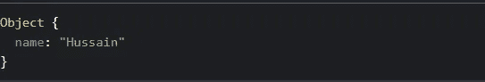

# React 中的道具指南

> 原文：<https://betterprogramming.pub/a-guide-to-props-in-react-d6980f947ea9>

## 关于 React 中的道具，你需要知道的一切


照片由 [Yann Allegre](https://unsplash.com/photos/q9XgBcv1pA8) 在 [Unsplash](https://unsplash.com/) 拍摄。

你想为客户的猫店建一个网站。客户有大量的猫，并要求您创建一个网站，其中包含了出售的猫的完整目录。

在一个简单的 HTML 中，这是您实际实现`cats`目录的方式:

仅仅为四只猫编写近 30 行代码看起来并不费力。但是如果你想扩展你的网站来处理更多的动物(比如 30 只猫)，该怎么办呢？对于 web 开发人员来说，这变成了一项极其乏味的任务。

如果我们使用功能组件来做同样的工作会怎么样？

现在渲染它:

```
ReactDOM.render(<ContactCard/>,document.getElementById('root')
```

尽管这已经被证明是非常容易的，但是还有一个警告:所有的值都是硬编码的。不是每只猫都应该有相同的电话号码、电子邮件、名字和其他属性。

这就是 React 中道具派上用场的地方。

# 道具到底是什么？

举一个简单的 JSX 代码:

```
<ContactCard **number**="12345"/>
```

这里的`number`属性可以定义为一个属性——或者简称为 prop。

当 React 看到代表用户定义组件的元素(`ContactCard`)时，它将 JSX 属性和子元素作为单个对象传递给该组件。这个物体也被称为`props`。

简而言之，React props 就像 JavaScript 中的函数参数和 HTML 中的属性。为了将属性发送到组件中，我们使用与 HTML 属性相同的语法。

# 如何使用道具

## 示例 1:基本用法

例如，让我们定义一个定制的功能组件`Welcome`，它根据传递给它的属性打印用户的名字。
在这里，道具的名称为`name`:

这将是浏览器中的代码输出:


代码的输出。

正如所观察到的，`name`道具被赋予一个相应显示的值。根据这段代码，`props.name`属性被赋值为`Hussain`。最后，在`h1`元素中打印出`props.name`的值。这是标准的 JSX。

如果我们记录下`props`对象的值，我们会看到:



道具的价值。

正如所观察到的，`props`返回一个由传递给 JSX 元素的值组成的对象。

现在，我们可以使用这段代码来欢迎多个用户，而不用硬编码这些值:

代码的输出如下所示:


代码的输出。

注意，我们不需要为不同的名称多次重写不同的头。这不仅促进了模块化，而且现在代码看起来更整洁、更易读。

## 示例 2:在元素之间传递数据

我们可以使用我们的嵌套组件概念(自定义组件在另一个自定义组件中)来实现这个方法。

重用第一个例子中的`Welcome`:

这将是代码的输出:


上面写的代码的输出。

# 重写我们的猫的例子

既然我们已经介绍了基础知识，我希望您重写在本文开头写的示例。

## 解决方案#1

创建一个函数`ContactCard`，并使用 props 在 JSX 元素中传递值:

现在使用我们创建的`ContactCard`元素，并在其中指定给定的道具:

请注意，我们的代码现在更易于阅读，并且不再需要对值进行硬编码。

然而，有一个与之相关的问题:如果客户选择添加许多关于他们的猫的属性，那么我们的代码将再次变得复杂。让我们转到解决这个问题的第二种方法。

## 解决方案 2

无论我们在哪里呈现我们的`ContactCard`元素，我们都可以像这样修改代码:

```
<ContactCardcontact={{name: "Mr. Whiskerson", imgUrl: "http://placekitten.com/300/200", phone: "(212) 555-1234", email: "mr.whiskaz@catnap.meow"}}/>
```

注意这个`contact`道具有多个值。

要使用它，现在像这样修改您的`ContactCard`定义:

这种方法的另一个实际用例可能是，如果用户有两种类型的信息，而我们只想显示他们的公共信息。所以我们可以声明两个道具:`personalInfo`和`privateInfo`。`privateInfo`可以有类似于`phoneNumber`和`address`的值，而我们的`personalInfo`属性可以包含类似于`twitterID`和`mediumAccountId`的值，这些值将在稍后显示。

假设我们有来自 API 的输入数据。在这种情况下，我们将使用 JavaScript 中的`map`方法。让我们接下来讨论那个。

# 在 React 中映射组件

JavaScript 中的`map()`方法通过调用父数组中每个元素的特定函数来创建数组。

假设我们有来自名为`jokesData.json`的 API 的数据。这个文件有一系列笑话:

现在我们使用`map`方法在程序中正确显示数据:

在这段代码中，我们使用了`map`方法。对于 JSON 文件中的每个对象，我们用所需的属性生成一个新元素。最后，我们用简单的 JSX 显示数组。

该方法在官方文件的[中有详细介绍。](https://reactjs.org/docs/lists-and-keys.html)

如果不指定`id`字段，React 会抛出一个错误。`id`字段是一个特殊的字符串属性，您需要在创建元素列表时包含它。我们将在下一节讨论为什么这很重要。

# 有一点要记住

道具是只读的！

无论你将一个组件[声明为函数还是类](https://reactjs.org/docs/components-and-props.html#function-and-class-components)，它绝不能修改自己的道具。

看看这个函数:

```
function sum(a, b) {
  return a + b;
}
```

上面的函数被认为是一个纯粹的函数，因为它不改变它的输入。

另一方面，下面的函数被归类为不纯，因为它试图改变作为参数传递的输入值:

```
function change(a) {
a = 34
}
```

因此， [React 提到了](https://reactjs.org/docs/components-and-props.html)一条严格的规则:

> "所有的 React 组件必须表现得像纯函数一样."

如果你觉得需要动态地改变道具，你可以使用另一个叫做状态的概念。这个概念将在下一篇文章中介绍。

# 概述

要使用道具:

```
function Welcome(props) {
  return <h1>Hello, {props.name}</h1>;
}ReactDOM.render(<Welcome name='Hussain', document.getElementById('root'));
```

*   重要提示:道具是只读的。它们不能被改变。

# 更多资源

*   [反应中的组件和道具](https://reactjs.org/docs/components-and-props.html)
*   [React 道具— W3 学校](https://www.w3schools.com/react/react_props.asp)
*   [如何在 React 中将道具传递给组件](https://www.robinwieruch.de/react-pass-props-to-component/')
*   [ReactJS 教程:共同进化的道具](https://www.youtube.com/watch?v=m7OWXtbiXX8)

# 结论

今天到此为止。非常感谢你坚持到最后！

如果您对这些概念中的任何一个感到困惑，我给你的建议是摆弄代码并解构示例程序，这样您就可以正确地理解这个概念。在 React 开发的世界中，道具是一个非常重要的概念。不要放弃！

下一篇文章:[React 中基于类的组件](https://medium.com/@hussainarifkl/class-based-components-in-react-440eb8ed85a0)
上一篇文章:[React 中 CSS 样式和编写的基础知识](https://medium.com/better-programming/the-basics-of-styling-and-writing-css-in-react-ff936ac98ffc)