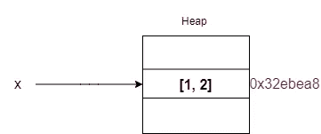
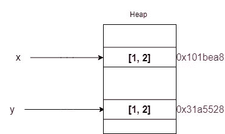
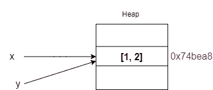

# Python 引用计数指南

> 原文：<https://betterprogramming.pub/a-guide-to-reference-counting-in-python-27334fc2e3c1>

## 内存中的 Python

照片由[斯蒂夫·约翰森](https://unsplash.com/@steve_j?utm_source=medium&utm_medium=referral)在 [Unsplash](https://unsplash.com?utm_source=medium&utm_medium=referral) 上拍摄

在这篇文章中，我将讨论 Python 中的引用计数。为了便于说明，我将使用 list 对象，它是可变的。我希望你会喜欢它。注意，我不会深入 C 实现的细节。

页（page 的缩写）s:在您的硬件上，代码片段的输出可能会有所不同。

# 变量是内存引用

Python 中的变量是内存引用。说`x=[1, 2]`会怎么样？`[1, 2]`是对象。回想一下，在 Python 中，一切都是对象。`[1, 2]`将在记忆中被创造。`x`是`[1, 2]`对象的内存引用。

关注下面的例子——您可以找到`x`引用的内存地址。请注意，您可以只使用`id(x)`，它会给您以十进制为基础，而`hex`函数会将其转换为十六进制。

# 引用计数

到目前为止，我们已经在内存中创建了一个列表对象和对该对象的引用。`y=[1,2]`和`y=x`有什么区别？

当你说`y=[1,2]`时，它会在内存中创建一个新的列表对象，而`y`会引用它。

而当你说`y=x`时，你基本上是告诉 Python 你希望`y`变量引用`x`变量所引用的内容。因为变量是内存引用。

您可以确认`x`和`y`引用同一个对象。

# 引用计数的数量

到目前为止还不错——我们学到了很多。现在，有多少变量引用了一个对象？

## **错误使用**

我看到有些人使用`sys.getrefcount(var)`却不知道传递`var`给对象多加一个引用。让我们看看下面的例子。

看看这个。在我们期待`2` ( `x`和`y`)的同时输出`3`。这是因为将`x`传递给`getrefcount`函数增加了一个引用。

## **最好用**

您可以使用内置的 ctypes 模块找到您期望的结果。你必须将`x`的 id 传递给`from_address`函数。

为什么会这样？因为**在错误的用法**中，你传递的是变量，而**在更好的用法中，**传递的是变量的 id，这意味着你传递的只是一个基数为 10 的数字，而不是变量。

# 当物体消失时

当没有变量引用一个对象时会发生什么？该对象将从内存中删除，因为没有任何对象引用该对象。请注意，这里有一个例外。如果有循环引用，`garbage collector`就会来打。我不会进入这里的垃圾收集器。

# 为什么我使用可变对象

对于不可变对象，由于性能原因，结果可能与您预期的不同。我可能会讨论未来科学背后的东西。

检查下面例子，看看输出是如何变化的。

# 结论

到目前为止，我们讨论的所有内容都适用于 CPython。我希望你喜欢它。