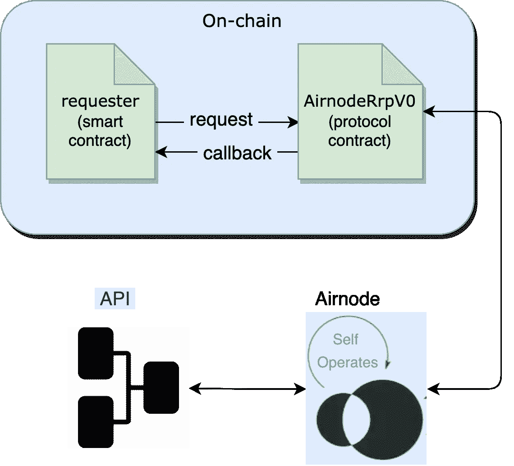
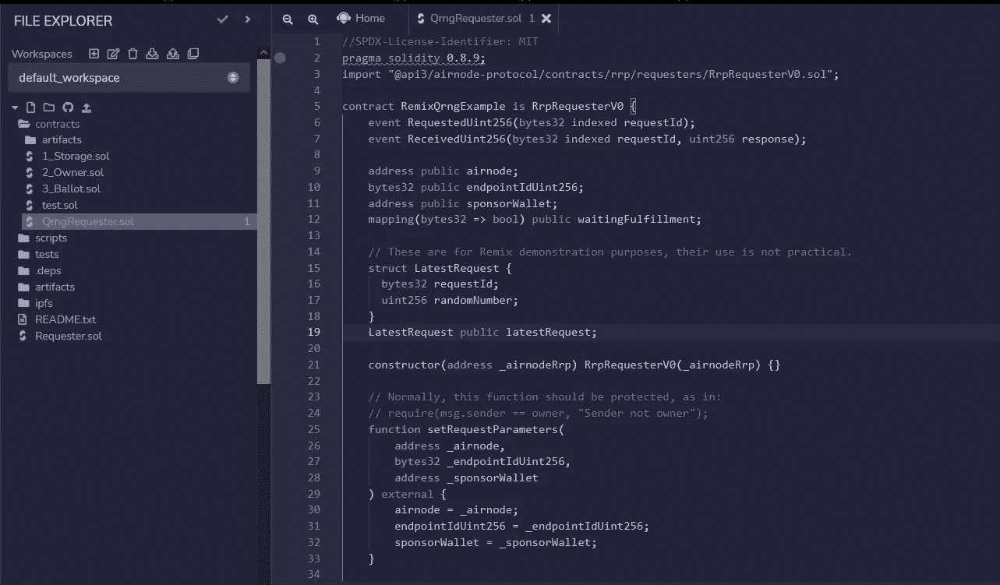
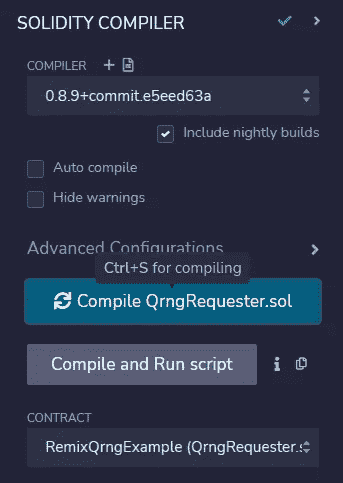
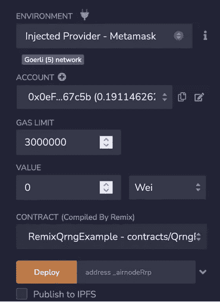
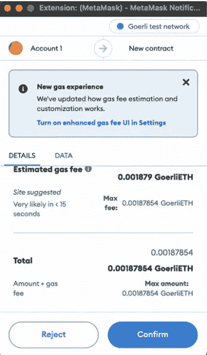
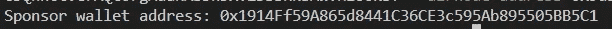
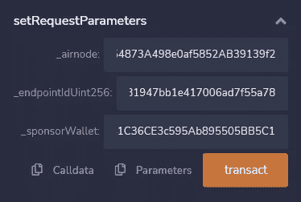
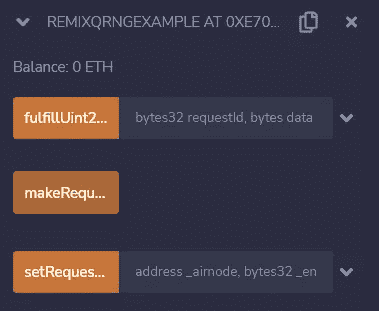
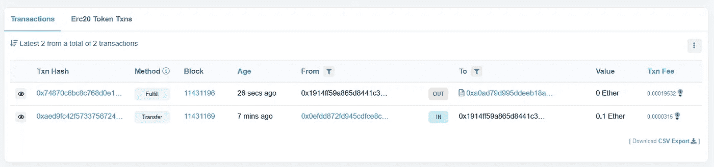
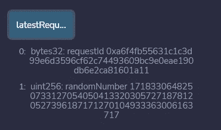

# 在你的智能合约中使用 ANU 量子随机数发生器的指南

> 原文：<https://betterprogramming.pub/a-guide-to-using-anus-quantum-random-number-generator-in-your-smart-contracts-21be5bed5aba>

## 用真正的随机数创建你的程序


照片由[飞:D](https://unsplash.com/@flyd2069?utm_source=medium&utm_medium=referral) 在 [Unsplash](https://unsplash.com?utm_source=medium&utm_medium=referral)

使用智能合约时，随机数生成(RNG)一直是最大的问题之一。确定性虚拟机无法产生“真正的”随机性。因此，RNG 需要作为 oracle 服务提供。

为了满足智能合约中随机性的需求，分散伪随机 RNG 是一种常见的方式。最常用的方法之一是 Chainlink 的 VRF 或可验证随机函数，它在链上提供密码可证明的随机数。它生成一个带加密证明的随机数字，用于验证结果。

> 但是，这种配置与任何其他第三方 oracle 网络一样存在同样的问题。建立一个可以提供 PRNG 的 oracle 节点暴露了潜在的攻击媒介，如 [Sybil 攻击](https://en.wikipedia.org/wiki/Sybil_attack)，但也缺乏源代码透明性和分散性。例如，人们需要信任管理实体来选择网络参与者，这意味着分散的 PRNG 只与管理实体一样安全和分散。

# 量子随机数生成

qrg 通过量子现象产生随机性。它使用“真正的”熵源，利用量子物理的独特属性来产生真正的随机性。

有不同的实现 qrg 的方法，具有不同的实用水平，但共同点是产生的数字将是真正随机的，因为量子事件的结果在理论上是不确定的，具有明确定义的特征。因此，qrg 是随机数生成的黄金标准。

# 澳大利亚国立大学的 QRNG Airnode


ANU 的艾伦·特兰特博士

正如我们已经讨论过的，通过第三方 oracle 网络提供 RNG 为攻击媒介打开了空间。但是由 [QRNG API](https://docs.api3.org/qrng/) 提供者直接操作的第一方 Oracle([air nodes](https://docs.api3.org/airnode/v0.8/))可以最佳地对抗 Sybil 攻击风险。

API 3 qrg 是由澳大利亚国立大学(ANU)提供的公共事业。它由 ANU 量子随机数托管的 Airnode 提供支持，这意味着它是第一方服务。澳大利亚国立大学的量子光学部门是该领域世界领先的研究机构之一。该部门还运行一个 REST API，[量子随机数 API](https://quantumnumbers.anu.edu.au/) ，为 Web2 中的 QRNG 提供服务。

[阅读更多关于 ANU 如何通过测量真空的量子波动实时产生随机数的信息](https://quantumnumbers.anu.edu.au/)

它是一种公共产品，是免费的(除了天然气费用)，当需要 RNG 链时，它通过一个易于使用的解决方案提供“真正的”量子随机性。

# Airnode 和 API3 QRNG 的工作原理



[https://docs.api3.org/qrng/introduction/how-works.html](https://docs.api3.org/qrng/introduction/how-works.html)

首先，我们需要用匹配的赞助商钱包来部署和赞助`QrngRequester`。`QrngRequester`将是检索随机数的主要契约。

`QrngRequester`向`AirnodeRrpV0`提交一个随机数请求。Airnode 收集来自`AirnodeRrpV0`协议契约的请求，离线检索随机数，并将其发送回`AirnodeRrpV0`。一旦收到，它就用随机数对请求者执行回调。

你可以在这里阅读更多关于 API3 QRNG 如何使用请求-响应协议的信息。

# 编码 QrngRequester.sol

## 入门指南

确保您安装了以下软件:

*   节点. js
*   纱线/NPM

此外，确保您已经克隆并安装了 [Airnode Monorepo](https://github.com/api3dao/airnode) 。如果没有，请使用以下命令克隆 Airnode Monorepo:

```
$ git clone [https://github.com/api3dao/airnode.git](https://github.com/api3dao/airnode.git) .
```

要安装依赖项，请执行以下操作:

```
$ yarn run bootstrap
```

要构建所有包，请使用以下命令:

```
$ yarn run build
```

# 编制合同

为了编译 QrngRequester 契约，我们将使用 [Remix IDE](https://remix.ethereum.org/) 。它是一个在线 IDE，允许为兼容 EVM 的区块链开发、部署和管理智能合同。

`QrngRequester`将有三个主要功能:`setRequestParameters()`、`makeRequestUint256()`和`fulfillUint256()`。

1.  `setRequestParameters()`接收`airnode`、`endpointIdUint256`、`sponsorWallet`并设置这些参数。
2.  `makeRequestUint256()`函数调用 [](https://docs.api3.org/airnode/v0.8/concepts/#airnoderrpv0-sol) `[AirnodeRrpV0.sol](https://docs.api3.org/airnode/v0.8/concepts/#airnoderrpv0-sol)`协议契约的`airnodeRrp.makeFullRequest()`函数，该函数将请求添加到其存储器中并返回一个`requestId`。
3.  目标链外 ANU [Airnode](https://docs.api3.org/airnode/v0.8/concepts/airnode.html) 收集请求，并用随机数对请求者执行回调。

# 请求参数

`makeRequestUint256()`函数需要以下参数来发出有效请求。

*   `airnode`(地址)和`endpointIdUint256`指定端点。从[这里](https://docs.api3.org/qrng/reference/providers.html)获取这些。
*   `sponsorWallet`指定将使用哪个钱包来完成请求。

# 响应参数

对`QrngRequester`的回调包含两个参数:

*   `requestId`:发出请求时第一次获取，并在此处作为参考传递，以标识响应所针对的请求。
*   `data`:如果响应成功，这是已被编码的请求数据，除了其他响应数据外，还包含一个[时间戳](https://docs.api3.org/ois/v1.1/reserved-parameters.html#timestamp-encoded-to-uint256-on-chain)。使用来自`abi`对象的函数`decode()`对其进行解码，以获得您的随机数。

头到 Remix IDE，做一个契约，粘贴到`[QrngRequester](https://gist.github.com/vanshwassan/0b50c7b36b1e7ebed85549754578ed79#file-qrngrequester-sol)`代码里。



现在，点击仪表板右侧的 compile，编译智能合同。



# 部署合同

我们将把我们的`QrngRequester`部署到格利。确保你的钱包里有足够的 testnet ETH 来部署合同并在以后资助`sponsorWallet`。你可以在这里得到一些 testnet Goerli [。](https://goerlifaucet.com/)

开始部署，运行事务，并选择 Environment 下的“Injected Provider — MetaMask”选项。连接您的元掩码。确保你在格里。



这个`_rrpAddress`就是主要的`airnodeRrpAddress`。RRP 合同已经在链上部署。您可以在这里查看您的具体链条[。](https://docs.api3.org/airnode/v0.8/reference/airnode-addresses.html#airnoderrpv0)

一旦`_rrpAddress`被填充，点击“部署”确认元掩码上的事务，并等待它部署请求者契约。



确保你在格利测试网上

# 调用合同

当您的`QrngRequester`被部署后，前往 Deploy，运行事务，并在 Deployed Contracts 下单击请求者的下拉菜单。

现在选择`setRequestParameters`下拉菜单设置所有参数。


将以下内容添加到函数的相应字段中。

*   `_airnode`:所需 QRNG 服务提供商的 airnode 地址。从 [ANU 空气节点](https://docs.api3.org/qrng/reference/providers.html#airnode)看它的值。
*   `_endpointIdUint256`:air node 端点 ID 将返回一个随机数。从 [ANU 空气节点](https://docs.api3.org/qrng/reference/providers.html#endpointiduint256)看它的值。
*   `_sponsorWallet`:从请求者契约地址、Airnode 地址和 Airnode xpub 导出的钱包。钱包用于支付汽油费用以获得一个随机数。必须从管理 CLI 中使用命令[derive-sponsor-wallet-address](https://docs.api3.org/airnode/v0.7/reference/packages/admin-cli.html#derive-sponsor-wallet-address)派生赞助商钱包。使用该命令输出的赞助商钱包地址的值。

在设置了 Airnode CLI、安装并构建了所有依赖项和包之后，运行以下命令来派生您的`_sponsorWallet`:

# Linux 操作系统

```
npx @api3/airnode-admin derive-sponsor-wallet-address \
  --airnode-xpub xpub6CUGRUo... \
  --airnode-address 0xe1...dF05s \
  --sponsor-address 0xF4...dDyu9
```

# Windows 操作系统

```
npx @api3/airnode-admin derive-sponsor-wallet-address ^
  --airnode-xpub xpub6CUGRUo... ^
  --airnode-address 0xe1...dF05s ^
  --sponsor-address 0xF4...dDyu9
```

ANU 的`airnode-address`和`airnode-xpub`可以在这里找到[。](https://docs.api3.org/qrng/reference/providers.html)



资助`sponsorWallet`进行一些测试。点击交易按钮并确认交易以设置参数。



要发出请求，点击`makeRequestUint256`按钮调用该功能并发出完整请求。



现在你可以去 [](https://rinkeby.etherscan.io/) `[https://goerli.etherscan.io/](https://goerli.etherscan.io/)`查看你的`sponsorWallet`是否有新的交易。

您可能需要等待一段时间，因为 Airnode 调用`AirnodeRrpV0.sol`中的`fulfill()`函数，该函数将使用函数`fulfillFunctionId`回调`fulfillAddress`处的请求者契约，以交付`data`(随机数)。



在这里，我们可以看到最新的`Fulfill`交易。

现在回到混音，点击`latestRequest`按钮检查响应。



如果回调已成功完成，则`randomNumber`将出现。`waitingFulfillment`的值将为`false`。

如果您想了解更多，请查看 [QRNG 示例项目](https://github.com/api3dao/qrng-example)。

阅读更多关于 [API3 QRNG](https://docs.api3.org/qrng/) 的内容。

```
**Want to Connect?**Check out [API3’s Discord Server](https://discord.com/invite/qnRrcfnm5W) and drop your queries there!
```