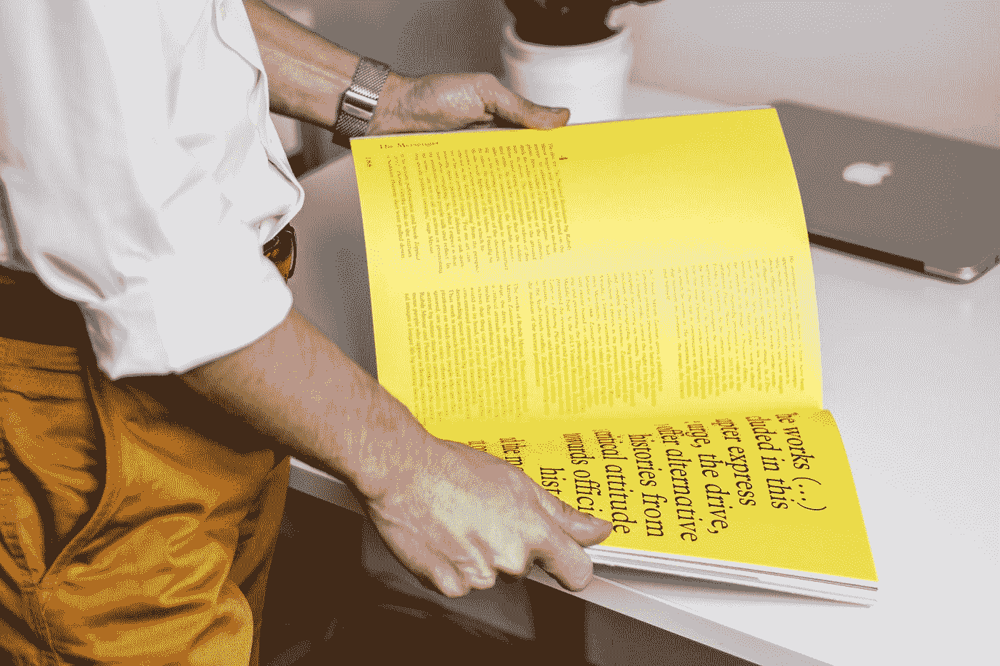
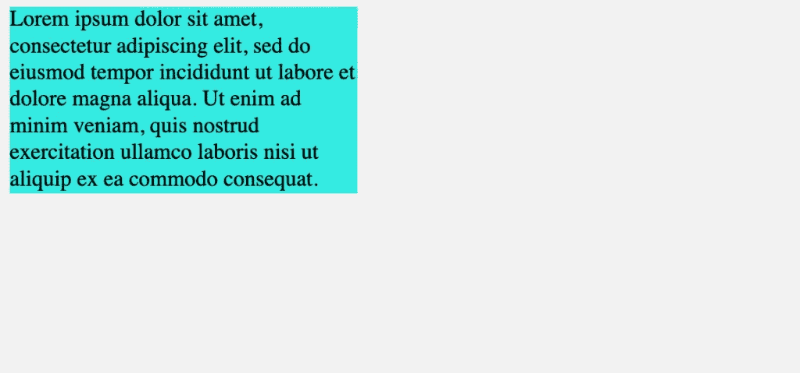
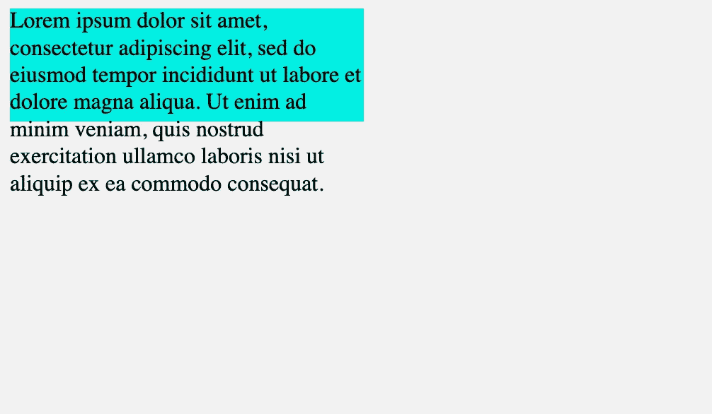
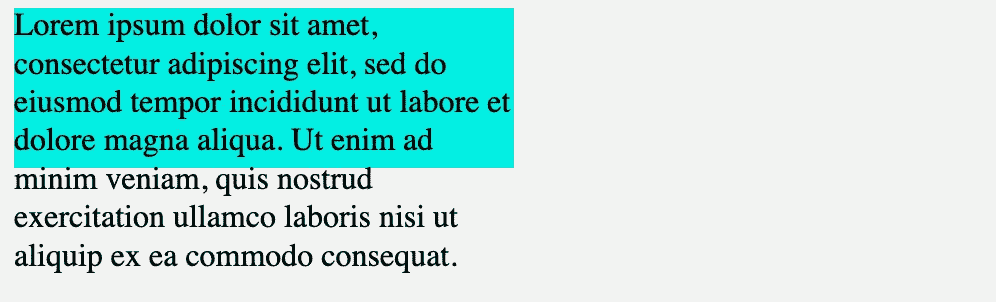
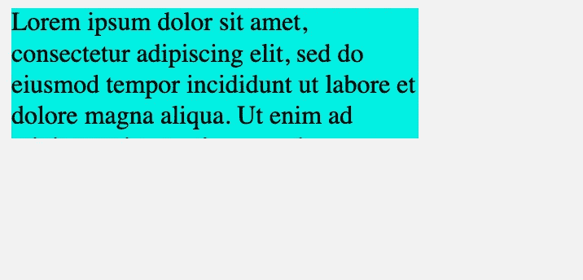
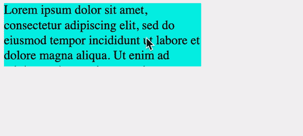
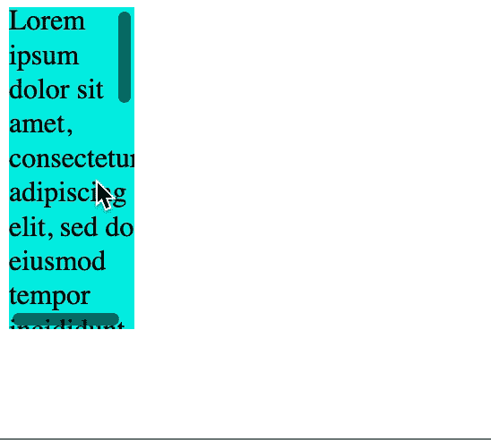
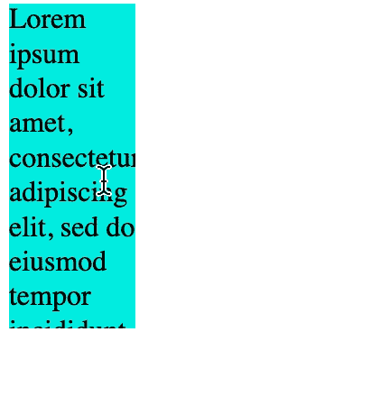
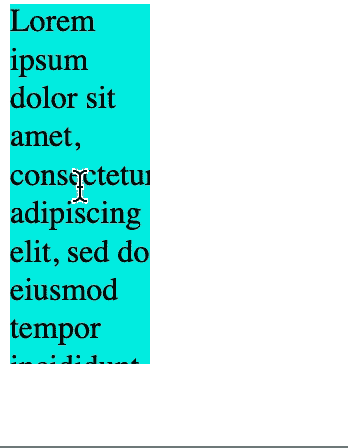

# CSS 溢出属性使用指南

> 原文：<https://betterprogramming.pub/a-guide-to-using-the-css-overflow-property-5fd5bbd038c9>

## 讨论可见、隐藏、滚动、自动、溢出 x 和溢出 y

照片由[诺德伍德主题](https://unsplash.com/@nordwood?utm_source=medium&utm_medium=referral)在 [Unsplash](https://unsplash.com?utm_source=medium&utm_medium=referral) 上拍摄

有时，网页的内容或部分内容不适合并超出了其容器的边框。在这种情况下，CSS 用它的`overflow`属性为我们提供了一个解决方案，因此我们可以处理溢出问题。

在本文中，我将向您展示如何使用具有不同类型值的`overflow`属性。

# 溢出属性

CSS 中的`overflow`属性用于当元素的内容大于它自己指定的区域时，剪切、隐藏或滚动元素的内容。

有四种不同的 CSS 溢出值可供我们使用:

`overflow: visible | hidden | scroll | auto`

我们可以将这些值设置为水平和/或垂直:

*   `overflow-x`:只横。
*   `overflow-y`:仅垂直。
*   `overflow`:两者都有。

**重要提示:**`overflow`属性只在一个元素是[块级](https://medium.com/better-programming/understanding-css-display-none-block-inline-and-inline-block-63f6510df93)元素并且有一个定义的高度时有效。

下面用一个例子来说明细节。

# 例子

假设我们有一个`
`框，里面有一些文本。

通常情况下，文本将适合框内，因为高度会根据其内容的大小(文本的长度)自动调整:

所以，不管文本有多长，它总是适合它的容器(盒子)。

但是，有时元素可能有固定大小的宽度或高度。在这种情况下，当文本足够长时，它将溢出:

在这个例子中，蓝框有一个固定的`height`的`80px`，但是文本更大。现在，在这里，我们可以使用`overflow`属性来修复这个问题，方法是根据我们使用的值隐藏或添加滚动条。

# 看得见的

`visible`是默认值。如果内容溢出，我们仍然可以看到它:

# 隐藏的

当我们将`overflow`设置为`hidden`时，它将剪切内容并隐藏其余内容:

# 卷起

`scroll`值将再次剪辑内容，但它将添加一个滚动条，以便我们可以通过滚动来查看其余内容:

# 汽车

`auto`值还会添加一个滚动条，但是用户只有在内容溢出时才会看到滚动条。

*   `overflow: scroll`添加滚动条，不管我们是否需要它。
*   `overflow: auto`仅在必要时添加滚动条。

# 溢出 x 和溢出 y

所以，以上我解释了`overflow`的作用和它的价值。

我们也可以对`overflow-x`和`overflow-y`使用相同的值。但是有什么区别呢？

例如，我们取`scroll`值。当元素的`width`和`height`都过小时，`overflow: scroll`将垂直添加滚动条，水平添加滚动条&:

当我们使用`overflow-x`而不是`overflow`时，滚动条将仅水平添加到元素*中:*

并且，`overflow-y`仅垂直添加滚动条*:*

我们甚至可以同时给`overflow-x`和`overflow-y`赋予不同的值。

所以，这基本上就是`overflow`做的事情。如果你有任何问题，不要犹豫地问。

谢谢，再见！