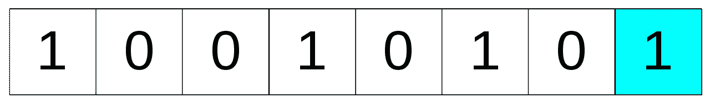

# 使用 Python 的视频隐写术指南

> 原文：<https://betterprogramming.pub/a-guide-to-video-steganography-using-python-4f010b32a5b7>

## 使用最低有效位加密视频中的数据


由[雅各布·欧文斯](https://unsplash.com/@jakobowens1?utm_source=medium&utm_medium=referral)在 [Unsplash](https://unsplash.com?utm_source=medium&utm_medium=referral) 上拍摄的照片。

隐写术是将文件、消息、图像或视频隐藏在另一个文件、消息、图像或视频中的做法。它已经存在了很长时间，现在，数字隐写术被用来隐藏图像内部的数据。我们可以通过使用不同的数字隐写方法来隐藏各种数据。

在本文中，我们将使用一种称为最低有效位(LSB)变换的方法来隐藏视频中的文本。

# 最低有效位是什么？



图片来自[维基百科](https://en.wikipedia.org/wiki/Bit_numbering#/media/File:Least_significant_bit.svg)。

上面是 8 位二进制数字 149 的表示，其中最右边的一位被突出显示。如果我们把它改成 0，就会得到 10010100 (十进制相当于 148)。如果我们改变上述二进制数中的任何其他位，变化会大得多。因此，在本例中，最右边的位是最低位，改变它对原始数字的影响最小。

# 我们如何使用 LSB 变换来隐藏图像中的数据？

数字图像是像素值的表示，每个像素值都有包含该像素信息的数字。一幅数字彩色图像有红色、绿色和蓝色通道，每个通道用 8 位来表示，因此每个通道可以取 0-255 之间的值，这个值表示像素的亮度。`(R, G, B)=(0,0,0)`代表黑色，`(255,255,255)`代表白色。

以一个像素数组为例，假设我们想要在其中隐藏字符 *A* 。让我们看看它是如何做到的:

```
(R, G, B)= (11101010 11101001 11001010),(10111001,11001011,11101000),(11001001 00100100 11101001)
```

这是一个像素数组，我们想在其中隐藏一个。 *A* 的 ASCII 值为 65。如果我们把它转换成二进制，我们得到 01000001。因此，如果我们使用 LSB 变换，我们可以改变数组中所有数字的 LSB，得到:

```
(R,G, B)= (11101010 11101001 11001010),(10111000,11001010,11101000),(11001000 00100101 11101001)
```

现在我们已经在像素数组中隐藏了 *A* ，让我们使用 Python 来隐藏图像中的文本。

# Python 中的图像隐写术


照片来自 Sourceforge 。

这是我们将要使用的图像。首先，我们将安装依赖项，然后一步一步地查看代码。

## 1.安装依赖项

我们将使用 Python 中的 [stegano](https://pypi.org/project/stegano/) 库。我们可以通过运行以下命令来安装它:

```
$pip install stegano
```

现在我们需要导入这个库并从中导入`lsb`类:

```
from stegano import lsb
```

现在我们已经导入了`lsb`类，让我们使用它的`hide()`方法来隐藏图像中的文本:

```
secret=lsb.hide('./lenna.png','hello world')
```

这将转换我们图像的 LSB，并在其中隐藏我们的信息。现在我们必须保存图像:

```
secret.save('./encoded_image.png')
```

就是这样。仅用三行代码，我们就隐藏了消息。

## 图像比较


编码图像(左)与原始图像(右)

如你所见，这两张图片没有明显的区别。

要揭示秘密消息，只需使用带有图像作为参数的`lsb.reveal()`方法，消息将被打印出来:

```
 lsb.reveal('./encoded_image.png')Output:- hello world
```

我们已经使用 LSB 变换来隐藏图像中的数据，但是我们如何使用它来隐藏视频中的数据呢？

# 视频隐写术

视频是帧的集合，每一帧都是一幅图像。因此，如果我们从视频中取出所有帧，我们可以使用这种方法，通过 LSB 隐写术存储数据，并将这些帧与秘密消息缝合回视频中。


视频由 [Roman Koval](https://www.pexels.com/video/thorns-on-the-stem-of-a-tree-2790317/) 在 [Pexels](https://www.pexels.com/) 上制作。

原始视频很长，所以我只使用了其中八秒钟的部分。

## 1.从视频中提取帧

为了从视频中提取帧，我们可以使用最流行的计算机视觉库， [OpenCv](https://opencv.org/) 。

首先，安装 OpenCv 并导入它:

```
import cv2
```

我们必须看录像。逐帧浏览视频，并将所有图像保存到一个新目录中。

为了加载视频，我们运行:

```
vidcap = cv2.VideoCapture("video.mp4")
```

这将视频加载到 vidcap 中。现在我们可以使用`read`方法从“video.mp4”中读取帧

```
success, image = vidcap.read()
```

我们可以定义一个循环来遍历所有的帧，并用一个我们可以轻松排序的唯一文件名来保存它:

一旦完成，我们就剩下视频中的所有帧了。

但是视频不仅仅是图像的集合。还有音频。为了提取音频，我们将使用 [FFmpeg](https://ffmpeg.org/) 。

## 2.从视频中提取音频

FFmpeg 是一个免费的开源命令行工具，用于对多媒体文件进行代码转换。它包含一组共享的音频和视频库，如 libavcodec、libavformat 和 libavutil。使用 FFmpeg，您可以从视频中提取音频文件，将 PNG 图像文件转换为视频，等等。

要在 Ubuntu 中安装 FFmpeg，首先更新包列表:

```
$sudo apt update
```

然后运行下面的命令来安装 FFmpeg:

```
$sudo apt install ffmpeg
```

要验证 FFmpeg 安装是否正确，请运行:

```
ffmpeg -version
```

如果您收到类似下面的消息，则一切正常:

```
ffmpeg version n4.1.4 Copyright (c) 2000-2019 the FFmpeg developers
```

要在 Python 中使用 FFmpeg，我们必须从[子流程](https://docs.python.org/3/library/subprocess.html#module-subprocess)库中导入 call 和 STDOUT:

```
from subprocess import call,STDOUT
```

然后我们可以用 Python 运行下面的代码:

```
call(["ffmpeg", "-i","video.mp4" , "-q:a", "0", "-map", "a", "tmp/audio.mp3", "-y"],stdout=open(os.devnull, "w"), stderr=STDOUT)
```

这段代码将从给定的视频文件中提取音频，并将其保存为 tmp 文件夹中的“audio.mp3”。在我们用文本对帧进行编码之后，我们就可以使用这个音频文件为编码后的视频文件提供合适的音频。

## 3.对框架内的文本进行编码

现在我们有了所有的帧，我们可以将字符串分成小块，并使用`lsb.hide()`方法将每个消息块隐藏在一个帧中:

`split_string`是一个将字符串分割成小部分的辅助函数。因为我们不需要隐藏第一个框架中的所有文本，所以我们将框架分开并隐藏在许多框架中。完整的代码可以在 GitHub 上找到[。](https://github.com/llopen-sourcell/Video-Steganography/blob/master/README.md)

我们已经加载了一个视频，将它拉到尽可能多的帧，并对其进行编码。现在我们必须把这些画面组合成一个视频。

## 4.从帧制作视频

我们可以使用 FFmpeg 将所有带有隐藏信息的帧拼接在一起，形成视频，然后播放音频:

```
call(["ffmpeg", "-i", "tmp/frame%d.png" , "-vcodec", "png", "video.mov", "-y"],stdout=open(os.devnull, "w"), stderr=STDOUT)
```

运行上面的代码创建了隐藏了我们秘密信息的视频。

如果我们希望视频中有声音，可以运行下面的代码:

```
call(["ffmpeg", "-i", "temp/video.mov", "-i", "temp/audio.mp3", "-codec", "copy","data/enc-" + str(file_name)+".mov", "-y"],stdout=open(os.devnull, "w"), stderr=STDOUT)
```

我们做到了。输出视频差不多 900 MB。我已经上传了一小部分视频，以表明视频质量不受这种方法的影响。

现在，我们已经完成了编码的艰难部分，让我们看看一个人如何解码我们的视频和阅读信息。

## 解密视频中的信息

我们必须执行与加密相同的步骤，但顺序相反。因此，我们从视频中提取所有帧，并从 LSB 中提取信息:

# 结论

如你所见，有了像 Python 这样的现代库和语言，做隐写术和密码学真的很简单。

这种方法的唯一问题是，与原始视频相比，新视频的大小非常大。如果我们能缩小尺寸，这将是这个项目的一个很好的补充。

这个项目的完整代码可以在 GitHub 上找到[。](https://github.com/llopen-sourcell/Video-Steganography/blob/master/README.md)