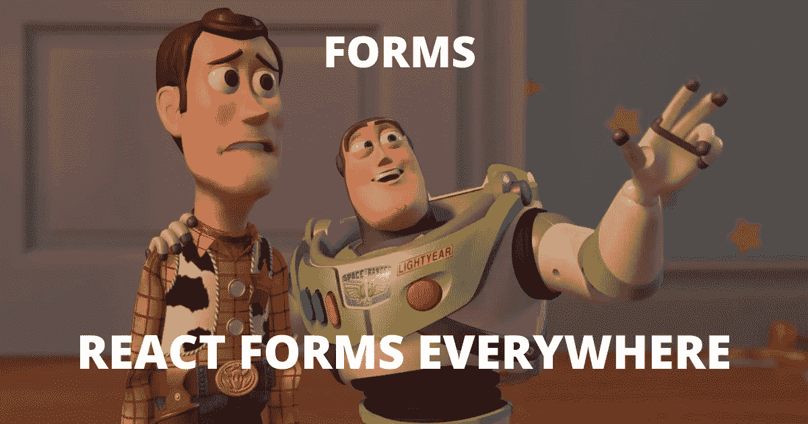
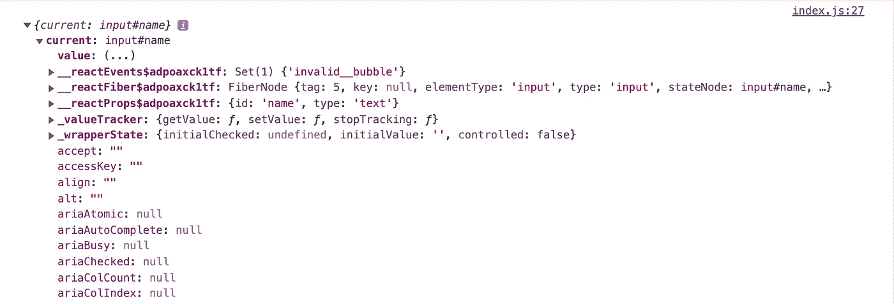

# React 中使用表单和输入字段的指南

> 原文：<https://betterprogramming.pub/a-guide-to-working-with-forms-and-input-fields-in-react-403d64aaedf3>

## React 中所有受控和非受控组件

[玩具总动员](https://en.wikipedia.org/wiki/Toy_Story)

理解任何框架的基础的最好方法是开发一个 CRUD 应用程序，每个 CRUD 应用程序总是有一个带有不同输入字段的表单。在 React 中使用表单时，您会遇到一些奇怪的术语，如“受控”和“非受控”组件。我写这篇文章的目的是用简单的英语来解释这些花哨的术语。

这篇博文的先决条件是您对 HTML 表单有基本的了解。如果没有，您可以参考[本](https://www.w3schools.com/html/html_forms.asp)快速复习。

# 参考文献与 DOM

`ref`是默认情况下出现在所有输入元素上的属性。它们允许我们访问其他 DOM 元素并使用它们。

> Refs 提供了一种方法来访问在 render 方法中创建的 DOM 节点或 React 元素。
> 
> –[reactjs.org](https://reactjs.org/docs/refs-and-the-dom.html)

为了理解`ref`能做什么，让我们看看表单是如何使用的。如果你有使用 React 的经验，你会知道`useState`是什么，以及它如何处理表单域。对于其他人，让我们考虑这个小例子:

这里，我们使用`input`上的`onChange`事件处理程序在每次击键时更新用户名的值，并将其存储在`name`变量中。我们使用`value`属性将该状态反馈到`input`中。然后，我们使用表单的提交处理程序来使用变量值，最后清除输入。这是一个“受控”输入域/组件的完美例子。

这是管理表单状态的完美方式。但是，当我们只需要表单提交期间的状态时，每次击键都更新状态(即`name`)是低效的。

这就是`refs`发挥作用的地方。

# 裁判是如何工作的？

Refs 在 DOM 中呈现的 HTML 元素和 JavaScript 代码之间建立连接。我们通过使用名为– `[useRef()](https://reactjs.org/docs/hooks-reference.html#useref)`的 react 挂钩来实现这一点

旁注:

1.  `React.createRef` *(摘自 React 16.3)*
2.  `useRef`钩子*(摘自 React 16.8)*

像所有钩子一样，`useRef()`遵循 React 钩子的所有[规则。它有一个默认值，我们可以用它来初始化，但这是可选的。它返回一个值，一旦我们将它连接到一个 HTML DOM 元素，这个值将允许我们以后使用那个`ref`。为了连接，我们将使用一个名为`ref`的内置属性/道具，它出现在每个 HTML DOM 元素上。](https://reactjs.org/docs/hooks-rules.html)

因为您可以将`ref`连接到任何 HTML DOM 元素，但这并不意味着您应该这样做。您将主要在表单中使用`ref`。

最后，`nameRef`将在它的`current`属性中保存一个完整的 DOM 元素。如果我控制`nameRef.current`，我们可以看到我们有了完整的输入原生 HTML DOM 元素:

为了更好地理解，这是它将在案例 2 中呈现的内容:

*当前属性保存连接的 DOM 元素的值*

**注意**:他们强烈建议不要强制操作 DOM，即不要使用 React。当我们使用`useState`来操作 DOM 时，这是很好的，也是做事情的理想方式。`useRef`的用例是不同的，不应该成为你操作 DOM 的首选解决方案，比如从字段重新设置、更新表单字段值等。使用`ref`进行只读操作仍然是可以接受的，因为您没有改变任何状态。

# 何时使用 ref？

使用`ref`的理想场合是当你想做只读动作的时候。有时，您会遇到希望读取一个值而不更改它的用例。如果是这种情况，可以避免使用`useState`。会造成很多多余的代码。

根据[官方文件](https://reactjs.org/docs/refs-and-the-dom.html#when-to-use-refs)，参考的几个好用例:

*   管理焦点、文本选择或媒体播放。
*   触发命令式动画——其中命令式动画意味着使用 JavaScript 定义[动画](https://anvaka.github.io/sj/compare/)
*   与第三方 DOM 库集成。

避免对任何可以声明完成的事情使用 refs。

# ref 的一个用例

考虑一个用例，当表单提交过程中出现错误时，您希望将焦点放在输入 DOM 元素上。我们可以使用`ref`来做到这一点

在下面的例子中，如果用户试图提交一个没有输入的表单，这将是一个无效的提交动作，并且该表单将获得焦点。

*名称输入获得无效表单提交的焦点*

# 使用带有功能组件的 ref

是的，每个 HTML DOM 元素都有一个`ref`道具，你可以用它来定位。但是您不能在 React 功能组件上使用`ref`。例如:

但是 React 的维护者真的很体贴。您可以使用另一个挂钩将`ref`与功能组件配合使用。这个钩子有助于强制性地使用功能组件，也就是说，不是通过 props 传递一些状态给它，而是从父组件调用一个函数来改变组件内部的一些东西。这很像 React 中的父子关系管理。

这是你不应该经常做的事情。在这里展示是因为我的工作是在我真正的读者面前展示所有的武器，因为我不想让他们装备不良就去打仗(也就是工作)。

考虑一个用例，您希望以编程方式将焦点从呈现子元素的父组件转移到 input 元素。我将在`Age`功能组件中添加两个自定义功能`focusAgeInputField`和`isAgeValid`。

因此，我们试图做的是强制性地访问组件或组件内部的功能，这就是我们使用`useImperativeHandle`钩子的地方。你可以通过 Anik 的这篇详细文章了解更多。

根据官方文件:

> `**useImperativeHandle**`定制使用`ref`时暴露给父组件的实例值。和往常一样，在大多数情况下应该避免使用引用的命令式代码。`**useImperativeHandle**`应与`[forwardRef](https://reactjs.org/docs/react-api.html#reactforwardref)`配合使用:
> 
> –[reactjs.org](https://reactjs.org/docs/hooks-reference.html#useimperativehandle)

当使用`useImperativeHandle`时，你完全意识到你想要控制输入不是通过状态属性管理，不是通过从父组件控制组件的状态，而是通过编程直接调用或操作组件中的某些东西。这既不建议，也不推荐，但你无论如何要知道！

# 使用 useImperativeHandle

`useImperativeHandle`钩子接受两个参数:

*   **ref** :通过来自外部的参考点。这个`ref`是伴随`props`而来的第二个论点。第二个`ref`参数只在用`React.forwardRef`调用定义组件时存在。常规函数或类组件不接收`ref`参数，并且`ref`在 props 中也不可用。

Ref 转发不限于 DOM 组件。您也可以将引用转发给类组件实例。

*   **回调函数**:该函数必须返回一个对象。该对象将包含您能够从外部使用的所有数据。对象属性的名称将是您将从外部使用的名称。功能组件的第二个参数，即`ref`，将作为第一个参数传递给`useImperativeHandle`。

为了导出`Age`功能组件中的`ref`参数，我们需要以一种特殊的方式导出功能组件。

# 使用 forwardRef

我们需要使用`React.forwardRef`包装功能组件，以便能够激活`ref`参数。

来自 react 官方文档:

> 引用转发是一种自动将引用通过一个组件传递给其子组件的技术。对于应用程序中的大多数组件来说，这通常是不必要的。然而，对于某些类型的组件，尤其是在可重用的组件库中，它可能是有用的。
> 
> –[reactjs.org](https://reactjs.org/docs/forwarding-refs.html#gatsby-focus-wrapper)

`React.forwardRef`将功能组件作为第一个参数，并返回一个可以绑定到`ref`的自定义功能组件

使用`Age`功能组件通过`ref`访问上面的两个方法。还有一件事，眼尖的读者可能已经注意到了，即`<>`和`</>`。这些被称为[反应片段](https://adityatyagi.com/index.php/2022/01/21/how-to-write-cleaner-react-code/)。

将所有这些放在一起，我们现在可以提交带有空年龄输入的函数，结果，它将聚焦于该字段。

*年龄输入成为无效提交的焦点*

# 非受控 v/s 受控组件

你刚刚学到的上述所有东西不过是使用“[未受控的](https://reactjs.org/docs/uncontrolled-components.html)”组件。所谓不受控制，意味着您必须处理值/状态，而不是使用 React 来完成。

对于“受控”组件和输入字段，您可以使用状态来读取、写入和更新组件状态。这是当您使用`useState`或`useReducer`创建一个状态，然后将该状态绑定到您的组件/输入字段。一旦你这样做了，它就变成了一个“受控的”输入域/组件。

根据官方文件:

> 由于不受控制的组件在 DOM 中保留了事实的来源，所以在使用不受控制的组件时，有时更容易集成 React 和非 React 代码。如果你想变得又快又脏，代码也可以少一点。否则，您通常应该使用受控组件。
> 
> reactjs.org

在为这篇博文做研究的时候，我也偶然发现了戈萨·阿里尼奇的作品。

# 默认值与值

您不能在非受控组件/表单字段上使用`value`属性。如果你想给一个不受控制的表单域一个默认值，使用`defaultValue`。点击此处了解更多信息[。](https://scriptverse.academy/tutorials/reactjs-defaultvalue-value.html)

# 额外收获:一个游乐场

现在你知道了。试着到处玩，把你的手弄脏！我希望你已经发现这是有用的。感谢您的阅读。