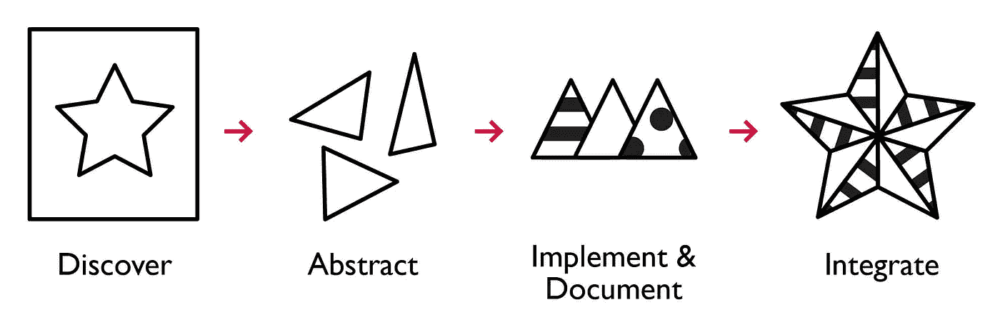
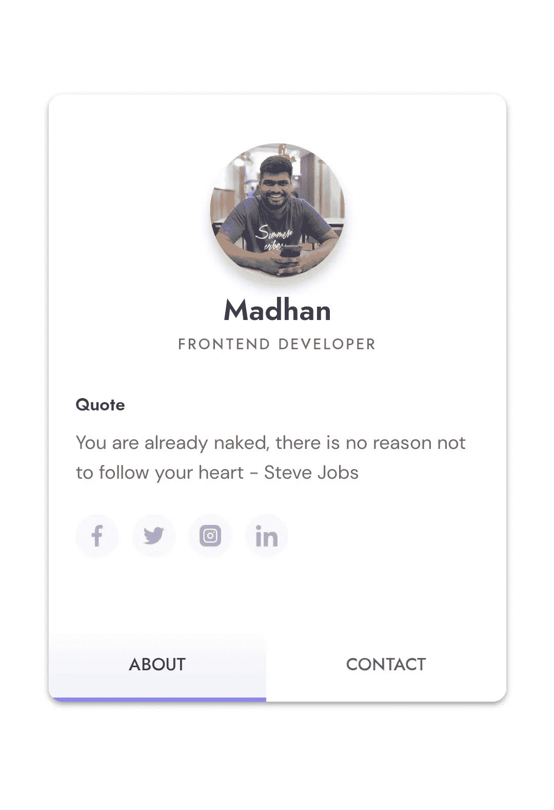
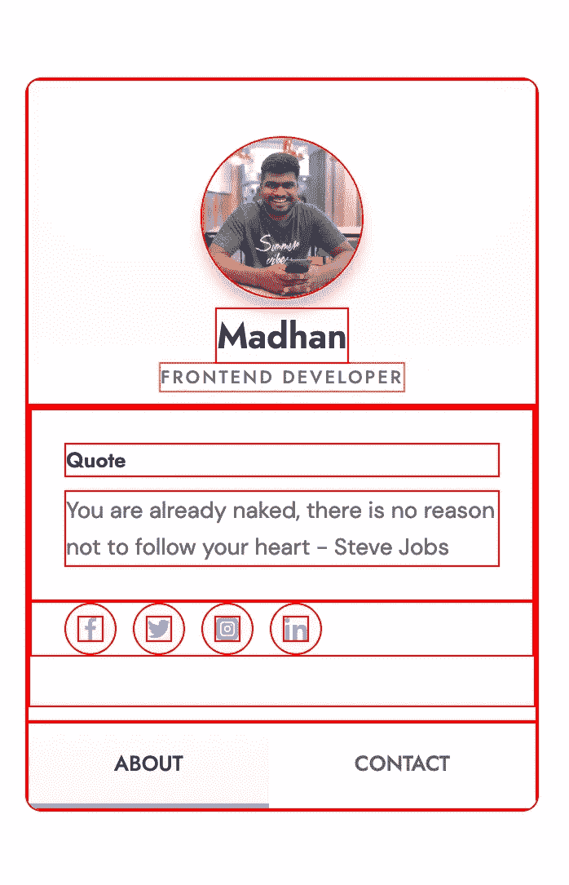

# 构建 UI 组件手册

> 原文：<https://betterprogramming.pub/a-handbook-for-building-ui-components-37836492df06>

## 以及对 UI 组件的误解

发现、抽象单个盒子，将盒子分组，并整合盒子。

到目前为止，全球最主要的 UI 趋势是基于组件的架构。我想说这种模式对开发者和企业都有帮助，这是这种趋势仍然如此著名的最显著的原因。

如今，制造产品变得越来越快。开发人员获得了更多的时间来投资其他领域，这种方法可以为整个团队节省高达 50%的项目时间。团队可以在理解用户和他们的需求上投入更多。将有更多的空间来考虑性能和适应新的趋势，因为开发人员不需要重新发明轮子。

# UI 组件的误解

每当我们听到一个 UI 组件，我们会突然想到“用来构建它的 JS 框架/库是什么？”只是为了我们的记忆添加一个注释，组件总是结构、风格和行为的混合。

因为“让用户感觉在控制中”是良好用户体验的主要方面之一，风格和行为的一致性是必不可少的。重要的是要改变关于组件的普遍误解，它不仅仅是行为。显然，行为(功能)是重要的，正如我上面提到的，组件是三个部分的混合物，所以我们必须在开发组件时平衡重要性。

# **手册**

**免责声明:**这是我遵循了四年多的方法。这纯粹是根据我的经验。就我个人而言，这对我帮助很大。

让我们从 UI 组件手册开始，这本手册将帮助你分解事物，避免混乱的结构和样式。

我们可以很容易地将组件开发与构建块联系起来。作为第一步，我们需要关注结构，然后是风格和行为。我们需要依次遵循以下步骤:

1.  结构( **HTML**
2.  样式( **CSS** )
3.  行为( **JavaScript)**

是的，现在是时候用上面的方法构建一个组件了。为了简单起见，并平等地涵盖所有三个部分，让我们构建一个 profile card 组件。

简介卡的模拟图像。

# **结构**

众所周知，在 HTML 中，所有的元素都是大小不同、重复相同模式的盒子。因此，第一步，试着标记所有的单个盒子，然后根据需要将这些单个盒子分组。

在标记了所有单独的框并对它们进行分组后，最终的输出将如下所示。

在对单个盒子进行标记和分组之后。

在上图中，我们可以看到单独的盒子和分组的盒子。现在我们有了组件的蓝图。蓝图看起来很干净，有助于轻松识别盒子。

让我们用我们的蓝图来建造这个结构:

结构蓝图。

结构相当干净，给人一种很好的感觉，对吧？现在这个结构看起来更加模块化了，我们可以在整个应用程序中共享组件。

从上述标记中识别的可重用组件有:

*   虚拟角色组件
*   排印
*   按钮组件
*   图标按钮

这种分解结构帮助我避免了级联混乱效应，有时我们倾向于为了设计或行为的改变而改变结构，然后我们可能会破坏所有的结构。最终，我们会害怕去碰那个部件。

# **风格**

就我个人而言，这是我最喜欢的部分，它赋予了结构以活力。我是一个曾经遵循 CSS 网格的页面布局和组件的 Flex-box 的人。所以你可能已经知道我现在要怎么设计了。

很抱歉出现了糟糕的缩进，我试图用 Github gist 解决这个问题，但是没有成功。

有三块大箱子需要容纳小箱子。大多数情况下，所有的大盒子都是 flex，每个盒子都是 flex 项目。我敢肯定，现在你感到震惊，觉得 CSS 是容易的。我也是这么想的。

CSS 很好学，但是掌握起来有点难。这需要一段时间来熟悉，也许需要一辈子来掌握。

# **关闭思路:**

一旦设计被分解成更小的盒子，我们终于有了我们的组件。现在，这已经给出了工作的基线，而不是重复相同的结构、风格和行为。

我个人认为，在任何地方建立一种共同语言都有助于改善团队成员之间的协作。所以我希望，你能遵循这种模式来改进你团队中的工作流程。欢迎在评论中分享你的想法。