# GPG 和 Git 手册

> 原文：<https://betterprogramming.pub/a-handbook-to-gpg-and-git-5990f8db4361>

## 在您的机器上设置更安全的开发流程的完整指南

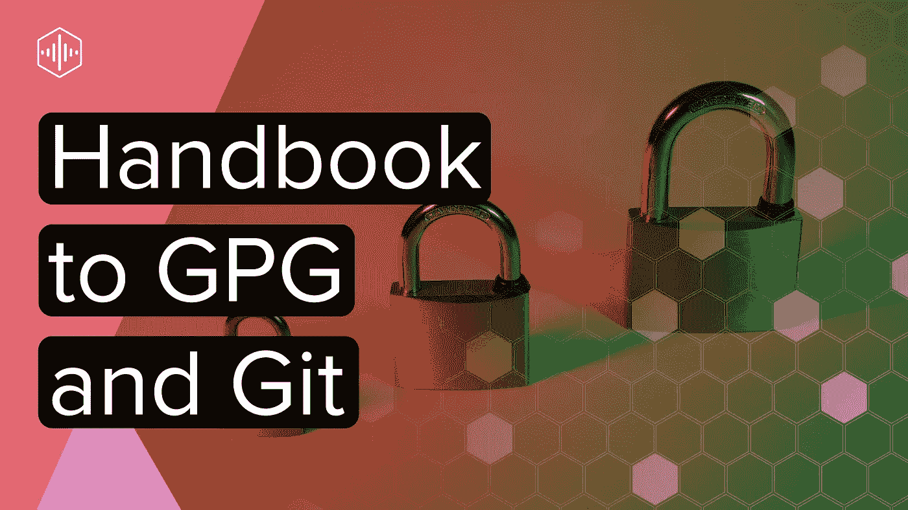

Git 充满了有用的命令、强大的功能和经常被忽略的特性。它隐藏的一个优点是它能够用一个密钥签署提交和标记。对于这项工作，Git 求助于 GPG，这是一个广泛采用的开源程序，专为这类任务而设计。

GPG 背后的团队，或 GNU 隐私卫士，将其描述为一个“允许你加密和签名你的数据和通信”的程序该工具对于保护和加密验证通过消息应用程序、电子邮件和版本控制系统(如 Git)发送的数据非常有用。幸运的是，Git 开发团队已经为我们完成了繁重的工作，对 GPG 签名的本机支持已经融入到应用程序中。

# GPG 签约的好处

在深入“如何做”之前，我想先回答“为什么”。企业家、大企业以及所有介于两者之间的人可能看不到将 GPG 群岛纳入他们的开发流程的理由。但是，如果它不值得使用，为什么 Git 要费心包含对它的原生支持呢？我想提出一些支持将这种实践添加到日常开发中的论点。

## 安全性

难道用户名和密码还不足以保证用户工作的安全吗？还是 SSH 键？简单的回答是否定的和否定的。不管是好是坏，这两种机制都允许或拒绝对 Git 存储库的访问。一旦授予访问权限，工程师必须通过额外的步骤来提供他们的身份，然后才能进行任何提交:

熟悉的 Git 配置参数

一旦我被授权使用我的密码或 SSH 密钥进行访问，游戏就结束了。想象一个场景，一个叫爱丽丝的工程师同事和我正在做一个项目。如果我发现我的变更影响了生产，让公司损失了几千美元，我可以拆掉`develop`分公司，声明她的身份，重写历史，说是爱丽丝而不是我犯的错。简单的运行一下`git log`就能告诉我所有我需要知道的关于她的身份。当然，如果我做了这样的事情，分支的`HEAD`会在多个 Git 实例中发散，但这仍然证明了一点。不是所有的黑客都需要才华来制造麻烦。如果 Alice 签署了她的提交，在 Git 提供者没有将我的尝试标记为未经验证和不可信的情况下，我就无法模拟她的身份。

## 信心

加密和数字签名都是为了激发信心。Git 世界中的所有主要参与者都会奖励那些付出额外努力来证明自己是 GPG 的人。GitLab、GitHub 和 Bitbucket 都会在每个作者与 GPG 签署的提交旁边显示一个徽章。GitHub 进一步指出，当一个经过验证的作者签署他们的标签和发布。说说友好的拍拍背吧！

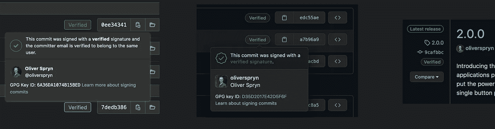

GitLab 验证的提交、GitHub 验证的提交和标记

## 简单

对于工程师来说，密码学往往是痛苦的代名词。你的钥匙过期了吗？是时候生成一个新的并把它放在所有正确的地方了。你忘记用这里的钥匙了吗？你刚刚打开了一个大洞。等等等等。在我看来，Git 让它变得如此容易使用，我没有理由不使用它。我告诉 Git 使用什么样的 GPG 密钥，让它为我的每个提交签名，然后像往常一样继续使用 Git。一切照旧再容易不过了。

# 创建密钥对

GPG 在配置密钥的创建方面提供了很大的灵活性。就个人而言，这些是我喜欢使用的选项:

*   **密钥类型:** RSA 和 RSA，用于加密和解密的非对称密钥对。
*   **位长:** 4096 为最大熵值。
*   **失效日期:**无。完全取决于您和您的用例，但我在这里只是为了在 Git 上证明我的身份，而不是为了保护国家支持的机密而轮换我的密钥。

这个过程非常简单:

1.  打开一个终端。
2.  键入`gpg --full-generate-key` 进入创建流程。
3.  选择所需的密钥类型。我呢，RSA 和 RSA 选的是`1`。
4.  输入位长。我用了`4096`。
5.  指定有效期，用`0`表示没有过期。那是我的选择。它会要求您确认您的选择。

对于接下来的几个提示，我用我提供给 Git 的标识值排列我的答案。

1.  对于真实姓名提示，请输入您的显示名称。当然，我的是`Oliver Spryn`。
2.  电子邮件地址应该与您的提交电子邮件相匹配。在我的例子中，我使用了`oliverspryn@example.com`，但是在现实世界中，我更喜欢使用 GitLab 和 GitHub 提供给我的屏蔽邮件。这个特性是许多主要 Git 提供商提供的一个很好的隐私附加层。
3.  对于注释，我留下了一个人类可读的描述来指出我计划在哪里使用这个键。在我的例子中，我使用了`GitLab GPG Key`。

这里有一个流动视频:

GPG 密钥创建流程

# 导出密钥对

除非您的 Git 提供者能够验证提交，否则对提交进行签名没有多大用处。因此，我们需要导出公钥来与 GitLab 和 GitHub 共享。我还会导出私钥，以确保它在我的密码库中的安全，以防我得到一台新计算机或意外丢失我的本地副本。

首先，我们需要告诉 GPG 我们打算出口哪个密钥。首先列出当前系统上的所有键:

使用长 ID 列出 GPG 钥匙串中的所有钥匙

这应该会产生如下结果:

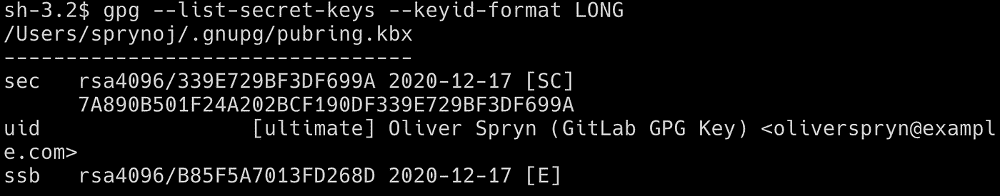

存储在 GPG 的 RSA 密钥对

当然，如果你的电脑上有更多的键，你会看到它们都显示出来。我对一条特别的信息感兴趣，长键 ID。它出现了两次，一次是简写版本，另一次是完整的 ID。区别在于:

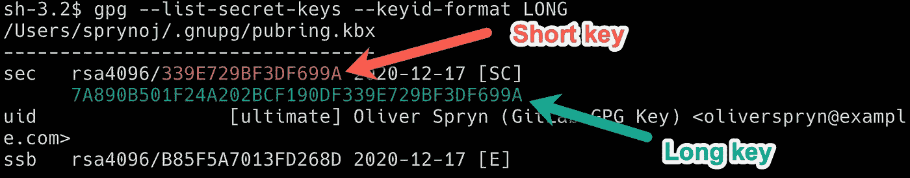

短键只使用长键标识符的子集

注意我是如何引用单词`sec`旁边的 id 的。图片底部是短语`ssb`旁边的另一个 ID。顶部的 ID 指的是秘密密钥(即“sec”)，底部的 ID 指的是秘密子密钥(即“ssb”)。出于这个目的，忽略`ssb` ID。

在下一步中，您可以通过它的短 ID 来引用想要的键，但是为了精确起见，我更喜欢显式地使用它的长 ID。有了长密钥 ID，就可以用它来导出公钥和私钥:

从 GPG 导出 RSA 公钥和私钥

确保这两个文件的安全。非常安全。我喜欢把它们放在我的 [LastPass](https://go.oliverspryn.com/lastpass) 或者我的 [ProtonDrive Vault](https://go.oliverspryn.com/protondrive) 里。任何锁定和加密的文件存储应该做得很好。

# 使用钥匙

就像告诉 Git 您的姓名和电子邮件一样，您也可以提供 GPG 密钥配置。同样，为了更精确，这里最好使用长键 ID。我将在下面的命令中使用这个 ID，并使用另一个配置选项告诉 Git 每次提交时都使用这个键，即使我在开发周期的提交过程中忽略了这一点。

配置 Git 使用本地 GPG 密钥并自动签署每个提交

现在，Git 用 GPG 对你的所有提交进行签名，而不需要对你的工作流做任何修改。就像你一直做的那样。您可以像这样验证所有已签名的提交:

正常的 Git 日志不报告提交签名

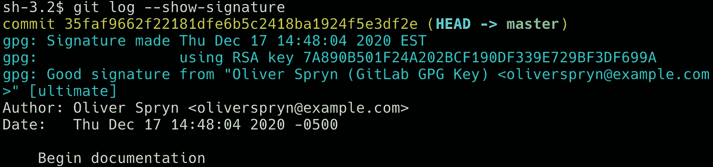

Git 显示用可信密钥签名的提交

当然，只有当您是团队中唯一的人或者在分布式团队中工作并且每个人都拥有整个团队的公钥时，Git 才会告诉您提交是否被正确签名。否则，您将看到 Git 报告由您的队友签名的提交的信任问题。在这种情况下，当我想确保有人正确地签署了 commit 时，我不会费心参考 GitLab 和 GitHub。这种方式稍微容易一些，因为 Git 提供者负责保存所有的公钥，每个成员都必须使用网站来保持她或她的公钥是最新的。

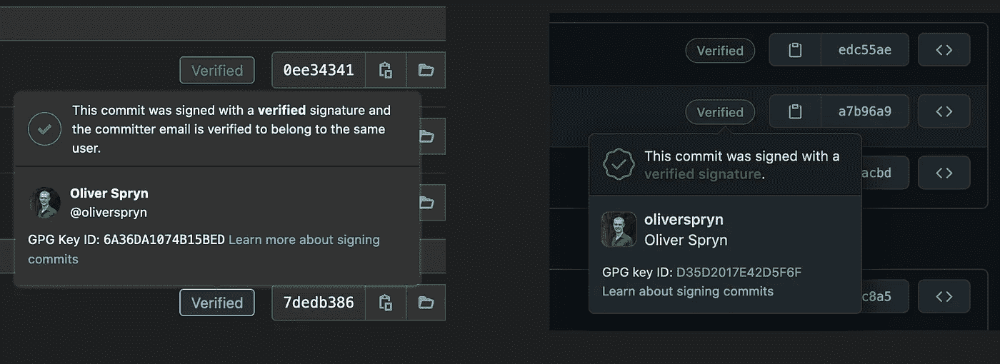

GitLab 和 GitHub，分别报告已验证的提交

如果您不告诉 Git 自动签署您的提交，您将需要在每次提交时都这样做:

手动签署 Git 提交

我发现标记签名仍然是一个手动过程，尽管:

手动签署 Git 标签

注意上面两行的区别。签署提交使用大写`-S`作为标志，标记操作使用小写`-s`。这不是我遇到的第一个 Git 怪癖！

总的来说，在日常工作流程中使用 GPG 的头痛问题已经基本消失了。事实上，这种简单程度使得任何反对使用它的论点都很难让人相信。

# 将密钥导出到 GitLab 和 GitHub

私下里，我让 GPG 为我生成一个 RSA 密钥对。与任何非对称密钥一样，如果您打算与第三方共享任何信息，您需要与他们共享公钥。当然，既然我们在谈论推送到 Git 仓库，我们肯定会共享信息。谢天谢地，GitLab 和 GitHub 让这个过程变得简单了。

在将公钥导入任何 Git 提供程序之前，请确保在您喜欢的文本编辑器中打开了之前导出的公钥。请确保您打开的是公钥，而不是私钥。

## GitLab

这个过程是相同的，无论你使用 GitLab.com 或 GitLab 自托管。登录您的帐户，在右上角选择您的个人资料，然后进入设置。

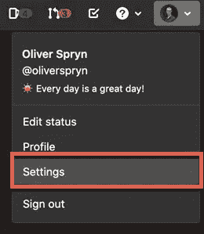

从左侧的面板中，选择“GPG 关键点”。

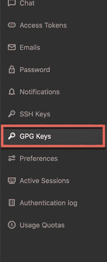

将公钥粘贴到文本框中，然后按添加密钥按钮。

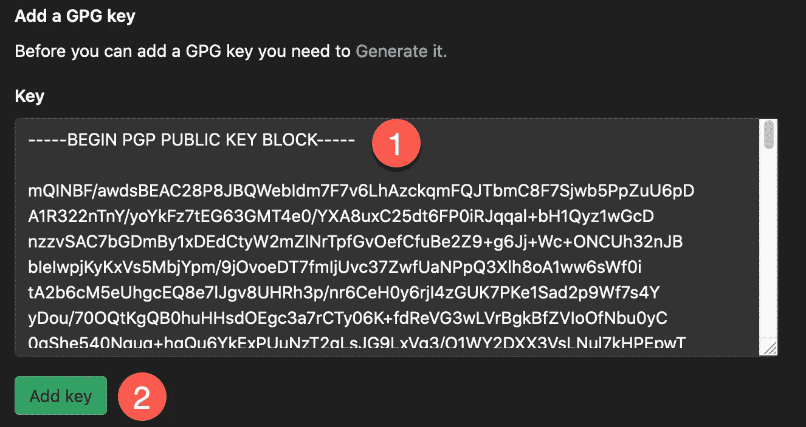

观察 GPG 键列表中的键。

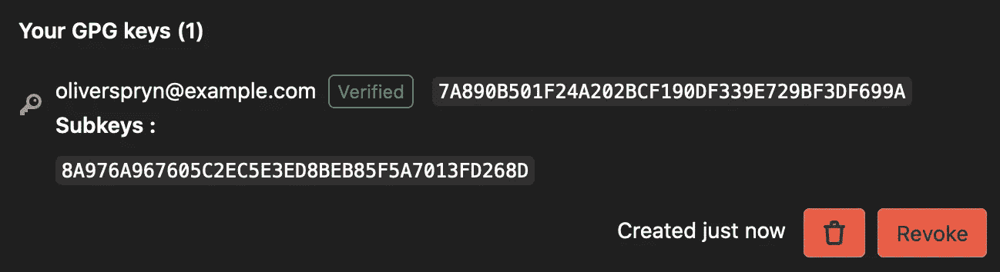

## 开源代码库

你会发现在 GitHub 上安装一个密钥和 GitLab 的过程很相似。登录您的帐户，在右上角选择您的个人资料，然后进入设置。

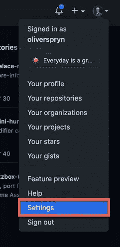

从左边的面板中，选择 SSH 和 GPG 密钥。

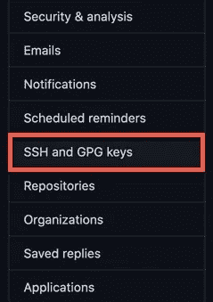

按下新 GPG 键按钮。

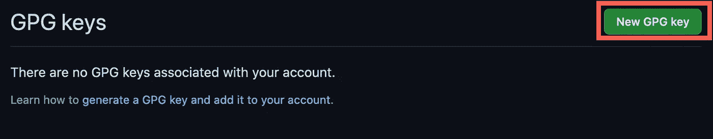

将公钥粘贴到文本框中，然后按添加密钥按钮。

观察 GPG 键列表中的键。

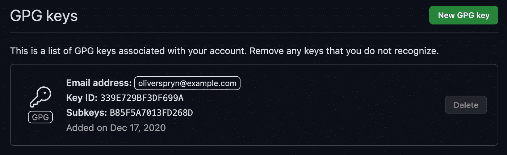

# 密钥存储

灾难是我们不希望发生的事情，但我们应该随时做好准备。把你的钥匙放在一个安全的地方有助于避免这类事件中最痛苦的部分。如前所述，我喜欢使用两个地方中的一个来保存这类信息: [LastPass](https://go.oliverspryn.com/lastpass) 或 [ProtonDrive](https://go.oliverspryn.com/protondrive) 。不，这些公司没有赞助我推荐他们，但他们工作得足够好，值得一个主动推荐！

## 最后一遍

甚至在他们的免费账户上，LastPass 也允许你将二进制文件放入加密存储中。因为我管理几个 GPG 键，所以我[为我想知道的关于我的键的所有信息创建了一个定制条目类型](https://go.oliverspryn.com/lastpass-custom-item-types)。它看起来是这样的:

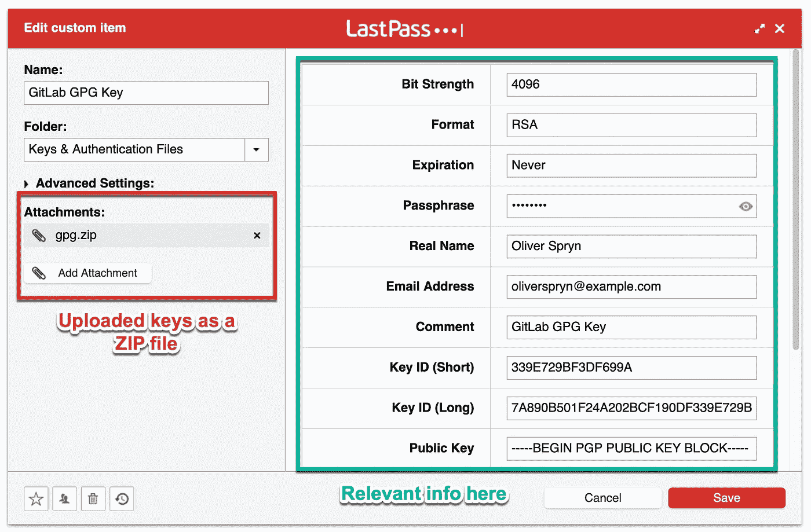

LastPass 中的 GPG 密钥管理

## 质子驱动

我也喜欢 [ProtonDrive](https://go.oliverspryn.com/protondrive) ，因为它是完全加密的零访问文件存储服务。如果你愿意，一个更常见的选择是类似于 [OneDrive Personal Vault](https://go.oliverspryn.com/onedrive-personal-vault) 的东西。这两个地方的想法是一样的。我把每把钥匙和一张包含密码的纸条放在加密的保险箱里，这样就可以随时使用，如果我需要的话。

我在 ProtonDrive 中出口的 GPG 钥匙

# 导入密钥

您的开发机器上的数据丢失了吗？你买了一台新电脑吗？你需要在第二台电脑上工作吗？所有这些都是打开保险库并输入密钥的正当理由。一旦您将`.asc`文件下载到您的新设置中，键入这些命令会将公钥和私钥添加到您的钥匙串中:

将公钥和私钥都导入 GPG

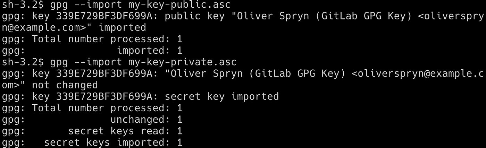

运行两个导入命令后的终端输出

请注意我是如何在导入私钥之前导入公钥的。让我们仔细检查一下，看看这是否如预期的那样起作用:

使用长 ID 列出 GPG 钥匙串中的所有钥匙

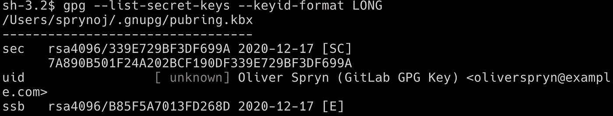

新导入的密钥不可信

不幸的是，虽然密钥存在于钥匙串中，但是它没有得到系统的信任，因为这台机器首先不负责创建密钥。让我们来解决这个问题:

1.  在您的终端中，键入:`gpg --edit-key key-id`，其中`key-id`是您想要编辑的键的 ID。
2.  您已经进入了 GPG 命令行编辑器。
3.  键入单词`trust`。
4.  因为这是您的密钥，所以您应该能够在您的系统中给予它最终的信任。因此，在信任级别提示符下，输入`5`表示最终信任，并确认您的选择。这个级别与您最初创建密钥并在同一台机器上使用它时分配给密钥的信任值相同。
5.  键入`quit`退出 GPG 提示符。

在机器上授予密钥最终信任的流程

再次检查我们的工作表明我们在寻找什么。密钥对是可用的，并且对系统具有最终信任。

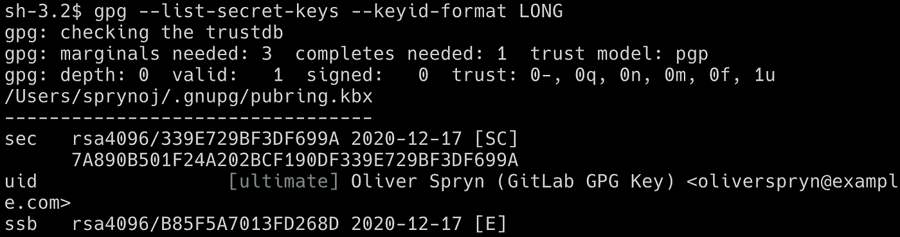

钥匙现在有了最终的信任

# 解决纷争

作为我日常工作的一部分，我使用 Macbook。在这个设置中，Git 和 GPG 配合得很好。然而，我更喜欢在我的个人项目上使用 Ubuntu，我注意到当我试图开箱即用在那个平台上使用 GPG 时，它不工作。如果您在 Ubuntu 或任何其他 Linux 发行版上签名提交时遇到问题，您可能需要安装 GPG2。以下是我在 Ubuntu 上尝试签署提交时遇到的问题:

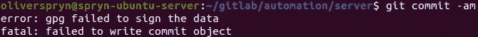

GPG 无法签署我的承诺

以下是我在 Ubuntu 和其他基于 Debian 的系统上纠正这个问题的方法:

在基于 Debian 的 Linux 发行版上安装 GPG2，比如 Ubuntu

然后，我指示 Git 使用`gpg2`而不是`gpg`作为签名程序:

指示 Git 使用 GPG2 作为签名程序

在那里，我使用`gpg2`来尝试签署一个简单的字符串，然后我遇到了另一个错误消息:

请求 GPG2 在“测试”一词上签名

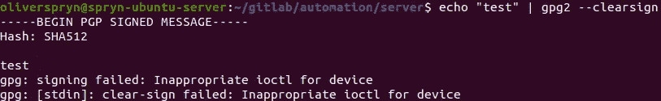

对简单字符串进行签名也会失败

从那里，我打开我的`~/.bashrc`、`~/.bash_profile`或`~/.zshrc`(取决于您的 shell)，并将以下行添加到脚本中:

终端启动时应该运行的一行加法

对文件进行必要的修改后，重启你的终端，或者`source`使用正确的脚本，你的修改就会生效。重新运行上述签名命令会产生一个成功的结果:

与上面相同的 GPG2 命令，也签署了单词“test”

签名字符串现在可以正常工作了

这个命令的结果显示 GPG2 已经准备好开始使用 Git 了。在 GPG 使用 Git 和与 GPG 交互的其他事情都是一样的。但是，不使用`gpg`作为终端命令，而是使用`gpg2`。

# 信用

尽管我已经使用 GPG 和 Git 好几年了，我还是在研究撰写本文的信息时学到了不少东西。以下是我用来帮助我更好地理解这一过程的一些资源:

*   [GnuPG 项目](https://go.oliverspryn.com/gnupg)
*   [SEC 和 SSB](https://go.oliverspryn.com/gpg-sec-and-ssb)
*   [签名 Git 提交](https://go.oliverspryn.com/signing-git-commits)
*   [欺骗 Git 提交](https://go.oliverspryn.com/spoofing-git-commits)
*   [Git 和 GPG2](https://go.oliverspryn.com/git-and-gpg2)
*   [GPG 未能签署数据](https://go.oliverspryn.com/gpg-failed-to-sign-data)

# 喜欢你读的东西吗？

媒体上还有成千上万篇类似的文章。我是这个网站的付费会员，我完全认为这项投资是值得的。 [**点击这里加入**](https://go.oliverspryn.com/medium-membership) ，你将以你的一部分会员身份支持我的工作。

本文最初发表于[https://oliverspryn.com/](https://go.oliverspryn.com/the-handbook-to-gpg-and-git)。 [**加入我的邮件列表。**](https://go.oliverspryn.com/medium-subscribe)