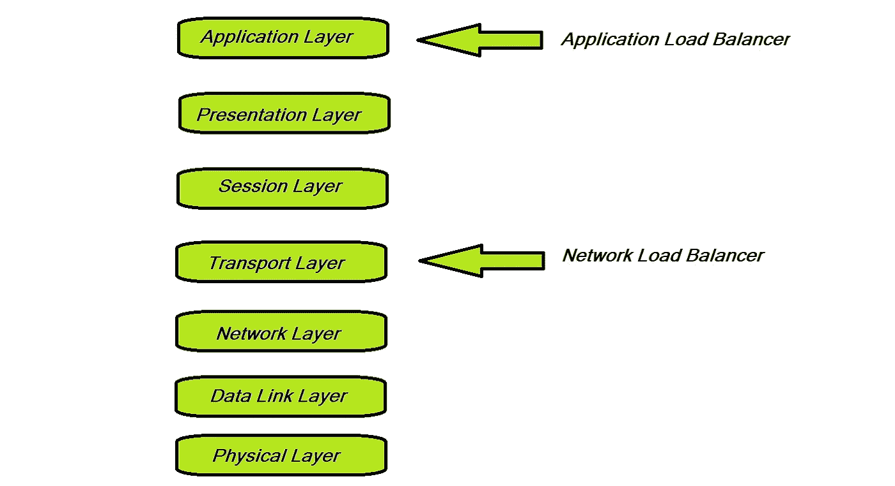

# 负载平衡算法的高级概述

> 原文：<https://betterprogramming.pub/a-high-level-overview-of-load-balancing-algorithms-8c7d3368276>

## 哪一种适合您的部署需求？

马丁·桑切斯在 [Unsplash](https://unsplash.com?utm_source=medium&utm_medium=referral) 上的照片

# 介绍

*负载平衡*是将网络负载平均分配到几台服务器上的过程。它有助于在高峰交通时段通过帮助均匀分布工作来扩展需求。服务器可以位于云中、数据中心或内部。它可以是物理服务器，也可以是虚拟服务器。负载平衡器(LB)的一些主要功能是:

*   高效路由数据
*   防止服务器过载
*   对服务器执行运行状况检查
*   面对大流量时调配新的服务器实例

# 负载平衡算法的类型

在七层 OSI 模型中，负载平衡发生在第 4 层(传输层)到第 7 层(应用层)。

不同类型的 LB 算法在基于流量分布的方式(即，是网络层流量还是应用层流量)来分布网络流量方面是有效的。

*   网络层流量由 LB 根据 TCP 端口、IP 地址等进行路由。
*   应用层流量基于各种附加属性(如 HTTP 报头、SSL)进行路由，它甚至向 LBs 提供内容交换功能。

# 网络层算法

## 1.循环算法

流量负载被分配给第一个可用的服务器，然后该服务器被下推到队列中。如果服务器是相同的，并且没有持久连接，这个算法可以证明是有效的。有两种主要类型的循环算法:

*   **加权循环法:**如果服务器的容量不同，那么可以使用这种算法来分配负载。可以将一些权重或效率参数分配给池中的所有服务器，并基于此以类似的循环方式分配负载。
*   **动态循环法:**分配给服务器以标识其容量的权重也可以在运行时计算。动态循环有助于根据运行时权重向服务器发送请求。

## 2.最小连接算法

该算法计算特定时间内每台服务器的活动连接数，并将传入流量定向到连接最少的服务器。这在需要持久连接的场景中非常有用。

## 3.加权最小连接算法

这类似于上面的最少连接数算法，但是除了到服务器的活动连接数之外，它还考虑了服务器的容量。

## 4.最短响应时间算法

这也类似于最少连接算法，但是它也考虑了服务器的响应时间。请求被发送到响应时间最短的服务器。

## 5.哈希算法

不同的请求参数用于确定请求将被发送到哪里。基于此的不同类型的算法有:

*   **源/目的地 IP 散列:**源和目的地 IP 地址被散列在一起，以确定将服务于该请求的服务器。在断开连接的情况下，相同的请求可以在重试时被重定向到相同的服务器。
*   **URL 散列:**请求 URL 用于执行散列，这种方法通过避免在许多缓存中存储相同的请求对象来帮助减少服务器缓存的重复。

## 6.杂项算法

还有一些其他算法，如下所示:

*   **最小带宽算法:**负载均衡器选择过去 14 分钟内消耗带宽最少的服务器。
*   **最少数据包算法:**与上面类似，负载均衡器选择传输最少数据包的服务器来重定向流量。
*   **定制负载算法:**负载平衡器根据服务器上的当前负载来选择服务器，这可以由内存、处理单元使用、响应时间、请求数量等来确定。

# 应用层算法

在这一层，可以根据请求的内容分配流量；因此，伦敦商学院可以做出更加明智的决策。还可以跟踪服务器响应，因为它是从服务器一直传过来的，这有助于更有效地确定服务器负载。

在这一层使用的最重要的算法之一是**最少挂起请求算法**。该算法将挂起的 HTTP(s)请求的流量定向到最可用的服务器。该算法有助于通过监控服务器负载来调整突然出现的请求高峰。

# 结论

这些是一些已知的负载平衡算法，在选择最理想的算法时，需要考虑许多因素，例如，高流量或突然的峰值。算法的良好选择有助于维护任何应用程序的可靠性和性能。因此，在设计大规模分布式系统时，很好地理解这些将会很有帮助。