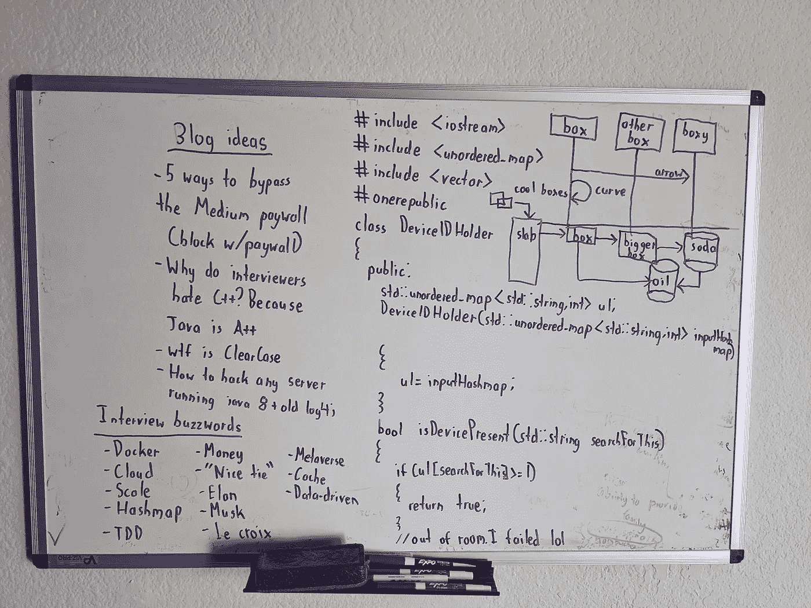
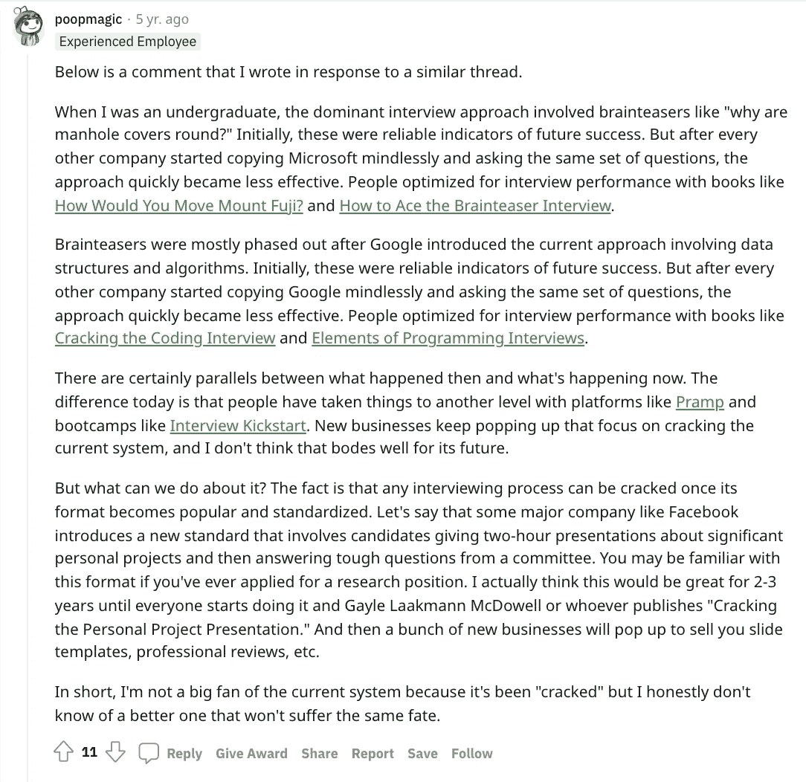

# 编码面试的历史

> 原文：<https://betterprogramming.pub/a-history-of-coding-interviews-23b5e8f9c92f>

## 很多人谈论编码面试的“如何”和“为什么”，那么“什么时候”呢？

找不到合适的图片，被迫依靠自己不存在的摄影能力。

如果你申请的是软件开发人员或软件工程师的工作，你可能会对这个过程的标准化程度感到惊讶。是的，仍然有一小部分公司没有采用编码/白板面试；是的，一些地方似乎仍然喜欢脑筋急转弯。

在大多数情况下，你可能会发现每个公司都或多或少地问你同样的问题。你得到一个 CoderPad 链接，或者一些空白的白板模拟器，或者(我个人最不喜欢的)一些没有其他人在场的自动化测试，你可能有 45 分钟的时间来编写独立的代码，这些代码*做一些事情*。

也许你很幸运，面试官问你[字谜题](https://leetcode.com/problems/valid-anagram/)。也许你运气不好，面试官问你[最大二分匹配问题](https://www.geeksforgeeks.org/maximum-bipartite-matching/?fbclid=IwAR07yklA6w-az0SoZT0XnQEFCZKQiSLIdQp-yuNF8TeiPbxsNiCrBpR6mG0)。在课程结束时，如果你的代码有效和/或面试官满意，你通常会进入下一轮。

Kevin Naughton 声称*破解编码面试*普及了这类问题并重塑了整个行业，但是我找不到任何主要的出版物来证实这一点。据他说，主要的科技公司过去常常会问这样的问题，比如为什么井盖是圆的，或者如何用一个 4 和 6 加仑的罐子装满一个 5 加仑的罐子。随着时间的推移，编码面试开始主导这个行业。

他们为此在维基百科上做了一个完整的页面。

# 早在 90 年代

早在 90 年代，我在一个非常著名的电视节目中…

根据[福布斯](https://www.forbes.com/sites/vivekravisankar/2015/05/04/the-rise-and-looming-fall-of-the-engineering-whiteboard-interview/?sh=27e258bb1c82)的一篇文章(虽然，不可否认，这句话可能没有争议到需要引用)，过去测试代码非常昂贵，所以程序员使用笔和纸。在 20 世纪 90 年代，对于编程来说，白板变得比黑板更受欢迎，白板编程面试自然就开始了。

[coder pad 的一篇文章](https://coderpad.io/blog/whiteboard-interview-guide/)(嘿！你们在介绍中)证实了这一点，指出在 20 世纪 90 年代白板风靡一时，这种热情带进了面试。

今天，这种做法只是延续了下来。一些公司使用没有文本突出显示的程序来模拟白板程序，但是他们仍然需要一些方法来评估“编码能力”的基线水平

# 脑筋急转弯消失了

维基百科的文章“编码采访”声称微软是一个先驱，主要是因为比尔盖茨对谜题的迷恋。直到 2003 年，[的应聘者仍然会被问到这样的问题](https://www.npr.org/templates/story/story.php?storyId=1405340):

> 假设你有八个台球。其中一个有缺陷——它比其他的重。使用天平，您如何在两次称重中辨别哪个球有缺陷？

一个解决方案是分而治之的方法，我个人可以确认微软仍然会问这个问题(尽管我会保护我的消息来源)，但是这些问题是如何变得不那么受欢迎而有利于编码测试的，我不太清楚。维基百科的文章说:

> 微软面试是一个先驱，因为它是关于技术知识、解决问题和创造力，而不是大多数公司当时使用的[目标和弱点面试](https://en.wikipedia.org/wiki/Job_interview#Behavioral)。最初是基于比尔·盖茨对谜题的痴迷，面试中出现的许多谜题开始是费米问题，有时是逻辑问题，多年来最终转变为与编程相关的问题

…但是，任何英语/写作老师都会告诉你，维基百科是一个非常不可靠的来源，尽管事实上它比大多数媒体文章都经过更仔细的审查。以准确和真实的名义，以下是一位用户在 Reddit 上的评论:

来源:[https://www . Reddit . com/r/cscareerquestions/comments/4 wyzwa/has _ the _ existence _ of _ books _ like _ cracking _ the/](https://www.reddit.com/r/cscareerquestions/comments/4wyzwa/has_the_existence_of_books_like_cracking_the/)

TL；根据这位有 40，000 karma 经验丰富的开发人员的说法，dr 是脑筋急转弯占主导地位，直到谷歌改变了游戏规则。首先是由微软开创的“脑筋急转弯时代”，直到像*你将如何移动富士山*这样的书给了候选人竞争优势。接下来是我们今天知道并喜欢(或讨厌)的编码面试，由谷歌开创，直到像*破解编码面试*这样的书给了候选人竞争优势。

上面的帖子似乎暗示编码/谷歌风格的面试将不可避免地被其他东西取代，就像前面提到的福布斯文章一样，但我无法想象会是什么。

大家会转而开始收集谷歌证书吗？

我正在链接这个关键的视频；除了这篇文章和我其他抱怨 YouTube 厌恶计数器和 reCAPTCHA 3 的博客文章，我对谷歌的印象并不太好。我想提醒全世界，我用的是 Pixel，像 Gmail，不要用 Bing。

我参加的一次面试给了我一个模拟的大型代码库，然后在被允许在互联网上搜索错误修复后，给了我大约半个小时的时间来撰写一封虚构的电子邮件。没有什么比这更好的经历了。

我没有水晶球，但如果一些大公司发明了一个集成平台，以便他们可以同时评估您使用命令行、运行容器或调试现有代码的能力，这对我来说并不疯狂。他们现在做采访的方式似乎限制了我。

# 结束语

我收到一个人的评论，说*破解编码采访*并不是这类书的第一本。在阅读他的评论之前，我写了这篇文章的其余部分，但它说明了一个很好的观点:不是每个公司都遵循一个确切的趋势。并不是每个公司都效仿微软，使用脑筋急转弯，然后每个公司都迅速改变路线，采用编码面试。

接下来的博客文章是 2000 年由 Joel Spolsky 撰写的，他是 Trello 的创始人，也是一位至今仍然非常活跃的科技博客作者。来自文章:

> 对于编程问题，我要求考生用 c 写一个小函数，下面是我会问的一些典型问题:
> 
> 将字符串反向放置
> 
> 反转一个链表
> 
> 计算一个字节中所有的位
> 
> 二进位检索
> 
> 查找字符串中最长的游程
> 
> 阿托伊
> 
> itoa(很好，因为他们必须使用堆栈或 strrev)

——谢谢你，[格雷格](https://gregbo.medium.com/)

预测编码面试的走向也需要预测*编码*的走向。这是一个有趣的话题，但不是这里要讨论的内容。

下面，艾伦·杰克描绘了一幅令人惊讶的乐观的未来图景。他并不担心编码员会过时，而是认为市场将会爆炸——类似于 Python 等技术，然后 web 框架降低了准入门槛，允许更多的技术公司存在，这些公司需要更多的开发人员来运营它们。