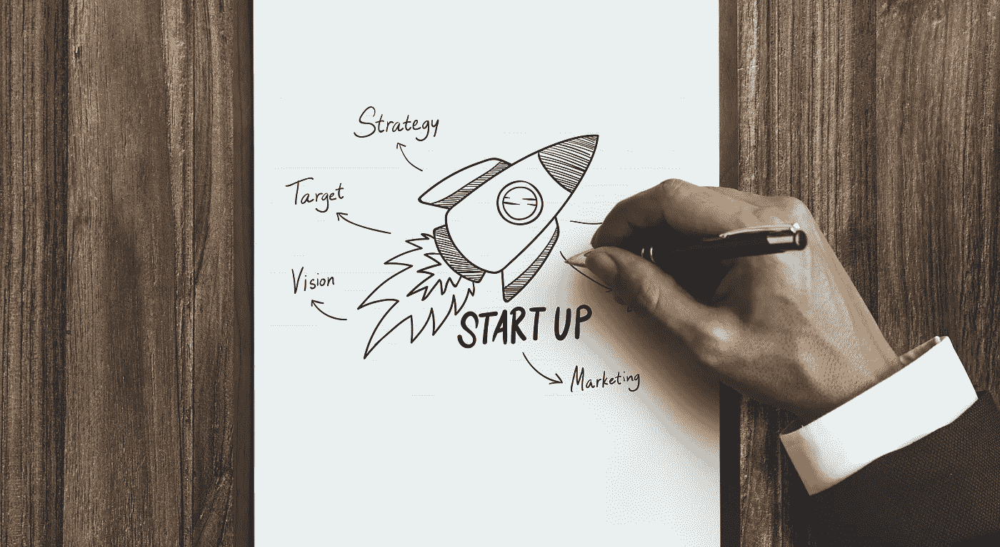
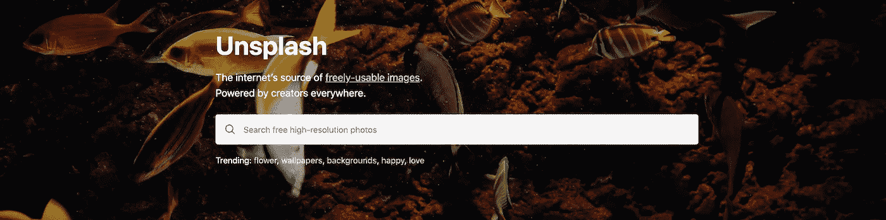
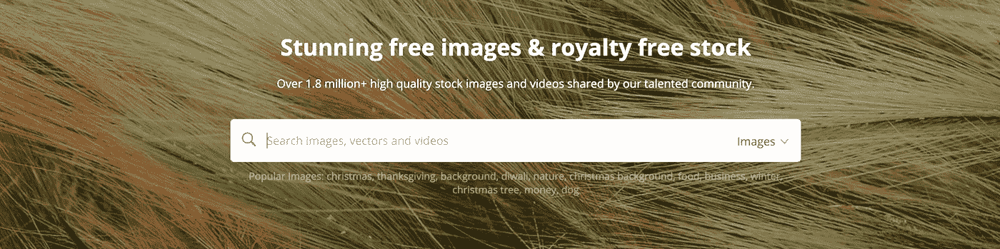
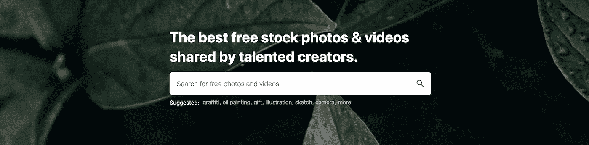
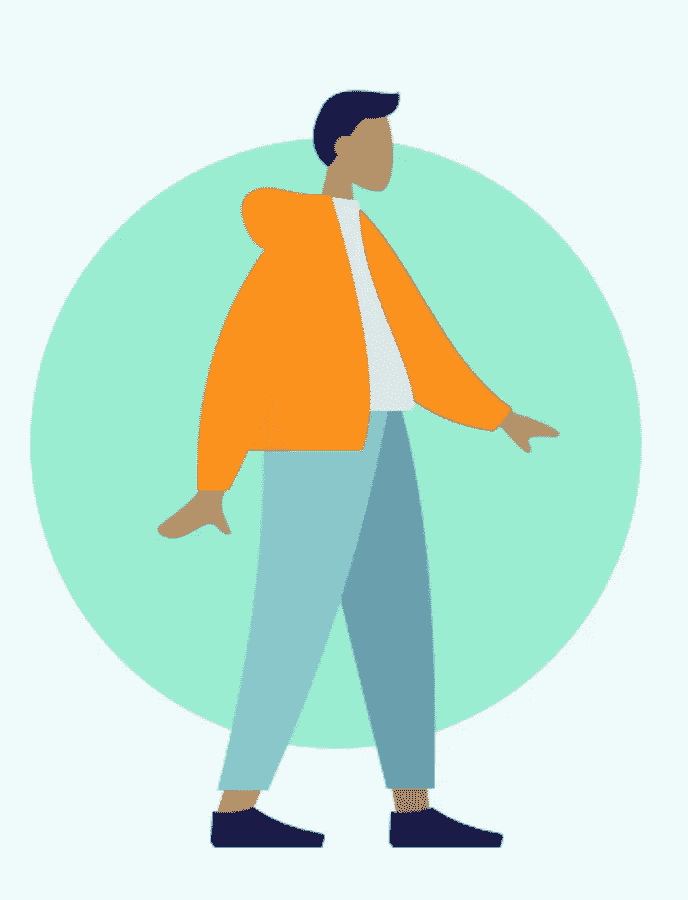

# 2021 年为开发者提供的大量免费照片和插图

> 原文：<https://betterprogramming.pub/a-huge-list-of-free-photos-and-illustrations-for-developers-in-2021-f63dc20e878c>

## 为您的开发项目、中型文章等获取免费照片和免费插图

图片来源:Adobe Stock

你是一名开发人员，有很好的想法，你知道如何将想法变成现实，但你缺乏设计技能。

一幅好的插图或一幅有代表性的图像可以说明产品或服务的全部目的，而不需要冗长的描述，没有人想看。

感谢上帝，在过去的一二十年里，事情发生了变化。你不需要学设计；不需要请设计师。你可以在网上找到很棒的**免费的** 插图和照片。

以下是我的资源列表:免费照片和免费插图。前几个将是我最喜欢的。我列出了以下内容，没有任何顺序。

# 免费照片

我最喜欢的免费照片网站:

【Unsplash.com 

*   Unsplash.com:为任何项目或博客文章提供漂亮、免费的图片和照片。专业和半专业摄影师拍摄的照片

[Pixabay.com](https://pixabay.com/)

*   [Pixabay.com](https://pixabay.com/):超过 180 万张面向商业和营销的免费高质量图片和视频

[Pexels.com](https://www.pexels.com/)

*   [Pexels.com](https://www.pexels.com/):世界各地按主题排列的照片。

免费照片和图像的其他好资源:

*   [Adobe stock free](https://stock.adobe.com/si/free) :免费的照片、矢量和视频。
*   [地形图](https://gratisography.com/):高分辨率自由库存图片。每周都会添加新照片。
*   Morguefile :随机人物和日常物品的照片。
*   每日新的免费照片、纹理和插图。
*   [Pikwizard](https://pikwizard.com/) :一百万张高质量的图片和视频。您可以在下载照片之前进行基本编辑，如添加文本覆盖。
*   Rawpixel:多样化的照片集合。
*   PicJumbo :一个免费的图片社区，里面有很多免费的漂亮照片。
*   [重拍](https://www.reshot.com/):新晋摄影师分享他们惊艳的照片。
*   [Shopify 爆款](https://burst.shopify.com/):网站和商业用途的免费高分辨率照片。
*   [免费图片](https://www.freeimages.com/):超过 30 万张免费图片。
*   [Canva 免费图片](https://www.canva.com/photos/free/) : Canva 是我最喜欢的设计工具。他们有一些免费的照片，你可以在你的项目中使用
*   [StockSnap](https://stocksnap.io/) :每日数百张新图片的大量精选照片。
*   [FoodiesFeed](https://foodiesfeed.com/) :高分辨率免费美食图片。
*   [KaboomPics](https://kaboompics.com/) :高质量的免费图片，包括抽象、城市/建筑、时尚、美食、风景等。
*   [Pix 的生活](http://www.lifeofpix.com/):免费高分辨率照片，本周摄影大赛。
*   [SkitterPhoto](https://skitterphoto.com/) :由 SkitterPhoto 的所有者创作的真实照片。
*   新老库存:来自公共档案馆的老照片。
*   [FreeStocks](http://freestocks.org/) :大范围的高质量照片。
*   风格股票:为每位女企业家免费提供女性股票摄影。
*   [生成照片](https://generated.photos/):AI 生成的人物照片。
*   [科学图片](https://www.scienceimage.csiro.au/):免费的科学图片:科技、动物、天文…
*   伊恩图片库:免费的科学图片，包括生态系统，过程，病毒…
*   [摄影](https://picography.co/):免费库存照片。
*   Picspree :免版税的图片、库存照片、插图和矢量。
*   [ISO Republic](https://isorepublic.com/) :免费的高分辨率照片和视频
*   [Jopwell 系列](https://jopwell.pixieset.com/):几个相册，里面有数百张照片，展示了 jop well 多元化社区的人们
*   尼克·杰克逊的照片。
*   [写实镜头](https://realisticshots.com/):免费高分辨率照片。
*   [Depositphotos](https://depositphotos.com/free-files.html) :每周新的免费图片、矢量、编辑内容和脚注。
*   [查找照片](https://www.chamberofcommerce.org/findaphoto/):超过 100 万张高质量的股票照片，横跨多个免费和付费的股票照片网站。
*   [负空间](https://negativespace.co/):免费高分辨率照片。
*   [Piqsels](https://piqsels.com/) :免费照片。
*   [Wunder Stock](https://wunderstock.com/) :一个免费的照片库，提供对 Flickr 上数万张高质量公共领域照片以及超过 1000 万张创作共用图片的扩展结果的访问。
*   T21:不受 CC0 版权保护。
*   [尿布](https://www.nappy.co/):黑人和棕色人种的高清照片。
*   [域公开图片](https://www.publicdomainpictures.net/en/):所有类型的免费图片。
*   [虎耳草](http://www.freenatureimages.eu/):自由的自然意象。
*   ZoomStock :免费库存照片。

图片来源:Adobe Stock

# 免费插图

我最喜欢的免费插图网站:

[绘图工具包](https://www.drawkit.io/)

*   [DrawKit](https://www.drawkit.io/) :漂亮、自由的插图。每周更新和定制选项。两种不同风格的 50 多幅免费插图。

[未绘制](https://undraw.co/illustrations)

*   [unDraw](https://undraw.co/illustrations) :由 [Katerina Limpitsouni](https://twitter.com/ninalimpi) 创作的任何你能想象到的想法的开源插图。

[人类](https://www.humaaans.com/)

*   人类:可定制的人物插图。

免费插图的其他好资源:

*   [免费插图](https://freellustrations.com/):为你令人敬畏的登陆页面提供免费插图背景图片
    。
*   [IconScout](https://iconscout.com/illustrations) :从 900 多个投稿人中搜索 200 万幅插图。精选独特的插图包。
*   [多像素](https://www.manypixels.co/gallery/):每周，发现免版税的插图，为你的项目提供动力。
*   [腮红设计](https://blush.design/):用全球艺术家的作品创作和定制令人惊艳的插图。
*   荒谬的设计:如果你在寻找不同的东西，荒谬的插图是有意义的。
*   [FreePik](https://stories.freepik.com/) :免费插画。
*   [Openpeeps](https://www.openpeeps.com/) :手绘插图库。这个库就像是由矢量手臂、腿和情感组成的积木。您可以混合这些元素来创建不同的 Peeps。
*   Artify :一个易于使用的基于网络的设计编辑器，拥有一个巨大的设计资源库。
*   [设计](https://delesign.com/free-designs/graphics):免版税设计插图。
*   [插图](https://illlustrations.co/):100 幅精彩插图的开源插图套件。
*   [Vecteezy](https://www.vecteezy.com/) :自由矢量艺术。
*   [黑人插图](https://www.blackillustrations.com/):你下一个数字项目的黑人插图。
*   [插画](https://getillustrations.com/):海量插画包。让你的设计脱颖而出的故事。
*   [卢卡斯·亚当](https://lukaszadam.com/illustrations):免费插画。
*   [哎呦图标 8](https://icons8.com/illustrations) :哎呦帮助不画画的创作者克服缺乏高质量图形的问题。免费矢量插图。
*   [Outlane](https://outlane.co/topics/freebie/):Outlane 手工制作的免费插画。
*   [灯光师](https://bulbman.art/explore/):免费插画。
*   [Charco 插图](https://www.karthiksrinivas.in/charco):为您的 web 和应用程序项目制作的 16 幅手工插图。该集合包括诸如 404 错误、没有互联网连接、没有服务、致命错误、找不到页面、出错、正在建设等类别。
*   [等距图](https://isometric.online/):免费的等距图，供设计师、
    初创公司和公司使用。
*   Paaatterns :所有矢量格式的漂亮图案的免费集合。
*   [Error404](https://error404.fun/) :页面免费插图。
*   [IsoFlat](https://isoflat.com/) :等距和平面图形资源。
*   [Sketchvalley](https://sketchvalley.com/) :为你的项目手绘免费矢量插图资源。
*   [伸缩自如](https://2.flexiple.com/scale/all-illustrations):每天都有新的高质量开源插图。
*   旧书插图:大量旧书插图的集合。
*   [故事片](https://storytale.io/freebies/):免费插画。
*   [等角图](https://www.isometriclove.com/):可爱的等角图对象，适合你的设计。
*   [flat icon](https://www.flaticon.com/):366.45 万个矢量图标。
*   [ui8](https://ui8.net/margose/products/free-12-illustrationicon-and-character-set) :自由插画/图标和字符集。
*   [OpendDoodles](https://opendoodles.com/) :一套免费的草图。

如果你有我还没找到的更好的资源，请告诉我。