# 从 React 到 Vue.js 的旅程

> 原文：<https://betterprogramming.pub/a-journey-from-react-to-vue-js-cec3ba44c377>

## 在 React 工作了四年后转到 Vue 是什么感觉

图片来源:【https://productvn.com/en-react-vs-vue-vs-angular/ 

在过去的四年里，我一直在与 React 合作。现在刚开始和 Vue 合作。你在 React 里能做的，在 Vue 里也能做。不过，有一些重要的概念差异，其中一些反映了 Angular 对 Vue 的影响。老实说，我觉得 Vue 是 Angular 和 React 的最佳组合。

进行比较的一个关键因素是，Vue 框架的创始人尤雨溪将 React 作为新框架开发的灵感来源。

> “我想，如果我可以只提取 React 中我真正喜欢的部分，构建一个真正轻量级的东西，而不涉及所有额外的概念，会怎么样？我也很好奇它的内部实现是如何工作的。我开始这个实验只是想复制这个最小的特性集，比如声明性数据绑定。基本上 Vue 就是这样开始的。”—尤雨溪

我在本文中的重点将是强调两者之间的差异。

首先，让我们看看一些事实:

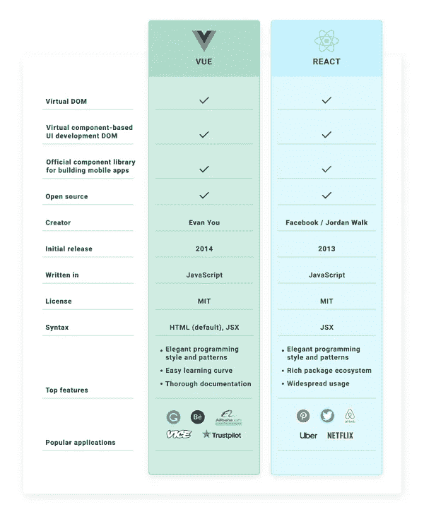

# 快速比较

*   React 是一个库，而 Vue 是一个完整的框架。
*   两者都是快速和轻量级的。
*   两者都有基于组件的架构。
*   两者都使用虚拟 DOM。
*   两者都可以放在一个 HTML 文件中，或者作为一个更复杂的 Webpack 设置中的一个模块。
*   两者都有独立但常用的路由器和状态管理库。

最大的区别是 Vue 通常使用 HTML 模板文件，而 React 完全是 JavaScript。Vue 也有可变状态和自动重新渲染系统，称为*反应*。

# 基于组件的体系结构

React 和 Vue 都遵循基于可重用组件的方法。

## 做出反应。组件与 Vue 组件

React 和 Vue 都提供了一个`component`方法，但是它们非常不同。这是因为 React 将组件定义为类，而 Vue 将组件定义为对象。

`Vue.component` [全局注册组件](https://frontendsociety.com/why-you-shouldnt-use-vue-component-ff019fbcac2e)，而`React.Component`作为你的组件的基类。

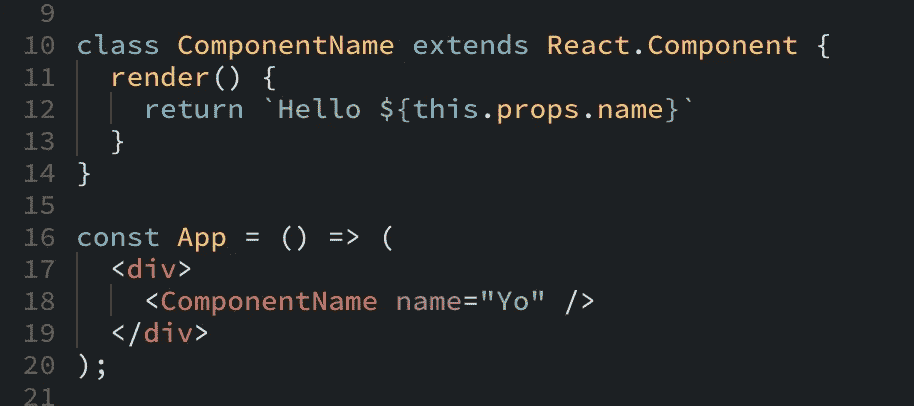

<componentname>是模板中直接使用的类名。</componentname>

Vue 中的组件是普通对象；不需要扩展 Vue。

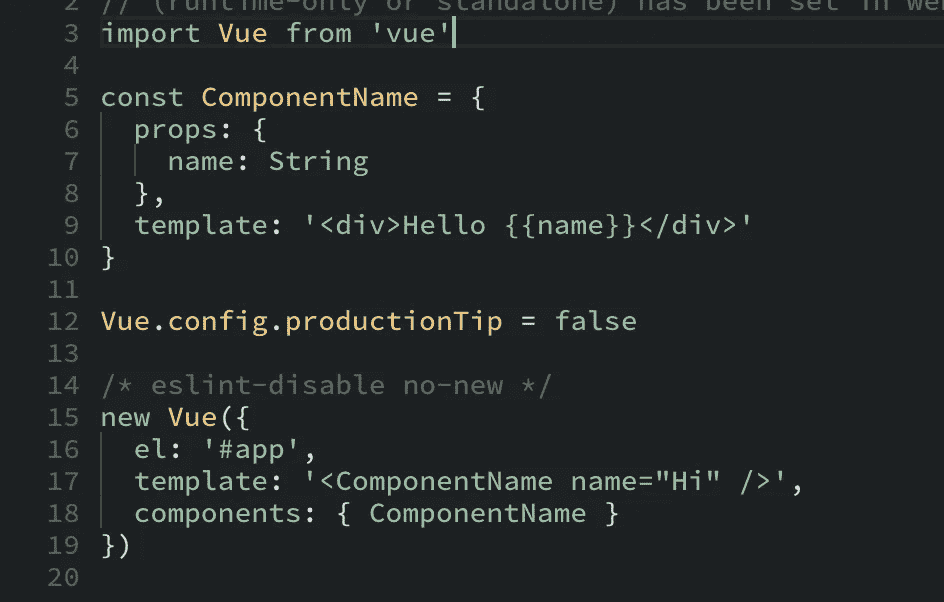

Vue 中相同的组件和模式:<componentname>只是一个对象，必须包含在 Vue app 的`components`值中才能显示。</componentname>

尽管有基于组件的方法，两者还是有很大的不同。

# 反应 JSX 与 Vue 模板

React 的`render`道具只是 JavaScript，所以你在模板里做的一切都和在 JavaScript 里一样。

Vue 依赖于 HTML 模板，所以它包含一些指令。这些指令在设计上与 AngularJS 非常相似(其实几乎一样:`v-if`、`v-for`、`v-show`等)。)

# 生命周期方法

Vue 中的组件也有类似于 React 方法的生命周期方法。

让我们来做一个一对一的比赛:

*   `constructor` → `[created](https://vuejs.org/v2/api/#created)`
*   `componentWillMount` → `[beforeMount](https://vuejs.org/v2/api/#beforeMount)`
*   `componentDidMount` → `[mounted](https://vuejs.org/v2/api/#mounted)`
*   `componentWillUnmount` → `[beforeDestroy](https://vuejs.org/v2/api/#beforeDestroy)`
*   `componentDidCatch` →不适用
*   `shouldComponentUpdate` →不适用
*   `setState` →不适用 *—* 直接设置属性即可

# 组件状态和数据

在 React 中，你有组件的`state`。在 Vue 里，你有`data`。

## 设置初始状态

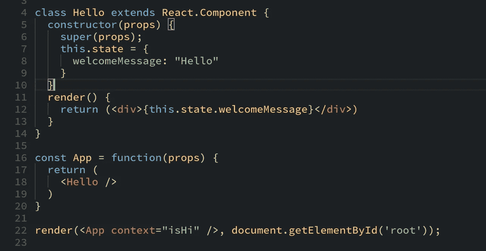

反应组分

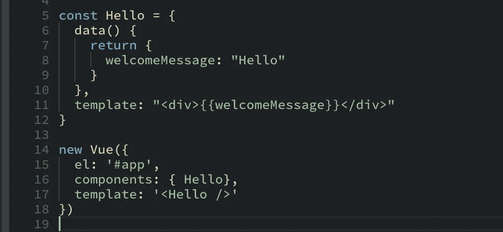

Vue 组件

## 更新状态

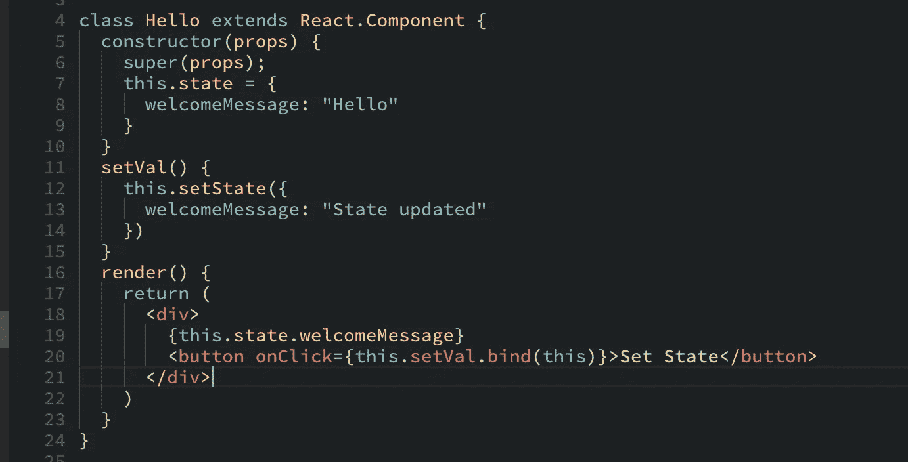

React 采用`setState` 的方法

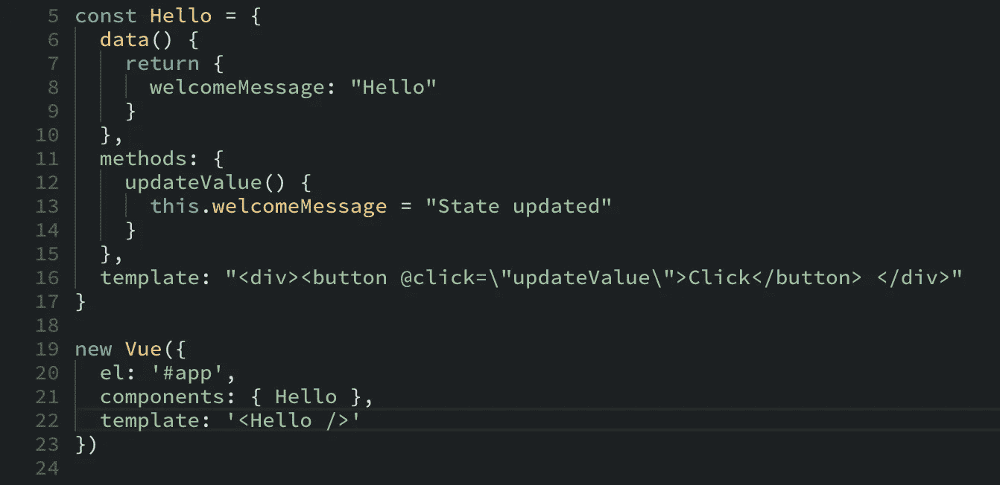

Vue 只是给属性赋予新的值。

# 条件渲染

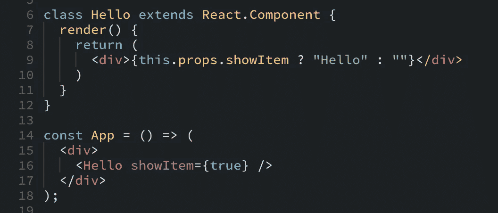

React 通常使用三元运算符有条件地呈现内容。

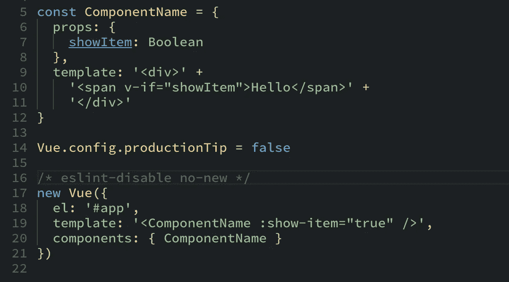

Vue 引入了与此类似的 v-if 指令。

# 使用循环进行迭代和渲染

在 React 中，我们通常`map`遍历这些值，并返回一个字符串，它是您希望每个`element`是什么。

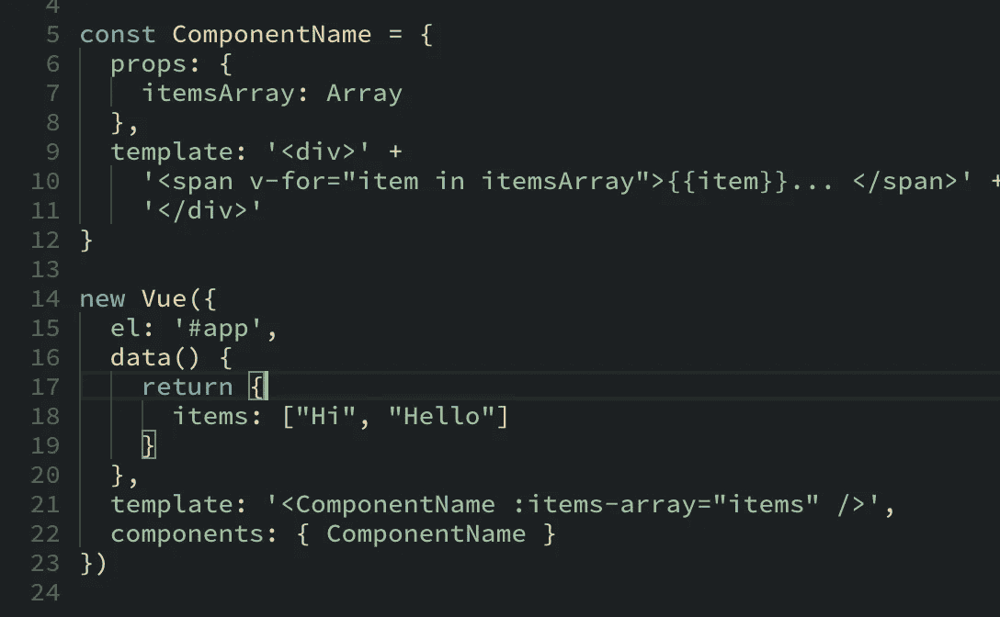

在 Vue 中，我们将使用`v-fordirective`

# 生态系统

Vue 比 React 拥有更多的“官方”库——“官方”意味着它得到了核心框架的官方支持、维护和发布。

由于年代久远，Vue 没有 React 那么多社区支持的库。

# 对照表

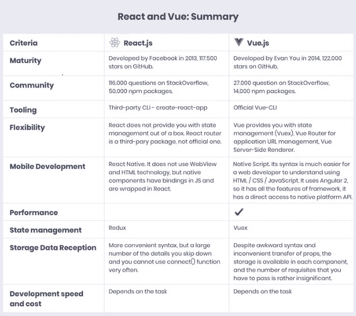

总而言之，Vue 和 React 都是创建复杂 web 解决方案的强大工具。它们都可以为你提供大量的可能性，所以你可以对任何任务感到舒适。

无论你选择什么，你都不会错。

编码快乐！