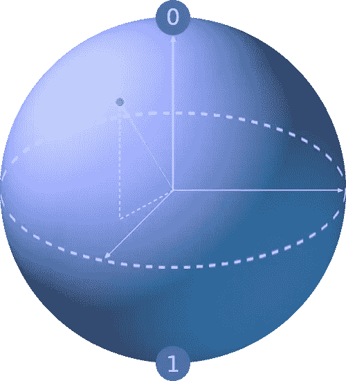
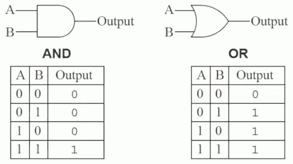
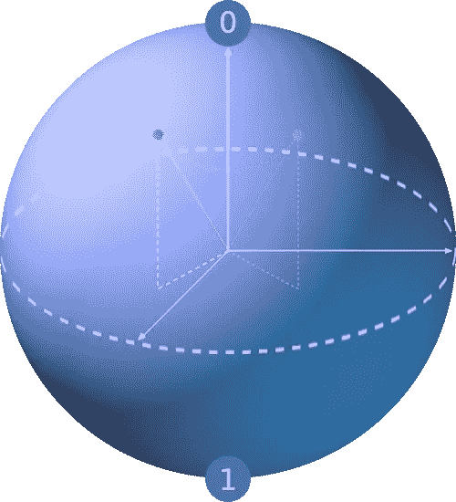
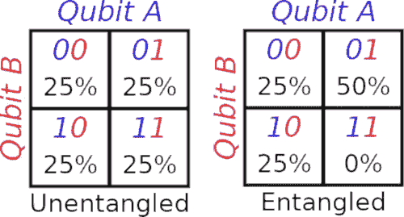
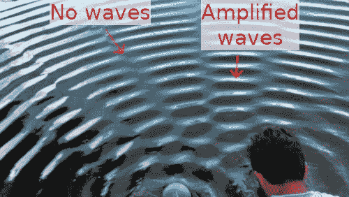

# 量子计算机的外行介绍

> 原文：<https://betterprogramming.pub/a-laymans-intro-to-quantum-computers-67b7a7126695>

## 量子计算入门—无需博士学位

照片由[Zoltan·塔斯](https://unsplash.com/@zoltantasi?utm_source=medium&utm_medium=referral)在 [Unsplash](https://unsplash.com?utm_source=medium&utm_medium=referral) 上拍摄

量子计算机有可能彻底改变信息技术。许多分析家认为目前的量子计算机相当于 20 世纪 40 年代的房间大小的计算机。在未来的几十年里，它们可能会像经典计算机一样以同样的指数速度发展。不幸的是，量子计算的文献通常是由拥有物理学位的人写的。在这里，我将深入浅出地解释量子计算:它是如何工作的，它与经典计算有何不同，以及为什么它将对您的业务产生革命性的影响。

# 经典比特与量子比特

经典计算机有一个由比特组成的存储器，其中每个比特有两种状态，分别代表`0`或`1`。当你把更多的比特串在一起时，你可以存储更多的信息组合。

例如，两个比特有四种可能的状态:`00 01 10 11`。三位有八种可能的状态:`000 001 010 011 100 101 110 111`。

在物理层面上，这些位是电路，其中`0`和`1`代表流经它们的不同电流水平。

量子计算机保持一系列量子位，每个量子位也有两种状态，可以代表`0`或`1`。然而，这些量子位不是电路。相反，它们是固定在一个地方的亚原子粒子——不动的。它们通过各种方式代表`0`或`1`，这取决于量子计算机的类型，但这种详细程度对于理解它们的用途并不重要。

与经典比特不同，当你测量量子比特时，你并不总是得到相同的结果。相反，一个量子位的状态可以被认为是在一个球体的表面。北极和南极分别代表最终状态`0`和`1`。当量子位的状态更接近一个极点时，它表示测量时更有可能达到`0`状态，等等。举例来说，一个量子位元在它的赤道上，有 50%的机会往任何一个方向移动。当测量下图中的量子位时，由于它离北极比离南极更近，所以它出现在`0`(北)的几率明显高于`1`(南)的几率。

将量子位表示为球体表面上的一个点。图片鸣谢:作者。

# 第一个区别:确定状态与概率状态

这给我们带来了与经典计算机的第一个区别。一个经典位持有一个确定的`0`或`1`。相比之下，一个量子位拥有成为`0`或`1`的*概率*。举个例子，如果一个量子比特有 60%的概率成为`1`，那么你可以把它想象成存储了值`60%`。通过多次重复量子计算并观察结果，你可以在一定程度上确定概率是多少。因此，它可以存储从 0 到 1 的无限数量的值，但代价是对于该值的真实值总是有某种程度的统计不确定性。量子算法通常是概率性的，因为它们仅在某个已知的置信概率内提供正确的解。相比之下，经典计算机在本质上是确定性系统，可以完全自信地输出一个答案。任何计算机科学家都知道，让经典计算机真正随机是非常困难的，因为它们太倾向于确定性的“是”或“不是”答案。

# 经典门与量子门

计算机通过让它们的比特通过门来计算东西。这些通常有两个输入，有时只有一个，并根据这些输入输出一个新值。例如，称为`AND`门的门输出`1`，如果它的两个输入也是`1`；否则输出`0`。这里显示了两个示例门:

两种常见的经典逻辑门。图片鸣谢:作者。

量子计算机使用量子门对其量子位进行操作。这些在球体表面移动量子位，意味着输入和输出是相同的。举例来说，一个量子门可能会将量子位元翻转到球体的另一边，或是让它绕著其中一个轴旋转。一些门接受一个输入。另一些需要两个或更多，其中每个输入的状态影响所有输出的结果状态。在下面的图片中，我们看到量子比特被量子门绕着它的垂直轴旋转。

量子门在球体表面移动量子位。图片鸣谢:作者。

# 第二个区别:非常不同的门

经典的计算机门输出一个新的位，同时保持它们的输入位不变。量子计算机改变其输入比特的状态，而不会产生新的输出比特。此外，所有量子门都是可逆的，但不是所有经典门都是可逆的(见上图中的两个门——没有办法总是从输出中推断出输入)。最后，数学家们已经证明，所有经典计算机门都可以用量子门的组合来创造，但是有些量子门不能用经典门来创造。换句话说，量子门开启了经典计算机无法完成的新操作。这意味着新算法的潜力。

# 纠缠

两个或更多的量子比特有可能纠缠在一起。这意味着测量一个量子位会立即影响其他量子位，即使它们被移动到宇宙的另一边。一个简单的例子是，如果你有两个量子位，观察一个会导致另一个在观察时总是产生相反的结果。另一种可能是，观察一个量子位的结果会影响另一个量子位成为`0`或`1`的概率。这开启了运算整个数据系统的算法，而不是一次一位。

# 第三个区别:比特之间的依赖性

一种思考方式是，两个纠缠量子位的状态不再相互独立。

下面的左图显示了两个未纠缠的量子位——蓝色的 A 和红色的 B。两人都有 50%的机会成为`0`或`1`。每个组合的几率都是一样的:25%几率的`00`，25%几率的`01`，等等。知道 A 或 B 的值并不能告诉你其他的什么。

在右边，它显示了两个纠缠的量子比特。在这种情况下，知道一个量子位的值也能告诉你另一个量子位的情况。如果你知道量子位 B 是`0`，那么你也知道量子位 A 是`1`的可能性是`0`的两倍。但是如果你知道量子位 B 是`1`，那么你就知道量子位 A 一定是`0` ——它们不再是独立的。

图片鸣谢:作者。

# 叠加

回想一下，当观察一个量子位时，它会产生随机的结果。你会直觉地认为量子位在两种状态之间振荡，就像一枚硬币在空中翻转正面和反面，直到它降落在可以观察到最终结果的地方。然而，实际上，一个量子位同时是`0`和`1`。这是因为储存量子位元资讯的粒子可以有不同的能量，或是同时在不同的位置。当量子粒子与其他东西相互作用时，例如测量其能量或位置的工具，它会随机“坍缩”到这些多重状态中的一个。

## 暂停你的怀疑

我需要打断对叠加的描述，并解决大多数人的主要障碍:不相信或困惑。你现在的想法大概是，“一个东西怎么可能同时出现在两个地方？那不可能！”

我向三位量子物理学家博士提出了这个问题。一个人回答说，你只需要暂停怀疑，相信证明这是真的数学和实验。另外两个给出了比较满意的答案。我们生活的宏观世界与最微观层面上发生的事情完全不同，我们不能将我们在人类观察水平上观察到的东西应用到宇宙最微观层面上发生的事情上。

为了帮助接受这一点，想想宇宙最宏观的方面。爱因斯坦证明了没有什么能比光速更快。从我们人类的角度来看，这在直觉上似乎也是不可能的:当我接近光速时，我为什么不能稍微加大油门呢？然而，它已经成为主流文化普遍接受。

所以，当我说一个量子位可以在两个不同的位置，或者同时有两个看似矛盾的能级，就当它是真的，不要试图去想更深的为什么。

现在回到解释叠加…

# 第四个区别:指数增长

传统位只能处于对应于`0`的状态或对应于`1`的状态，而量子位可能同时处于两种状态的叠加状态。32 位的序列可以有大约 40 亿种组合。一台经典计算机一次只能评估其中一个。一系列 32 个量子位同时存在于所有 40 亿种组合中。这意味着量子计算能力以指数速度增长，而经典计算机是线性增长的。

例如，如果我想搜索某个 8 位的组合键，16 位计算机可以并行执行两次搜索，速度是 8 位计算机的两倍。一台 32 位计算机可以进行四次并行搜索，完成搜索的速度是 8 位计算机的四倍。这意味着当传统计算机的位数加倍时，它的能力也会加倍。

相比之下，量子计算机。如果一台量子计算机有一个量子位，那么它同时存储两种状态(`0 1`)，因此可以同时搜索两种状态。如果它有两个量子位，那么它同时存储四种状态(`00 01 10 11`)，并且可以同时搜索所有四种状态，这使得它的速度是单个量子位计算机的两倍。如果它有三个量子位，那么它同时存储八个状态(`000 001 010 011 100 101 110 111`)，并且可以同时搜索所有八个，所以它比单个量子位计算机快八倍。因此，每加入一个量子位元，量子电脑的能力就会加倍。

不过，你可能记得，量子位有一个问题:当我们测量它们时，我们只能随机获得其中一种组合，如果我们想利用它同时处于多种状态的能力，这不是很有用。我们如何解决这个问题？答案是波干涉。

# 波干扰

如果你在高中科学课上忘记了，让我们回顾一下波是如何工作的。你可以在一池水中看到，当两个波相遇时，它们会相互干涉。当两个波的波峰和波谷对齐时，它们会放大自己，形成更强的波峰和波谷。但是当波峰和波谷相遇时，它们会相互抵消，导致没有波动。

图片来源:[真实](https://www.youtube.com/watch?v=Iuv6hY6zsd0)作者编辑

引擎盖下，量子比特的属性来自能量波，能量波和池塘里的水波具有相同的信号干涉属性。有一些复杂的算法(其数学原理超出了本文的范围)使用抵消干扰来抑制远离正确答案的能量状态，同时放大那些接近正确答案的能量状态。通过在测量量子位之前多次重复该算法，导致不正确状态的测量概率下降，而导致期望状态的测量概率上升。即使量子位同时处于所有状态，你也可以通过抑制你不想要的状态，同时放大你想要的状态，在一定程度上找到问题的正确答案。

# 应用程序

量子计算机有望在某些领域超越经典计算机。这里有一些例子。

*   **人工智能和数据科学。**许多人工智能都建立在复杂的统计数据和在复杂数据中搜索模式的基础上。同时搜索所有状态的能力使得量子算法特别适合在复杂数据中寻找模式，这不仅可以用于人工智能，还可以用于数据科学的其他领域。
*   **密码学。** [肖尔算法](https://en.wikipedia.org/wiki/Shor%27s_algorithm)是一种理论上的量子算法，可以破解大多数非对称密码。另一方面，纠缠开启了新加密模式的可能性。即使两个纠缠的量子位移动到宇宙的相反两端，它们也是相互关联的。使用纠缠量子位加密在数学上是无法破解的，因为没有共享密钥。例如，如果我有一对纠缠的量子位，它们的值总是相同，我可以给我的信息接收者一个，然后强迫另一个取我想要的值。当我的接收者读取另一个量子位元的值时，他会得到和我设定的值相同的值，而不需要透过电线传递任何资讯。
*   **金融和天气模型。**量子位的随机元素使它们更适合于模拟复杂的随机系统，如金融市场和天气。投资者通常希望在随机产生的大量场景下评估各种结果的概率。天气有如此多的复杂变量，以至于一台传统的计算机计算一次天气预报所需的时间比天气演变所需的时间还要长。此外，麻省理工学院的研究人员已经表明，控制天气的方程具有隐藏的波动性质，可以通过量子计算机来解决。
*   **分子建模。**分子的复杂性如此之大，以至于只有最简单的分子才能在经典计算机中建模。化学工业看到了利用量子计算机模拟复杂分子以开发新化合物的巨大潜力。

# 您的 IT 组织的后续步骤

采用量子有两个关键限制。最大的是量子计算机还处于初级阶段。目前很少有商业上可行的选择。第二是量子计算机永远不会在所有领域打败经典计算机。相反，它们只在某些特定类型的计算任务上更胜一筹。对于大多数计算任务，经典计算机仍将优于量子计算机。这意味着经典计算机将继续存在。

尽管如此，您的企业现在可以采取一些措施来击败 quantum 的竞争对手。量子计算机已经发展得足够成熟，数据科学家可以识别出唯一适合量子计算机的算法，并识别出量子计算机如果现在存在将会有益的用例。开始在您的数据科学团队中发展量子算法技能。让他们确定哪些计算任务更适合 quantum。更具体地说，确定某些更适合 quantum 的模式并记录下来，以便其他数据科学家可以识别数据集何时具有将受益于 quantum 的特征。这将允许数据团队创建一个列表，列出哪些当前业务案例(以及未来出现的业务案例)适合 quantum，包括 quantum 计算机需要达到什么样的成熟度才能触发其生存能力。最后，创建一个利用量子计算的战略计划，基于你的数据科学家认为哪些业务问题适合量子计算。

你可以开始发展量子技能的一些资源包括:

*   [量子计算游乐场](http://www.quantumplayground.net/)是一个可以在网络浏览器中运行的量子模拟器。它不会拥有真正的量子计算机的能力，但这是一个学习其概念的机会。
*   微软发布了一种叫做 Q# 的[量子语言，它也可以在量子计算机模拟器中运行。](https://www.microsoft.com/en-us/quantum/development-kit)
*   最后， [IBM 量子体验](https://quantum-computing.ibm.com/)有一台真正的量子计算机连接到互联网。有了 IBMid 账户，你可以编写代码在他们的量子计算机上运行，并访问他们的量子社区论坛。

量子计算正在快速发展。通过在您的数据科学组织中播下量子技能的种子并立即制定这一战略计划，总有一天您的组织将能够利用量子计算的优势，而您的竞争将从起点开始。